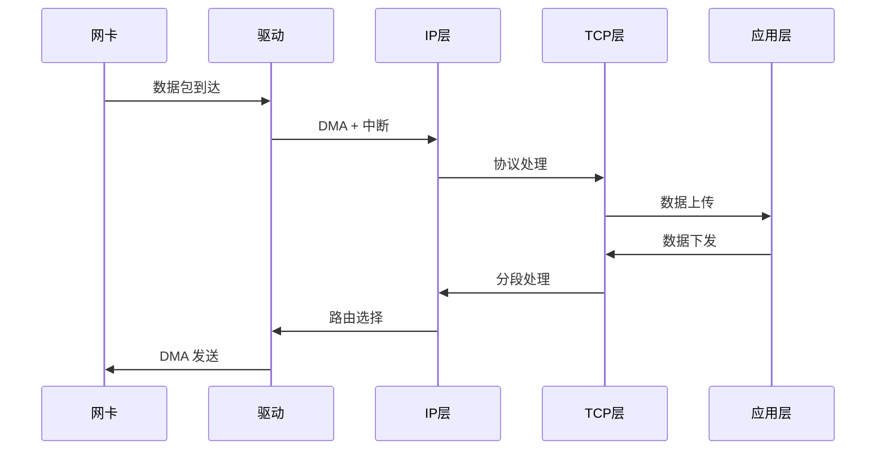

# Linux 网络协议栈处理流程

## 1. 数据包接收流程

### 硬件层
- 网卡接收数据包
- DMA 传输到内存
- 触发硬件中断

### 软件中断处理
- 网卡驱动注册 NAPI
- softirq 处理数据包
- GRO（Generic Receive Offload）合并数据包

### 协议栈处理
1. **网络层处理**
   - IP 包合法性检查
   - 路由查找
   - Netfilter 处理

2. **传输层处理**
   - TCP/UDP 协议处理
   - 数据包放入 socket 接收队列

3. **应用层读取**
   - 通过 socket 接口读取数据
   - 数据拷贝到用户空间

## 2. 数据包发送流程

### 应用层
- 调用 socket 发送接口
- 数据拷贝到内核空间

### 传输层处理
1. **TCP 处理**
   - 分段（GSO/TSO）
   - 计算校验和
   - 拥塞控制

2. **UDP 处理**
   - 添加 UDP 头
   - 计算校验和

### 网络层处理
- 路由查找
- 添加 IP 头
- Netfilter 处理

### 网络设备层
- 选择发送队列（多队列网卡）
- 构建 MAC 头
- 调用网卡驱动发送

## 3. 关键处理点

### 数据包分段
- **GSO**（Generic Segmentation Offload）
- **TSO**（TCP Segmentation Offload）
- 避免协议栈多次处理

### 校验和计算
- 硬件校验和卸载
- 软件校验和计算

### 数据拷贝优化
- 零拷贝技术
- sendfile/splice
- 页面共享

## 4. 性能优化点

### 硬件优化
- RSS（Receive Side Scaling）
- 多队列支持
- 硬件卸载特性

### 软件优化
- NAPI 机制
- 批量处理
- 中断绑定

## 处理流程图

这个流程展示了 Linux 网络协议栈的核心工作原理，理解这个处理流程对于网络性能优化和问题排查都非常重要。每个阶段都有其特定的处理任务和优化机会，合理利用硬件特性和软件机制可以显著提升网络性能。