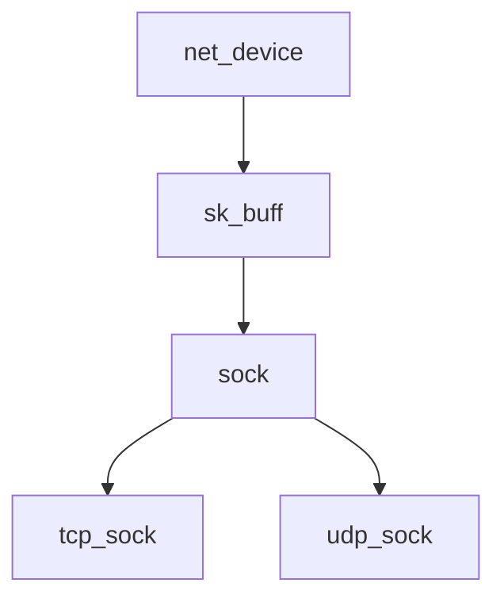

# Linux 网络协议栈核心数据结构

## 1. sk_buff（Socket Buffer）

### 基本介绍
sk_buff 是 Linux 网络协议栈中最重要的数据结构之一，用于在网络协议栈各层之间传递数据包。

### 主要字段
- **head/data/tail/end**：缓冲区的内存管理
- **next/prev**：链表管理
- **sk**：关联的 sock 结构
- **dev**：网络设备
- **protocol**：协议类型
- **transport_header/network_header/mac_header**：各层协议头部指针

### 主要功能
- 数据包在协议栈中的传递
- 支持零拷贝操作
- 动态调整协议头部空间

## 2. sock（Socket 结构）

### 基本介绍
sock 是表示网络协议的核心数据结构，包含了协议操作和状态信息。

### 主要字段
- **sk_type**：套接字类型
- **sk_protocol**：使用的协议
- **sk_state**：连接状态
- **sk_rcvbuf/sk_sndbuf**：接收/发送缓冲区大小
- **sk_backlog**：后备队列

### 主要功能
- 维护协议状态
- 管理数据收发缓冲区
- 实现协议特定操作

## 3. net_device（网络设备）

### 基本介绍
表示一个网络设备（物理或虚拟）的结构体。

### 主要字段
- **name**：设备名称
- **dev_addr**：设备硬件地址
- **flags**：设备状态标志
- **features**：硬件特性
- **netdev_ops**：设备操作函数

### 主要功能
- 提供设备抽象层
- 管理设备状态和配置
- 实现设备特定操作

## 4. tcp_sock（TCP Socket）

### 基本介绍
TCP 协议专用的 socket 结构，继承自 sock。

### 主要字段
- **srtt_us**：平滑往返时间
- **rcv_nxt/snd_nxt**：接收/发送序号
- **window_clamp**：窗口大小限制
- **congestion_control**：拥塞控制算法

### 主要功能
- TCP 状态管理
- 拥塞控制
- 超时重传

## 5. udp_sock（UDP Socket）

### 基本介绍
UDP 协议专用的 socket 结构。

### 主要字段
- **pending**：待处理的数据包
- **encap_type**：封装类型
- **udp_table**：UDP 哈希表

### 主要功能
- UDP 数据包管理
- 多播支持
- 端口绑定

## 数据结构关系图

这些数据结构构成了 Linux 网络协议栈的核心框架，理解它们之间的关系和交互对于深入理解网络协议栈的工作原理至关重要。