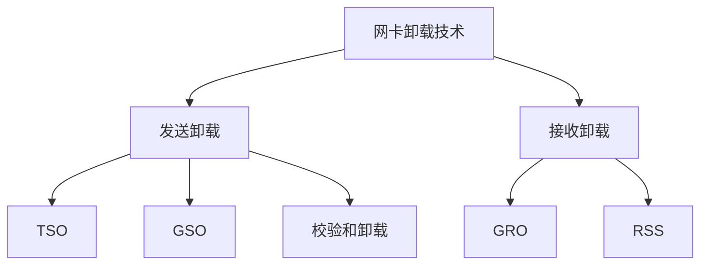

# Linux 网卡卸载技术

## 1. TSO（TCP Segmentation Offload）

### 基本原理
- 将 TCP 分段工作从 CPU 转移到网卡
- 减少 CPU 处理负载
- 提高网络吞吐量

### 配置方法
```bash
# 查看 TSO 状态
ethtool -k eth0 | grep tso

# 启用 TSO
ethtool -K eth0 tso on

# 禁用 TSO
ethtool -K eth0 tso off
```

## 2. GSO（Generic Segmentation Offload）

### 基本原理
- 软件层面的分段机制
- 在不支持 TSO 的网卡上使用
- 延迟分段操作到最后发送阶段

### 特点
- 减少协议栈处理次数
- 提高 CPU 效率
- 与 TSO 协同工作

## 3. GRO（Generic Receive Offload）

### 基本原理
- 接收端数据包合并
- 减少协议栈处理次数
- 提高网络吞吐量

### 配置方法
```bash
# 查看 GRO 状态
ethtool -k eth0 | grep gro

# 启用 GRO
ethtool -K eth0 gro on

# 禁用 GRO
ethtool -K eth0 gro off
```

## 4. RSS（Receive Side Scaling）

### 基本原理
- 多队列接收负载均衡
- 将数据包分发到多个 CPU
- 提高多核系统性能

### 配置方法
```bash
# 查看网卡队列数
ethtool -l eth0

# 设置队列数
ethtool -L eth0 combined 8
```

## 5. 校验和卸载

### 支持类型
- TCP 校验和
- UDP 校验和
- IP 校验和

### 配置方法
```bash
# 查看校验和卸载状态
ethtool -k eth0 | grep checksum

# 启用 TCP 校验和卸载
ethtool -K eth0 tx-tcp-checksumming on
```

## 6. 性能影响

### 优点
- 减少 CPU 负载
- 提高网络吞吐量
- 降低网络延迟

### 注意事项
- 硬件兼容性
- 驱动支持情况
- 网络环境适用性

## 卸载特性关系图



## 总结

网卡卸载技术是提升网络性能的重要手段，通过合理配置这些特性，可以显著提高系统的网络处理能力。在实际应用中，需要根据具体场景和硬件支持情况选择合适的卸载特性。