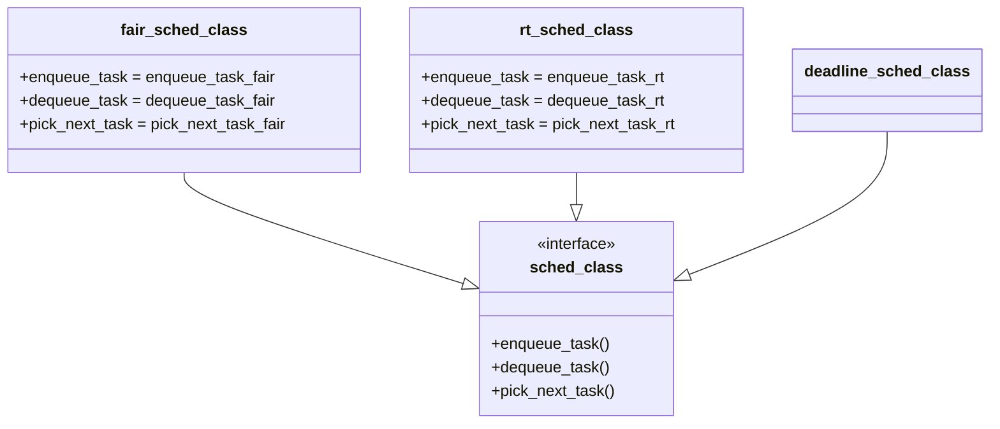

[[线程]]
[[task struct]]
[[调度方法]]
[[调度策略]]
[[进程运行符号管理]]


---
在操作系统中，**进程**是程序执行的基本单位，而**线程**是进程内的执行单元。理解进程和线程的管理需要深入探讨相关的数据结构、调度方法和策略。以下是关于进程、线程、`task_struct`、调度方法和调度策略的详细解析：

---

## 1. **线程（Thread）**
线程是进程内的执行单元，共享进程的资源（如内存、文件描述符等），但拥有独立的执行上下文（如栈、寄存器等）。

### 线程的特点：
- **轻量级**：创建和切换线程的开销比进程小。
- **共享资源**：线程共享进程的内存空间和资源。
- **并发执行**：多线程可以在多核 CPU 上并行执行，提高程序性能。

### 线程的实现：
- **用户级线程**：由用户空间的线程库（如 POSIX 的 `pthread`）管理，内核不可见。
- **内核级线程**：由操作系统内核直接管理，支持真正的并行执行。

### 示例：创建线程（POSIX 线程）
```c
#include <pthread.h>
#include <stdio.h>

void* thread_func(void* arg) {
    printf("Hello from thread!\n");
    return NULL;
}

int main() {
    pthread_t tid;
    pthread_create(&tid, NULL, thread_func, NULL);
    pthread_join(tid, NULL);
    return 0;
}
```

---

## 2. **`task_struct`**
### `task_struct` 的关键字段：
- **调度信息**（`sched_class`、`prio`）：调度类和优先级，具体关联策略：
  - `sched_class`指向调度类（如`fair_sched_class`对应CFS）
  - `prio`表示动态优先级（120-139对应普通策略，0-99对应实时策略）
- **进程状态**（`state`）：如运行、就绪、阻塞等。
- **进程 ID**（`pid`）：唯一标识进程。
- **父进程**（`parent`）：指向父进程的指针。
- **内存管理**（`mm`）：指向进程内存管理结构的指针。
- **文件描述符表**（`files`）：记录进程打开的文件。
- **调度信息**（`sched_class`、`prio`）：调度类和优先级。
- **线程信息**：如果是线程，还会包含线程组的信息。

### 示例：`task_struct` 的部分定义（Linux 内核源码）
```c
struct task_struct {
    volatile long state;    // 进程状态
    pid_t pid;              // 进程 ID
    struct task_struct *parent; // 父进程
    struct mm_struct *mm;   // 内存管理
    struct files_struct *files; // 文件描述符表
    int prio;               // 优先级
    struct sched_class *sched_class; // 调度类
    // 其他字段...
};
```

---

## 3. **调度方法（Scheduling Methods）**
调度方法是操作系统决定哪个进程或线程使用 CPU 的算法。常见的调度方法包括：

### （1）**先来先服务（FCFS, First-Come-First-Served）**
- 按照进程到达的顺序分配 CPU。
- 优点：简单易实现。
- 缺点：可能导致短任务等待长任务，产生“饥饿”现象。

### （2）**短作业优先（SJF, Shortest Job First）**
- 优先调度运行时间最短的进程。
- 优点：减少平均等待时间。
- 缺点：长任务可能被“饿死”。

### （3）**时间片轮转（Round Robin）**
- 每个进程分配一个固定的时间片（如 10ms），时间片用完后切换到下一个进程。
- 优点：公平，适合交互式系统。
- 缺点：时间片过小会增加上下文切换开销。

### （4）**优先级调度（Priority Scheduling）**
- 每个进程分配一个优先级，优先调度高优先级进程。
- 优点：灵活，适合实时系统。
- 缺点：低优先级进程可能被“饿死”。

---

## 4. **调度策略（Scheduling Policies）**
Linux 内核支持多种调度策略，适用于不同的场景。

### （1）**完全公平调度（CFS, Completely Fair Scheduler）**
![[CFS红黑树结构.png]]

**核心机制**：
1. **vruntime计算**
```c
// 内核源码：kernel/sched/fair.c
static void update_curr(struct cfs_rq *cfs_rq)
{
    struct sched_entity *curr = cfs_rq->curr;
    u64 now = rq_clock_task(rq_of(cfs_rq));
    u64 delta_exec = now - curr->exec_start;
    
    curr->vruntime += calc_delta_fair(delta_exec, curr);
    curr->exec_start = now;
    
    // 权重调整公式：vruntime = 实际运行时间 * NICE_0_LOAD / 权重
}
```
2. **红黑树调度队列**
```c
struct cfs_rq {
    struct rb_root_cached tasks_timeline; // 红黑树根节点
    struct sched_entity *curr;
    unsigned int nr_running;
};

// 实体插入操作（__enqueue_entity）
static void __enqueue_entity(struct cfs_rq *cfs_rq, struct sched_entity *se)
{
    struct rb_node **link = &cfs_rq->tasks_timeline.rb_root.rb_node;
    struct rb_node *parent = NULL;
    bool leftmost = true;
    
    while (*link) {
        parent = *link;
        if (entity_before(se, parent)) {
            link = &parent->rb_left;
        } else {
            link = &parent->rb_right;
            leftmost = false;
        }
    }
    rb_link_node(&se->run_node, parent, link);
    rb_insert_color_cached(&se->run_node,
        &cfs_rq->tasks_timeline, leftmost);
}
```
3. **调度类层级**


### （2）**实时调度策略**
- 通过`task_struct->sched_class`关联`rt_sched_class`实现
- 优先级通过`task_struct->prio`与`rt_priority`共同决定
- **SCHED_FIFO**：先进先出，高优先级进程一直运行，直到主动放弃 CPU。
- **SCHED_RR**：时间片轮转，每个实时进程分配一个时间片。
- 适用于实时任务（如音视频处理）。

### （3）**批量调度策略**
- **SCHED_BATCH**：适用于非交互式的批量任务，减少上下文切换开销。

### （4）**空闲调度策略**
- **SCHED_IDLE**：仅在系统空闲时运行，优先级最低。

### 示例：设置进程的调度策略（Linux C 代码）
```c
#include <sched.h>
#include <stdio.h>

int main() {
    struct sched_param param;
    param.sched_priority = 50; // 设置优先级

    // 设置调度策略为 SCHED_FIFO
    if (sched_setscheduler(0, SCHED_FIFO, &param) == -1) {
        perror("sched_setscheduler");
        return 1;
    }

    printf("Scheduling policy set to SCHED_FIFO\n");
    return 0;
}
```

### 示例：内核调度策略设置（补充）
```c
// 设置实时调度策略（内核源码示例）
void __sched_fork(struct task_struct *p) {
    if (rt_prio(p->prio)) {
        p->sched_class = &rt_sched_class; // 关联实时调度类
    } else {
        p->sched_class = &fair_sched_class; // 关联CFS调度类
    }
}
```

---

## 5. **进程状态**
进程在其生命周期中会经历多种状态，常见状态包括：
- **运行（Running）**：进程正在使用 CPU。
- **就绪（Ready）**：进程已准备好运行，等待 CPU。
- **阻塞（Blocked）**：进程等待某个事件（如 I/O 完成）。
- **终止（Terminated）**：进程执行完毕或被终止。

---

## 6. **上下文切换（Context Switching）**
上下文切换是操作系统从一个进程切换到另一个进程的过程，包括保存当前进程的状态（如寄存器、程序计数器）并恢复下一个进程的状态。

### 上下文切换的开销：
- 需要保存和恢复大量寄存器。
- 可能导致 CPU 缓存失效，影响性能。

---

## 总结
- **线程**：进程内的执行单元，共享资源但独立运行。
- **`task_struct`**：Linux 内核中表示进程或线程的核心数据结构。
- **调度方法**：如 FCFS、SJF、Round Robin 等，决定进程的执行顺序。
- **调度策略**：如 CFS、SCHED_FIFO、SCHED_RR 等，适用于不同的场景。

理解这些概念对于开发高效、稳定的系统程序至关重要，尤其是在多线程、多任务的环境中。