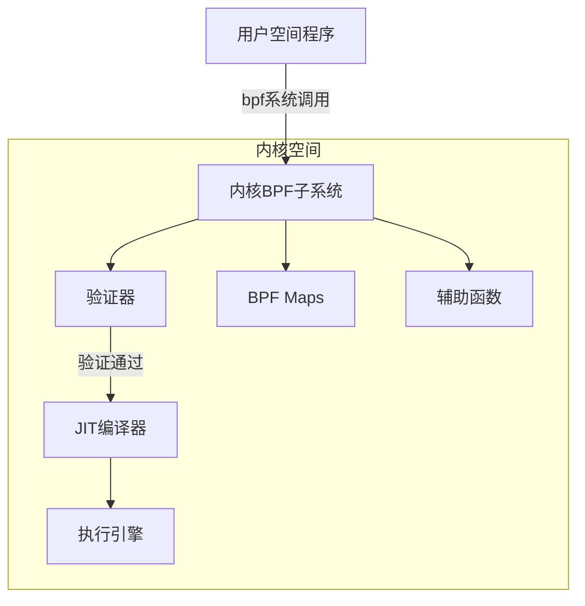
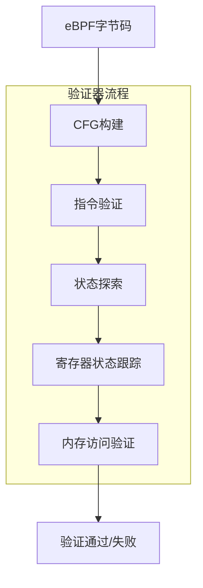
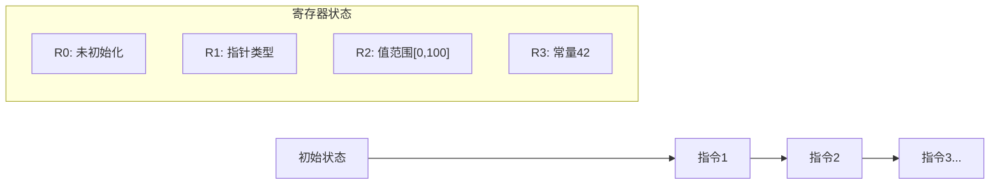
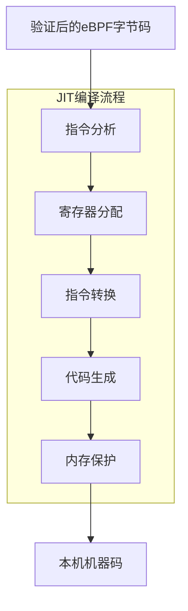
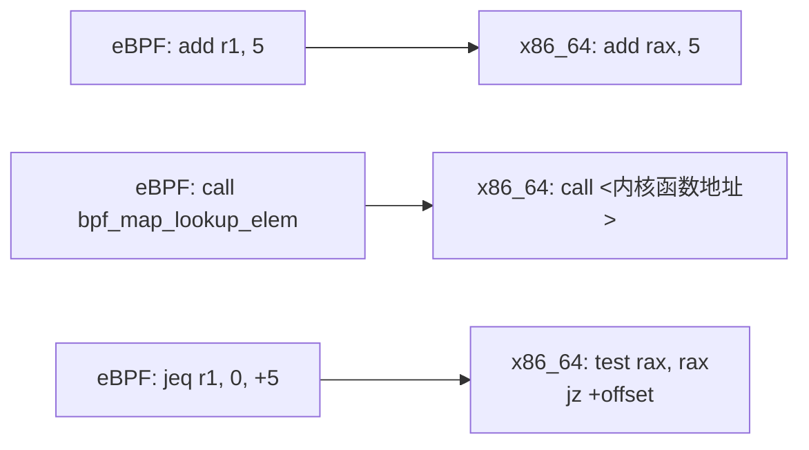
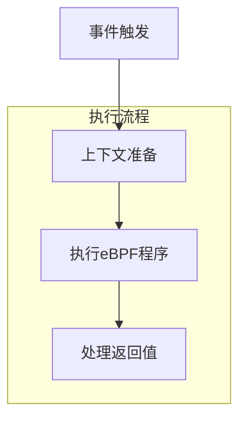
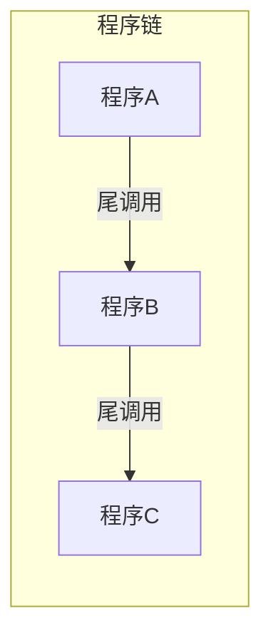
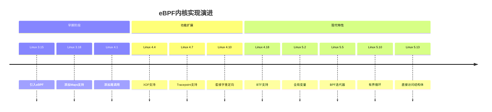

# eBPF 内核实现

## 概述

eBPF（扩展的伯克利包过滤器）作为Linux内核中的一项关键技术，其内核实现是理解其安全性和性能的基础。本文深入分析eBPF的内核实现机制，特别是验证器和JIT编译器的工作原理。

## eBPF 内核架构



## eBPF 验证器

验证器是eBPF安全模型的核心组件，确保加载到内核的eBPF程序不会破坏系统稳定性或安全性。

### 验证器工作流程



### 1. 控制流图（CFG）构建

验证器首先构建程序的控制流图，识别所有可能的执行路径：

- 检测无效跳转指令
- 识别不可达代码
- 检测循环（eBPF程序不允许有循环，除非使用有界循环扩展）

### 2. 指令验证

验证每条指令的合法性：

- 操作码有效性
- 寄存器范围检查
- 指令组合合法性

### 3. 状态探索与寄存器跟踪

验证器模拟程序执行，跟踪每个寄存器的可能值范围：



- **值跟踪**：记录每个寄存器可能的值范围
- **指针跟踪**：验证指针操作安全性
- **类型检查**：确保操作类型兼容

### 4. 内存访问验证

- 验证所有内存访问在有效范围内
- 检查栈边界
- 验证映射访问的正确性

### 5. 验证器的限制与优化

- **状态爆炸问题**：复杂程序可能导致状态空间爆炸
- **验证时间限制**：内核对验证时间有上限（通常为1秒）
- **验证器改进**：
  - 状态合并优化
  - 剪枝技术
  - 并行验证

## eBPF JIT 编译器

JIT（Just-In-Time）编译器将eBPF字节码转换为本机机器码，显著提高执行性能。

### JIT编译流程



### 1. 架构特定实现

Linux内核为不同CPU架构提供了特定的JIT实现：

- **x86_64**：最成熟的实现，支持全指令集
- **ARM64**：针对移动和服务器平台优化
- **RISC-V**：新兴架构支持
- **PowerPC**：IBM系统支持
- **s390**：大型机支持

### 2. 指令映射

JIT编译器将eBPF指令映射到对应的本机指令：



### 3. 寄存器映射

- **x86_64**：eBPF寄存器映射到硬件寄存器
  - R0 → RAX
  - R1 → RDI
  - R2 → RSI
  - 等等

### 4. 优化技术

JIT编译器应用多种优化技术：

- **指令合并**：将多条eBPF指令合并为更少的本机指令
- **尾调用优化**：优化函数调用
- **常量传播**：编译时计算常量表达式
- **死代码消除**：移除不会执行的代码

### 5. 安全考虑

- **代码保护**：JIT生成的代码被标记为只读
- **常量混淆**：防止JIT喷射攻击
- **内存隔离**：确保生成的代码不能执行特权操作

## eBPF 运行时

### 1. 执行模型



- **上下文准备**：根据程序类型准备输入上下文
- **执行调度**：在适当的钩子点调用eBPF程序
- **返回值处理**：根据程序类型解释返回值

### 2. 尾调用机制

尾调用允许一个eBPF程序调用另一个eBPF程序，实现程序链：



- 最多支持32层调用深度
- 使用BPF_MAP_TYPE_PROG_ARRAY映射存储目标程序

### 3. 辅助函数实现

辅助函数是内核提供的API，允许eBPF程序执行特权操作：

- 实现为内核函数
- 通过函数ID映射表调用
- 每个程序类型有特定的允许辅助函数集

## eBPF 内核子系统演进



## 性能考量

### 1. JIT vs 解释器

- JIT编译后的性能提升4-5倍
- 解释器作为后备机制存在
- 编译开销通常在程序加载时一次性发生

### 2. 内存访问优化

- 直接数据包访问
- 零拷贝技术
- 缓存友好的数据结构

### 3. 并行执行

- 每CPU映射减少锁竞争
- 无共享状态设计
- 原子操作支持

## 调试与故障排除

### 1. 验证器日志

验证器提供详细的失败原因：

```
bpf_prog_load() err=13
verification failed: invalid indirect read from stack R1 off -8+0 size 8
0: (bf) r6 = r1
1: (7b) *(u64 *)(r10 -8) = r6
2: (79) r1 = *(u64 *)(r10 -8)
3: (07) r1 += 8
4: (79) r2 = *(u64 *)(r1 +0)
```

### 2. BTF (BPF Type Format)

BTF提供了调试信息：

- 保留类型信息
- 支持源代码级调试
- 简化程序开发

### 3. bpftool

内核提供的工具，用于检查和管理eBPF程序和映射：

```bash
# 列出所有加载的程序
bpftool prog list

# 显示程序的JIT代码
bpftool prog dump xlated id 123
bpftool prog dump jited id 123
```

## 安全模型

### 1. 权限控制

- 默认需要CAP_BPF或CAP_SYS_ADMIN权限
- 非特权用户限制：
  - 只能加载套接字过滤器
  - 有限的辅助函数集
  - 更严格的验证

### 2. 隔离机制

- 沙箱执行环境
- 无法访问任意内存
- 有限的指令集

### 3. 漏洞缓解

- 常量混淆
- JIT硬化
- 内存保护

## 结论

eBPF的内核实现通过验证器和JIT编译器提供了安全性和性能的平衡。验证器确保程序安全，而JIT编译器提供接近原生的执行性能。随着Linux内核的发展，eBPF子系统不断演进，提供更多功能和优化，使其成为现代Linux系统中不可或缺的组件。