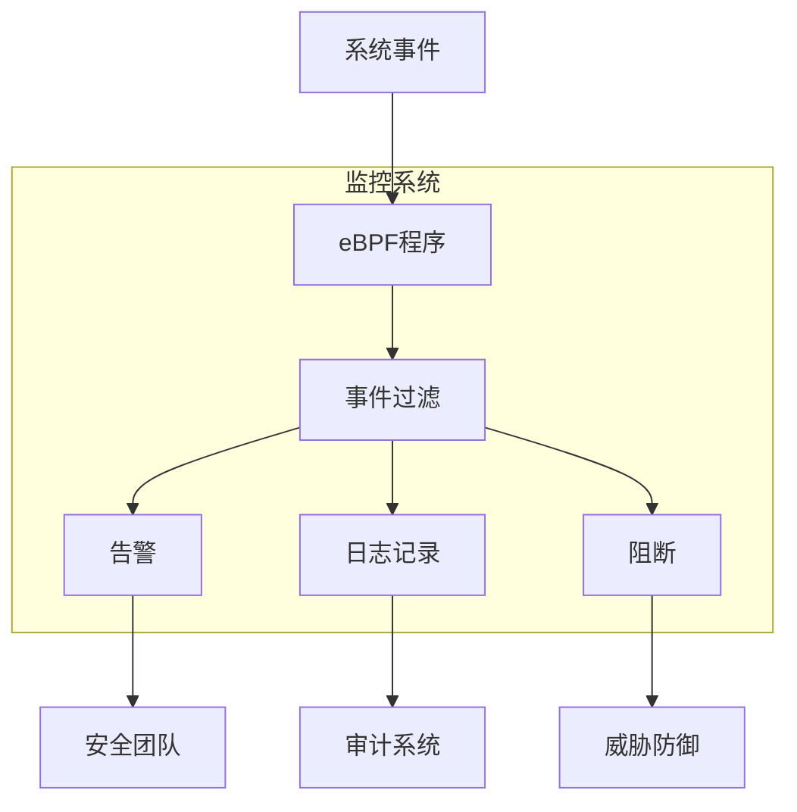
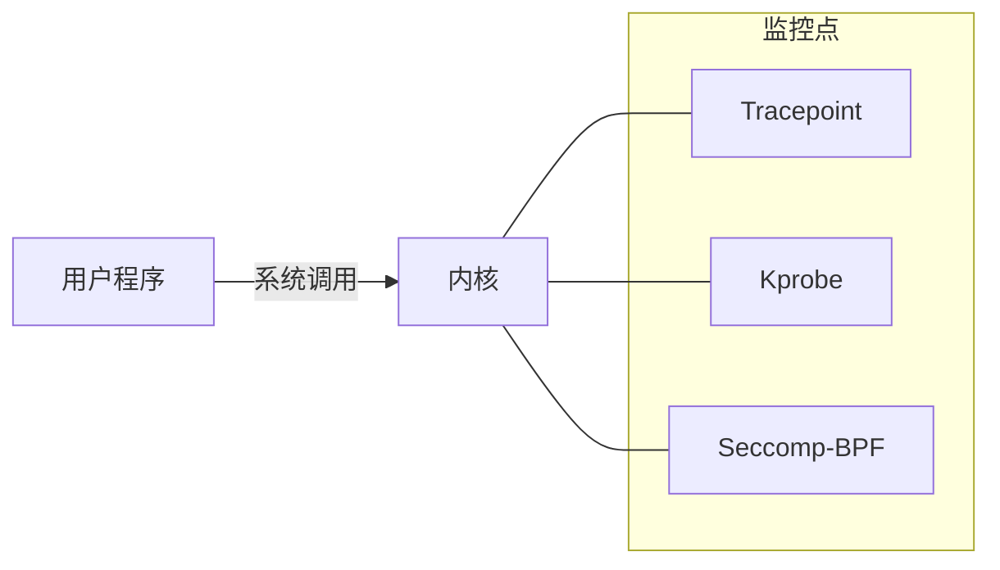
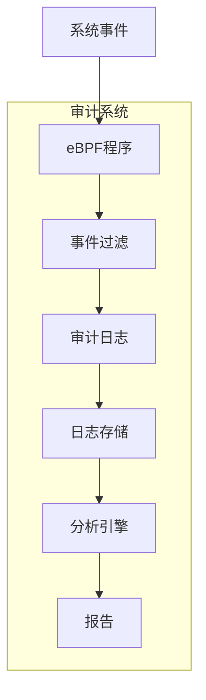

# eBPF 安全监控

## 概述

eBPF技术为Linux系统安全监控提供了强大的能力，允许以低开销方式实时监控系统行为。本文详细介绍如何使用eBPF进行系统调用监控和安全审计，帮助安全工程师和系统管理员构建高效的安全监控系统。

## 安全监控架构



## 系统调用监控

系统调用是用户空间程序与内核交互的主要接口，监控系统调用可以全面了解程序行为。

### 1. 系统调用跟踪技术



#### Tracepoint 方式

Tracepoint是内核中预定义的静态跟踪点，提供稳定的ABI：

```c
#include <linux/bpf.h>
#include <bpf/bpf_helpers.h>

struct syscalls_enter_execve_args {
    __u64 pad;
    __u32 syscall_nr;
    const char *filename;
    const char *const *argv;
    const char *const *envp;
};

SEC("tracepoint/syscalls/sys_enter_execve")
int trace_execve(struct syscalls_enter_execve_args *ctx) {
    char comm[16];
    bpf_get_current_comm(&comm, sizeof(comm));
    
    bpf_printk("execve called by %s, filename: %s\n", 
               comm, ctx->filename);
    return 0;
}

char LICENSE[] SEC("license") = "GPL";
```

#### Seccomp-BPF 方式

Seccomp-BPF允许为进程设置系统调用过滤器：

```c
#include <linux/bpf.h>
#include <linux/seccomp.h>
#include <linux/filter.h>
#include <linux/audit.h>
#include <sys/syscall.h>
#include <unistd.h>

static void install_filter(void) {
    struct sock_filter filter[] = {
        BPF_STMT(BPF_LD | BPF_W | BPF_ABS, 
                 offsetof(struct seccomp_data, nr)),
        
        // 允许 read, write, exit, exit_group
        BPF_JUMP(BPF_JMP | BPF_JEQ | BPF_K, __NR_read, 0, 1),
        BPF_STMT(BPF_RET | BPF_K, SECCOMP_RET_ALLOW),
        BPF_JUMP(BPF_JMP | BPF_JEQ | BPF_K, __NR_write, 0, 1),
        BPF_STMT(BPF_RET | BPF_K, SECCOMP_RET_ALLOW),
        BPF_JUMP(BPF_JMP | BPF_JEQ | BPF_K, __NR_exit, 0, 1),
        BPF_STMT(BPF_RET | BPF_K, SECCOMP_RET_ALLOW),
        BPF_JUMP(BPF_JMP | BPF_JEQ | BPF_K, __NR_exit_group, 0, 1),
        BPF_STMT(BPF_RET | BPF_K, SECCOMP_RET_ALLOW),
        
        // 记录并拒绝其他系统调用
        BPF_STMT(BPF_RET | BPF_K, SECCOMP_RET_TRACE),
    };
    
    struct sock_fprog prog = {
        .len = sizeof(filter) / sizeof(filter[0]),
        .filter = filter,
    };
    
    syscall(SYS_seccomp, SECCOMP_SET_MODE_FILTER, 0, &prog);
}
```

### 2. 系统调用监控工具

#### BCC工具: `execsnoop`

监控系统上所有的`execve`系统调用：

```bash
# 监控所有进程的execve调用
sudo execsnoop

# 监控特定进程的execve调用
sudo execsnoop -p 1234
```

#### 自定义监控脚本

使用bpftrace监控特定系统调用：

```bash
#!/usr/bin/env bpftrace

tracepoint:syscalls:sys_enter_open,
tracepoint:syscalls:sys_enter_openat
{
    printf("%s(%d) opened %s\n", comm, pid, str(args->filename));
}
```

### 3. 案例：检测权限提升

#### 问题描述

需要监控系统中可能的权限提升行为，如通过`setuid`程序或漏洞利用获取root权限。

#### 监控方案

使用eBPF监控关键系统调用：

```c
#include <linux/bpf.h>
#include <bpf/bpf_helpers.h>

struct {
    __uint(type, BPF_MAP_TYPE_RINGBUF);
    __uint(max_entries, 256 * 1024);
} events SEC(".maps");

struct event {
    u32 pid;
    u32 uid;
    u32 gid;
    u32 target_uid;
    u32 target_gid;
    char comm[16];
};

SEC("tracepoint/syscalls/sys_enter_setuid")
int trace_setuid(void *ctx) {
    struct event *e;
    
    e = bpf_ringbuf_reserve(&events, sizeof(*e), 0);
    if (!e) return 0;
    
    e->pid = bpf_get_current_pid_tgid() >> 32;
    e->uid = bpf_get_current_uid_gid() & 0xFFFFFFFF;
    e->gid = bpf_get_current_uid_gid() >> 32;
    
    // 获取目标UID
    // 注意：这里简化处理，实际需要从系统调用参数获取
    e->target_uid = 0; // 假设目标是root
    
    bpf_get_current_comm(&e->comm, sizeof(e->comm));
    
    bpf_ringbuf_submit(e, 0);
    return 0;
}
```

#### 分析结果

```
TIME      PID    UID    GID    TARGET  COMM
10:15:32  1234   1000   1000   0       sudo
10:15:45  2345   1000   1000   0       su
10:16:01  3456   1000   1000   0       unknown_binary
```

#### 案例解决

通过监控发现了一个未知二进制文件尝试提升到root权限。进一步调查确认这是一个恶意程序，及时阻止了潜在的安全事件。

## 安全审计

安全审计是记录系统中安全相关事件的过程，用于事后分析和合规性验证。

### 1. 审计架构



### 2. 文件访问审计

#### 监控关键文件访问

使用eBPF监控敏感文件的访问：

```c
#include <linux/bpf.h>
#include <bpf/bpf_helpers.h>

struct data_t {
    u32 pid;
    u32 uid;
    char comm[16];
    char filename[256];
    int flags;
};

struct {
    __uint(type, BPF_MAP_TYPE_PERF_EVENT_ARRAY);
    __uint(key_size, sizeof(u32));
    __uint(value_size, sizeof(u32));
} events SEC(".maps");

SEC("tracepoint/syscalls/sys_enter_openat")
int trace_openat(struct trace_event_raw_sys_enter *ctx) {
    struct data_t data = {};
    
    data.pid = bpf_get_current_pid_tgid() >> 32;
    data.uid = bpf_get_current_uid_gid() & 0xFFFFFFFF;
    
    bpf_get_current_comm(&data.comm, sizeof(data.comm));
    
    // 获取文件名
    bpf_probe_read_user_str(&data.filename, sizeof(data.filename),
                       (void *)ctx->args[1]);
    
    // 获取打开标志
    bpf_probe_read(&data.flags, sizeof(data.flags),
               (void *)&ctx->args[2]);
    
    // 检查是否为敏感文件
    if (bpf_strncmp(data.filename, 11, "/etc/passwd") == 0 ||
        bpf_strncmp(data.filename, 11, "/etc/shadow") == 0 ||
        bpf_strncmp(data.filename, 9, "/etc/ssh/") == 0) {
        
        bpf_perf_event_output(ctx, &events, BPF_F_CURRENT_CPU,
                           &data, sizeof(data));
    }
    
    return 0;
}
```

#### 审计日志示例

```
TIME           PID    UID    COMM       FILENAME           FLAGS
14:23:45.123   1234   0      cat        /etc/passwd        O_RDONLY
14:25:12.456   2345   1000   vim        /etc/passwd        O_RDWR
14:30:01.789   3456   0      sshd       /etc/ssh/sshd_config O_RDONLY
```

### 3. 网络连接审计

#### 监控网络连接

使用eBPF监控网络连接建立：

```c
#include <linux/bpf.h>
#include <bpf/bpf_helpers.h>
#include <linux/tcp.h>
#include <linux/ip.h>

struct connection_info {
    u32 pid;
    u32 uid;
    char comm[16];
    u32 saddr;
    u32 daddr;
    u16 sport;
    u16 dport;
    u8 protocol;
};

struct {
    __uint(type, BPF_MAP_TYPE_PERF_EVENT_ARRAY);
    __uint(key_size, sizeof(u32));
    __uint(value_size, sizeof(u32));
} events SEC(".maps");

SEC("tracepoint/sock/inet_sock_set_state")
int trace_connect(struct trace_event_raw_inet_sock_set_state *ctx) {
    if (ctx->newstate != TCP_ESTABLISHED)
        return 0;
    
    struct connection_info info = {};
    
    info.pid = bpf_get_current_pid_tgid() >> 32;
    info.uid = bpf_get_current_uid_gid() & 0xFFFFFFFF;
    
    bpf_get_current_comm(&info.comm, sizeof(info.comm));
    
    info.saddr = ctx->saddr;
    info.daddr = ctx->daddr;
    info.sport = ctx->sport;
    info.dport = ctx->dport;
    info.protocol = ctx->protocol;
    
    bpf_perf_event_output(ctx, &events, BPF_F_CURRENT_CPU,
                       &info, sizeof(info));
    
    return 0;
}
```

#### 审计日志示例

```
TIME           PID    UID    COMM       SRC             DST             PROTO
15:10:23.456   1234   1000   curl       192.168.1.5:12345 93.184.216.34:80 TCP
15: