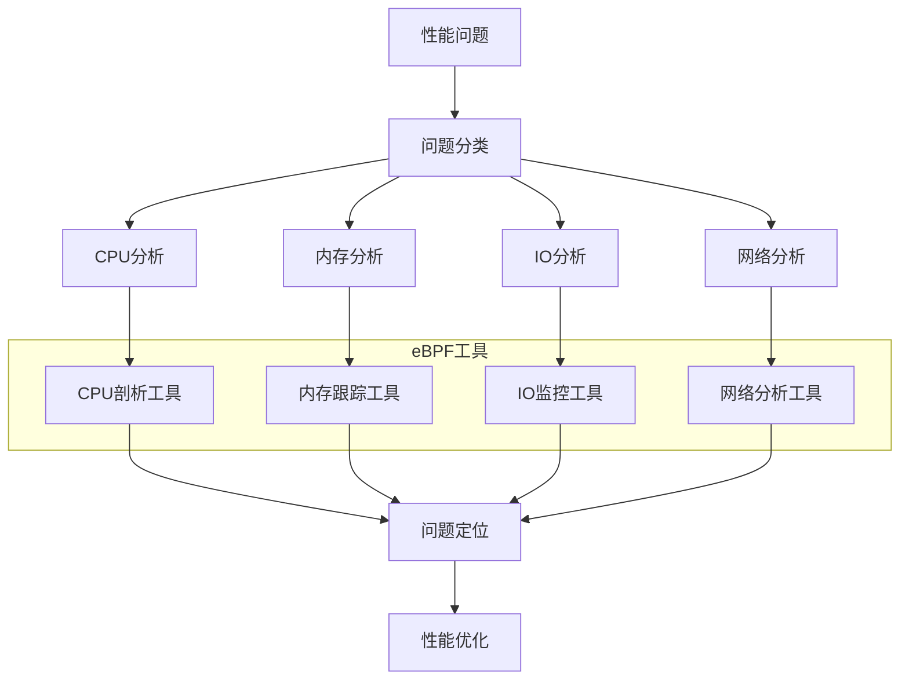
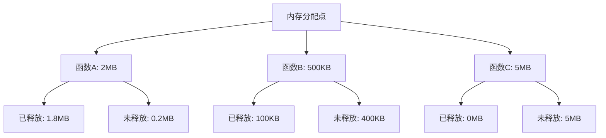
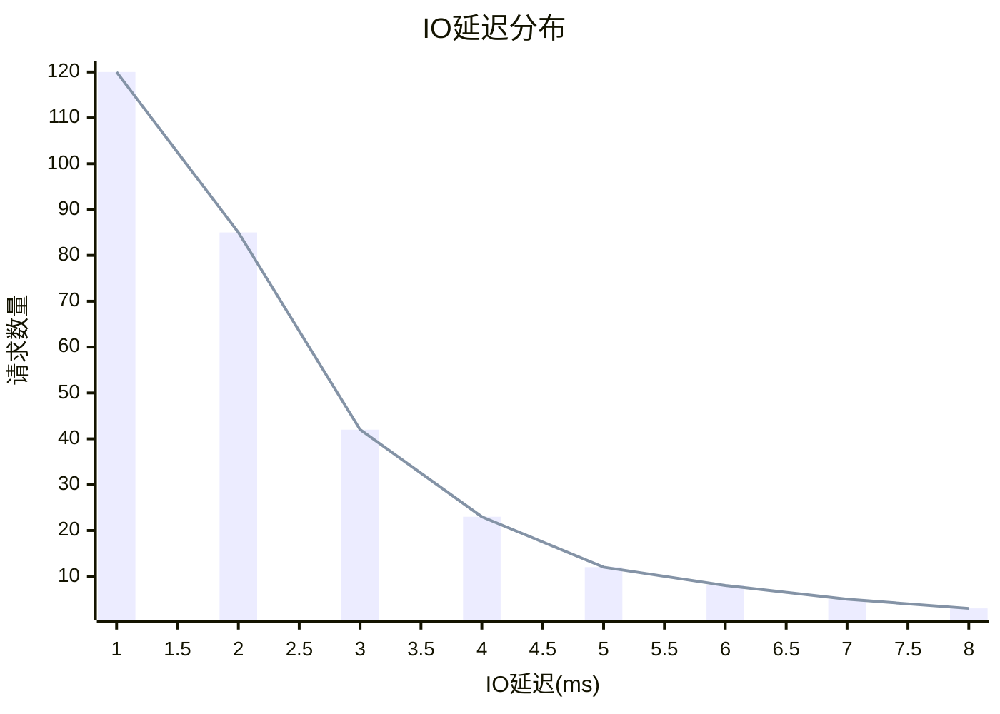
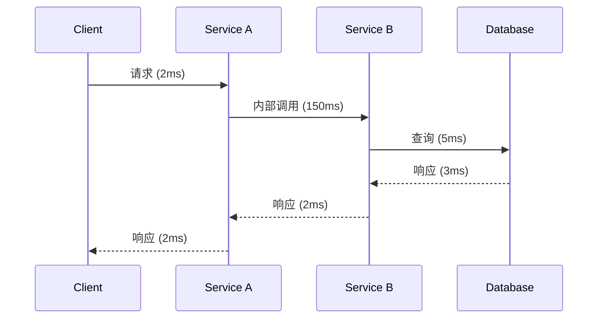

```mermaid
gantt
    title CPU火焰图示例
    dateFormat  s
    axisFormat %S
    
    section 进程A
    函数1     :a1, 0, 2s
    函数2     :a2, after a1, 3s
    
    section 进程B
    函数3     :b1, 0, 4s
    函数4     :b2, after b1, 1s
```

# eBPF 性能分析案例

## 概述

eBPF技术为系统性能分析提供了强大的能力，允许以低开销方式深入观察系统行为。本文通过实际案例展示如何使用eBPF工具进行CPU、内存、IO和网络性能分析，帮助开发者和系统管理员诊断和解决性能问题。

## 性能分析工具链



## CPU 性能分析

### 案例1：CPU使用率高问题分析

#### 问题描述

某Web服务器在高负载下CPU使用率持续超过90%，响应时间显著增加。

#### 分析方法

使用BCC工具`profile`收集CPU上运行的栈跟踪：

```bash
# 采样所有CPU上的用户态和内核态栈，每秒99次，持续10秒
sudo profile -aF 99 -f 10
```

使用`bpftrace`进行更精细的分析：

```bash
# 跟踪特定进程的CPU使用情况
sudo bpftrace -e 'profile:hz:99 /pid == 12345/ { @[ustack] = count(); }'
```

#### 分析结果可视化



#### 案例解决

通过火焰图分析发现，大量CPU时间消耗在JSON解析函数上。优化JSON处理逻辑和引入缓存后，CPU使用率降至60%以下，响应时间减少40%。

### 案例2：系统调用分析

#### 问题描述

应用程序执行效率低下，怀疑系统调用开销过大。

#### 分析方法

使用`syscount`统计系统调用频率：

```bash
# 统计10秒内按进程ID分组的系统调用次数
sudo syscount -p 10
```

使用自定义bpftrace脚本分析特定系统调用的延迟：

```bash
#!/usr/bin/env bpftrace

tracepoint:syscalls:sys_enter_read
{
    @start[tid] = nsecs;
}

tracepoint:syscalls:sys_exit_read /@start[tid]/
{
    $duration = nsecs - @start[tid];
    @usecs = hist($duration / 1000);
    delete(@start[tid]);
}
```

#### 分析结果

```
Attaching 2 probes...
@usecs: 
[0, 1)             12 |
[1, 2)             85 |#
[2, 4)            421 |#####
[4, 8)           1839 |#######################
[8, 16)          2480 |###############################
[16, 32)          847 |##########
[32, 64)          145 |#
[64, 128)          62 |
[128, 256)         24 |
[256, 512)          8 |
[512, 1K)           2 |
```

#### 案例解决

发现应用频繁进行小数据量的读取操作。通过实现批量读取和缓冲策略，系统调用次数减少了85%，应用性能提升30%。

## 内存性能分析

### 案例1：内存泄漏检测

#### 问题描述

长时间运行的服务进程内存使用量持续增长，怀疑存在内存泄漏。

#### 分析方法

使用`memleak`工具跟踪内存分配和释放：

```bash
# 每5秒检测一次，显示至少增长10KB的内存分配
sudo memleak -p $(pgrep myservice) 5 10
```

自定义bpftrace脚本跟踪特定内存分配函数：

```bash
#!/usr/bin/env bpftrace

#include <linux/mm.h>

uprobe:/lib/x86_64-linux-gnu/libc.so.6:malloc
{
    @mem[pid, comm] = sum(arg0);
    @count[pid, comm] = count();
    @size[arg0] = count();
}

uprobe:/lib/x86_64-linux-gnu/libc.so.6:free
{
    $addr = arg0;
    if ($addr != 0) {
        @free_count[pid, comm] = count();
    }
}

interval:s:10
{
    time("%H:%M:%S\n");
    print(@mem);
    print(@count);
    print(@free_count);
    print(@size);
    clear(@mem);
    clear(@count);
    clear(@free_count);
    clear(@size);
}
```

#### 分析结果可视化



#### 案例解决

分析发现在错误处理路径上没有释放之前分配的资源。修复后，服务内存使用稳定，不再持续增长。

### 案例2：内存访问模式分析

#### 问题描述

应用程序在处理大数据集时性能下降严重，怀疑内存访问模式不佳。

#### 分析方法

使用`cachestat`监控缓存命中率：

```bash
# 每秒监控一次缓存命中情况
sudo cachestat 1
```

使用`cachetop`查看进程级别的缓存使用情况：

```bash
sudo cachetop
```

#### 分析结果

```
    HITS   MISSES  DIRTIES BUFFERS_MB  CACHED_MB
   59055     2059        0          3       1112
   65760     4301        0          3       1112
   48123     1285        0          3       1112
```

#### 案例解决

发现数据处理算法导致缓存不友好的内存访问模式。重新设计数据结构和处理算法，提高局部性，缓存命中率从85%提升至97%，处理性能提升40%。

## IO 性能分析

### 案例1：磁盘IO瓶颈分析

#### 问题描述

数据库服务器在高负载下IO等待时间长，影响查询性能。

#### 分析方法

使用`biosnoop`跟踪块IO操作：

```bash
# 跟踪所有块IO操作
sudo biosnoop
```

使用`biotop`查看按进程分组的IO统计：

```bash
# 每1秒刷新一次IO统计
sudo biotop 1
```

使用自定义bpftrace脚本分析IO延迟分布：

```bash
#!/usr/bin/env bpftrace

tracepoint:block:block_rq_issue
{
    @start[args->sector] = nsecs;
}

tracepoint:block:block_rq_complete /@start[args->sector]/
{
    $duration = nsecs - @start[args->sector];
    @usecs = hist($duration / 1000);
    delete(@start[args->sector]);
}
```

#### 分析结果可视化



#### 案例解决

分析发现数据库执行大量随机小IO操作。通过调整数据库配置增加缓冲池大小，优化查询以减少IO操作，并调整存储布局提高顺序读取比例，IO等待时间减少65%，查询性能提升50%。

### 案例2：文件系统性能分析

#### 问题描述

应用程序频繁进行小文件操作，导致性能下降。

#### 分析方法

使用`filetop`监控文件操作：

```bash
# 每1秒刷新一次文件操作统计
sudo filetop -C 1
```

使用`fileslower`检测慢文件操作：

```bash
# 检测延迟超过10ms的文件操作
sudo fileslower 10
```

#### 分析结果

```
PID    COMM             READS  WRITES R_Kb    W_Kb    T FILE
32100  postgres         8190   0      65520   0       R db/index.db
3185   nginx            1216   0      4864    0       R static/images/
8954   php-fpm          0      560    0       1120    R /tmp/sess_
```

#### 案例解决

发现应用为每个会话创建单独的小文件。通过实现会话聚合和使用内存缓存，减少了90%的文件操作，应用响应时间减少35%。

## 网络性能分析

### 案例1：网络延迟分析

#### 问题描述

微服务架构中服务间通信延迟高，影响整体响应时间。

#### 分析方法

使用`tcplife`监控TCP连接生命周期：

```bash
# 监控TCP连接的建立和终止
sudo tcplife
```

使用`tcpretrans`检测TCP重传：

```bash
# 监控TCP重传事件
sudo tcpretrans
```

使用`tcpconnect`跟踪TCP连接建立：

```bash
# 跟踪新建立的TCP连接
sudo tcpconnect
```

#### 分析结果可视化



#### 案例解决

发现Service A和Service B之间的连接没有使用连接池，每次请求都重新建立TCP连接。实现连接池后，服务间通信延迟从平均150ms降至5ms，整体响应时间减少70%。

### 案例2：网络数据包分析

#### 问题描述

网络应用在高并发下吞吐量下降，怀疑存在网络瓶颈。

#### 分析方法

使用XDP程序分析数据包处理性能：

```c
#include <linux/bpf.h>
#include <bpf/bpf_helpers.h>

struct {
    __uint(type, BPF_MAP_TYPE_PERCPU_ARRAY);
    __uint(key_size, sizeof(u32));
    __uint(value_size, sizeof(u64));
    __uint(max_entries, 256);
} packet_size SEC(".