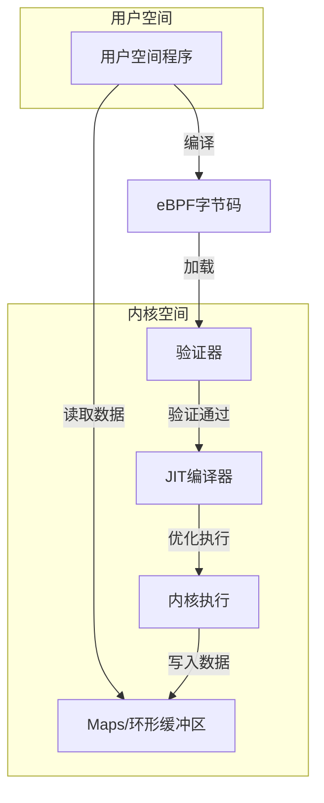
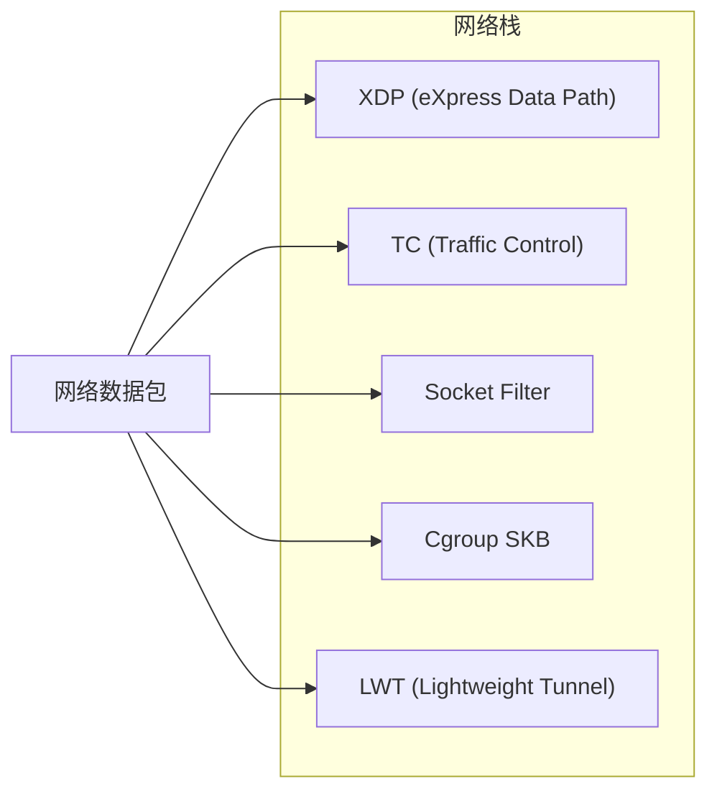
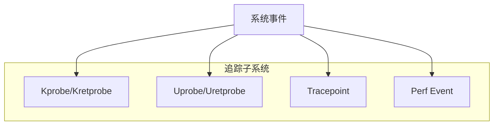
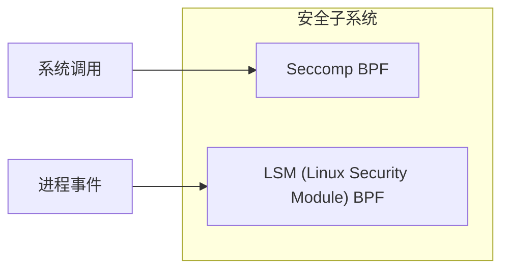
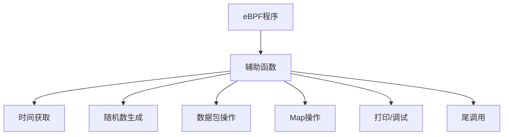
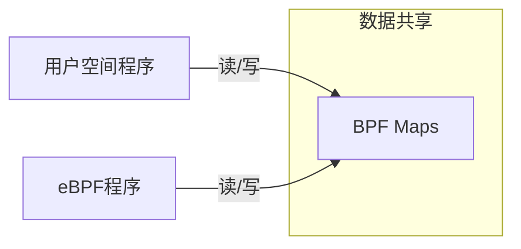
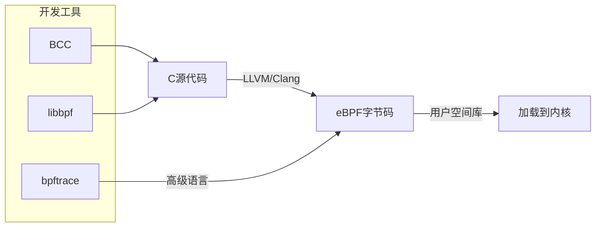

# eBPF 编程模型

## 概述

eBPF（扩展的伯克利包过滤器）是Linux内核中的一种强大技术，允许在内核空间安全地执行用户定义的程序，而无需修改内核源代码或加载内核模块。本文详细介绍eBPF的编程模型、程序类型和编程接口。

## eBPF 架构



## eBPF 程序类型

eBPF程序根据其挂载点和用途分为多种类型，每种类型有特定的上下文和功能限制：

### 1. 网络相关程序类型



- **XDP (eXpress Data Path)**：
  - 挂载点：网络驱动程序接收路径的最早点
  - 上下文：`struct xdp_md`
  - 特点：最高性能，可在数据包到达网络栈之前处理
  - 返回值：`XDP_DROP`, `XDP_PASS`, `XDP_TX`, `XDP_REDIRECT`
  - 应用场景：DDoS防御、负载均衡、包过滤

- **TC (Traffic Control)**：
  - 挂载点：流量控制层（入口/出口）
  - 上下文：`struct __sk_buff`
  - 特点：可以修改数据包内容，比XDP更灵活
  - 应用场景：QoS、流量整形、网络监控

- **Socket Filter**：
  - 挂载点：套接字层
  - 上下文：`struct __sk_buff`
  - 特点：过滤到达特定套接字的数据包
  - 应用场景：应用层过滤、安全监控

### 2. 追踪和性能分析程序类型



- **Kprobe/Kretprobe**：
  - 挂载点：任意内核函数入口/返回点
  - 上下文：`struct pt_regs`
  - 特点：动态追踪，可能受内核版本变化影响
  - 应用场景：内核函数调用分析、参数监控

- **Uprobe/Uretprobe**：
  - 挂载点：用户空间函数入口/返回点
  - 上下文：`struct pt_regs`
  - 特点：动态追踪用户程序
  - 应用场景：应用程序性能分析、行为监控

- **Tracepoint**：
  - 挂载点：内核中预定义的静态跟踪点
  - 上下文：特定于每个tracepoint的结构
  - 特点：稳定的ABI，不受内核版本变化影响
  - 应用场景：系统调用追踪、文件系统操作监控

- **Perf Event**：
  - 挂载点：性能监控事件
  - 上下文：取决于事件类型
  - 特点：硬件和软件事件监控
  - 应用场景：CPU性能计数器、缓存命中率分析

### 3. 安全相关程序类型



- **Seccomp BPF**：
  - 挂载点：系统调用
  - 上下文：`struct seccomp_data`
  - 特点：过滤和限制系统调用
  - 应用场景：容器安全、沙箱环境

- **LSM (Linux Security Module) BPF**：
  - 挂载点：LSM钩子
  - 上下文：特定于每个LSM钩子
  - 特点：实现自定义安全策略
  - 应用场景：强制访问控制、审计

## eBPF 编程接口

### 1. BPF 系统调用

eBPF程序通过`bpf()`系统调用与内核交互，该系统调用支持多种命令：

```c
int bpf(int cmd, union bpf_attr *attr, unsigned int size);
```

主要命令包括：

- `BPF_PROG_LOAD`：加载eBPF程序
- `BPF_MAP_CREATE`：创建BPF映射
- `BPF_MAP_LOOKUP_ELEM`：查找映射元素
- `BPF_MAP_UPDATE_ELEM`：更新映射元素
- `BPF_MAP_DELETE_ELEM`：删除映射元素
- `BPF_OBJ_PIN`：将BPF对象固定到文件系统
- `BPF_OBJ_GET`：从文件系统获取BPF对象

### 2. BPF 辅助函数

eBPF程序可以调用内核提供的辅助函数来执行各种操作：



常用辅助函数类别：

- **Map操作**：`bpf_map_lookup_elem()`, `bpf_map_update_elem()`, `bpf_map_delete_elem()`
- **时间相关**：`bpf_ktime_get_ns()`, `bpf_jiffies64()`
- **打印调试**：`bpf_trace_printk()`, `bpf_perf_event_output()`
- **数据包操作**：`bpf_skb_store_bytes()`, `bpf_l3_csum_replace()`, `bpf_l4_csum_replace()`
- **上下文获取**：`bpf_get_current_pid_tgid()`, `bpf_get_current_uid_gid()`, `bpf_get_current_comm()`
- **尾调用**：`bpf_tail_call()`

### 3. BPF Maps

BPF Maps是eBPF程序存储和检索数据的关键机制，也是用户空间和内核空间通信的桥梁：



主要Map类型：

- **BPF_MAP_TYPE_HASH**：哈希表，用于键值对存储
- **BPF_MAP_TYPE_ARRAY**：数组，固定大小，索引为键
- **BPF_MAP_TYPE_PERCPU_HASH**：每CPU哈希表，避免锁竞争
- **BPF_MAP_TYPE_PERCPU_ARRAY**：每CPU数组
- **BPF_MAP_TYPE_LRU_HASH**：LRU哈希表，自动淘汰最近最少使用的项
- **BPF_MAP_TYPE_RINGBUF**：环形缓冲区，高效事件传输
- **BPF_MAP_TYPE_STACK_TRACE**：堆栈跟踪存储
- **BPF_MAP_TYPE_PROG_ARRAY**：程序数组，用于尾调用

## 编程工具链



### 1. BCC (BPF Compiler Collection)

BCC提供了Python和Lua接口，简化了eBPF程序的开发：

```python
from bcc import BPF

# 定义eBPF程序
prog = """
#include <uapi/linux/ptrace.h>

BPF_HASH(count_map, u64, u64);

int kprobe__sys_clone(struct pt_regs *ctx) {
    u64 pid = bpf_get_current_pid_tgid();
    u64 *val = count_map.lookup(&pid);
    if (!val) {
        u64 init_val = 1;
        count_map.update(&pid, &init_val);
    } else {
        (*val)++;
        count_map.update(&pid, val);
    }
    return 0;
}
"""

# 加载eBPF程序
b = BPF(text=prog)

# 打印结果
while True:
    try:
        sleep(1)
        for k, v in b["count_map"].items():
            print(f"PID {k.value}: {v.value}")
    except KeyboardInterrupt:
        break
```

### 2. libbpf

libbpf是一个C库，提供了加载和交互eBPF程序的API：

```c
#include <bpf/bpf.h>
#include <bpf/libbpf.h>

int main() {
    struct bpf_object *obj;
    struct bpf_program *prog;
    int prog_fd;
    
    // 加载BPF对象文件
    obj = bpf_object__open("program.o");
    if (!obj) {
        fprintf(stderr, "Failed to open BPF object\n");
        return 1;
    }
    
    // 加载BPF程序
    if (bpf_object__load(obj)) {
        fprintf(stderr, "Failed to load BPF object\n");
        bpf_object__close(obj);
        return 1;
    }
    
    // 获取程序文件描述符
    prog = bpf_object__find_program_by_name(obj, "prog_name");
    if (!prog) {
        fprintf(stderr, "Failed to find BPF program\n");
        bpf_object__close(obj);
        return 1;
    }
    prog_fd = bpf_program__fd(prog);
    
    // 附加到事件
    // ...
    
    bpf_object__close(obj);
    return 0;
}
```

### 3. bpftrace

bpftrace是一种高级跟踪语言，类似于awk和DTrace：

```
#!/usr/bin/env bpftrace

tracepoint:syscalls:sys_enter_openat
{
    @files[comm] = count();
}

interval:s:5
{
    print(@files);
    clear(@files);
}
```

## 最佳实践

1. **性能考虑**：
   - 避免在热路径中使用复杂逻辑
   - 利用每CPU映射减少锁竞争
   - 使用批处理减少事件处理开销

2. **安全考虑**：
   - 遵循最小权限原则
   - 谨慎处理用户输入
   -