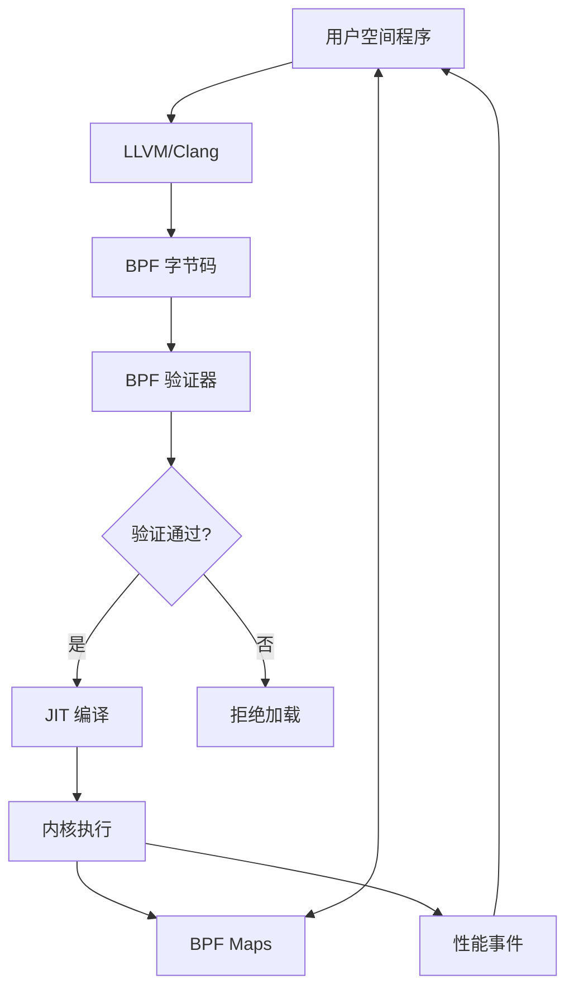
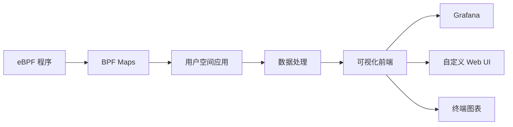

---
tags:
  - 性能优化
  - 工具
  - eBPF
---

# eBPF 实战指南

## 基础概念

### eBPF 简介

eBPF (extended Berkeley Packet Filter) 是 Linux 内核中的一种高性能、安全的虚拟机机制，允许在内核中运行沙盒程序，无需修改内核源码或加载内核模块。它已经从最初的网络包过滤器发展成为通用的内核可编程框架，广泛应用于性能分析、网络监控和安全审计等领域。

### eBPF 架构



### eBPF 程序类型

- **kprobe/kretprobe**：内核函数入口/返回点跟踪
- **uprobe/uretprobe**：用户空间函数入口/返回点跟踪
- **tracepoint**：内核静态跟踪点
- **perf_event**：性能监控事件
- **XDP**：eXpress Data Path，网络数据包快速处理
- **socket**：套接字过滤
- **cgroup**：控制组资源控制

## 实战案例

### 案例1：网络性能分析
追踪TCP重传事件，诊断网络延迟问题：
```bash
sudo opensnoop-bpfcc -d 5
sudo tcpretrans -c

# 结果解读：
# 显示触发TCP重传的进程、源目地址、重传次数
# 结合ss -i命令查看具体连接状态
```

### 案例2：CPU使用率高分析
跟踪用户空间函数调用频率：
```python
from bcc import BPF
prog = '''
int count_functions(struct pt_regs *ctx) {
    bpf_trace_printk(\"func called\

```bash
# Ubuntu/Debian
sudo apt-get install bpfcc-tools linux-headers-$(uname -r)

# CentOS/RHEL
sudo yum install bcc-tools kernel-devel

# Arch Linux
sudo pacman -S bcc bcc-tools
```

### 常用 BCC 工具

```bash
# 跟踪系统调用
sudo execsnoop

# 跟踪文件打开
sudo opensnoop

# 跟踪TCP连接
sudo tcpconnect

# 跟踪块I/O延迟
sudo biolatency

# 跟踪进程执行
sudo runqlat
```

## bpftrace 使用

bpftrace 是基于 eBPF 的高级跟踪语言，提供了类似 awk 和 C 的语法，使得编写 eBPF 程序更加简单。

### 安装 bpftrace

```bash
# Ubuntu/Debian
sudo apt-get install bpftrace

# CentOS/RHEL
sudo yum install bpftrace

# 从源码编译
git clone https://github.com/iovisor/bpftrace
cd bpftrace
mkdir build && cd build
cmake -DCMAKE_BUILD_TYPE=Release ..
make
sudo make install
```

### bpftrace 一行命令示例

```bash
# 跟踪系统调用
sudo bpftrace -e 'tracepoint:syscalls:sys_enter_* { @[probe] = count(); }'

# 跟踪文件I/O大小分布
sudo bpftrace -e 'tracepoint:block:block_rq_issue { @bytes = hist(args->bytes); }'

# 跟踪进程创建
sudo bpftrace -e 'tracepoint:sched:sched_process_exec { printf("%s executed\n", comm); }'
```

### bpftrace 脚本示例

```bash
#!/usr/bin/env bpftrace

begin
{
    printf("Tracing TCP retransmits... Hit Ctrl-C to end.\n");
}

kprobe:tcp_retransmit_skb
{
    $sk = (struct sock *)arg0;
    $inet_family = $sk->__sk_common.skc_family;
    
    if ($inet_family == AF_INET) {
        $daddr = ntop($sk->__sk_common.skc_daddr);
        $saddr = ntop($sk->__sk_common.skc_rcv_saddr);
        $lport = $sk->__sk_common.skc_num;
        $dport = $sk->__sk_common.skc_dport;
        
        // 转换端口字节序
        $dport = ($dport >> 8) | (($dport << 8) & 0xff00);
        
        printf("TCP retransmit: %s:%d -> %s:%d\n", $saddr, $lport, $daddr, $dport);
        @count[$saddr, $lport, $daddr, $dport] = count();
    }
}

end
{
    printf("\nTCP retransmit counts by connection:\n");
    print(@count);
}
```

## 自定义 eBPF 程序开发

### 开发环境准备

```bash
# 安装必要的开发工具
sudo apt-get install clang llvm libelf-dev linux-headers-$(uname -r) build-essential
```

### 使用 BCC 开发 eBPF 程序

```python
#!/usr/bin/env python3
from bcc import BPF

# 定义 eBPF 程序
bpf_text = """
#include <uapi/linux/ptrace.h>
#include <net/sock.h>
#include <bcc/proto.h>

BPF_HASH(start, u32, u64);
BPF_HISTOGRAM(dist);

int do_entry(struct pt_regs *ctx) {
    u32 pid = bpf_get_current_pid_tgid();
    u64 ts = bpf_ktime_get_ns();
    start.update(&pid, &ts);
    return 0;
}

int do_return(struct pt_regs *ctx) {
    u32 pid = bpf_get_current_pid_tgid();
    u64 *tsp = start.lookup(&pid);
    if (tsp != 0) {
        u64 delta = bpf_ktime_get_ns() - *tsp;
        dist.increment(bpf_log2l(delta / 1000));
        start.delete(&pid);
    }
    return 0;
}
"""

# 加载 eBPF 程序
b = BPF(text=bpf_text)
b.attach_kprobe(event="tcp_connect", fn_name="do_entry")
b.attach_kretprobe(event="tcp_connect", fn_name="do_return")

print("Tracing TCP connects... Hit Ctrl-C to end.")

# 输出结果
try:
    b.trace_print()
except KeyboardInterrupt:
    pass

b["dist"].print_log2_hist("TCP connect latency (us)")
```

### 使用 libbpf 开发 eBPF 程序

```c
// hello_world.bpf.c
#include <linux/bpf.h>
#include <bpf/bpf_helpers.h>

SEC("tracepoint/syscalls/sys_enter_execve")
int bpf_prog(void *ctx) {
    char msg[] = "Hello, BPF World!\n";
    bpf_trace_printk(msg, sizeof(msg));
    return 0;
}

char LICENSE[] SEC("license") = "GPL";
```

```c
// hello_world.c
#include <stdio.h>
#include <unistd.h>
#include <bpf/libbpf.h>
#include <bpf/bpf.h>

int main(int argc, char **argv) {
    struct bpf_object *obj;
    int prog_fd;
    
    // 加载 BPF 程序
    obj = bpf_object__open_file("hello_world.bpf.o", NULL);
    if (!obj) {
        fprintf(stderr, "Failed to open BPF object\n");
        return 1;
    }
    
    if (bpf_object__load(obj)) {
        fprintf(stderr, "Failed to load BPF object\n");
        return 1;
    }
    
    // 获取程序文件描述符
    struct bpf_program *prog = bpf_object__find_program_by_name(obj, "bpf_prog");
    if (!prog) {
        fprintf(stderr, "Failed to find BPF program\n");
        return 1;
    }
    
    prog_fd = bpf_program__fd(prog);
    
    // 附加到跟踪点
    int attach_fd = bpf_raw_tracepoint_open("sys_enter_execve", prog_fd);
    if (attach_fd < 0) {
        fprintf(stderr, "Failed to attach BPF program\n");
        return 1;
    }
    
    printf("BPF program loaded and attached. Press Ctrl+C to exit.\n");
    
    // 保持程序运行
    while (1) {
        sleep(1);
    }
    
    return 0;
}
```

## 性能分析案例

### CPU 性能分析

```bash
# 查看进程级别的CPU使用情况
sudo bpftrace -e 'profile:hz:99 { @[comm] = count(); }'

# 查看内核函数级别的CPU使用情况
sudo bpftrace -e 'profile:hz:99 /arg0/ { @[ksym(arg0)] = count(); }'

# 生成CPU火焰图
sudo bcc/tools/profile.py -F 99 -f 30 > profile.folded
./FlameGraph/flamegraph.pl profile.folded > profile.svg
```

### 内存分析

```bash
# 跟踪内存分配
sudo bpftrace -e 'kprobe:kmalloc { @bytes = hist(arg1); }'

# 跟踪用户空间内存分配
sudo bpftrace -e 'uprobe:/lib/x86_64-linux-gnu/libc.so.6:malloc { @bytes = hist(arg0); }'

# 查看页面错误
sudo bpftrace -e 'software:page-faults:1 { @[comm] = count(); }'
```

### I/O 性能分析

```bash
# 查看块I/O延迟分布
sudo bpftrace -e 'tracepoint:block:block_rq_issue { @start[args->sector] = nsecs; } tracepoint:block:block_rq_complete /@start[args->sector]/ { @usecs = hist((nsecs - @start[args->sector]) / 1000); delete(@start[args->sector]); }'

# 查看文件系统操作延迟
sudo bpftrace -e 'kprobe:vfs_read { @start[tid] = nsecs; } kretprobe:vfs_read /@start[tid]/ { @read_us = hist((nsecs - @start[tid]) / 1000); delete(@start[tid]); }'
```

### 网络性能分析

```bash
# 查看TCP重传
sudo bpftrace -e 'kprobe:tcp_retransmit_skb { @[comm] = count(); }'

# 查看网络延迟
sudo bpftrace -e 'kprobe:tcp_rcv_established { @start[arg0] = nsecs; } kretprobe:tcp_rcv_established /@start[arg0]/ { @tcp_latency = hist((nsecs - @start[arg0]) / 1000); delete(@start[arg0]); }'
```

## eBPF 可视化工具

### 火焰图生成

```bash
# 使用 BCC 的 profile 工具生成火焰图数据
sudo bcc/tools/profile.py -F 99 -f 30 > profile.folded

# 使用 FlameGraph 工具生成 SVG
./FlameGraph/flamegraph.pl profile.folded > profile.svg
```

### eBPF 可视化架构



### 使用 Grafana 可视化 eBPF 数据

1. **安装 Prometheus 和 Grafana**

```bash
# 安装 Prometheus
wget https://github.com/prometheus/prometheus/releases/download/v2.30.0/prometheus-2.30.0.linux-amd64.tar.gz
tar xvfz prometheus-2.30.0.linux-amd64.tar.gz
cd prometheus-2.30