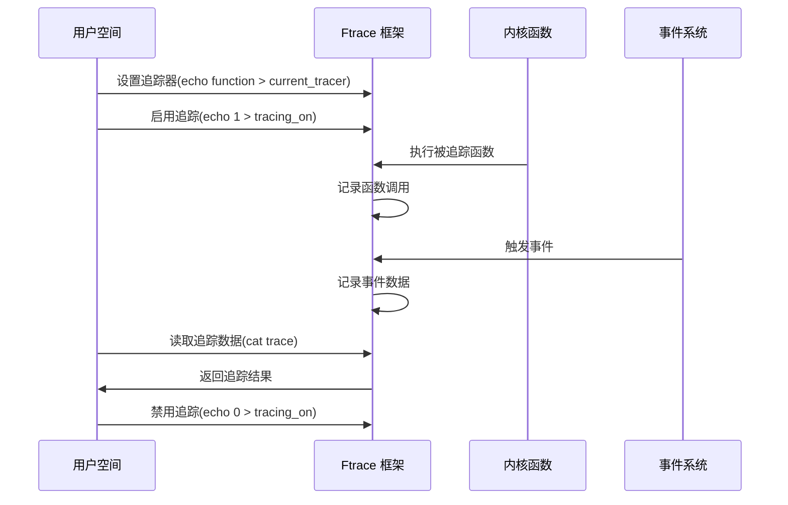

---
tags:
  - 性能优化
  - 工具
  - ftrace
---

# Ftrace 使用指南

## 基础概念

### Ftrace 简介

Ftrace (Function Tracer) 是 Linux 内核中的一个强大的追踪工具，用于帮助开发者了解内核的行为和性能特性。它最初设计用于函数调用追踪，后来扩展为一个追踪框架，支持多种追踪器和事件追踪功能。Ftrace 位于 `/sys/kernel/debug/tracing` 目录下，提供了一系列文件接口用于控制和获取追踪数据。

### Ftrace 架构

```mermaid
flowchart TD
    A[用户空间工具] --> B[/sys/kernel/debug/tracing]
    B --> C[trace_pipe/trace]
    B --> D[available_tracers]
    B --> E[available_events]
    B --> F[tracing_on]
    G[内核] --> H[静态追踪点]
    G --> I[动态追踪点]
    H --> J[Ftrace 框架]
    I --> J
    J --> C
```

### Ftrace 追踪器类型

- **function**：追踪内核函数调用
- **function_graph**：追踪函数调用图，包括函数的调用关系和执行时间
- **irqsoff**：追踪禁用中断的最长时间和发生位置
- **preemptoff**：追踪禁用抢占的最长时间和发生位置
- **preemptirqsoff**：追踪禁用中断和抢占的最长时间
- **wakeup**：追踪进程唤醒延迟
- **wakeup_rt**：追踪实时进程唤醒延迟
- **nop**：不执行任何追踪，用于禁用追踪

## 基本使用方法

### 查看可用追踪器

```bash
# 查看可用的追踪器
cat /sys/kernel/debug/tracing/available_tracers

# 查看当前使用的追踪器
cat /sys/kernel/debug/tracing/current_tracer
```

### 启用函数追踪

```bash
# 设置函数追踪器
echo function > /sys/kernel/debug/tracing/current_tracer

# 开启追踪
echo 1 > /sys/kernel/debug/tracing/tracing_on

# 查看追踪结果
cat /sys/kernel/debug/tracing/trace

# 关闭追踪
echo 0 > /sys/kernel/debug/tracing/tracing_on
```

### 使用函数图追踪器

```bash
# 设置函数图追踪器
echo function_graph > /sys/kernel/debug/tracing/current_tracer

# 开启追踪
echo 1 > /sys/kernel/debug/tracing/tracing_on

# 查看追踪结果
cat /sys/kernel/debug/tracing/trace
```

### 过滤追踪函数

```bash
# 设置要追踪的函数
echo schedule > /sys/kernel/debug/tracing/set_ftrace_filter

# 添加多个函数
echo 'schedule* sys_*' > /sys/kernel/debug/tracing/set_ftrace_filter

# 清除过滤器
echo > /sys/kernel/debug/tracing/set_ftrace_filter
```

## 事件追踪

### 查看可用事件

```bash
# 查看所有可用事件
cat /sys/kernel/debug/tracing/available_events

# 查看特定子系统的事件
cat /sys/kernel/debug/tracing/available_events | grep sched
```

### 启用事件追踪

```bash
# 启用调度器事件
echo 'sched:sched_switch sched:sched_wakeup' > /sys/kernel/debug/tracing/set_event

# 启用所有调度器事件
echo 'sched:*' > /sys/kernel/debug/tracing/set_event

# 清除事件设置
echo > /sys/kernel/debug/tracing/set_event
```

### 事件过滤

```bash
# 过滤特定进程的调度事件
echo 'common_pid == 1234' > /sys/kernel/debug/tracing/events/sched/sched_switch/filter

# 清除过滤器
echo > /sys/kernel/debug/tracing/events/sched/sched_switch/filter
```

## 高级功能

### 追踪点触发器

```bash
# 设置触发器：当发生 sched_switch 事件时转储堆栈
echo 'stacktrace' > /sys/kernel/debug/tracing/events/sched/sched_switch/trigger

# 设置触发器：当发生 10 次 sched_switch 事件时停止追踪
echo 'traceon:10' > /sys/kernel/debug/tracing/events/sched/sched_switch/trigger
```

### 内核函数图追踪

```bash
# 启用函数图追踪器
echo function_graph > /sys/kernel/debug/tracing/current_tracer

# 设置最大追踪深度
echo 5 > /sys/kernel/debug/tracing/max_graph_depth

# 追踪特定函数及其调用
echo '__do_sys_open' > /sys/kernel/debug/tracing/set_graph_function
```

### 追踪延迟

```bash
# 使用 irqsoff 追踪器
echo irqsoff > /sys/kernel/debug/tracing/current_tracer

# 查看最大延迟
cat /sys/kernel/debug/tracing/tracing_max_latency
```

## 实用工具

### trace-cmd 工具

trace-cmd 是一个用户空间工具，简化了 ftrace 的使用。

```bash
# 安装 trace-cmd
sudo apt-get install trace-cmd

# 记录函数调用
trace-cmd record -p function -F ls -l

# 记录特定事件
trace-cmd record -e sched:sched_switch -e sched:sched_wakeup sleep 1

# 查看记录结果
trace-cmd report
```

### kernelshark 可视化

kernelshark 是 trace-cmd 的图形界面，用于可视化追踪数据。

```bash
# 安装 kernelshark
sudo apt-get install kernelshark

# 记录数据并打开可视化界面
trace-cmd record -p function_graph ls -l
kernelshark
```

## 实战案例

### 分析系统调用路径

```bash
# 追踪系统调用路径
echo function_graph > /sys/kernel/debug/tracing/current_tracer
echo 'sys_*' > /sys/kernel/debug/tracing/set_ftrace_filter
echo 1 > /sys/kernel/debug/tracing/tracing_on

# 执行要分析的命令
ls -l

# 查看结果
cat /sys/kernel/debug/tracing/trace
```

### 分析调度延迟

```bash
# 使用 wakeup 追踪器
echo wakeup > /sys/kernel/debug/tracing/current_tracer
echo 1 > /sys/kernel/debug/tracing/tracing_on

# 运行一段时间后查看结果
sleep 10
cat /sys/kernel/debug/tracing/trace
```

### 分析中断处理时间

```bash
# 追踪中断处理函数
echo function > /sys/kernel/debug/tracing/current_tracer
echo 'irq_*' > /sys/kernel/debug/tracing/set_ftrace_filter
echo 1 > /sys/kernel/debug/tracing/tracing_on

# 查看结果
cat /sys/kernel/debug/tracing/trace
```

## Ftrace 与其他工具集成

### 与 perf 结合使用

```bash
# 使用 perf 记录 ftrace 事件
perf record -e ftrace:function -a sleep 1

# 分析结果
perf report
```

### 与 eBPF 结合使用

```bash
# 使用 bpftrace 访问 ftrace 事件
sudo bpftrace -e 'tracepoint:raw_syscalls:sys_enter { @[comm] = count(); }'
```

## Ftrace 工作流程图



## 常见问题与解决

### 权限问题

```bash
# 临时解决
sudo mount -o remount,mode=755 /sys/kernel/debug
sudo chmod 755 /sys/kernel/debug/tracing

# 永久解决（添加到启动脚本）
echo 'mount -o remount,mode=755 /sys/kernel/debug' >> /etc/rc.local
echo 'chmod 755 /sys/kernel/debug/tracing' >> /etc/rc.local
```

### 缓冲区溢出

```bash
# 增加缓冲区大小
echo 10240 > /sys/kernel/debug/tracing/buffer_size_kb
```

### 性能影响

使用 ftrace 会对系统性能产生一定影响，特别是在启用大量函数追踪时。在生产环境中使用时应注意：

- 限制追踪范围，只追踪必要的函数或事件
- 使用过滤器减少数据量
- 在短时间内完成追踪，避免长时间运行
- 在非高负载时段进行追踪

## 总结

Ftrace 是 Linux 内核中强大而灵活的追踪工具，通过合理使用可以帮助开发者和系统管理员深入了解内核行为，诊断性能问题，分析系统瓶颈。本文介绍了 Ftrace 的基本概念、使用方法和实战案例，希望能帮助读者更好地利用这一工具进行内核分析和性能优化。