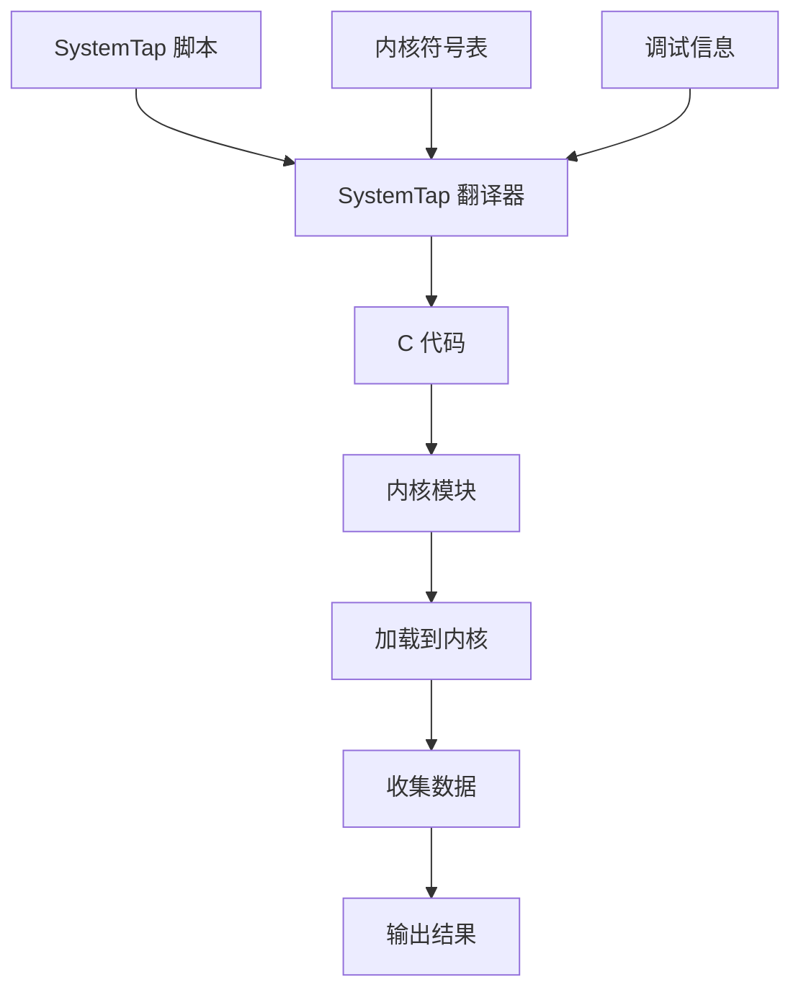
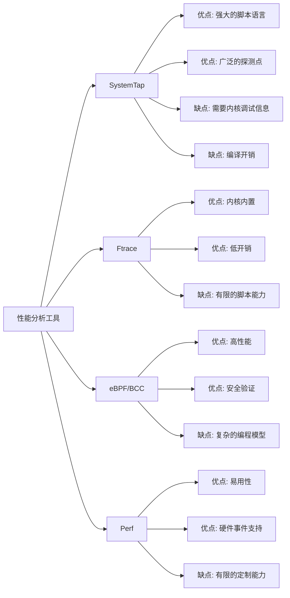

---
tags:
  - 性能优化
  - 工具
  - systemtap
---

# SystemTap 使用指南

## 基础概念

### SystemTap 简介

SystemTap 是一个用于实时监控和跟踪 Linux 系统运行状态的动态追踪工具。它允许用户编写脚本来收集、过滤和分析系统运行时的信息，而无需修改内核源代码或重新编译。SystemTap 提供了一种类似 C 语言的脚本语言，使用户能够深入了解内核和应用程序的行为。

### SystemTap 架构



### SystemTap 工作原理

SystemTap 的工作流程包括以下几个步骤：

1. **脚本解析**：将 SystemTap 脚本（.stp 文件）解析为中间表示
2. **代码生成**：将中间表示转换为 C 代码
3. **编译**：将 C 代码编译为内核模块（.ko 文件）
4. **加载**：将编译好的内核模块加载到运行中的内核
5. **执行**：执行探针，收集数据并输出结果
6. **卸载**：完成后卸载内核模块

## 安装配置

### 安装 SystemTap

```bash
# Debian/Ubuntu
sudo apt-get install systemtap systemtap-runtime linux-headers-$(uname -r) linux-image-$(uname -r)-dbg

# CentOS/RHEL
sudo yum install systemtap systemtap-runtime kernel-devel kernel-debuginfo

# Fedora
sudo dnf install systemtap systemtap-runtime kernel-devel kernel-debuginfo
```

### 验证安装

```bash
# 检查 SystemTap 是否正确安装
stap -v -e 'probe begin { printf("Hello, World!\n"); exit() }'
```

### 配置内核调试信息

对于某些发行版，可能需要额外配置内核调试信息：

```bash
# CentOS/RHEL
sudo debuginfo-install kernel

# 检查调试信息是否可用
stap -L 'kernel.function("*")' | head
```

## 基本语法

### 脚本结构

SystemTap 脚本由一系列探针（probe）和处理程序（handler）组成：

```stap
probe event {
    // 处理程序代码
}
```

### 常用探针类型

- **begin/end**：脚本开始/结束时触发
- **kernel.function("name")**：内核函数入口点
- **kernel.function("name").return**：内核函数返回点
- **process("path").function("name")**：用户空间函数入口点
- **timer.ms(N)**：每 N 毫秒触发一次
- **syscall.name**：系统调用入口点
- **syscall.name.return**：系统调用返回点

### 基本语法示例

```stap
#!/usr/bin/env stap

// 脚本开始时执行
probe begin {
    printf("监控开始...\n")
}

// 监控系统调用
probe syscall.open {
    printf("%s(%d) 打开文件: %s\n", execname(), pid(), argstr)
}

// 脚本结束时执行
probe end {
    printf("监控结束\n")
}
```

## 常用功能

### 变量和数据结构

SystemTap 支持多种变量类型和数据结构：

```stap
// 标量变量
global count = 0

// 数组
global array

// 关联数组（哈希表）
global stats

probe begin {
    array[0] = 10
    array[1] = 20
    
    stats["key1"] = 100
    stats["key2"] = 200
}
```

### 聚合操作

SystemTap 提供了强大的聚合操作符：

```stap
// 定义聚合变量
global times

probe syscall.read {
    times <<< size
}

probe end {
    printf("读取大小统计:\n")
    printf("  计数: %d\n", @count(times))
    printf("  总和: %d\n", @sum(times))
    printf("  最小值: %d\n", @min(times))
    printf("  最大值: %d\n", @max(times))
    printf("  平均值: %d\n", @avg(times))
    printf("  分布:\n")
    print(@hist_log(times))
}
```

### 字符串操作

SystemTap 提供了多种字符串处理函数：

```stap
probe begin {
    str = "Hello, SystemTap!"
    printf("原始字符串: %s\n", str)
    printf("子字符串: %s\n", substr(str, 0, 5))
    printf("字符串长度: %d\n", strlen(str))
    printf("替换后: %s\n", stringat(str, "SystemTap", "World"))
}
```

## 实用案例

### 监控系统调用

```stap
#!/usr/bin/env stap

global syscalls

probe syscall.* {
    syscalls[probefunc()]++
}

probe timer.s(5) {
    printf("系统调用统计 (5秒内):\n")
    foreach (name in syscalls-) {
        printf("  %s: %d\n", name, syscalls[name])
    }
    delete syscalls
}
```

### 监控文件 I/O

```stap
#!/usr/bin/env stap

global reads, writes

probe vfs.read {
    reads[execname(), pid()] += $count
}

probe vfs.write {
    writes[execname(), pid()] += $count
}

probe timer.s(10) {
    printf("\n文件 I/O 统计 (10秒内):\n")
    printf("%-20s %-6s %-10s %-10s\n", "进程名", "PID", "读取字节", "写入字节")
    foreach ([name, pid] in reads) {
        printf("%-20s %-6d %-10d %-10d\n", name, pid, reads[name, pid], writes[name, pid])
    }
    delete reads
    delete writes
}
```

### 监控进程创建

```stap
#!/usr/bin/env stap

probe process.create {
    printf("%s (PID: %d) 创建进程: %s\n", execname(), pid(), argstr)
}
```

### 监控内存分配

```stap
#!/usr/bin/env stap

global allocs

probe kernel.function("kmalloc").return {
    allocs[execname(), pid()] += $return
}

probe timer.s(10) {
    printf("\n内核内存分配统计 (10秒内):\n")
    printf("%-20s %-6s %-10s\n", "进程名", "PID", "分配字节")
    foreach ([name, pid] in allocs-) {
        printf("%-20s %-6d %-10d\n", name, pid, allocs[name, pid])
    }
    delete allocs
}
```

## 高级功能

### 用户空间探测

```stap
#!/usr/bin/env stap

probe process("/bin/bash").function("readline") {
    printf("Bash 正在读取命令行输入\n")
}

probe process("/bin/bash").function("readline").return {
    printf("Bash 读取到命令: %s\n", user_string($return))
}
```

### 条件断点

```stap
#!/usr/bin/env stap

probe kernel.function("do_sys_open") {
    filename = user_string($filename)
    if (filename =~ "/etc/passwd") {
        printf("%s (PID: %d) 正在打开敏感文件: %s\n", execname(), pid(), filename)
        print_backtrace()
    }
}
```

### 性能分析

```stap
#!/usr/bin/env stap

global start_time, intervals

probe kernel.function("do_sys_open") {
    start_time[tid()] = gettimeofday_us()
}

probe kernel.function("do_sys_open").return {
    if (start_time[tid()] > 0) {
        elapsed = gettimeofday_us() - start_time[tid()]
        intervals <<< elapsed
        delete start_time[tid()]
    }
}

probe timer.s(10) {
    printf("\ndo_sys_open 执行时间统计 (微秒):\n")
    printf("  调用次数: %d\n", @count(intervals))
    printf("  最小时间: %d\n", @min(intervals))
    printf("  最大时间: %d\n", @max(intervals))
    printf("  平均时间: %d\n", @avg(intervals))
    printf("  分布:\n")
    print(@hist_log(intervals))
    delete intervals
}
```

## SystemTap 与其他工具对比



## 性能优化案例

### CPU 热点分析

```stap
#!/usr/bin/env stap

global samples

probe timer.profile {
    samples[probefunc()]++
}

probe timer.s(10) {
    printf("\nCPU 热点函数 (10秒采样):\n")
    foreach (func in samples- limit 20) {
        printf("  %s: %d\n", func, samples[func])
    }
    delete samples
}
```

### 锁竞争分析

```stap
#!/usr/bin/env stap

global lock_waits

probe kernel.function("mutex_lock") {
    lock_waits[tid()] = gettimeofday_us()
}

probe kernel.function("mutex_lock").return {
    if (lock_waits[tid()] > 0) {
        elapsed = gettimeofday_us() - lock_waits[tid()]
        if (elapsed > 1000) { // 超过1毫秒的锁等待
            printf("进程 %s (PID: %d) 等待锁 %p 时间: %d 微秒\n", 
                   execname(), pid(), $mutex, elapsed)
            print_backtrace()
        }
        delete lock_waits[tid()]
    }
}
```

### I/O 延迟分析

```stap
#!/usr/bin/env stap

global io_start

probe kernel.function("blk_start_request") {
    io_start[devname, $rq] = gettimeofday_us()
}

probe kernel.function("blk_update_request").return {
    if (io_start[devname, $rq] > 0) {
        elapsed = gettimeofday_us() - io_start[devname, $rq]
        if (elapsed > 10000) { // 超过10毫秒的I/O操作
            printf("设备 %s I/O 请求延迟: %d 微秒\n", devname, elapsed)
        }
        delete io_start[devname, $rq]
    }
}
```

### 网络性能分析

```stap
#!/usr/bin/env stap

global tcp_rtt

probe kernel.function("tcp_rcv_established") {
    sock = $sk
    if (tcp_rtt[sock] == 0) {
        tcp_rtt[sock] = gettimeofday_us()
    }
}

probe kernel.function("tcp_ack_update_rtt").return {
    sock = $sk
    if (tcp_rtt[sock] > 0) {
        elapsed = gettimeofday_us() - tcp_rtt[sock]
        printf("TCP RTT: %d 微秒\n", elapsed)
        tcp_rtt[sock] = gettimeofday_us()
    }
}
```

## 实用技巧

### 减少开销

```stap
# 使用条件过滤减少探针触发次数
probe kernel.function("do_sys_open").return {
    if (pid() == target()) { // 只跟踪特定进程
        printf("打开文件返回: %d\n", $return)
    }
}

# 使用计数器限制输出频率
global count = 0
probe syscall.* {
    if (count++ % 100 == 0) { // 每100次系统调用输出一次
        printf("系统调用: %s\n", name)
    }
}
```

### 调试 SystemTap 脚本

```bash
# 查看脚本生成的C代码
stap -p3 -e 'probe begin { printf("hello\n"); exit() }'

# 使用 -v 参数增加详细输出
stap -v script.stp

# 使用 -k 参数保留临时文件
stap -k script.stp
```

### 常见错误处理

```bash
# 符号解析错误
stap -L 'kernel.function("*")' | grep function_name

# 权限问题
sudo stap script.stp

# 内核版本不匹配
stap --skip-badvars script.stp
```

## 总结

SystemTap 是一个功能强大的动态追踪工具，适用于 Linux 系统性能分析、问题诊断和监控。它通过脚本语言提供了灵活的探测机制，能够深入了解内核和应用程序的行为。与其他工具相比，SystemTap 的优势在于其强大的脚本语言和广泛的探测点支持，但也需要内核调试信息和一定的学习成本。

通过本文介绍的基础概念、安装配置、基本语法和实用案例，读者可以开始使用 SystemTap 进行系统分析和性能优化。随着对 SystemTap 的深入了解和实践，可以开发更复杂的脚本来解决特定的性能问题和监控需求。