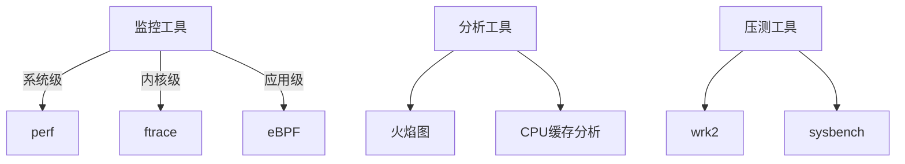

# 系统性能优化知识体系

## 核心性能指标
- CPU使用率/负载
- 内存占用/缺页率
- 磁盘IOPS/吞吐
- 网络带宽/延迟
- 应用级QPS/时延

## 工具矩阵

## 优化方法论
1. **问题定位**：建立监控基线，使用`perf top`快速定位热点
2. **根因分析**：结合火焰图和硬件事件采样
3. **方案实施**：代码优化/算法改进/架构调整
4. **效果验证**：AB测试对比性能指标

## 知识地图
- [[工具使用]]
- [[案例分析]]
- [[最佳实践]]
- [[性能模式解析]]