# 内存优化

## 内存优化概述

内存优化是提高程序性能的关键方面，通过合理管理内存资源，可以减少内存访问延迟、降低内存占用、减少垃圾回收开销，从而提升程序的整体性能。

### 内存优化的重要性

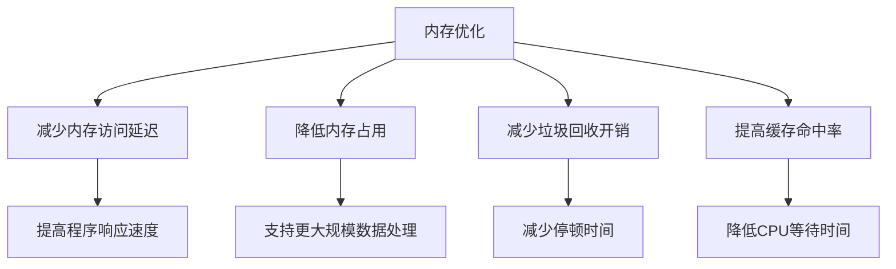

## 内存池技术

### 内存池实现

#### 对象池设计
```cpp
class ObjectPool {
    std::vector<void*> free_list;
    size_t object_size;
    
public:
    ObjectPool(size_t size, size_t init_count) 
        : object_size(size) {
        for(int i=0; i<init_count; ++i){
            free_list.push_back(::operator new(size));
        }
    }
    
    void* allocate() {
        if(free_list.empty()){
            return ::operator new(object_size);
        }
        void* ptr = free_list.back();
        free_list.pop_back();
        return ptr;
    }
    
    void deallocate(void* ptr) {
        free_list.push_back(ptr);
    }
};
```

### 线程本地缓存
```cpp
thread_local ObjectPool local_pool(64, 1024);

void* fast_alloc() {
    return local_pool.allocate();
}
```

## jemalloc实战

### 编译安装
```bash
./autogen.sh --enable-prof --enable-debug
make -j8 && sudo make install
```

### 性能调优配置
```c
// 设置arena数量为CPU核心数2倍
mallctl("arenas.narenas", &narenas, &sz, &newval, sizeof(newval));

// 启用线程缓存
mallctl("thread.tcache.enabled", &enabled, &sz, &newval, sizeof(newval));
```

### 内存泄漏检测
```bash
export MALLOC_CONF="prof:true,prof_prefix:/tmp/jeprof"
./your_program
pprof --web your_program /tmp/jeprof.1234.heap
```

内存池是一种内存分配策略，通过预先分配一大块内存，然后管理这块内存的分配和释放，避免频繁调用系统内存分配函数。

### 内存池工作原理

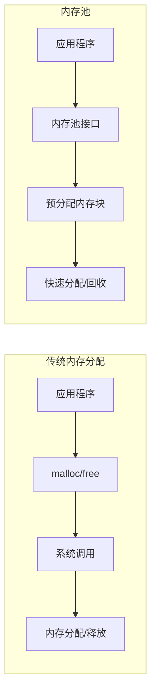

### 内存池实现策略

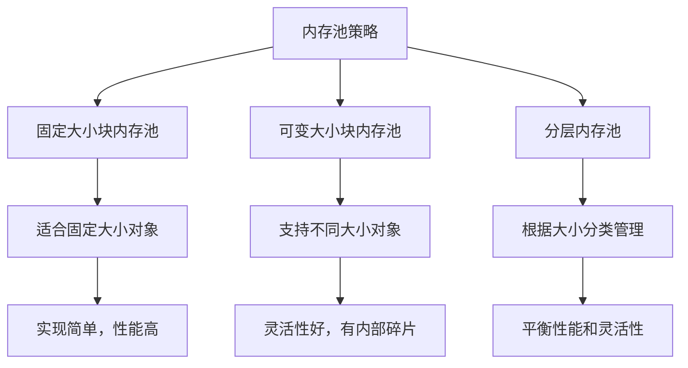

### 内存池代码示例

```cpp
class FixedSizeMemoryPool {
private:
    struct Block {
        Block* next;
    };
    
    void* pool;
    Block* freeList;
    size_t blockSize;
    size_t poolSize;
    
public:
    MemoryPool(size_t blockSize, size_t numBlocks) {
        this->blockSize = std::max(blockSize, sizeof(Block));
        this->poolSize = this->blockSize * numBlocks;
        
        // 分配内存池
        pool = malloc(poolSize);
        
        // 初始化空闲列表
        freeList = nullptr;
        char* start = static_cast<char*>(pool);
        for (size_t i = 0; i < numBlocks; ++i) {
            Block* block = reinterpret_cast<Block*>(start + i * this->blockSize);
            block->next = freeList;
            freeList = block;
        }
    }
    
    void* allocate() {
        if (freeList == nullptr) return nullptr;
        
        Block* block = freeList;
        freeList = block->next;
        return block;
    }
    
    void deallocate(void* ptr) {
        if (ptr == nullptr) return;
        
        Block* block = static_cast<Block*>(ptr);
        block->next = freeList;
        freeList = block;
    }
    
    ~MemoryPool() {
        free(pool);
    }
};
```

## 对象复用

对象复用是避免频繁创建和销毁对象的技术，特别适用于短生命周期但创建成本高的对象。

### 对象池模式

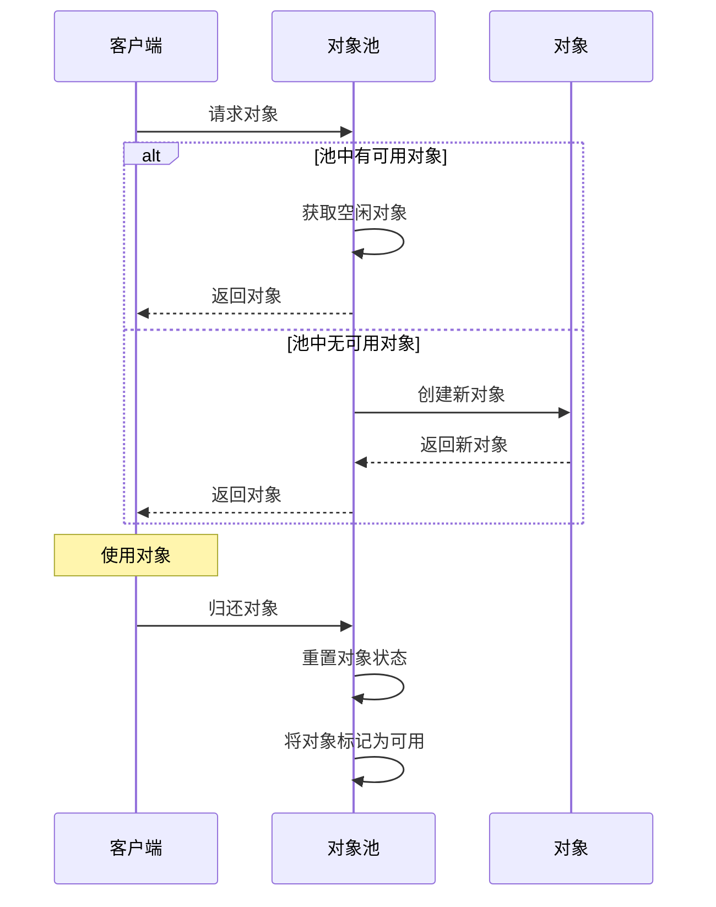

### 对象池实现示例

```cpp
template <typename T>
class ObjectPool {
private:
    std::vector<std::unique_ptr<T>> objects;
    std::queue<T*> freeObjects;
    std::mutex mtx;
    
public:
    ObjectPool(size_t initialSize = 10) {
        for (size_t i = 0; i < initialSize; ++i) {
            objects.push_back(std::make_unique<T>());
            freeObjects.push(objects.back().get());
        }
    }
    
    T* acquire() {
        std::lock_guard<std::mutex> lock(mtx);
        if (freeObjects.empty()) {
            objects.push_back(std::make_unique<T>());
            freeObjects.push(objects.back().get());
        }
        
        T* obj = freeObjects.front();
        freeObjects.pop();
        return obj;
    }
    
    void release(T* obj) {
        std::lock_guard<std::mutex> lock(mtx);
        // 重置对象状态
        obj->reset();
        freeObjects.push(obj);
    }
};
```

## 内存对齐

内存对齐是指将数据存储在内存中时，其地址是某个倍数，这样可以提高内存访问效率。

### 内存对齐原理

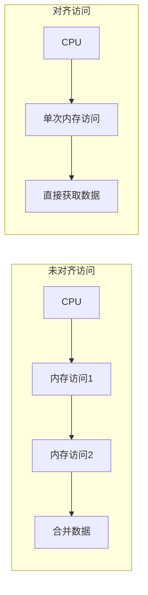

### 数据结构对齐优化

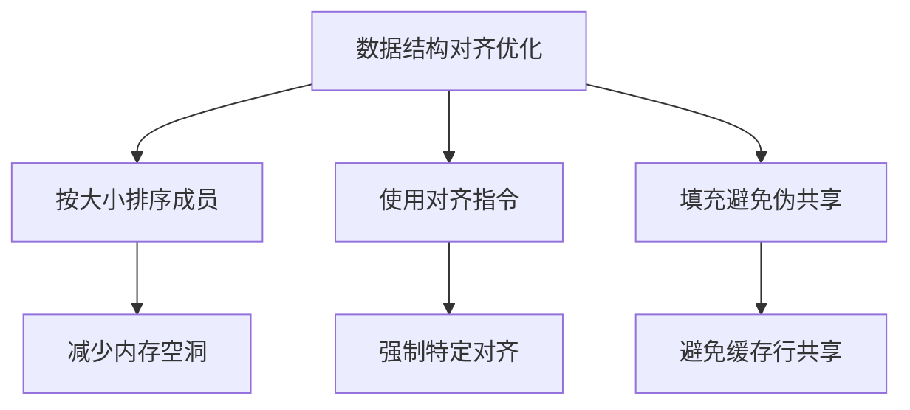

### 对齐示例

```cpp
// 未优化的结构体
struct BadLayout {
    char a;       // 1字节
    double b;     // 8字节
    int c;        // 4字节
    short d;      // 2字节
};  // 实际占用24字节

// 优化后的结构体
struct GoodLayout {
    double b;     // 8字节
    int c;        // 4字节
    short d;      // 2字节
    char a;       // 1字节
    // 1字节填充
};  // 实际占用16字节

// 使用对齐指令
struct alignas(16) AlignedStruct {
    int data[4];  // 16字节，刚好一个缓存行
};
```

## 内存预分配

内存预分配是指在程序启动或功能初始化时提前分配可能需要的内存，避免运行时频繁分配导致的性能波动。

### 预分配策略

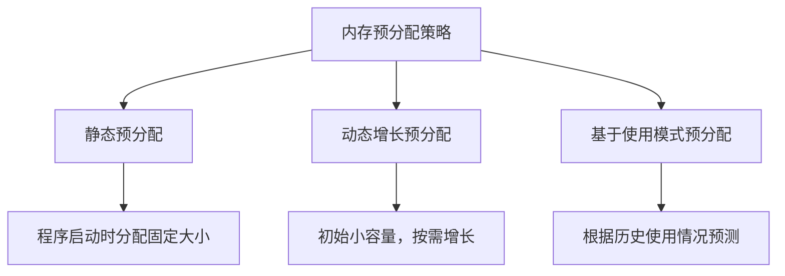

### 容器预分配

```cpp
// 向量预分配
std::vector<int> vec;
vec.reserve(10000);  // 预分配10000个元素的空间

// 字符串预分配
std::string str;
str.reserve(1024);  // 预分配1024字节的空间

// 哈希表预分配
std::unordered_map<int, int> map;
map.reserve(1000);  // 预分配1000个桶
```

## 内存碎片管理

内存碎片是指内存空间被分割成小块，虽然总空闲内存足够，但无法分配大块连续内存的情况。

### 内存碎片类型

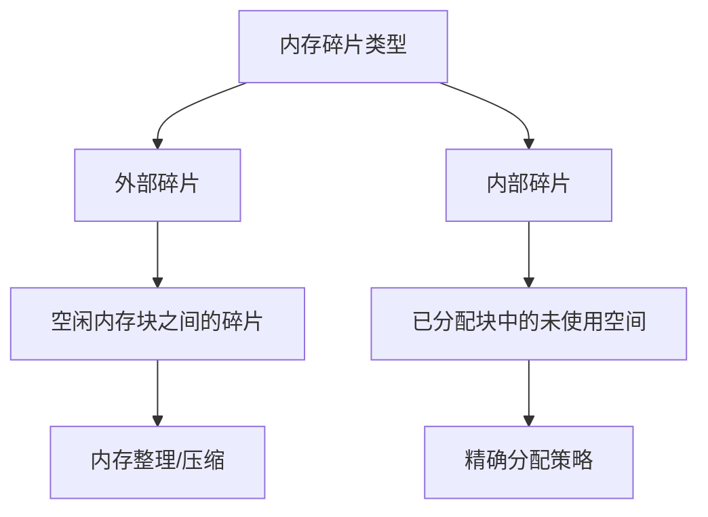

### 碎片减少策略

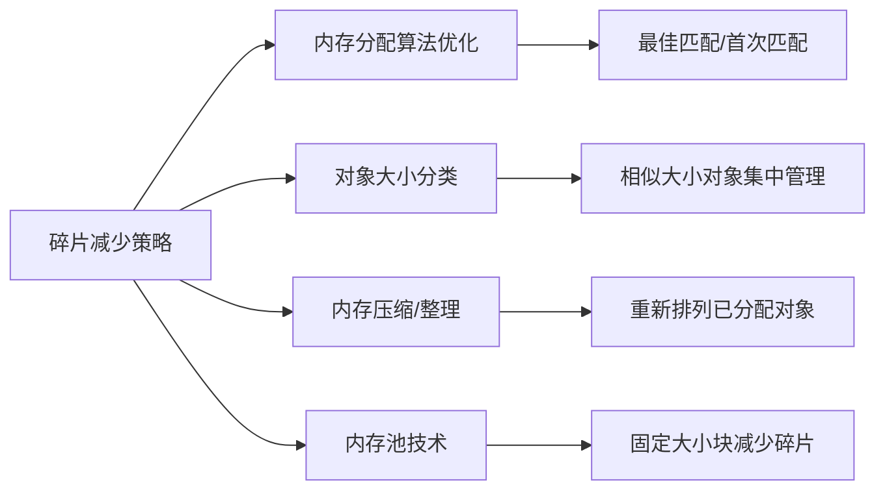

## 缓存友好编程

缓存友好编程是指设计程序时考虑CPU缓存的工作方式，优化内存访问模式，提高缓存命中率。

### 缓存层次结构

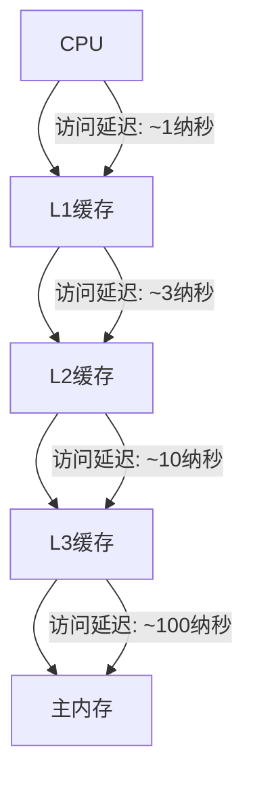

### 缓存友好技术

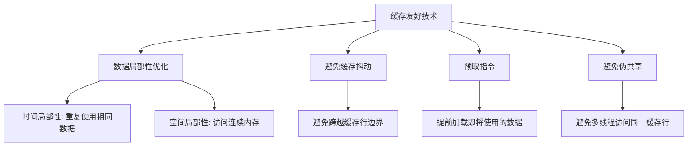

### 数据访问模式优化

```cpp
// 缓存不友好的遍历方式
for (int j = 0; j < n; j++) {
    for (int i = 0; i < n; i++) {
        matrix[i][j] += 1;  // 列优先访问，缓存命中率低
    }
}

// 缓存友好的遍历方式
for (int i = 0; i < n; i++) {
    for (int j = 0; j < n; j++) {
        matrix[i][j] += 1;  // 行优先访问，缓存命中率高
    }
}
```

## 内存泄漏检测与防范

内存泄漏是指程序分配的内存在不再需要时未被释放，导致可用内存逐渐减少的问题。

### 内存泄漏检测工具

```mermaid
flowchart TD
    A[内存泄漏检测工具] --> B1[Valgrind]
    A --> B2[AddressSanitizer]
    A --> B3[LeakCanary]
    A --> B4[Visual Studio

```