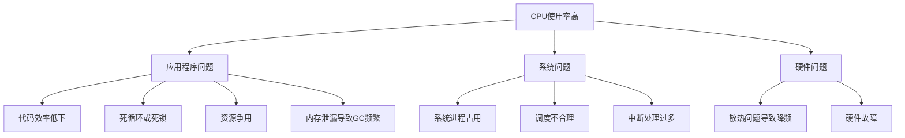
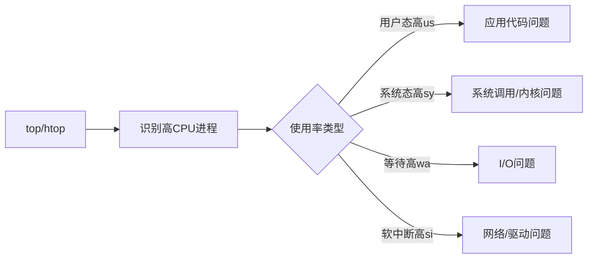
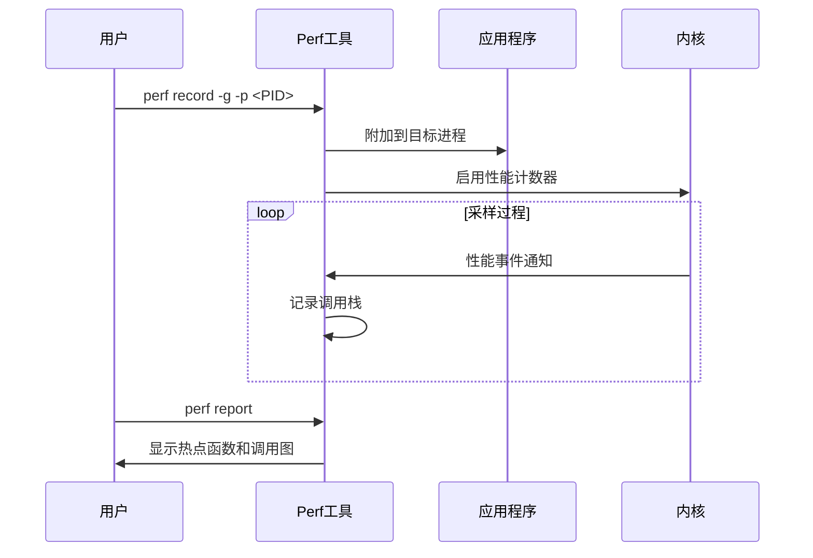
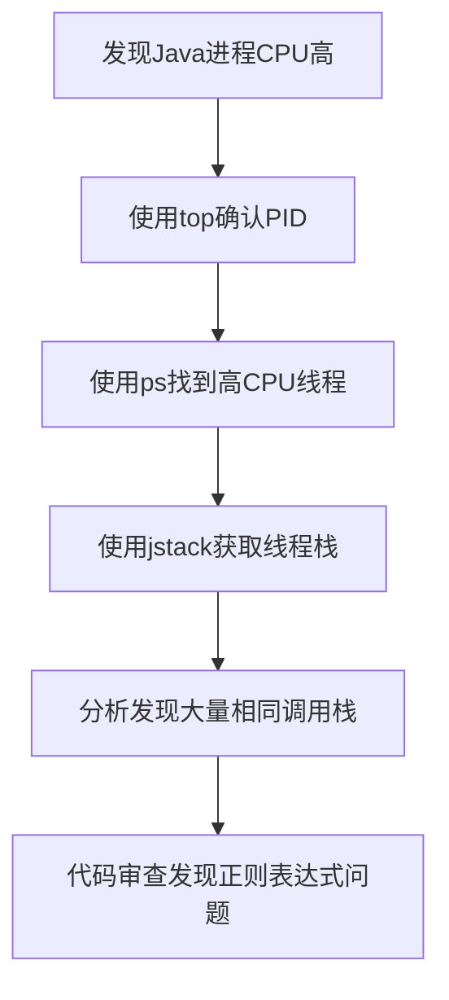

---
tags:
  - 性能优化
  - 案例分析
  - CPU
---

# CPU使用率高问题排查与优化

## 问题概述

CPU使用率异常高是服务器和应用程序中常见的性能问题，可能导致系统响应缓慢、服务超时甚至完全不可用。本文将详细介绍CPU使用率高的常见原因、排查思路和解决方法。

## 常见原因分析



## 排查工具与方法

### 基础监控工具

#### top/htop

```bash
# 使用top查看系统CPU使用情况
top

# 使用htop获取更友好的界面
htop
```

通过top/htop可以获取的关键信息：

- 系统负载（Load Average）
- 整体CPU使用率
- 各进程CPU使用率排序
- 各进程内存使用情况



#### vmstat

```bash
# 每秒输出一次统计信息
vmstat 1
```

vmstat提供系统级别的CPU、内存、I/O等统计信息，特别关注：

- us（用户态CPU使用率）
- sy（系统态CPU使用率）
- id（空闲CPU百分比）
- wa（I/O等待时间百分比）

#### mpstat

```bash
# 查看所有CPU核心使用情况
mpstat -P ALL 1
```

mpstat可以显示每个CPU核心的详细使用情况，有助于识别单核心负载过高的问题。

### 进程分析工具

#### pidstat

```bash
# 监控特定进程的CPU使用情况
pidstat -p <PID> 1

# 监控所有Java进程
pidstat -p ALL -u -r -d 1 | grep java
```

pidstat可以持续监控特定进程的CPU、内存、I/O使用情况。

#### ps

```bash
# 查看CPU使用率最高的进程
ps aux --sort=-%cpu | head -10

# 查看特定进程的线程CPU使用情况
ps -mp <PID> -o THREAD,tid,time
```

### 深入分析工具

#### perf

```bash
# 采样CPU事件并记录
sudo perf record -g -p <PID> -- sleep 30

# 分析结果
sudo perf report
```

perf可以深入分析程序的热点函数、系统调用和内核活动。



#### eBPF/bpftrace

```bash
# 使用bpftrace分析on-CPU时间
sudo bpftrace -e 'profile:hz:99 /pid == 12345/ { @[ustack] = count(); }'

# 使用BCC工具profile分析
sudo profile -F 99 -p <PID> 30
```

eBPF工具提供了更精细和低开销的性能分析能力。

#### 火焰图

```bash
# 使用perf生成火焰图数据
sudo perf record -F 99 -g -p <PID> -- sleep 30
sudo perf script > out.perf

# 使用FlameGraph工具生成SVG
./stackcollapse-perf.pl out.perf > out.folded
./flamegraph.pl out.folded > cpu_flame.svg
```

火焰图直观展示CPU时间分布，宽度表示占用CPU时间比例，有助于快速定位热点代码。

## 常见场景与解决方案

### 场景1: 单个进程CPU使用率接近100%

#### 排查步骤

1. 使用top确认高CPU进程
2. 使用ps查看该进程的线程情况
   ```bash
   ps -mp <PID> -o THREAD,tid,time
   ```
3. 转换线程ID为十六进制
   ```bash
   printf "%x\n" <TID>
   ```
4. 使用jstack（Java程序）或gdb查看线程栈
   ```bash
   jstack <PID> | grep <十六进制TID> -A 30
   ```

#### 可能的原因与解决方案

1. **死循环或算法效率低下**
   - 优化算法复杂度
   - 添加合理的退出条件
   - 使用更高效的数据结构

2. **资源争用导致的锁竞争**
   - 减少锁粒度
   - 使用无锁数据结构
   - 考虑分片或分区技术

3. **频繁GC（Java应用）**
   - 增加堆内存
   - 调整GC参数
   - 检查并修复内存泄漏

### 场景2: 系统CPU使用率高但无明显高CPU进程

#### 排查步骤

1. 检查是否存在大量小进程
   ```bash
   ps aux | awk '{print $3":"$11}' | sort -nr | head -20
   ```

2. 检查上下文切换情况
   ```bash
   vmstat 1
   # 关注cs（上下文切换）列
   ```

3. 使用perf分析系统级别热点
   ```bash
   sudo perf top -a
   ```

#### 可能的原因与解决方案

1. **大量短生命周期进程**
   - 使用进程池或线程池
   - 减少进程创建频率

2. **频繁的上下文切换**
   - 减少线程数量
   - 优化调度亲和性
   - 使用协程或异步模型

3. **内核或驱动问题**
   - 更新内核版本
   - 检查并更新有问题的驱动

### 场景3: 系统负载高但CPU使用率不高

#### 排查步骤

1. 检查I/O等待情况
   ```bash
   iostat -x 1
   ```

2. 检查运行队列长度
   ```bash
   vmstat 1
   # 关注r（运行队列）列
   ```

3. 检查不可中断睡眠进程
   ```bash
   ps aux | grep D
   ```

#### 可能的原因与解决方案

1. **I/O瓶颈**
   - 使用异步I/O
   - 增加I/O缓冲
   - 考虑使用SSD或更快的存储

2. **资源限制**
   - 检查并调整cgroup限制
   - 检查ulimit设置

## 实际案例分析

### 案例1: Java应用CPU飙升

#### 问题现象

生产环境中一个Java应用CPU使用率突然从30%上升到95%，系统响应变慢。

#### 排查过程



1. 使用top确认是哪个Java进程CPU使用率高
2. 使用ps命令找到该进程中CPU使用率最高的线程
   ```bash
   ps -mp <PID> -o THREAD,tid,time | sort -rn -k2 | head -10
   ```
3. 使用jstack获取线程栈信息
   ```bash
   jstack <PID> > jstack.log
   ```
4. 分析发现大量线程在执行相同的正则表达式匹配操作

#### 解决方案

1. 优化正则表达式，避免回溯
2. 对常用匹配结果进行缓存
3. 使用更高效的字符串匹配算法替代部分正则表达式

### 案例2: 系统进程kswapd0占用高CPU

#### 问题现象

服务器负载升高，top显示kswapd0进程占用大量CPU。

#### 排查过程

1. 检查内存使用情况
   ```bash
   free -m
   cat /proc/meminfo
   ```
2. 检查swap使用情况
   ```bash
   swapon -s
   ```
3. 使用sar分析内存和交换活动
   ```bash
   sar -r 1
   ```
4. 使用perf分析kswapd0活动
   ```bash
   sudo perf record -p $(pgrep kswapd0) -g -- sleep 60
   sudo perf report
   ```

#### 解决方案

1. 增加物理内存
2. 调整vm.swappiness参数减少交换活动
   ```bash
   sysctl -w vm.swappiness=10
   ```
3. 识别并限制内存使用过高的应用

## 预防措施

### 监控与告警

1. 设置CPU使用率阈值告警
2. 监控系统负载趋势
3. 建立基线并检测异常模式

### 性能测试

1. 进行压力测试评估系统容量
2. 进行性能基准测试
3. 定期进行性能回归测试

### 代码优化实践

1. 代码审查关注性能问题
2. 使用性能分析工具指导优化
3. 采用高效算法和数据结构
4. 合理使用缓存减少计算

## 总结

CPU使用率高问题的排查是一个系统性工作，需要从应用到系统多个层面进行分析。通过合理使用监控和分析工具，结合对系统和应用架构的理解，可以有效定位和解决CPU相关性能问题。在实际工作中，建立完善的监控体系和性能基线，能够帮助我们更快地发现和解决问题，保障系统的稳定运行。