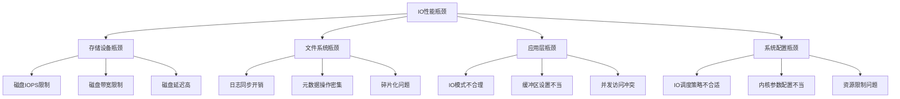
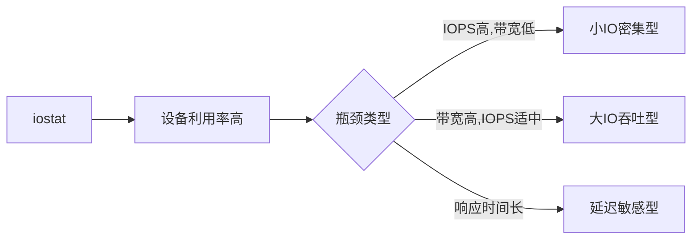
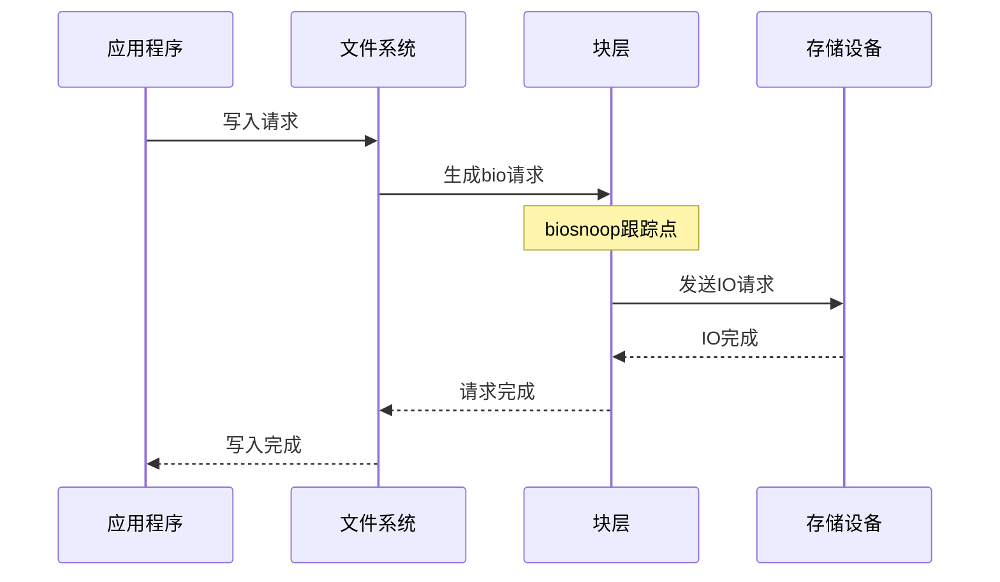
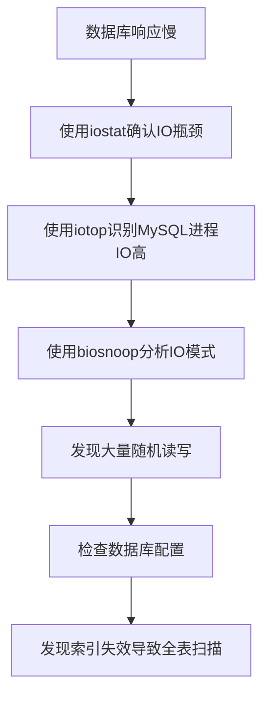

---
tags:
  - 性能优化
  - 案例分析
  - IO
---

# IO性能瓶颈分析与优化

## 问题概述

IO性能瓶颈是系统性能问题中的常见类型，可能导致应用响应缓慢、吞吐量下降和资源利用率不足。本文将详细介绍IO性能瓶颈的常见原因、排查方法和优化策略。

## IO性能瓶颈的类型



## 排查工具与方法

### 基础监控工具

#### iostat

```bash
# 每秒输出一次磁盘统计信息
isotat -xdm 1
```

通过iostat可以获取的关键指标：

- **%util**：设备利用率，接近100%表示设备饱和
- **r/s, w/s**：每秒读写请求数
- **rkB/s, wkB/s**：每秒读写KB数
- **await**：平均IO响应时间(ms)
- **svctm**：平均服务时间



#### iotop

```bash
# 查看进程级别IO使用情况
iotop
```

iotop可以帮助识别哪些进程产生了大量IO操作。

#### vmstat

```bash
# 监控系统级别IO统计
vmstat 1
```

关注bi(块设备读入)和bo(块设备写出)列，以及wa(IO等待时间)列。

### 高级分析工具

#### blktrace/blkparse

```bash
# 跟踪块设备IO活动
sudo blktrace -d /dev/sda -o - | blkparse -i -

# 生成IO可视化图表
sudo blktrace -d /dev/sda -o trace
blkparse -i trace -d trace.bin
btt -i trace.bin
```

blktrace可以详细跟踪IO请求从应用到设备的完整路径。

#### perf

```bash
# 记录块层IO事件
sudo perf record -e block:* -a -- sleep 30

# 分析结果
sudo perf report
```

#### eBPF/BCC工具

```bash
# 使用biosnoop跟踪块IO延迟
sudo biosnoop

# 使用biotop显示进程IO统计
sudo biotop

# 使用biolatency分析IO延迟分布
sudo biolatency
```



#### fio基准测试

```bash
# 随机读测试
fio --name=random-read --ioengine=libaio --direct=1 --bs=4k --size=4G --numjobs=4 --rw=randread

# 随机写测试
fio --name=random-write --ioengine=libaio --direct=1 --bs=4k --size=4G --numjobs=4 --rw=randwrite

# 混合读写测试
fio --name=mixed --ioengine=libaio --direct=1 --bs=4k --size=4G --numjobs=4 --rw=randrw --rwmixread=70
```

fio可以模拟各种IO模式，帮助评估存储系统性能上限。

## 常见IO瓶颈场景与解决方案

### 场景1: 随机小IO密集型应用

#### 问题特征

- iostat显示高IOPS但带宽不高
- 应用响应时间长
- CPU使用率不高但系统负载高

#### 排查步骤

1. 使用iostat确认IO模式
   ```bash
   iostat -xdm 1
   # 关注r/s, w/s高但rkB/s, wkB/s不高的情况
   ```

2. 使用biosnoop分析IO请求分布
   ```bash
   sudo biosnoop -Q
   ```

3. 使用blktrace分析IO栈延迟
   ```bash
   sudo blktrace -d /dev/sda -o - | blkparse -i -
   ```

#### 解决方案

1. **使用SSD替代HDD**：SSD在随机IO场景下性能远优于HDD
2. **增加内存缓存**：使用更大的页缓存或应用级缓存减少IO操作
3. **优化IO模式**：将随机IO转换为顺序IO，如使用预读或批处理
4. **使用IO调度器**：针对随机IO优化调度策略，如使用deadline或noop调度器

### 场景2: 大文件顺序IO瓶颈

#### 问题特征

- iostat显示带宽接近设备上限
- 大文件传输或处理速度慢
- %util接近100%但IOPS不高

#### 排查步骤

1. 使用iostat确认带宽使用情况
   ```bash
   iostat -xdm 1
   # 关注rkB/s, wkB/s接近设备上限的情况
   ```

2. 使用iotop识别高IO进程
   ```bash
   sudo iotop -o
   ```

3. 使用fio测试设备带宽上限
   ```bash
   fio --name=seq-read --ioengine=libaio --direct=1 --bs=1m --size=10G --numjobs=1 --rw=read
   ```

#### 解决方案

1. **使用更高带宽的存储设备**：如NVMe SSD或RAID阵列
2. **启用异步IO**：减少IO等待时间
3. **优化块大小**：使用更大的块大小提高带宽利用率
4. **使用直接IO**：绕过页缓存减少CPU开销
5. **启用预读**：提前读取数据到缓存

### 场景3: 文件系统元数据操作瓶颈

#### 问题特征

- 大量小文件创建/删除/查找操作
- iostat显示IOPS高但数据传输量小
- 系统调用跟踪显示大量stat/open/close操作

#### 排查步骤

1. 使用strace跟踪文件系统调用
   ```bash
   strace -f -p <PID> -e trace=file
   ```

2. 使用perf分析文件系统操作
   ```bash
   sudo perf record -e 'ext4:*' -p <PID> -- sleep 30
   sudo perf report
   ```

3. 使用eBPF跟踪文件系统操作
   ```bash
   sudo bpftrace -e 'tracepoint:ext4:ext4_create { @[comm] = count(); }'
   ```

#### 解决方案

1. **使用更适合的文件系统**：如XFS对元数据操作更高效
2. **减少文件数量**：合并小文件或使用数据库替代大量小文件
3. **优化目录结构**：避免单个目录下有过多文件
4. **使用内存文件系统**：对临时文件使用tmpfs
5. **调整文件系统挂载选项**：如noatime减少元数据更新

## 实际案例分析

### 案例1: 数据库IO性能问题

#### 问题现象

生产环境中MySQL数据库查询响应时间突然变长，iostat显示磁盘利用率接近100%。

#### 排查过程



1. 使用iostat确认IO瓶颈
   ```bash
   iostat -xdm 1
   # 发现%util接近100%，await值高
   ```

2. 使用iotop识别高IO进程
   ```bash
   sudo iotop -o
   # 确认MySQL进程IO使用率高
   ```

3. 使用biosnoop分析IO模式
   ```bash
   sudo biosnoop | grep mysql
   # 发现大量随机读操作，块大小小
   ```

4. 分析MySQL慢查询日志
   ```bash
   grep -A 10 "long_query_time" /var/log/mysql/mysql-slow.log
   ```

5. 使用EXPLAIN分析问题查询
   ```sql
   EXPLAIN SELECT * FROM large_table WHERE non_indexed_column = 'value';
   ```

#### 解决方案

1. 为频繁查询的列添加索引
   ```sql
   CREATE INDEX idx_column ON large_table(non_indexed_column);
   ```

2. 优化查询，避免全表扫描
   ```sql
   -- 替换
   SELECT * FROM large_table
   -- 为
   SELECT needed_columns FROM large_table
   ```

3. 增加InnoDB缓冲池大小
   ```ini
   innodb_buffer_pool_size = 8G
   ```

4. 将数据库迁移到SSD存储

### 案例2: 日志写入导致的IO瓶颈

#### 问题现象

应用服务器每隔几分钟出现短暂的响应延迟，与此同时磁盘写入活动突增。

#### 排查过程

1. 使用sar监控IO活动
   ```bash
   sar -b 1
   # 发现周期性的写入峰值
   ```

2. 使用iotop确认高IO进程
   ```bash
   sudo iotop -o -a
   # 发现日志记录进程和系统日志进程占用高IO
   ```

3. 使用lsof查看打开的日志文件
   ```bash
   lsof | grep log
   ```

4. 检查日志轮转配置
   ```bash
   cat /etc/logrotate.conf
   cat /etc/logrotate.d/*
   ```

#### 解决方案

1. 优化日志级别，减少不必要的日志

2. 将日志写入单独的磁