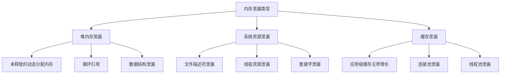
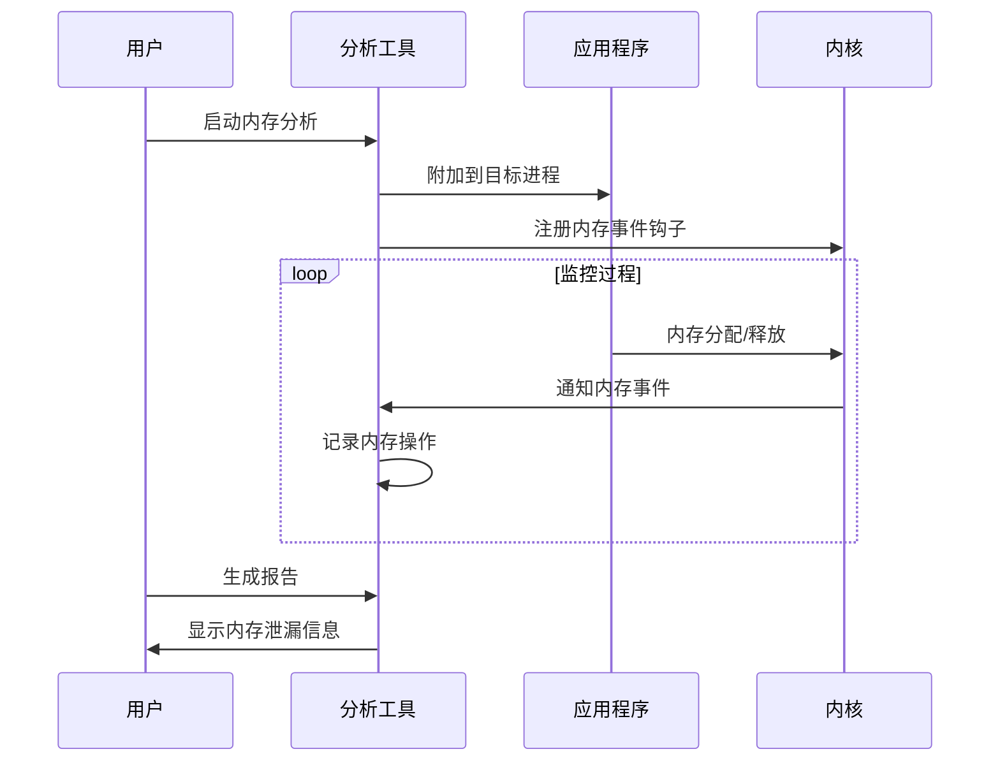
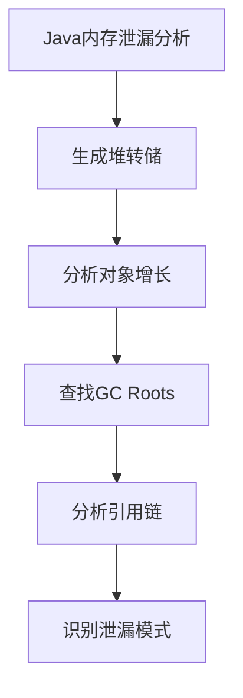
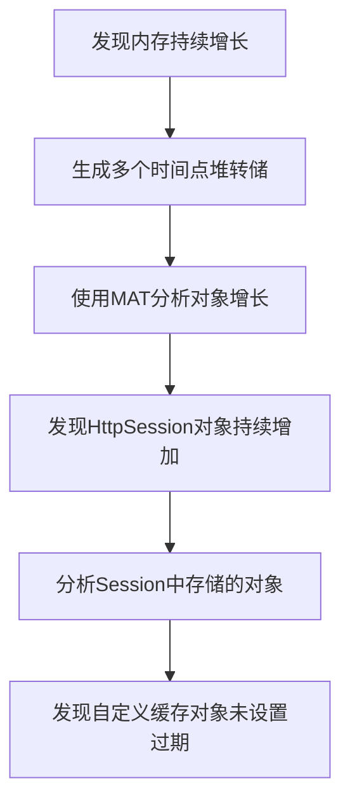

---
tags:
  - 性能优化
  - 案例分析
  - 内存
---

# 内存泄漏问题排查与解决方案

## 内存泄漏概述

内存泄漏是指程序分配的内存由于某种原因未被释放，导致系统可用内存逐渐减少，最终可能引发系统性能下降、应用崩溃或OOM（Out of Memory）杀手触发。本文将详细介绍内存泄漏的类型、排查方法和解决方案。

### 内存泄漏的类型



## 内存泄漏的症状

1. **系统内存使用持续增长**：应用运行时间越长，内存占用越多
2. **应用性能随时间下降**：随着内存泄漏累积，GC频率增加或系统开始交换
3. **OOM错误**：最终可能导致应用崩溃或被系统终止
4. **系统响应变慢**：内存压力导致系统整体性能下降

## 排查工具与方法

### 系统级监控工具

#### free与top

```bash
# 查看系统内存使用情况
free -m

# 监控进程内存使用
top -o %MEM
```

#### vmstat与sar

```bash
# 监控内存使用趋势
vmstat 1

# 使用sar记录内存使用历史
sar -r 1 3600
```

#### /proc文件系统

```bash
# 查看进程内存映射
cat /proc/<PID>/maps

# 查看进程内存状态
cat /proc/<PID>/status

# 查看详细内存使用
cat /proc/<PID>/smaps
```

### 语言特定工具

#### C/C++内存分析

```bash
# 使用Valgrind检测内存泄漏
valgrind --leak-check=full --show-leak-kinds=all ./your_program

# 使用AddressSanitizer
gcc -fsanitize=address -g source.c -o program
./program
```

#### Java内存分析

```bash
# 生成堆转储
jmap -dump:format=b,file=heap.bin <PID>

# 使用jstat监控GC活动
jstat -gc <PID> 1000

# 使用JVisualVM或MAT分析堆转储
jvisualvm --openfile heap.bin
```

#### Python内存分析

```bash
# 使用memory_profiler
pip install memory_profiler
python -m memory_profiler your_script.py

# 使用objgraph分析对象引用
pip install objgraph
```

### 高级分析工具

#### perf与BPF工具

```bash
# 使用perf记录内存分配
sudo perf record -e kmem:kmalloc -e kmem:kfree -p <PID> -- sleep 30

# 使用BCC工具memleak检测内核内存泄漏
sudo memleak -p <PID>

# 使用bpftrace跟踪内存分配
sudo bpftrace -e 'tracepoint:kmem:kmalloc { @bytes[args->bytes_alloc] = count(); }'
```



## 常见内存泄漏场景与解决方案

### 场景1: C/C++堆内存泄漏

#### 问题特征

- 使用`malloc/new`分配内存但未使用`free/delete`释放
- 内存分配与释放不匹配（如使用`malloc`分配但使用`delete`释放）
- 指针重新赋值导致原内存无法访问

#### 排查方法

```bash
# 使用Valgrind检测
valgrind --leak-check=full ./your_program

# 使用ASAN
LD_PRELOAD=/path/to/libasan.so ./your_program
```

#### 解决方案

1. **使用智能指针**：`std::unique_ptr`、`std::shared_ptr`自动管理内存
2. **RAII模式**：资源获取即初始化，确保资源在对象生命周期结束时释放
3. **代码审查**：确保每个`new`都有对应的`delete`
4. **静态分析工具**：使用Clang Static Analyzer或Coverity等工具

### 场景2: Java内存泄漏

#### 问题特征

- 长生命周期对象持有短生命周期对象引用
- 未关闭的资源（如文件流、数据库连接）
- 静态集合无限增长
- 线程局部变量未清理

#### 排查方法

```bash
# 生成多个堆转储并比较
jmap -dump:format=b,file=heap1.bin <PID>
# 等待一段时间
jmap -dump:format=b,file=heap2.bin <PID>

# 使用Eclipse MAT分析
```



#### 解决方案

1. **使用弱引用**：`WeakReference`、`SoftReference`避免强引用导致的内存泄漏
2. **资源关闭**：使用try-with-resources确保资源自动关闭
3. **缓存控制**：使用`WeakHashMap`或设置缓存大小上限
4. **检查监听器**：确保注册的监听器在不需要时被移除

### 场景3: 文件描述符泄漏

#### 问题特征

- 进程打开的文件描述符数量持续增长
- 最终可能达到系统限制，导致"Too many open files"错误

#### 排查方法

```bash
# 查看进程打开的文件描述符数量
ls -l /proc/<PID>/fd | wc -l

# 查看具体打开的文件
ls -la /proc/<PID>/fd

# 使用lsof查看
lsof -p <PID>
```

#### 解决方案

1. **资源自动关闭**：使用语言提供的自动资源管理机制
2. **finally块**：确保在异常情况下也能关闭资源
3. **资源池化**：使用连接池、线程池等限制资源数量
4. **超时机制**：为长时间未使用的资源设置自动关闭

## 实际案例分析

### 案例1: Web服务内存泄漏

#### 问题现象

生产环境中一个Java Web服务运行几天后内存占用持续增长，最终触发OOM错误。

#### 排查过程



1. 使用`jmap`生成多个时间点的堆转储
   ```bash
   jmap -dump:format=b,file=heap_t1.bin <PID>
   # 等待6小时
   jmap -dump:format=b,file=heap_t2.bin <PID>
   ```

2. 使用Eclipse MAT分析堆转储
   - 对比两个转储文件中对象数量变化
   - 发现`HttpSession`对象持续增长
   - 分析`HttpSession`中存储的对象

3. 代码审查发现问题
   - 在Session中存储了包含大量数据的自定义缓存对象
   - 缓存对象没有设置过期时间或大小限制
   - 用户每次登录都创建新Session但旧Session未及时失效

#### 解决方案

1. 将缓存从Session移至应用级缓存，并设置合理的过期策略
2. 使用`ehcache`或`caffeine`等缓存框架，设置内存上限
3. 调整Session超时时间，确保不活跃的Session能及时释放
4. 添加监控告警，在内存使用超过阈值时提前预警

### 案例2: C++服务资源泄漏

#### 问题现象

一个C++后台服务运行一段时间后，系统内存和文件描述符使用量持续增长，最终服务不可用。

#### 排查过程

1. 使用`top`和`lsof`确认内存和文件描述符持续增长
   ```bash
   top -p <PID>
   lsof -p <PID> | wc -l
   ```

2. 使用Valgrind工具分析内存泄漏
   ```bash
   valgrind --leak-check=full --track-fds=yes ./your_program
   ```

3. 代码审查发现多处问题
   - 异常处理路径中资源未释放
   - 自定义容器类未实现析构函数
   - 多线程环境下的资源竞争导致某些释放路径未执行

#### 解决方案

1. 使用RAII模式封装资源管理
   ```cpp
   class FileWrapper {
       FILE* fp;
   public:
       FileWrapper(const char* filename) { fp = fopen(filename, "r"); }
       ~FileWrapper() { if(fp) fclose(fp); }
       // ... 其他方法
   };
   ```

2. 使用智能指针管理动态内存
   ```cpp
   std::unique_ptr<Resource> res(new Resource());
   // 自动释放，无需手动delete
   ```

3. 完善异常处理，确保资源在所有路径上都能释放

4. 添加资源监控和限制机制

## 预防措施

### 开发阶段

1. **代码审查**：重点关注资源分配和释放
2. **静态分析**：使用静态分析工具检测潜在内存问题
3. **单元测试**：编写测试验证内存使用行为
4. **内存分析工具**：定期使用内存分析工具检查

### 运行阶段

1. **监控告警**：设置内存使用阈值告警
2. **资源限制**：使用cgroup或容器限制资源使用
3. **自动重启**：对于无法避免的小泄漏，设置定期重启策略
4. **灰度发布**：新版本