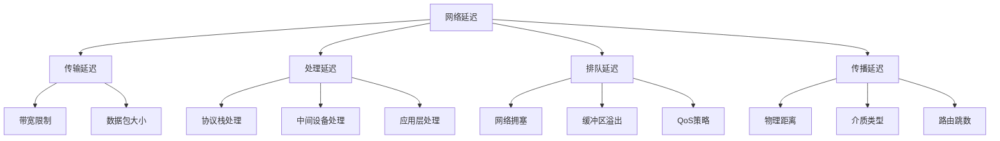
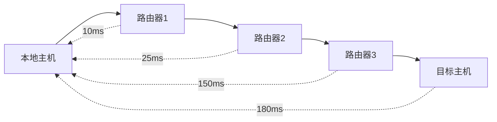
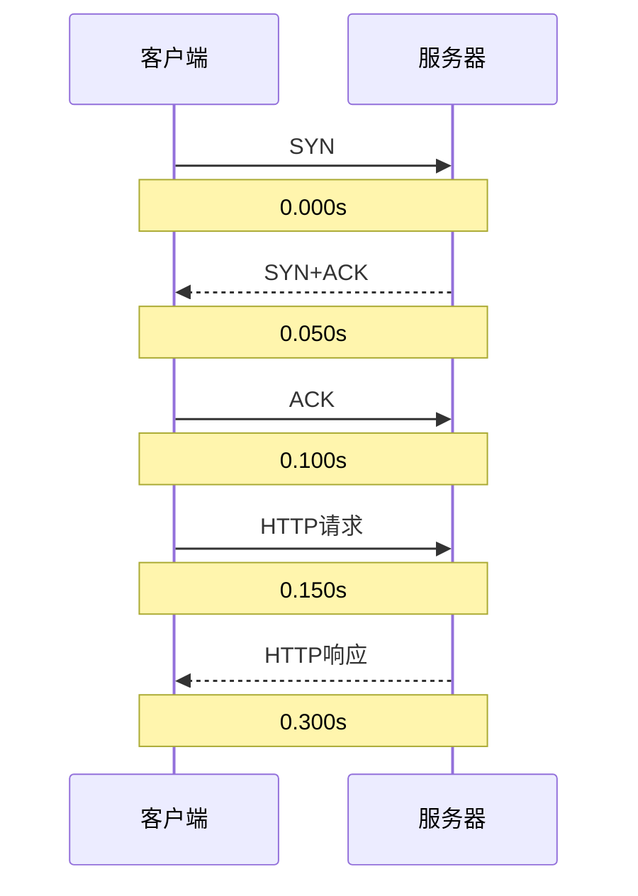
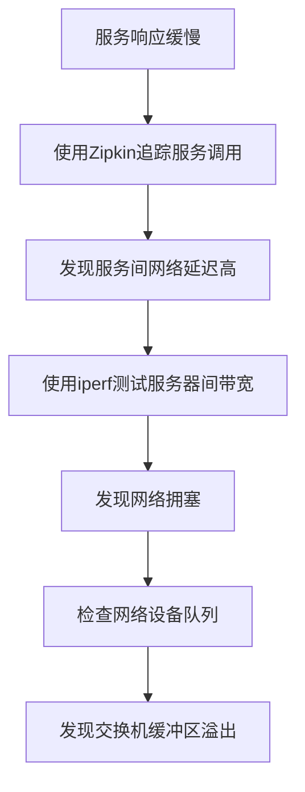

---
tags:
  - 性能优化
  - 案例分析
  - 网络
---

# 网络延迟问题排查与优化

## 问题概述

网络延迟问题是分布式系统和网络应用中常见的性能瓶颈，可能导致应用响应缓慢、超时错误和用户体验下降。本文将详细介绍网络延迟的常见原因、排查方法和优化策略。

## 网络延迟的类型与来源



## 排查工具与方法

### 基础网络诊断工具

#### ping

```bash
# 测试基本连通性和RTT
ping target_host

# 指定包大小和计数
ping -s 1400 -c 100 target_host
```

ping可以测试基本连通性、往返时间(RTT)和丢包率，是网络诊断的第一步。

#### traceroute/tracert

```bash
# Linux/Unix
traceroute target_host

# Windows
tracert target_host
```

traceroute显示数据包经过的路由路径和每一跳的延迟，有助于定位网络路径中的问题点。



#### mtr

```bash
# 实时跟踪路由和丢包情况
mtr target_host
```

mtr结合了ping和traceroute的功能，提供实时更新的网络路径质量报告。

### 高级网络分析工具

#### tcpdump

```bash
# 捕获特定主机的网络流量
tcpdump host target_host

# 捕获特定端口的流量
tcpdump port 80

# 保存捕获结果到文件
tcpdump -w capture.pcap
```

tcpdump可以捕获和分析网络数据包，深入了解网络通信细节。

#### Wireshark

Wireshark提供图形界面的网络协议分析，可以详细检查数据包内容、时序和协议交互。



#### iperf/iperf3

```bash
# 服务器端
iperf3 -s

# 客户端
iperf3 -c server_ip

# 测试UDP带宽
iperf3 -c server_ip -u -b 100M
```

iperf可以测试网络带宽、抖动和丢包率，是评估网络性能的有力工具。

#### netstat/ss

```bash
# 查看所有TCP连接
netstat -ant

# 使用ss查看详细连接状态
ss -tiepm
```

netstat和ss可以查看网络连接状态、套接字统计和路由表信息。

### 系统级网络监控

#### nload/iftop

```bash
# 监控网络接口带宽使用
nload

# 查看主机间流量
iftop
```

nload和iftop可以实时监控网络接口的带宽使用情况。

#### netdata

netdata提供实时的系统和应用监控，包括详细的网络性能指标。

## 常见网络延迟场景与解决方案

### 场景1: TCP连接建立慢

#### 问题特征

- 应用建立连接耗时长
- Wireshark显示SYN和SYN+ACK之间延迟高
- 可能出现TCP重传

#### 排查步骤

1. 使用tcpdump捕获TCP握手过程
   ```bash
   tcpdump -i eth0 'tcp[tcpflags] & (tcp-syn|tcp-ack) != 0'
   ```

2. 分析SYN包和SYN+ACK包之间的时间差

3. 检查防火墙和安全策略
   ```bash
   iptables -L -n
   ```

4. 检查服务器backlog队列
   ```bash
   netstat -s | grep -i listen
   ```

#### 解决方案

1. **调整TCP参数**
   ```bash
   # 增加SYN队列大小
   sysctl -w net.ipv4.tcp_max_syn_backlog=8192
   
   # 启用SYN cookies
   sysctl -w net.ipv4.tcp_syncookies=1
   ```

2. **优化防火墙规则**，减少连接检查开销

3. **使用TCP Fast Open**，减少握手延迟
   ```bash
   sysctl -w net.ipv4.tcp_fastopen=3
   ```

4. **使用长连接或连接池**，避免频繁建立新连接

### 场景2: 网络拥塞和丢包

#### 问题特征

- ping显示丢包或RTT波动大
- TCP重传频繁
- 应用层超时错误

#### 排查步骤

1. 使用ping测试丢包率
   ```bash
   ping -c 100 target_host
   ```

2. 使用mtr查看网络路径质量
   ```bash
   mtr -c 100 target_host
   ```

3. 使用tcpdump分析TCP重传
   ```bash
   tcpdump -i eth0 'tcp[tcpflags] & tcp-retransmit != 0'
   ```

4. 检查网络设备负载和队列状态

#### 解决方案

1. **实施QoS策略**，优先处理关键业务流量

2. **调整TCP拥塞控制算法**
   ```bash
   # 查看当前算法
   sysctl net.ipv4.tcp_congestion_control
   
   # 修改为BBR算法
   sysctl -w net.ipv4.tcp_congestion_control=bbr
   ```

3. **增加带宽或优化带宽使用**
   - 压缩传输数据
   - 实施流量整形
   - 考虑升级网络链路

4. **使用CDN或边缘节点**，减少长距离传输

### 场景3: DNS解析延迟

#### 问题特征

- 应用初始连接慢
- 网络请求有明显的前置延迟
- DNS查询耗时长

#### 排查步骤

1. 使用dig或nslookup测试DNS解析时间
   ```bash
   dig +stats domain.com
   ```

2. 检查DNS服务器响应时间
   ```bash
   for i in {1..10}; do time dig domain.com @dns_server; done
   ```

3. 使用tcpdump捕获DNS查询
   ```bash
   tcpdump -i eth0 udp port 53
   ```

#### 解决方案

1. **使用更快的DNS服务器**
   ```bash
   # 修改/etc/resolv.conf
   nameserver 8.8.8.8
   nameserver 1.1.1.1
   ```

2. **实施DNS缓存**
   - 本地DNS缓存服务(dnsmasq)
   - 应用层DNS缓存

3. **DNS预取技术**，提前解析可能需要的域名

4. **使用IP直连**，绕过DNS解析

## 实际案例分析

### 案例1: 微服务架构中的网络延迟

#### 问题现象

一个微服务架构的应用在高峰期出现响应缓慢，监控显示服务间调用延迟增加。

#### 排查过程



1. 使用分布式追踪工具(Zipkin/Jaeger)分析服务调用链路
   - 发现多个服务间的网络延迟异常高

2. 使用iperf测试服务器间网络性能
   ```bash
   # 在服务器A上
   iperf3 -s
   
   # 在服务器B上
   iperf3 -c server_A_ip
   ```
   - 发现带宽利用率接近上限，TCP重传率高

3. 检查网络设备状态
   - 交换机端口丢包计数增加
   - 缓冲区使用率高

#### 解决方案

1. 实施服务网格(Service Mesh)，优化服务间通信
   - 使用Istio/Linkerd提供智能路由和负载均衡

2. 调整网络拓扑，减少跨区域调用
   - 将频繁交互的服务部署在同一网络区域

3. 升级网络设备，增加交换机缓冲区

4. 实施异步通信模式，减少同步调用
   - 使用消息队列替代直接RPC调用

### 案例2: 数据库连接延迟

#### 问题现象

应用服务器连接数据库时间长，数据库查询延迟高，但数据库服务器负载不高。

#### 排查过程

1. 使用tcpdump捕获数据库连接流量
   ```bash
   tcpdump -i eth0 host database_ip and port 3306 -w db_traffic.pcap
   ```

2. 使用Wireshark分析连接建立过程
   - 发现TCP握手正常，但应用层认证过程延迟高

3. 检查数据库连接配置
   - 发现DNS反向解析导致连接延迟

4. 测试网络路径质量
   ```bash
   mtr database_ip
   ```
   - 发现应用服务器和数据库服务器之间有网络抖动

#### 解决方案

1. 禁用MySQL的DNS反向解析
   ```ini
   # my.cnf
   [mysqld]
   skip-name-resolve
   ```

2. 使用连接池减少连接建立开销

3. 优化网络路径，减少中间跳数

4. 考虑将应用和数据库部署在同一网络区域

## 网络优化最佳实践

### 应用层优化

1. **使用HTTP/2或HTTP/3**
   - 多路复用减少连接数
   - 头部压缩减少传输数据量

2. **实施连接池**
   - 减少连接建立开销
   - 控制并发连接数

3. **数据压