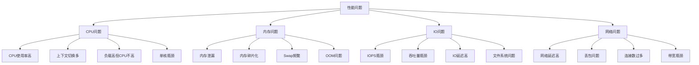
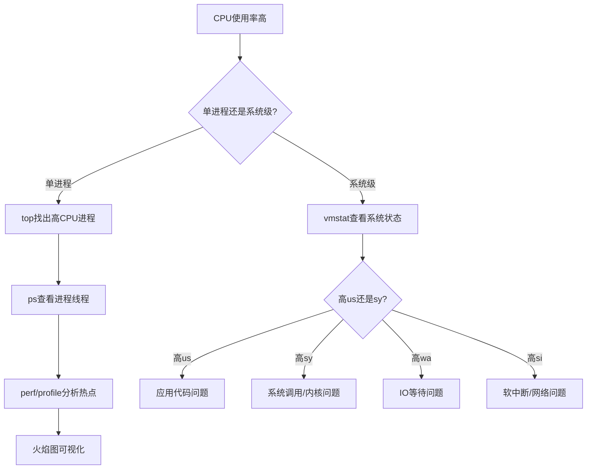
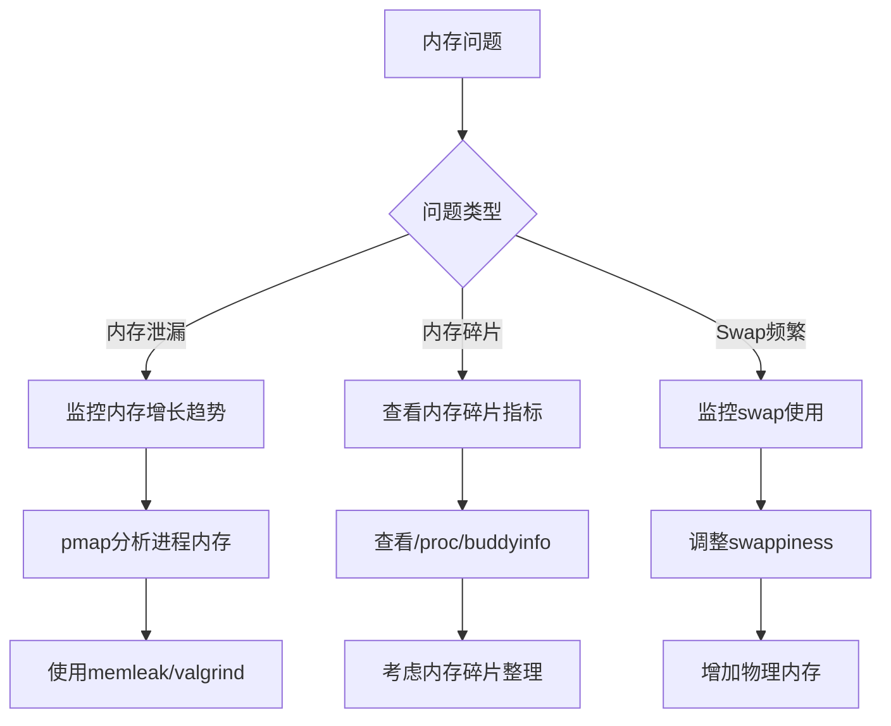
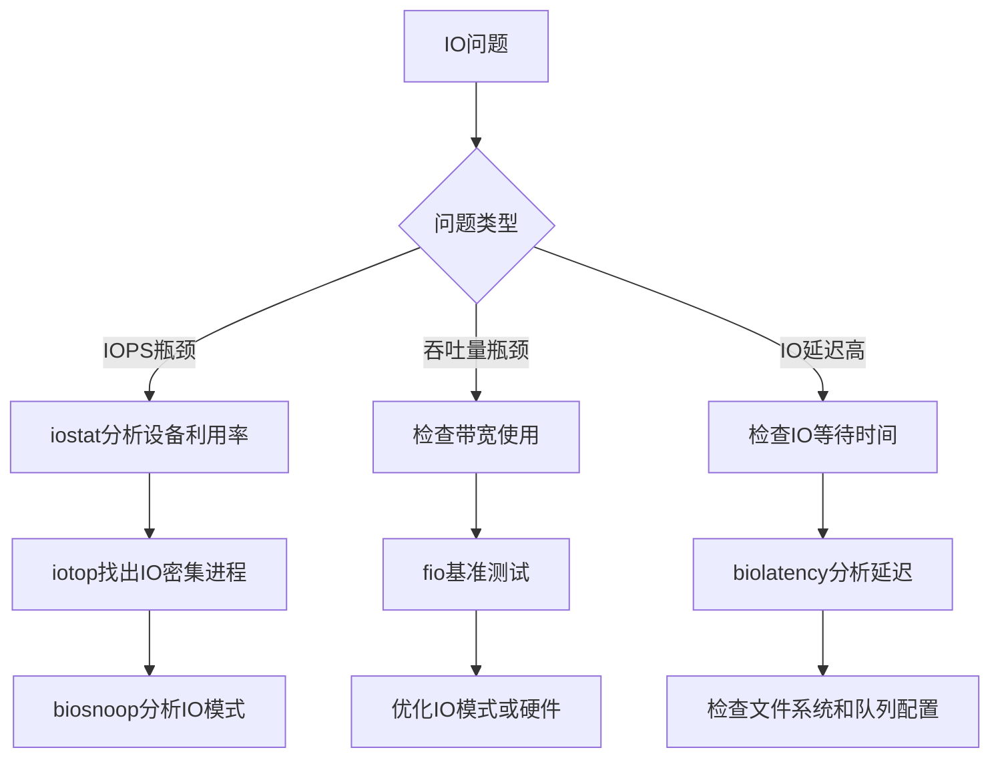
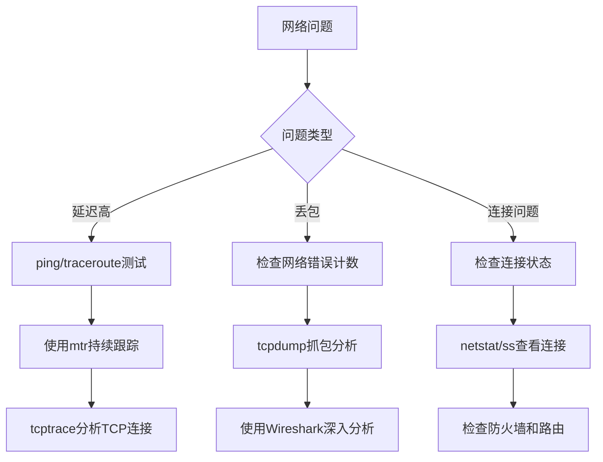

---
tags:
  - 性能优化
  - 问题排查
  - 工具速查
---

# 性能问题排查思路与工具速查表

## 性能问题分类与排查框架

## 通用排查流程

## CPU问题排查

### CPU使用率高问题排查流程

### CPU问题排查工具速查表

| 工具 | 用途 | 常用命令 |
|------|------|----------|
| top/htop | 系统进程监控 | `top -H -p <PID>` 查看线程 `htop -p <PID>` 交互式查看 |
| vmstat | 系统资源统计 | `vmstat 1` 每秒输出 `vmstat -s` 内存统计 |
| mpstat | CPU核心使用率 | `mpstat -P ALL 1` 所有CPU核心 |
| pidstat | 进程资源使用 | `pidstat -u -p <PID> 1` CPU使用 `pidstat -r -p <PID> 1` 内存使用 |
| perf | 性能分析 | `perf top -p <PID>` 实时热点 `perf record -F 99 -g -p <PID> -- sleep 30` 采样 `perf report` 查看报告 |
| bcc/bpftrace | eBPF分析 | `profile -F 99 -p <PID> 30` CPU分析 `funccount 'tcp_*'` 函数调用统计 |
| strace | 系统调用跟踪 | `strace -c -p <PID>` 系统调用统计 `strace -T -p <PID>` 带时间跟踪 |

## 内存问题排查

### 内存问题排查流程

### 内存问题排查工具速查表

| 工具 | 用途 | 常用命令 |
|------|------|----------|
| free | 系统内存使用 | `free -h` 可读格式 `free -s 1` 每秒刷新 |
| vmstat | 内存与交换 | `vmstat 1` 观察si/so列 |
| pmap | 进程内存映射 | `pmap -x <PID>` 详细内存映射 |
| smem | 共享内存分析 | `smem -k -p <PID>` 千字节显示 `smem -m` 按内存排序 |
| memleak (bcc) | 内存泄漏检测 | `memleak -p <PID>` 实时检测泄漏 |
| valgrind | 内存错误检测 | `valgrind --leak-check=full ./program` |
| /proc文件 | 内核内存信息 | `cat /proc/meminfo` 内存信息 `cat /proc/slabinfo` slab分配器信息 |

## IO问题排查

### IO问题排查流程

### IO问题排查工具速查表

| 工具 | 用途 | 常用命令 |
|------|------|----------|
| iostat | 设备IO统计 | `iostat -xdm 1` 详细IO统计 `iostat -xdm -p sda 1` 指定设备 |
| iotop | 进程IO监控 | `iotop -o` 只显示有IO的进程 |
| biosnoop (bcc) | 块IO跟踪 | `biosnoop -Q` 带队列信息 |
| biolatency (bcc) | IO延迟分析 | `biolatency` 延迟直方图 |
| fio | IO基准测试 | `fio --name=test --rw=randread --bs=4k --size=1G` |
| blktrace | 块设备IO追踪 | `blktrace -d /dev/sda -o - \| blkparse -i -` |
| fatrace | 文件访问跟踪 | `fatrace -f` 文件系统事件 |

## 网络问题排查

### 网络问题排查流程

### 网络问题排查工具速查表

| 工具 | 用途 | 常用命令 |
|------|------|----------|
| ping | 连通性测试 | `ping -c 5 target` 发送5个包 |
| traceroute | 路由跟踪 | `traceroute target` 跟踪路由 |
| mtr | 网络诊断 | `mtr target` 持续路由跟踪 |
| netstat/ss | 连接状态 | `ss -tunapl` 所有连接 `netstat -s` 协议统计 |
| tcpdump | 网络抓包 | `tcpdump -i eth0 host 1.2.3.4` 指定主机 `tcpdump -i eth0 port 80` 指定端口 |
| iftop | 带宽使用 | `iftop -i eth0` 监控接口流量 |
| tcptrace (bcc) | TCP连接跟踪 | `tcpconnect` 新TCP连接 `tcpretrans` TCP重传 |
| nload | 网络负载 | `nload eth0` 监控接口负载 |

## 工具速查表

### perf 工具速查表

| 场景 | 命令 | 说明 |
|------|------|------|
| 实时热点 | `perf top -p <PID>` | 实时显示热点函数 |
| CPU采样 | `perf record -F 99 -g -p <PID> -- sleep 30` | 99Hz频率采样30秒 |
| 查看报告 | `perf report` | 查看采样结果 |
| 系统调用 | `perf trace -p <PID>` | 类似strace的系统调用跟踪 |
| 事件统计 | `perf stat -e cycles,instructions,cache-misses -p <PID>` | 统计特定事件 |
| 生成火焰图 | `perf script > perf.out` `./flamegraph.pl perf.folded > perf.svg` | 需要FlameGraph工具 |

### eBPF/BCC 工具速查表

| 工具 | 用途 | 命令 |
|------|------|------|
| profile | CPU分析 | `profile -F 99 -p <PID> 30` |
| funccount | 函数调用计数 | `funccount 'tcp_*'` |
| execsnoop | 进程执行跟踪 | `execsnoop` |
| opensnoop | 文件打开跟踪 | `opensnoop -p <PID>` |
| biosnoop | 块IO跟踪 | `biosnoop` |
| tcpconnect | TCP连接跟踪 | `tcpconnect` |
| tcpretrans | TCP重传跟踪 | `tcpretrans` |
| memleak | 内存泄漏检测 | `memleak -p <PID>` |
| runqlat | 运行队列延迟 | `runqlat` |
| filetop | 文件IO排行 | `filetop` |

### bpftrace 一行命令速查表

| 场景 | 命令 |
|------|------|
| 系统调用计数 | `bpftrace -e 'tracepoint:syscalls:sys_enter_* { @[probe] = count(); }'` |
| 函数执行时间 | `bpftrace -e 'kprobe:vfs_read { @start[tid] = nsecs; } kretprobe:vfs_read /@start[tid]/ { @ns[comm] = hist(nsecs - @start[tid]); delete(@start[tid]); }'` |
| 进程创建跟踪 | `bpftrace -e 'tracepoint:sched:sched_process_exec { printf("%s -> %s\n", comm, str(args->filename)); }'` |
| 块IO大小分布 | `bpftrace -e 'tracepoint:block:block_rq_issue { @bytes = hist(args->bytes); }'` |
| TCP重传跟踪 | `bpftrace -e 'kprobe:tcp_retransmit_skb { @[pid, comm] = count(); }'` |

### ftrace 速查表

| 场景 | 命令 |
|------|------|
| 启用函数跟踪 | `echo function > /sys/kernel/debug/tracing/current_tracer` `echo 1 > /sys/kernel/debug/tracing/tracing_on` |
| 跟踪特定函数 | `echo schedule > /sys/kernel/debug/tracing/set_ftrace_filter` |
| 函数调用图 | `echo function_graph > /sys/kernel/debug/tracing/current_tracer` |
| 查看跟踪结果 | `cat /sys/kernel/debug/tracing/trace` |
| 跟踪系统调用 | `echo 'syscalls:sys_enter_*' > /sys/kernel/debug/tracing/set_event` |
| 跟踪调