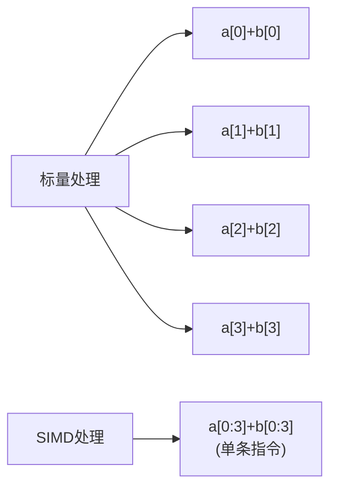

---
tags:
  - 系统编程
  - CPU
  - 性能优化
  - SIMD
  - 并行计算
---

# SIMD指令集应用

## SIMD基本概念

### SIMD的定义与作用

SIMD（Single Instruction Multiple Data，单指令多数据）是一种并行计算技术，允许一条指令同时对多个数据元素执行相同的操作。SIMD通过向量化处理，显著提高了数据密集型应用的计算效率，特别是在多媒体处理、科学计算、机器学习等领域。

与传统的标量处理（一次处理一个数据元素）相比，SIMD可以在相同的时钟周期内处理多个数据元素，从而提供更高的计算吞吐量。



### SIMD的工作原理

SIMD指令通过特殊的向量寄存器和指令集扩展来实现并行数据处理：

1. **向量寄存器**：比普通寄存器更宽，可以同时存储多个数据元素
2. **向量指令**：对向量寄存器中的所有数据元素并行执行相同的操作
3. **数据打包**：将多个标量数据打包到一个向量寄存器中
4. **数据对齐**：为了最佳性能，向量数据通常需要按特定边界对齐

## 主要SIMD指令集

### x86架构SIMD指令集

| 指令集 | 发布年份 | 寄存器宽度 | 主要特性 |
|-------|---------|----------|--------|
| MMX | 1997 | 64位 | 整数运算，8个MM寄存器 |
| SSE | 1999 | 128位 | 单精度浮点运算，8个XMM寄存器 |
| SSE2 | 2001 | 128位 | 双精度浮点运算，整数运算增强 |
| SSE3/SSSE3 | 2004/2006 | 128位 | 水平操作，复数运算 |
| SSE4 | 2007 | 128位 | 点积，混合，插入/提取等操作 |
| AVX | 2011 | 256位 | YMM寄存器，三操作数非破坏性操作 |
| AVX2 | 2013 | 256位 | 整数指令增强，FMA指令 |
| AVX-512 | 2016 | 512位 | ZMM寄存器，掩码寄存器，更多指令 |

### ARM架构SIMD指令集

| 指令集 | 主要特性 |
|-------|--------|
| NEON | 64/128位寄存器，支持整数和浮点运算 |
| SVE | 可变长度向量，最高2048位 |
| SVE2 | SVE扩展，更多算法支持 |

## SIMD在编程语言中的应用

### C/C++中的SIMD编程

在C/C++中使用SIMD主要有三种方式：

#### 1. 编译器自动向量化

现代编译器（如GCC、Clang、MSVC）能够自动将适合的循环代码转换为SIMD指令。开发者可以通过编译选项和代码优化来提高自动向量化的效果。

```cpp
// 编译器可能自动向量化的代码
void add_arrays(float* a, float* b, float* result, int size) {
    for (int i = 0; i < size; i++) {
        result[i] = a[i] + b[i];
    }
}

// 编译命令示例
// gcc -O3 -march=native -ftree-vectorize example.c
```

编译器自动向量化的限制：
- 复杂的数据依赖可能阻止向量化
- 条件分支和不规则内存访问模式难以向量化
- 编译器可能无法确定数据对齐和别名情况

#### 2. 内联汇编

直接在C/C++代码中嵌入SIMD汇编指令，提供最大的控制力，但可移植性差，维护成本高。

```cpp
#include <stdio.h>

void add_vectors_asm(float* a, float* b, float* c, int n) {
    for (int i = 0; i < n; i += 4) {
        __asm__ __volatile__ (
            "movups (%0), %%xmm0\n"  // 加载a中的4个浮点数
            "movups (%1), %%xmm1\n"  // 加载b中的4个浮点数
            "addps %%xmm1, %%xmm0\n" // 执行并行加法
            "movups %%xmm0, (%2)\n"  // 存储结果到c
            : // 输出操作数
            : "r"(a+i), "r"(b+i), "r"(c+i) // 输入操作数
            : "xmm0", "xmm1" // 被修改的寄存器
        );
    }
}
```

#### 3. 内联函数和编译器内建函数

使用编译器提供的内建函数（Intrinsics），平衡了性能控制和代码可读性。

```cpp
#include <immintrin.h> // 包含AVX/AVX2指令集

void add_arrays_avx(float* a, float* b, float* c, int n) {
    for (int i = 0; i < n; i += 8) { // AVX可以一次处理8个单精度浮点数
        __m256 va = _mm256_loadu_ps(a + i); // 加载8个浮点数
        __m256 vb = _mm256_loadu_ps(b + i);
        __m256 vc = _mm256_add_ps(va, vb);  // 并行加法
        _mm256_storeu_ps(c + i, vc);        // 存储结果
    }
}
```

### Rust中的SIMD编程

Rust提供了多种使用SIMD的方式，从底层到高层抽象都有支持。

#### 1. 标准库中的SIMD原语

Rust标准库在`std::arch`模块中提供了对各种SIMD指令集的底层访问。

```rust
#![feature(stdsimd)]
use std::arch::x86_64::*;

// 需要在运行时检查CPU特性
pub fn add_arrays_avx(a: &[f32], b: &[f32], c: &mut [f32]) {
    let n = a.len();
    assert_eq!(n, b.len());
    assert_eq!(n, c.len());
    
    // 安全地使用AVX指令需要运行时检查
    if is_x86_feature_detected!("avx2") {
        unsafe {
            add_arrays_avx_impl(a, b, c, n);
        }
    } else {
        // 回退到标量实现
        for i in 0..n {
            c[i] = a[i] + b[i];
        }
    }
}

#[target_feature(enable = "avx2")]
unsafe fn add_arrays_avx_impl(a: &[f32], b: &[f32], c: &mut [f32], n: usize) {
    for i in (0..n).step_by(8) {
        let va = _mm256_loadu_ps(a[i..].as_ptr());
        let vb = _mm256_loadu_ps(b[i..].as_ptr());
        let vc = _mm256_add_ps(va, vb);
        _mm256_storeu_ps(c[i..].as_mut_ptr(), vc);
    }
}
```

#### 2. SIMD抽象库

Rust生态系统中有多个库提供了更高级的SIMD抽象，如`packed_simd`和`simdeez`。

```rust
use packed_simd::f32x8; // 8个f32的SIMD向量

fn add_arrays_simd(a: &[f32], b: &[f32], c: &mut [f32]) {
    let chunks = a.len() / 8;
    
    for i in 0..chunks {
        let index = i * 8;
        // 从切片创建SIMD向量
        let va = f32x8::from_slice_unaligned(&a[index..]);
        let vb = f32x8::from_slice_unaligned(&b[index..]);
        // 执行SIMD加法
        let vc = va + vb;
        // 存储结果
        vc.write_to_slice_unaligned(&mut c[index..]);
    }
    
    // 处理剩余元素
    let remainder = chunks * 8;
    for i in remainder..a.len() {
        c[i] = a[i] + b[i];
    }
}
```

## SIMD应用场景与性能分析

### 图像处理

SIMD在图像处理中的应用非常广泛，包括：

- 图像滤波（模糊、锐化、边缘检测）
- 颜色空间转换（RGB到YUV等）
- 图像缩放和旋转
- 图像压缩和解压缩

**性能对比示例**：使用SIMD加速的高斯模糊与标量实现对比

| 图像大小 | 标量实现 | SIMD实现 | 加速比 |
|---------|---------|---------|-------|
| 1920x1080 | 120ms | 18ms | 6.7x |
| 3840x2160 | 480ms | 65ms | 7.4x |

### 科学计算

SIMD在科学计算中的应用：

- 矩阵和向量运算
- 快速傅里叶变换（FFT）
- 物理模拟
- 数值积分

**性能对比示例**：矩阵乘法性能对比

| 矩阵大小 | 标量实现 | SIMD实现 | 加速比 |
|---------|---------|---------|-------|
| 1024x1024 | 850ms | 210ms | 4.0x |
| 2048x2048 | 6800ms | 1600ms | 4.3x |

### 机器学习

SIMD在机器学习中的应用：

- 神经网络前向和反向传播
- 卷积操作
- 激活函数计算
- 批量数据处理

## SIMD编程最佳实践

### 数据对齐

为了获得最佳性能，数据应该按照SIMD寄存器宽度对齐：

```cpp
// C++中的对齐内存分配
#include <stdlib.h>

float* allocate_aligned(size_t n) {
    void* mem;
    if (posix_memalign(&mem, 32, n * sizeof(float))) {
        return nullptr; // 分配失败
    }
    return static_cast<float*>(mem);
}

// 使用C++11的对齐属性
alignof(32) float data[1024];
```

```rust
// Rust中的对齐内存分配
use std::alloc::{alloc, Layout};

fn allocate_aligned(n: usize) -> *mut f32 {
    let layout = Layout::from_size_align(n * std::mem::size_of::<f32>(), 32)
        .expect("Invalid layout");
    unsafe {
        alloc(layout) as *mut f32
    }
}
```

### 避免分支

SIMD指令在所有数据通道上执行相同操作，条件分支会降低SIMD效率：

- 使用掩码操作代替条件分支
- 将算法重构为无分支或最小分支版本
- 考虑使用查找表代替复杂条件逻辑

```cpp
// 使用掩码而非分支
__m256 mask = _mm256_cmp_ps(values, _mm256_set1_ps(threshold), _CMP_GT_OS);
__m256 result = _mm256_blendv_ps(values_if_false, values_if_true, mask);
```

### 内存访问模式

- 优先使用连续内存访问（提高缓存命中率）
- 避免不对齐的内存访问（可能导致性能下降）
- 预取数据以减少内存延迟（使用预取指令）
- 考虑数据布局转换（AoS到SoA）以优化SIMD访问

```cpp
// 结构体数组(AoS)转换为数组结构体(SoA)示例
// 原始AoS布局
struct Particle {
    float x, y, z;
    float vx, vy, vz;
};
Particle particles[1000];

// 优化后的SoA布局
struct ParticleSystem {
    float x[1000], y[1000], z[1000];
    float vx[1000], vy[1000], vz[1000];
};
```

### 循环优化

- 循环展开以减少分支预测失败
- 循环融合以提高指令级并行性
- 考虑向量长度进行循环拆分

```cpp
// 循环展开示例
void process_array_unrolled(float* data, int size) {
    __m256 factor = _mm256_set1_ps(2.0f);
    int i = 0;
    // 主循环每次处理32个元素（4次SIMD操作）
    for (; i <= size - 32; i += 32) {
        __m256 a1 = _mm256_loadu_ps(data + i);
        __m256 a2 = _mm256_loadu_ps(data + i + 8);
        __m256 a3 = _mm256_loadu_ps(data + i + 16);
        __m256 a4 = _mm256_loadu_ps(data + i + 24);
        
        a1 = _mm256_mul_ps(a1, factor);
        a2 = _mm256_mul_ps(a2, factor);
        a3 = _mm256_mul_ps(a3, factor);
        a4 = _mm256_mul_ps(a4, factor);
        
        _mm256_storeu_ps(data + i, a1);
        _mm256_storeu_ps(data + i + 8, a2);
        _mm256_storeu_ps(data + i + 16, a3);
        _mm256_storeu_ps(data + i + 24, a4);
    }
    // 处理剩余元素
    for (; i < size; i++) {
        data[i] *= 2.0f;
    }
}
```

## 跨平台SIMD编程

### 跨平台SIMD库

为了解决不同平台SIMD指令集不兼容的问题，可以使用跨平台SIMD库：

| 库名 | 语言 | 特点 |
|-----|-----|------|
| Eigen | C++ | 高性能线性代数库，自动选择最佳SIMD指令 |
| SIMD-everywhere | C/C++ | 提供统一的SIMD API，支持多种架构 |
| Highway | C++ | Google开发的可移植SIMD库 |
| simde | C | 提供x86 SIMD指令在其他平台的实现 |

### 自动向量化与手动向量化的权衡

| 方法 | 优点 | 缺点 |
|-----|-----|------|
| 自动向量化 | 代码可读性好，维护简单 | 优化效果不可控，可能不稳定 |
| 内联函数 | 控制精确，性能可预测 | 代码复杂，可移植性差 |
| 跨平台库 | 可移植性好，抽象层次高 | 可能有性能开销，灵活性受限 |

## 实际案例分析

### 案例1：图像处理中的SIMD优化

以下是一个使用AVX2指令集优化图像灰度转换的示例：

```cpp
// 标量实现
void rgb_to_gray_scalar(const uint8_t* rgb, uint8_t* gray, int width, int height) {
    const int pixels = width * height;
    for (int i = 0; i < pixels; ++i) {
        const int rgb_offset = i * 3;
        const uint8_t r = rgb[rgb_offset];
        const uint8_t g = rgb[rgb_offset + 1];
        const uint8_t b = rgb[rgb_offset + 2];
        // 标准灰度转换公式: Y = 0.299*R + 0.587*G + 0.114*B
        gray[i] = (uint8_t)(0.299f * r + 0.587f * g + 0.114f * b);
    }
}

// SIMD实现
#include <immintrin.h>

void rgb_to_gray_avx2(const uint8_t* rgb, uint8_t* gray, int width, int height) {
    const int pixels = width * height;
    const int simd_width = 8; // AVX2处理8个像素
    
    // 预计算权重向量
    const __m256 r_weight = _mm256_set1_ps(0.299f);
    const __m256 g_weight = _mm256_set1_ps(0.587f);
    const __m256 b_weight = _mm256_set1_ps(0.114f);
    
    int i = 0;
    for (; i <= pixels - simd_width; i += simd_width) {
        // 加载8个像素的RGB值（需要特殊处理，因为数据不是连续的）
        // 这里使用了一种简化方法，实际应用中可能需要更复杂的数据重排
        __m256i r_values = _mm256_setr_epi32(
            rgb[i*3], rgb[(i+1)*3], rgb[(i+2)*3], rgb[(i+3)*3],
            rgb[(i+4)*3], rgb[(i+5)*3], rgb[(i+6)*3], rgb[(i+7)*3]);
        __m256i g_values = _mm256_setr_epi32(
            rgb[i*3+1], rgb[(i+1)*3+1], rgb[(i+2)*3+1], rgb[(i+3)*3+1],
            rgb[(i+4)*3+1], rgb[(i+5)*3+1], rgb[(i+6)*3+1], rgb[(i+7)*3+1]);
        __m256i b_values = _mm256_setr_epi32(
            rgb[i*3+2], rgb[(i+1)*3+2], rgb[(i+2)*3+2], rgb[(i+3)*3+2],
            rgb[(i+4)*3+2], rgb[(i+5)*3+2], rgb[(i+6)*3+2], rgb[(i+7)*3+2]);
        
        // 转换为浮点数
        __m256 r_float = _mm256_cvtepi32_ps(r_values);
        __m256 g_float = _mm256_cvtepi32_ps(g_values);
        __m256 b_float = _mm256_cvtepi32_ps(b_values);
        
        // 应用权重
        __m256 r_contrib = _mm256_mul_ps(r_float, r_weight);
        __m256 g_contrib = _mm256_mul_ps(g_float, g_weight);
        __m256 b_contrib = _mm256_mul_ps(b_float, b_weight);
        
        // 求和
        __m256 sum = _mm256_add_ps(_mm256_add_ps(r_contrib, g_contrib), b_contrib);
        
        // 转换回整数
        __m256i gray_values = _mm256_cvtps_epi32(sum);
        
        // 打包并存储结果
        __m128i gray_packed = _mm256_extracti128_si256(gray_values, 0);
        for (int j = 0; j < simd_width; ++j) {
            gray[i + j] = (uint8_t)_mm_extract_epi32(gray_packed, j);
        }
    }
    
    // 处理剩余像素
    for (; i < pixels; ++i) {
        const int rgb_offset = i * 3;
        const uint8_t r = rgb[rgb_offset];
        const uint8_t g = rgb[rgb_offset + 1];
        const uint8_t b = rgb[rgb_offset + 2];
        gray[i] = (uint8_t)(0.299f * r + 0.587f * g + 0.114f * b);
    }
}
```

### 案例2：Rust中的SIMD优化

以下是一个使用Rust实现向量点积的SIMD优化示例：

```rust
use std::arch::x86_64::*;

// 标量实现
fn dot_product_scalar(a: &[f32], b: &[f32]) -> f32 {
    assert_eq!(a.len(), b.len());
    let mut sum = 0.0;
    for i in 0..a.len() {
        sum += a[i] * b[i];
    }
    sum
}

// SIMD实现
#[target_feature(enable = "avx")]
unsafe fn dot_product_avx(a: &[f32], b: &[f32]) -> f32 {
    assert_eq!(a.len(), b.len());
    let n = a.len();
    let mut sum_vec = _mm256_setzero_ps();
    
    // 每次处理8个元素
    let mut i = 0;
    while i <= n - 8 {
        let a_vec = _mm256_loadu_ps(a[i..].as_ptr());
        let b_vec = _mm256_loadu_ps(b[i..].as_ptr());
        // FMA指令：乘法和加法一步完成
        sum_vec = _mm256_fmadd_ps(a_vec, b_vec, sum_vec);
        i += 8;
    }
    
    // 水平求和
    let mut result = 0.0;
    let sum_array = std::mem::transmute::<__m256, [f32; 8]>(sum_vec);
    for j in 0..8 {
        result += sum_array[j];
    }
    
    // 处理剩余元素
    for j in i..n {
        result += a[j] * b[j];
    }
    
    result
}

// 安全包装函数
fn dot_product(a: &[f32], b: &[f32]) -> f32 {
    if is_x86_feature_detected!("avx") {
        unsafe { dot_product_avx(a, b) }
    } else {
        dot_product_scalar(a, b)
    }
}
```

## 总结与展望

### SIMD技术的局限性

- 不是所有算法都适合SIMD优化
- 数据依赖和分支逻辑可能限制SIMD效率
- 不同平台的SIMD指令集不兼容增加开发难度
- 过度优化可能导致代码可读性和可维护性下降

### 未来发展趋势

- 更宽的SIMD寄存器（如AVX-512扩展到未来可能的AVX-1024）
- 更灵活的SIMD指令（如ARM SVE的可变长度向量）
- 编译器自动向量化能力的提升
- 更多高级抽象库简化SIMD编程
- 与其他并行技术（如多线程、GPU计算）的结合

### 实践建议

1. 先确定性能瓶颈，再考虑SIMD优化
2. 从自动向量化开始，必要时再使用手动优化
3. 使用性能分析工具验证SIMD优化效果
4. 保持代码可读性和可维护性
5. 为不支持目标SIMD指令集的平台提供回退实现连续内存访问（提高缓存命中率）
- 避免不对齐的内