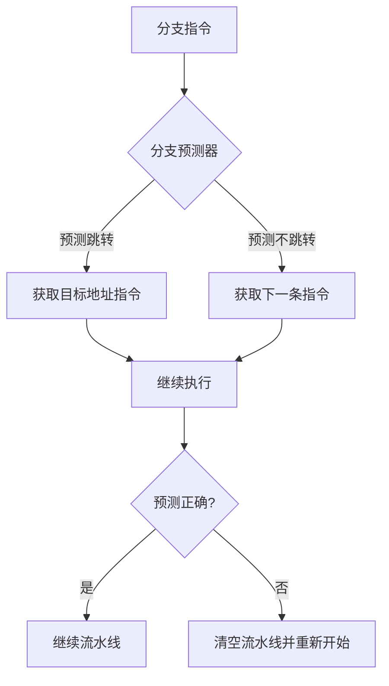
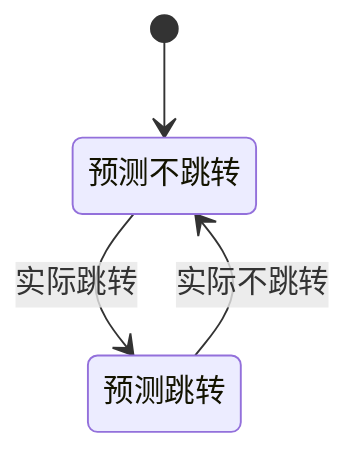
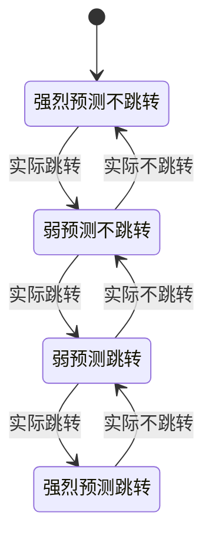
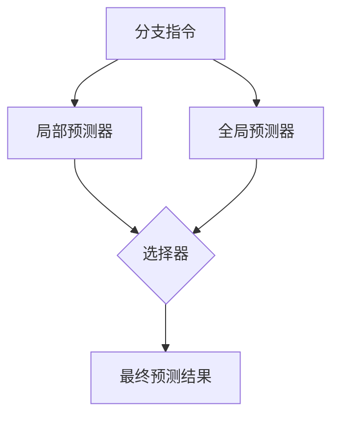
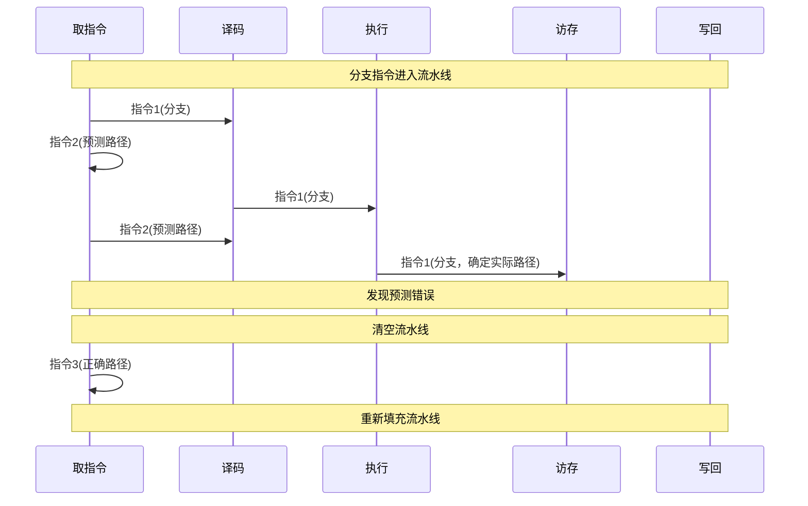
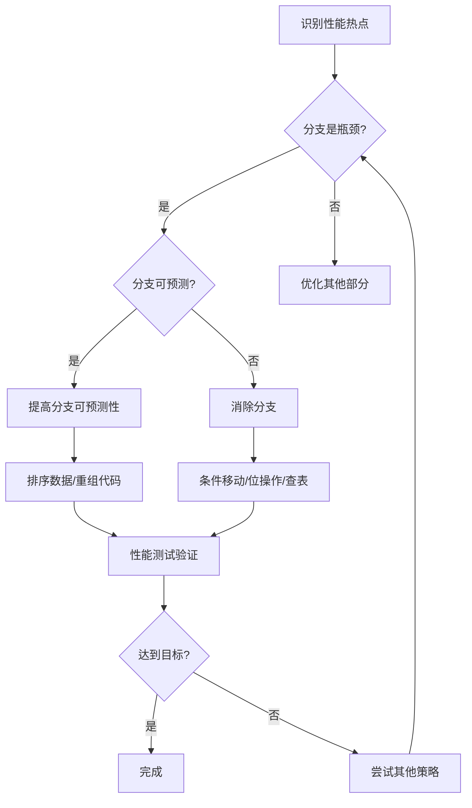

---
tags:
  - 系统编程
  - CPU
  - 性能优化
  - 分支预测
---

# 分支预测与流水线优化

## 分支预测基本概念

### 分支预测的定义与作用

分支预测是现代CPU中的一项关键技术，用于预测条件分支指令（如if-else语句）的执行路径。由于现代CPU采用深度流水线设计，当遇到分支指令时，CPU需要决定接下来执行哪条指令路径。如果等待分支条件计算完成再决定，会导致流水线停顿，严重影响性能。分支预测器通过预测分支结果，使CPU能够提前获取并执行预测路径上的指令。

### 分支预测的重要性

在现代CPU中，分支预测的重要性体现在：

1. **流水线深度**：现代CPU流水线通常有15-20个阶段，分支预测失败会导致整个流水线清空
2. **指令吞吐量**：高端CPU每周期可执行4-8条指令，预测失败造成的损失更大
3. **执行延迟**：分支预测失败可能导致10-20个周期的延迟，相当于执行几十条指令的时间



## 分支预测器类型

### 静态分支预测

静态分支预测使用固定的规则预测分支结果，不考虑程序的实际执行历史。

| 预测策略 | 描述 | 适用场景 |
|---------|------|----------|
| 总是预测跳转 | 假设所有分支都会跳转 | 循环结构（大多数循环会多次执行） |
| 总是预测不跳转 | 假设所有分支都不会跳转 | 错误处理代码（通常不执行） |
| 向后跳转预测为跳转，向前跳转预测为不跳转 | 基于跳转方向预测 | 混合代码（循环通常是向后跳转） |

### 动态分支预测

动态分支预测根据程序的实际执行历史来预测分支结果，能够适应程序的行为模式。

#### 一位预测器

最简单的动态预测器，记录上一次分支的结果。



#### 两位预测器

增加状态稳定性，需要连续两次预测错误才会改变预测方向。



#### 相关预测器

考虑分支指令之间的相关性，使用全局历史记录改进预测准确率。

1. **全局历史寄存器(GHR)**：记录最近N个分支的结果
2. **模式历史表(PHT)**：根据历史模式预测当前分支

#### 混合预测器

结合多种预测策略，根据预测器的历史准确率动态选择最佳预测结果。



### 现代处理器中的分支预测

现代处理器使用复杂的多级混合预测器，结合多种技术：

1. **TAGE预测器**：使用多个不同长度的历史记录表
2. **神经网络预测器**：使用简化的神经网络模型学习分支模式
3. **循环预测器**：专门针对循环结构优化的预测器

| 处理器架构 | 预测器类型 | 预测准确率 |
|-----------|-----------|------------|
| Intel Skylake | 多级混合预测器 | 95-98% |
| AMD Zen 3 | 神经网络增强预测器 | 96-99% |
| ARM Cortex-A78 | 多层感知器预测器 | 95-97% |

## 分支预测失败的性能影响

### 流水线清空

分支预测失败导致的流水线清空是性能下降的主要原因。



### 量化性能影响

分支预测失败的性能影响可以量化为：

```
性能损失 = 分支频率 × 预测失败率 × 预测失败惩罚
```

其中：
- 分支频率：程序中分支指令的比例（通常为15-25%）
- 预测失败率：分支预测错误的概率（现代处理器为2-5%）
- 预测失败惩罚：流水线清空的周期数（通常为10-20个周期）

## C++中的分支优化技术

### 分支消除技术

#### 条件移动指令

使用条件移动指令(cmov)替代分支，避免流水线清空。

```cpp
// 使用分支的版本
int max_branch(int a, int b) {
    if (a > b)
        return a;
    else
        return b;
}

// 使用条件移动的版本（编译器可能自动优化）
int max_cmov(int a, int b) {
    int result = b;
    if (a > b)
        result = a;
    return result;
}
```

#### 位操作替代分支

```cpp
// 使用分支的版本
int abs_branch(int x) {
    if (x < 0)
        return -x;
    else
        return x;
}

// 使用位操作的版本
int abs_bitwise(int x) {
    int mask = x >> 31;  // 获取符号位：负数为-1，非负数为0
    return (x ^ mask) - mask;  // 等价于 x<0 ? -x : x
}
```

#### 查表法

```cpp
// 使用分支的版本
const char* get_day_name(int day) {
    switch (day) {
        case 0: return "Sunday";
        case 1: return "Monday";
        case 2: return "Tuesday";
        // ...
        default: return "Invalid";
    }
}

// 使用查表法的版本
const char* get_day_name_table(int day) {
    static const char* days[] = {
        "Sunday", "Monday", "Tuesday", "Wednesday",
        "Thursday", "Friday", "Saturday", "Invalid"
    };
    return days[day < 0 || day > 6 ? 7 : day];
}
```

### 分支预测友好的代码

#### 提高分支可预测性

```cpp
// 分支预测不友好的版本
bool contains_unpredictable(const std::vector<int>& data, int value) {
    for (int x : data) {
        if (x == value)  // 随机数据导致分支难以预测
            return true;
    }
    return false;
}

// 分支预测友好的版本（数据排序后）
bool contains_predictable(const std::vector<int>& sorted_data, int value) {
    for (int x : sorted_data) {
        if (x > value)  // 排序后分支更可预测
            return false;
        if (x == value)
            return true;
    }
    return false;
}
```

#### 避免嵌套分支

```cpp
// 嵌套分支版本
void process_nested(int x, int y) {
    if (x > 0) {
        if (y > 0) {
            // 处理 x>0, y>0
        } else {
            // 处理 x>0, y<=0
        }
    } else {
        if (y > 0) {
            // 处理 x<=0, y>0
        } else {
            // 处理 x<=0, y<=0
        }
    }
}

// 扁平化分支版本
void process_flat(int x, int y) {
    if (x > 0 && y > 0) {
        // 处理 x>0, y>0
    } else if (x > 0 && y <= 0) {
        // 处理 x>0, y<=0
    } else if (x <= 0 && y > 0) {
        // 处理 x<=0, y>0
    } else { // x <= 0 && y <= 0
        // 处理 x<=0, y<=0
    }
}
```

### 编译器优化选项

```bash
# GCC/Clang分支优化选项
-O2 -ftree-loop-if-convert  # 循环中的if转换为条件执行
-O3 -fprofile-generate      # 生成性能分析信息
-O3 -fprofile-use           # 使用性能分析信息优化分支
```

## Rust中的分支优化技术

### 条件表达式与模式匹配

```rust
// 使用if-else的版本
fn max_if_else(a: i32, b: i32) -> i32 {
    if a > b {
        a
    } else {
        b
    }
}

// 使用match的版本
fn max_match(a: i32, b: i32) -> i32 {
    match a > b {
        true => a,
        false => b,
    }
}
```

### 位操作优化

```rust
// 使用分支的版本
fn abs_branch(x: i32) -> i32 {
    if x < 0 {
        -x
    } else {
        x
    }
}

// 使用位操作的版本
fn abs_bitwise(x: i32) -> i32 {
    let mask = x >> 31;
    (x ^ mask) - mask
}
```

### 预测提示

 Rust提供了likely和unlikely提示，帮助编译器优化分支预测。

```rust
// 使用预测提示
fn process_data(data: &[u32]) -> u32 {
    let mut sum = 0;
    for &x in data {
        if likely(x > 0) {
            // 大多数情况下x > 0
            sum += x;
        } else {
            // 罕见情况
            sum += 1;
        }
    }
    sum
}

// likely和unlikely的简单实现
#[inline(always)]
fn likely(b: bool) -> bool {
    #[cfg(feature = "branch-prediction")]
    unsafe {
        std::intrinsics::likely(b)
    }
    #[cfg(not(feature = "branch-prediction"))]
    b
}

#[inline(always)]
fn unlikely(b: bool) -> bool {
    #[cfg(feature = "branch-prediction")]
    unsafe {
        std::intrinsics::unlikely(b)
    }
    #[cfg(not(feature = "branch-prediction"))]
    b
}
```

### 数据结构优化

```rust
// 分支预测不友好的枚举处理
enum Shape {
    Circle(f32),    // 半径
    Rectangle(f32, f32), // 宽和高
    Triangle(f32, f32, f32), // 三边长
}

fn calculate_area(shape: &Shape) -> f32 {
    match shape {
        Shape::Circle(radius) => std::f32::consts::PI * radius * radius,
        Shape::Rectangle(width, height) => width * height,
        Shape::Triangle(a, b, c) => {
            let s = (a + b + c) / 2.0;
            (s * (s - a) * (s - b) * (s - c)).sqrt()
        }
    }
}

// 分支预测友好的类型标签处理
struct ShapeData {
    shape_type: u8,
    data: [f32; 3], // 足够存储任何形状的数据
}

fn calculate_area_optimized(shape: &ShapeData) -> f32 {
    match shape.shape_type {
        0 => std::f32::consts::PI * shape.data[0] * shape.data[0], // 圆
        1 => shape.data[0] * shape.data[1], // 矩形
        _ => {
            let a = shape.data[0];
            let b = shape.data[1];
            let c = shape.data[2];
            let s = (a + b + c) / 2.0;
            (s * (s - a) * (s - b) * (s - c)).sqrt() // 三角形
        }
    }
}
```

## 性能测试与分析

### 分支预测性能测试

```cpp
#include <benchmark/benchmark.h>
#include <vector>
#include <algorithm>
#include <random>

// 测试排序数据的分支预测性能
static void BM_SortedData(benchmark::State& state) {
    std::vector<int> data(state.range(0));
    for (size_t i = 0; i < data.size(); ++i) {
        data[i] = i;
    }
    
    for (auto _ : state) {
        int sum = 0;
        for (int x : data) {
            if (x > data.size() / 2) {
                sum += x;
            }
        }
        benchmark::DoNotOptimize(sum);
    }
}

// 测试随机数据的分支预测性能
static void BM_RandomData(benchmark::State& state) {
    std::vector<int> data(state.range(0));
    for (size_t i = 0; i < data.size(); ++i) {
        data[i] = i;
    }
    
    std::random_device rd;
    std::mt19937 g(rd());
    std::shuffle(data.begin(), data.end(), g);
    
    for (auto _ : state) {
        int sum = 0;
        for (int x : data) {
            if (x > data.size() / 2) {
                sum += x;
            }
        }
        benchmark::DoNotOptimize(sum);
    }
}

BENCHMARK(BM_SortedData)->Range(1<<10, 1<<18);
BENCHMARK(BM_RandomData)->Range(1<<10, 1<<18);
```

### 使用perf分析分支预测

```bash
# 使用perf统计分支预测失败率
perf stat -e branch-instructions,branch-misses ./program

# 详细分析分支预测失败的热点
perf record -e branch-misses ./program
perf report
```

示例输出分析：

```
 Performance counter stats for './program':

     1,234,567      branch-instructions
        45,678      branch-misses             # 3.70% of all branches
```

### 使用VTune分析分支预测

Intel VTune Profiler提供了更详细的分支预测分析：

```bash
# 收集分支预测数据
vtune -collect uarch-exploration -knob collect-memory-bandwidth=false ./program

# 生成报告
vtune -report summary -r r000ue
```

## 实际应用案例

### 二分查找优化

```cpp
// 传统二分查找（分支预测不友好）
int binary_search_traditional(const std::vector<int>& arr, int target) {
    int left = 0;
    int right = arr.size() - 1;
    
    while (left <= right) {
        int mid = left + (right - left) / 2;
        
        if (arr[mid] == target)
            return mid;
        
        if (arr[mid] < target)
            left = mid + 1;
        else
            right = mid - 1;
    }
    
    return -1;
}

// 分支预测友好的二分查找
int binary_search_optimized(const std::vector<int>& arr, int target) {
    int n = arr.size();
    int pos = 0;
    
    // 使用位操作和条件移动替代分支
    for (int step = n / 2; step > 0; step /= 2) {
        int new_pos = pos + step;
        bool take_step = (new_pos < n) && (arr[new_pos] <= target);
        
        // 使用位掩码替代if语句
        pos |= step & (-(int)take_step);
    }
    
    return (pos < n && arr[pos] == target) ? pos : -1;
}
```

### 排序算法优化

```cpp
// 分支预测友好的快速排序分区函数
int partition_optimized(std::vector<int>& arr, int low, int high) {
    int pivot = arr[high];
    int i = low;
    
    for (int j = low; j < high; j++) {
        // 使用条件移动替代分支
        int less = arr[j] < pivot;
        std::swap(arr[i], arr[j]);
        i += less;  // 等价于 if (arr[j] < pivot) i++;
    }
    
    std::swap(arr[i], arr[high]);
    return i;
}
```

## 总结与最佳实践

### 分支优化核心原则

1. **减少分支数量**：使用条件移动、位操作、查表法等技术消除分支
2. **提高分支可预测性**：使分支结果具有规律性，避免随机分支
3. **减少分支嵌套**：扁平化分支结构，降低预测复杂度
4. **数据排序**：对数据进行排序，使分支结果更加一致
5. **分支隔离**：将高频路径与低频路径分开，提高主路径的预测准确率

### 常见陷阱与注意事项

1. **过度优化**：分支优化可能增加代码复杂度，应权衡利弊
2. **编译器干扰**：手动优化可能与编译器优化冲突，应验证效果
3. **硬件依赖**：不同CPU架构的分支预测器特性不同，优化效果可能有差异
4. **维护困难**：位操作和条件移动等技术可能降低代码可读性

### 优化决策流程



## 参考资源

- [What Every Programmer Should Know About Memory](https://people.freebsd.org/~lstewart/articles/cpumemory.pdf)
- [Intel® 64 and IA-32 Architectures Optimization Reference Manual](https://www.intel.com/content/www/us/en/developer/articles/technical/intel-sdm.html)
- [Agner Fog's Software Optimization Resources](https://www.agner.org/optimize/)
- [Performance Analysis Guide for Intel® Core™ i7 Processor and Intel® Xeon® 5500 processors](https://software.intel.com/content/www/us/en/develop/articles/processor-specific-performance-analysis-papers.html)
- [Rust Performance Book](https://nnethercote.github.io/perf-book/)