---
tags:
  - 系统编程
  - CPU
  - 性能优化
---

# 现代CPU流水线设计与性能优化

## 流水线基本概念

### 流水线定义

CPU流水线是一种指令级并行技术，通过将指令处理过程分解为多个连续的阶段，使得多条指令可以同时在不同阶段执行，从而提高处理器的吞吐量。

### 基本流水线阶段


1. **取指令(Fetch)**：从内存中获取指令
2. **译码(Decode)**：解析指令，确定操作类型和操作数
3. **执行(Execute)**：执行算术逻辑运算
4. **访存(Memory)**：如果需要，访问数据内存
5. **写回(Write Back)**：将结果写回寄存器

## 现代流水线架构

### 超标量流水线

超标量处理器能够在一个时钟周期内发射和执行多条指令。

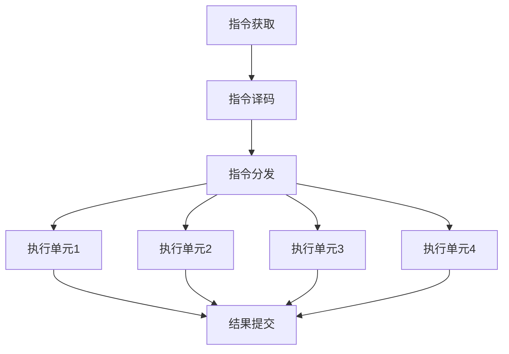

### 乱序执行

乱序执行允许指令不按程序顺序执行，而是根据资源可用性和数据依赖关系决定执行顺序。

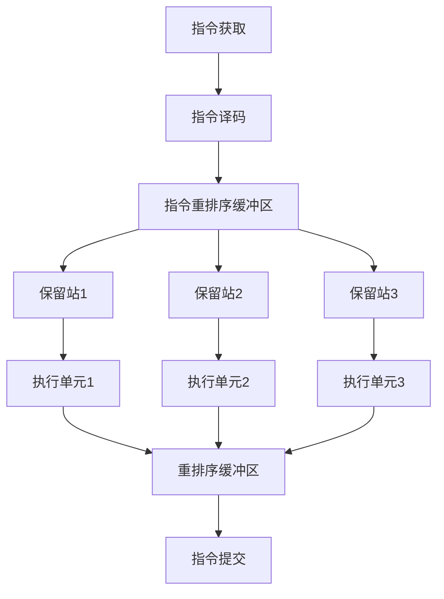

### 分支预测

分支预测技术尝试预测条件分支的结果，以减少流水线停顿。

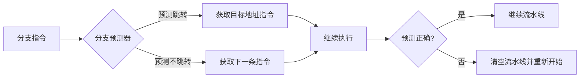

## 流水线冒险

### 数据冒险

当指令依赖于前面指令的结果时发生数据冒险。

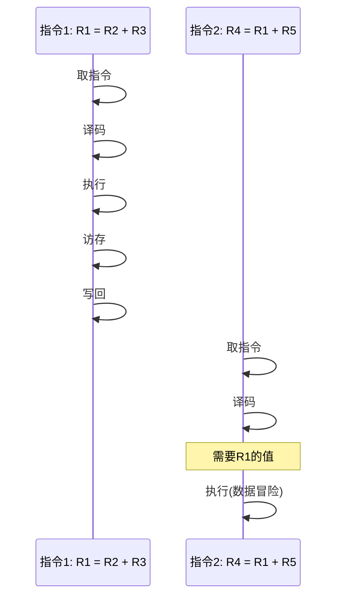

#### 解决方案

1. **转发(Forwarding)**：将结果直接从一个流水线阶段转发到另一个阶段
2. **流水线停顿(Pipeline Stall)**：插入气泡(bubble)等待数据就绪
3. **寄存器重命名**：消除假数据依赖

### 控制冒险

分支指令导致的流水线中断。

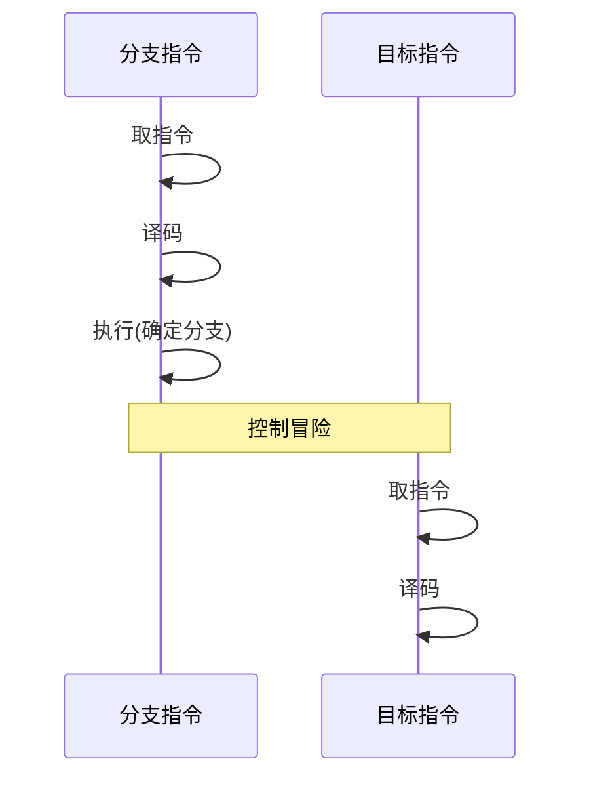

#### 解决方案

1. **分支预测**：静态预测和动态预测
2. **分支目标缓冲区(BTB)**：缓存分支目标地址
3. **推测执行**：预测执行分支路径

### 结构冒险

多条指令同时竞争同一硬件资源。

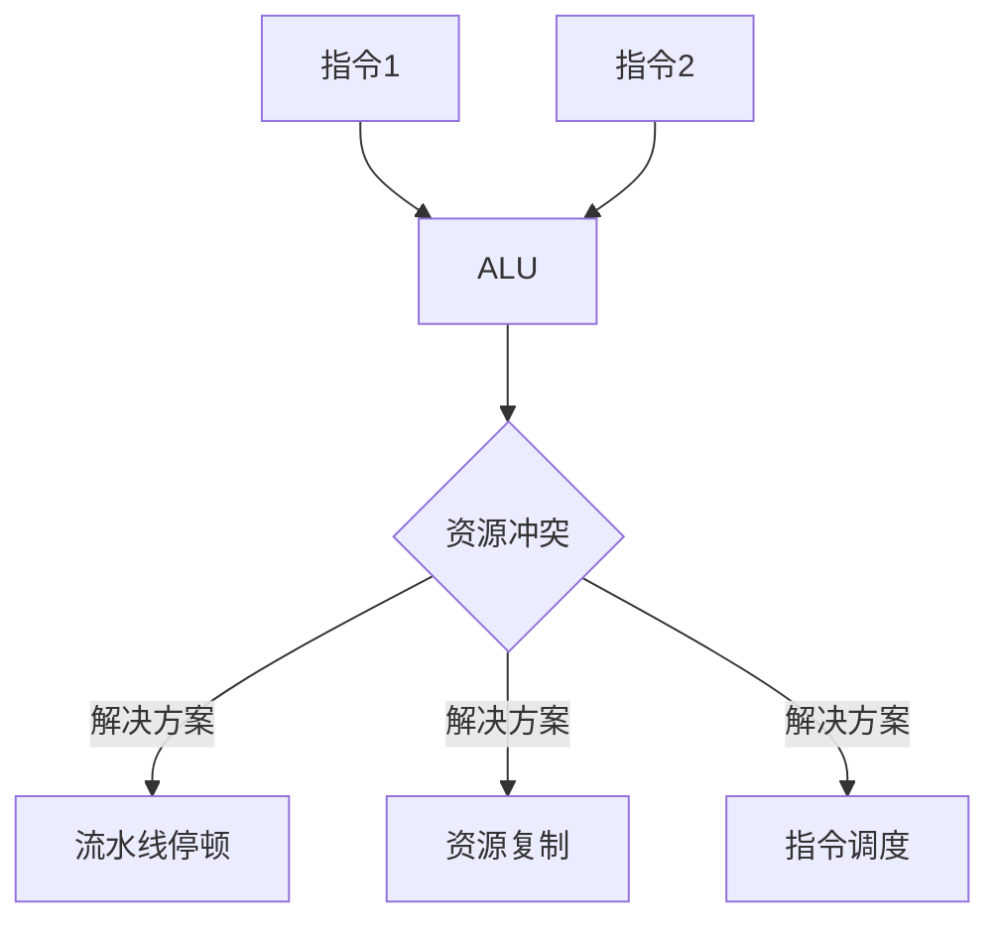

## 高级流水线优化技术

### 指令级并行(ILP)


### 预测执行

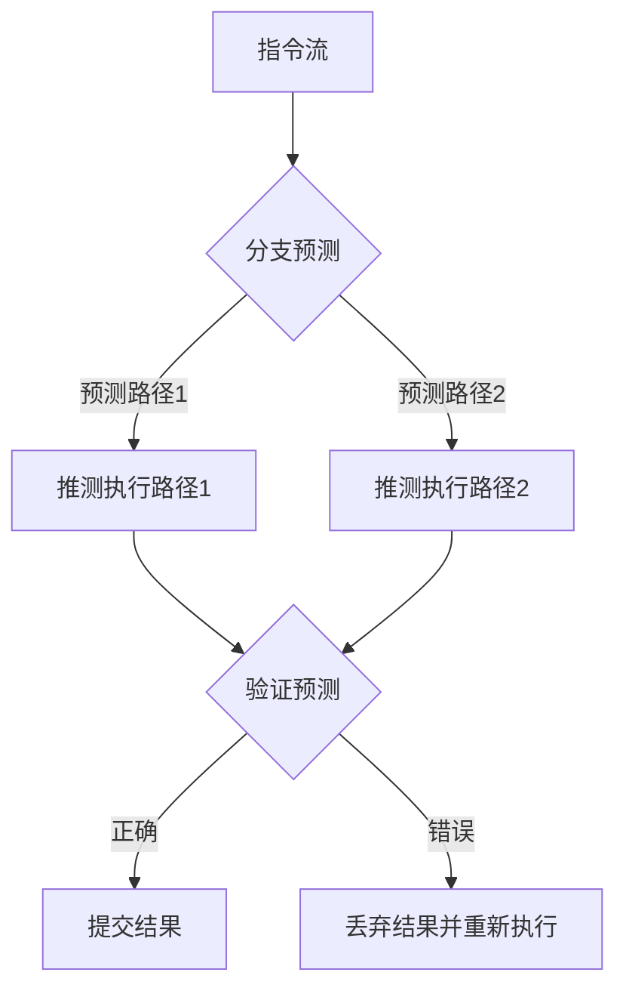

### 多级缓存

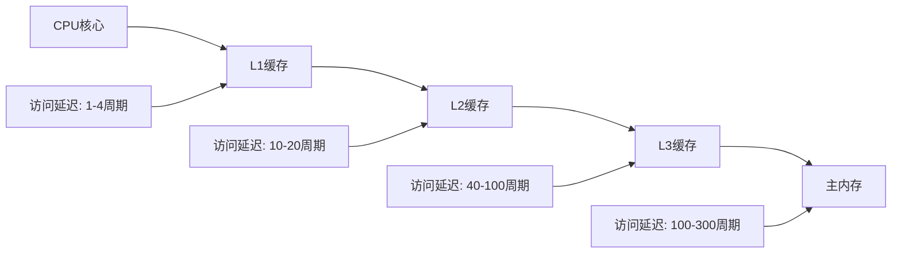

## 现代处理器流水线实例

### Intel Skylake架构

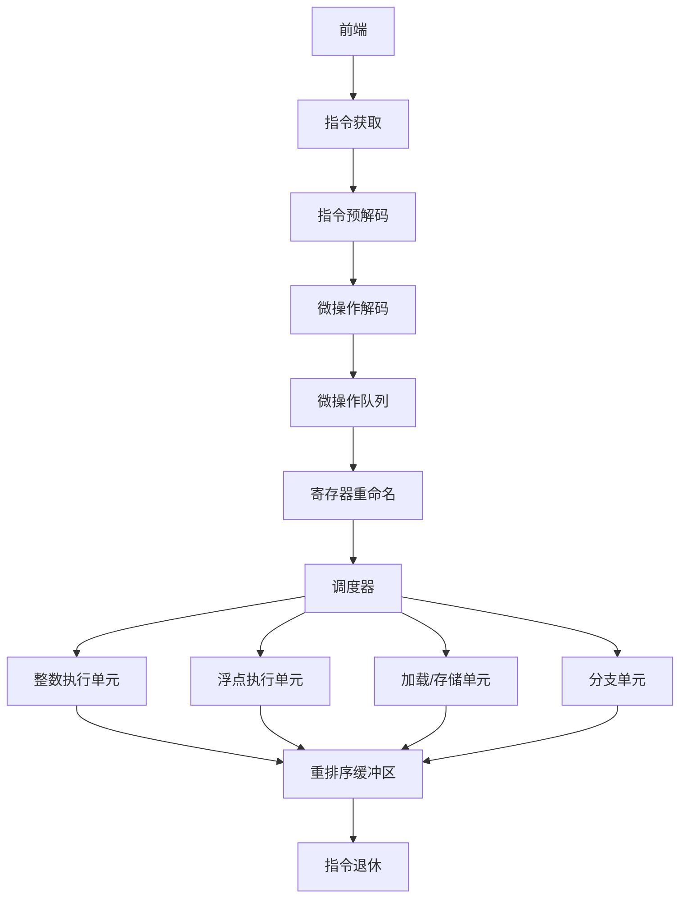

### ARM Cortex-A76架构

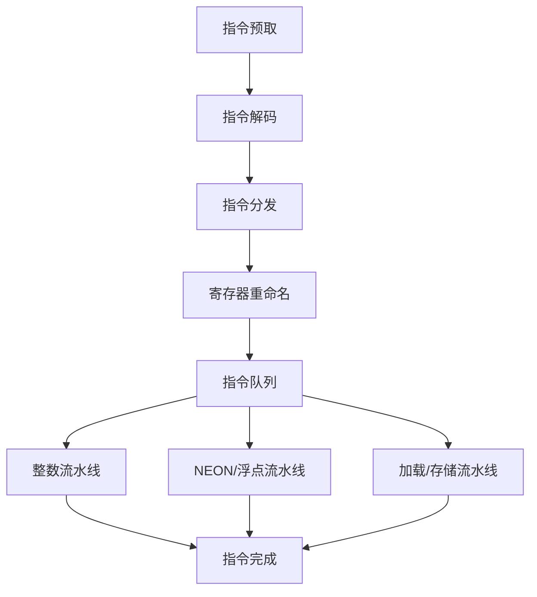

## 流水线性能指标

### 关键性能指标

1. **IPC (Instructions Per Cycle)**：每周期执行的指令数
2. **CPI (Cycles Per Instruction)**：每指令所需的周期数
3. **分支预测准确率**：分支预测正确的百分比
4. **缓存命中率**：内存访问在缓存中命中的百分比

```mermaid
bar chart
    title 不同处理器架构的IPC比较
    x-axis [处理器架构]
    y-axis IPC值
    "Intel Core i9" 3.8
    "AMD Ryzen 9" 4.2
    "ARM Cortex-A78" 2.7
    "Apple M1" 4.5
```

### 性能瓶颈分析

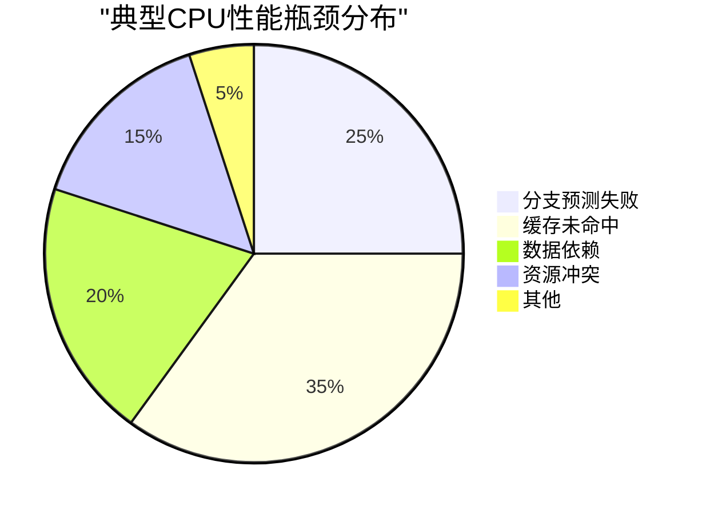

## 流水线优化策略

### 编译器优化

1. **指令调度**：重排指令顺序减少数据依赖
2. **循环展开**：减少分支指令
3. **函数内联**：消除函数调用开销

### 软件优化

1. **数据预取**：提前加载可能使用的数据
2. **分支消除**：使用条件移动指令代替分支
3. **数据对齐**：优化内存访问模式

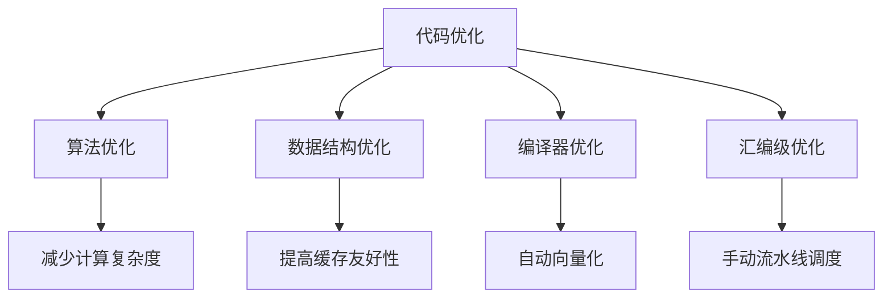

### 硬件优化

1. **更大的重排序缓冲区**：增加指令窗口大小
2. **更多的执行单元**：提高并行度
3. **更复杂的分支预测器**：提高预测准确率

## 未来发展趋势

### 专用加速器

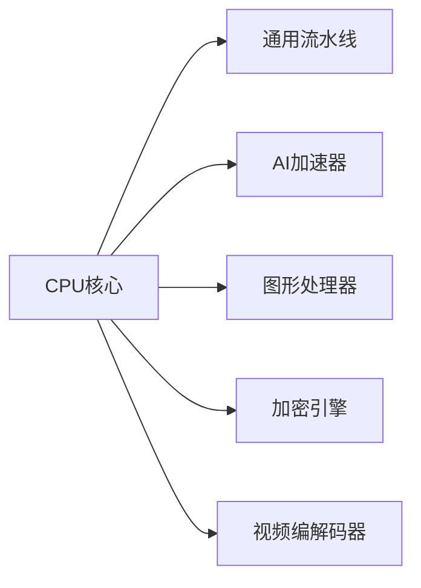

### 异构计算

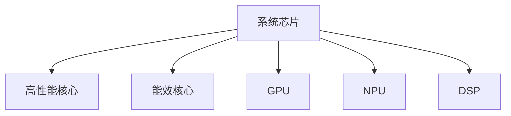

### 新型架构

1. **RISC-V**：开源指令集架构
2. **量子计算**：基于量子力学原理的计算
3. **神经形态计算**：模拟人脑的计算方式

## 总结

CPU流水线技术是现代处理器性能的关键所在，通过指令级并行、乱序执行、分支预测等技术，大幅提高了处理器的吞吐量。理解流水线架构及其优化方法，对于系统性能调优和软件开发至关重要。随着计算需求的不断增长，流水线设计将继续演进，结合专用加速器和异构计算等新技术，为未来的计算提供更高效的解决方案。