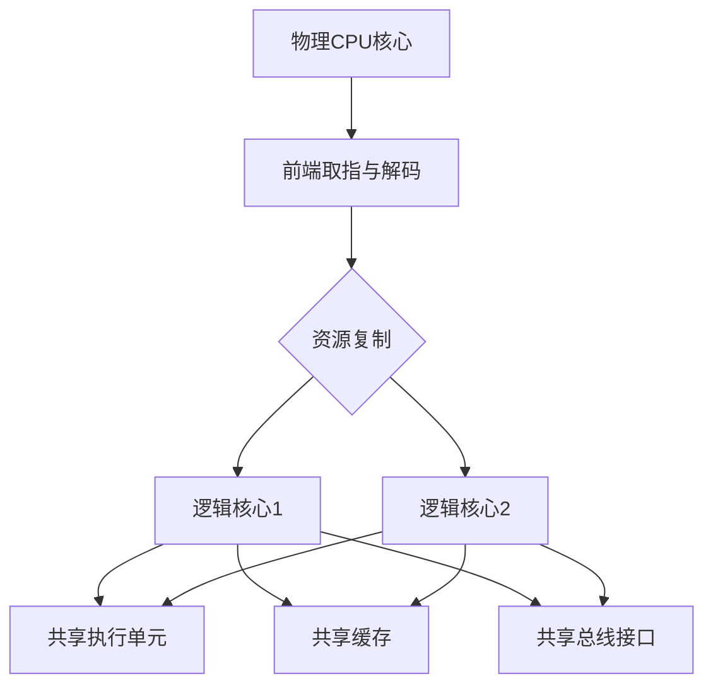
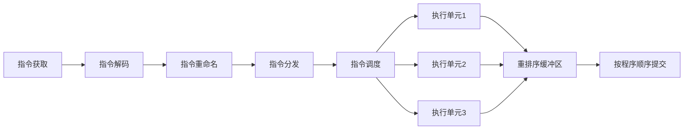
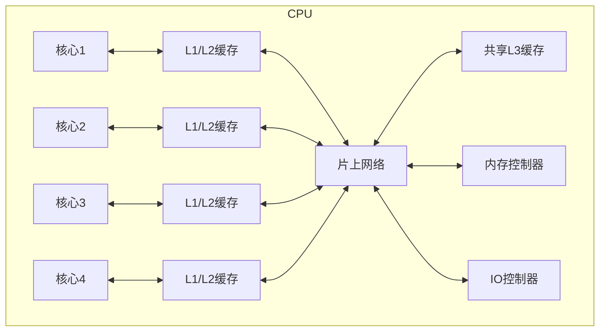

---
tags:
  - 系统编程
  - CPU
  - 性能优化
  - 超线程
  - 乱序执行
---

# 现代CPU架构特性

## 超线程技术

### 超线程的定义与原理

超线程技术（Hyper-Threading Technology，HTT）是Intel开发的一种同时多线程（SMT，Simultaneous Multi-Threading）实现，允许一个物理CPU核心同时执行两个独立的线程。超线程通过在单个物理核心上复制部分硬件资源（如寄存器和控制单元），同时共享其他资源（如执行单元、缓存和总线接口），使一个物理核心能够表现为两个逻辑核心。



### 超线程的工作机制

超线程技术的核心工作机制包括：

1. **资源复制**：每个逻辑核心拥有独立的架构状态，包括：
   - 程序计数器（PC）
   - 寄存器文件
   - 重排序缓冲区（ROB）
   - 分支预测器状态

2. **资源共享**：逻辑核心之间共享：
   - 执行单元（ALU、FPU等）
   - 缓存层次结构（L1、L2、L3缓存）
   - 内存访问硬件
   - 分支预测硬件（部分）

3. **指令调度**：处理器前端每个周期从多个线程中获取指令，根据资源可用性和线程优先级进行动态调度。

### 超线程的性能影响

| 优势 | 劣势 |
|------|------|
| 提高吞吐量（最多可提升30%） | 单线程性能可能下降 |
| 改善延迟隐藏 | 共享资源竞争 |
| 提高资源利用率 | 缓存污染问题 |
| 降低功耗/性能比 | 调度复杂性增加 |

超线程技术在以下场景中特别有效：

1. **混合工作负载**：当两个线程使用不同类型的执行资源时（如一个线程密集使用整数运算，另一个使用浮点运算）
2. **I/O密集型应用**：当一个线程等待内存或I/O操作时，另一个线程可以利用空闲的执行资源
3. **高度并行的应用**：如Web服务器、数据库服务器等

## 乱序执行

### 乱序执行的定义与原理

乱序执行（Out-of-Order Execution，OoOE）是现代高性能CPU的核心特性，允许处理器改变指令的执行顺序，以最大化指令级并行性和处理器资源利用率。乱序执行的基本原则是：只要不违反程序的数据依赖关系，指令可以按照资源可用性而非程序顺序执行。



### 乱序执行的关键组件

1. **寄存器重命名**：消除假依赖（写后写、写后读依赖），只保留真正的数据依赖（读后写）
2. **保留站**：存储等待执行的指令及其操作数
3. **重排序缓冲区（ROB）**：确保指令按程序顺序提交结果，维护精确异常处理
4. **内存排序缓冲区**：处理内存操作的依赖关系和一致性
5. **分支预测**：预测分支结果，允许投机执行

### 乱序执行的性能影响

乱序执行通过以下机制提高性能：

1. **隐藏延迟**：当一条指令等待其操作数或资源时，后续无依赖的指令可以先执行
2. **提高资源利用率**：不同类型的执行单元可以并行工作
3. **减少流水线停顿**：通过动态调度绕过阻塞指令

乱序执行的挑战：

1. **硬件复杂性**：需要复杂的调度逻辑和大量缓冲区
2. **功耗增加**：额外的硬件结构消耗更多能量
3. **预测错误代价高**：投机执行路径错误时需要回滚状态
4. **安全隐患**：可能导致侧信道攻击（如Spectre和Meltdown）

## 指令级并行

### 指令级并行的基本概念

指令级并行（Instruction-Level Parallelism，ILP）是指同时执行多条独立指令的能力。现代CPU通过多种微架构技术实现ILP，包括：

1. **流水线**：将指令处理分解为多个阶段，使多条指令可以同时在不同阶段执行
2. **超标量**：每个周期可以发射和执行多条指令
3. **乱序执行**：动态调整指令执行顺序以最大化并行性
4. **投机执行**：预测执行路径，提前执行指令

### 指令级并行的限制因素

| 限制因素 | 描述 | 解决方案 |
|---------|------|----------|
| 数据依赖 | 指令之间的真依赖关系 | 寄存器重命名、数据转发 |
| 控制依赖 | 分支指令导致的执行路径不确定性 | 分支预测、投机执行 |
| 内存依赖 | 内存访问之间的依赖关系 | 内存依赖预测、负载-存储队列 |
| 结构冲突 | 硬件资源不足 | 增加执行单元、优化资源分配 |

### 现代处理器中的ILP技术

1. **微操作融合**：将多个相关指令合并为单个内部操作
2. **宏操作融合**：在解码阶段将常见指令序列识别为单个复合操作
3. **循环流水线化**：自动将循环转换为可并行执行的形式
4. **预测执行**：基于预测提前执行可能的指令路径

## 高级缓存技术

### 智能预取

现代CPU实现了多种预取机制，自动识别访问模式并提前加载数据：

1. **硬件预取器类型**：
   - 顺序预取：检测顺序访问模式
   - 跨步预取：检测固定间隔访问模式
   - 相关预取：基于历史访问关联预测未来访问
   - 空间预取：预取相邻缓存行

2. **预取深度控制**：根据工作负载特性动态调整预取激进程度

3. **预取准确性优化**：使用过滤器和反馈机制减少错误预取

### 缓存分区与替换策略

1. **缓存分区技术**：
   - 路径关联：允许数据存储在特定的缓存路径集合中
   - 动态分区：根据工作负载特性动态调整缓存分配

2. **高级替换策略**：
   - RRIP (Re-Reference Interval Prediction)：预测缓存行再次被引用的时间间隔
   - Hawkeye：使用Belady最优算法的近似实现
   - MDPP (Multi-level Demotion and Promotion Policy)：多级别的缓存行降级和提升策略

## 处理器互连架构

### 片上互连网络

现代多核处理器使用复杂的片上网络（NoC，Network-on-Chip）连接各个组件：



1. **拓扑结构**：
   - 环形总线：Intel Skylake、Cascade Lake架构
   - 网格结构：AMD Epyc处理器
   - 混合拓扑：Intel Sapphire Rapids

2. **互连特性**：
   - 带宽：每核心可用带宽
   - 延迟：核心间通信延迟
   - 可扩展性：随核心数增加的性能变化

### NUMA架构

NUMA（Non-Uniform Memory Access，非统一内存访问）架构在多插槽系统中尤为重要：

1. **NUMA节点**：每个处理器插槽及其本地内存形成一个NUMA节点
2. **访问延迟差异**：访问本地内存比远程内存快2-3倍
3. **NUMA优化**：
   - 内存亲和性：将数据分配在访问它的线程所在的NUMA节点
   - 线程亲和性：将线程绑定到特定核心
   - 数据复制：在多个NUMA节点上复制频繁访问的只读数据

## 现代处理器架构比较

### Intel vs AMD架构特性

| 特性 | Intel (Alder Lake/Sapphire Rapids) | AMD (Zen 4) |
|------|-----------------------------------|-------------|
| 核心设计 | 混合架构（大小核） | 同构多核 |
| 前端宽度 | 6指令/周期 | 8指令/周期 |
| 分支预测器 | 多级预测器，TAGE变种 | 多级预测器，PERCEPTRON变种 |
| 执行引擎 | 更宽的单核（大核） | 更多的中等宽度核心 |
| 缓存层次 | 较小L2，较大共享L3 | 较大L2，分布式L3 |
| 互连架构 | 环形总线/网格混合 | 芯片组网格+Infinity Fabric |

### ARM服务器架构特性

ARM架构在服务器市场的特点：

1. **能效优势**：每瓦性能通常高于x86架构
2. **可扩展性**：从嵌入式到高性能服务器的统一架构
3. **定制化**：允许厂商（如AWS Graviton、Ampere Altra）添加专有扩展
4. **SVE向量扩展**：可扩展向量扩展，支持不同宽度的SIMD操作

## 编程优化建议

### 针对现代CPU架构的C++优化

1. **数据布局优化**：
   - 使用SoA (Structure of Arrays) 而非 AoS (Array of Structures)
   - 确保数据对齐以优化SIMD访问
   - 减少虚函数使用，避免间接跳转

```cpp
// 优化前：AoS
struct Particle {
    float x, y, z;
    float vx, vy, vz;
};
Particle particles[1000];

// 优化后：SoA
struct ParticleSystem {
    float x[1000], y[1000], z[1000];
    float vx[1000], vy[1000], vz[1000];
};
```

2. **分支优化**：
   - 使用条件移动替代分支
   - 利用编译器内联和展开循环
   - 使用__builtin_expect提示分支概率

```cpp
// 优化前：使用分支
if (x > 0) {
    result = a * b;
} else {
    result = a + b;
}

// 优化后：使用条件移动
result = (x > 0) ? (a * b) : (a + b);
```

3. **并行优化**：
   - 使用OpenMP或std::execution并行化算法
   - 考虑线程亲和性与NUMA节点
   - 避免伪共享（false sharing）

### 针对现代CPU架构的Rust优化

1. **内存布局优化**：
   - 使用repr(C)或repr(transparent)控制数据布局
   - 利用Rust的零成本抽象避免运行时开销
   - 使用packed和align属性优化内存访问

```rust
// 优化数据布局
#[repr(C)]
#[derive(Clone, Copy)]
struct AlignedVector {
    #[align(32)] // 对齐到32字节边界，优化SIMD访问
    data: [f32; 8],
}
```

2. **SIMD优化**：
   - 使用std::simd或第三方SIMD库
   - 利用Rust的类型系统保证SIMD操作安全性
   - 在性能关键路径使用unsafe代码

3. **并发优化**：
   - 利用Rust所有权系统避免数据竞争
   - 使用Rayon库进行数据并行处理
   - 考虑无锁数据结构减少同步开销

## 性能分析与调优

### 微架构相关性能计数器

现代CPU提供了丰富的性能计数器，可用于分析程序在微架构层面的行为：

| 计数器类型 | 描述 | 相关工具 |
|----------|------|----------|
| 分支预测失败 | 测量分支预测错误率 | perf, VTune |
| 缓存未命中 | 测量各级缓存未命中次数 | perf, cachegrind |
| 指令吞吐量 | 测量每周期执行的指令数 | perf, uarch-bench |
| 资源停顿 | 识别流水线停顿的原因 | VTune, AMD uProf |
| 内存带宽 | 测量内存访问带宽和延迟 | perf, memtest |

### 性能调优方法论

针对现代CPU架构的性能调优流程：

1. **测量基准性能**：建立性能基线
2. **识别热点**：使用性能分析工具定位瓶颈
3. **微架构分析**：使用硬件计数器了解底层行为
4. **有针对性优化**：根据瓶颈类型应用相应优化
5. **验证改进**：测量优化后的性能提升

## 未来CPU架构趋势

### 异构计算

未来CPU架构将更加注重异构计算能力：

1. **大小核设计**：结合高性能核心和高效率核心
2. **片上加速器**：集成AI加速器、加密引擎等专用硬件
3. **可重构逻辑**：部分区域可动态重配置为专用加速器

### 新兴内存技术

新型内存技术将改变传统内存层次结构：

1. **持久内存**：如Intel Optane，模糊存储与内存边界
2. **堆叠内存**：如HBM，提供超高带宽
3. **计算内存**：在内存中执行部分计算，减少数据移动

### 安全架构增强

针对硬件安全漏洞的架构级防护：

1. **控制流完整性**：硬件级别的控制流保护
2. **内存安全扩展**：硬件辅助的内存安全检查
3. **可信执行环境**：增强型隔离执行区域

## 总结

现代CPU架构通过超线程、乱序执行、高级缓存技术等特性显著提升了处理性能。理解这些特性对于开发高性能软件至关重要，尤其是在系统编程领域。针对不同架构特性的优化策略可以帮助开发者充分利用硬件潜力，但也需要权衡代码可维护性和性能之间的关系。

随着异构计算、新型内存技术和安全架构的发展，未来的CPU将继续演化，为软件开发带来新的挑战和机遇。开发者需要不断学习和适应这些变化，以创建既高效又安全的软件系统。