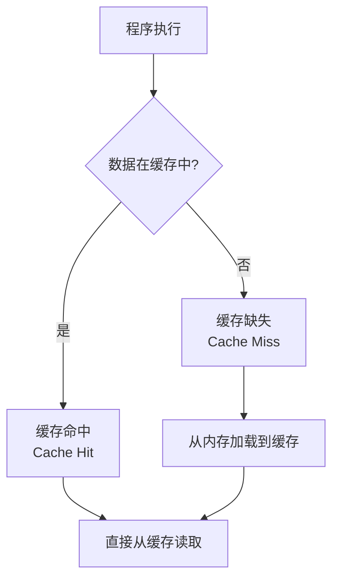
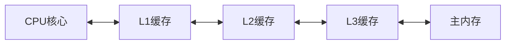
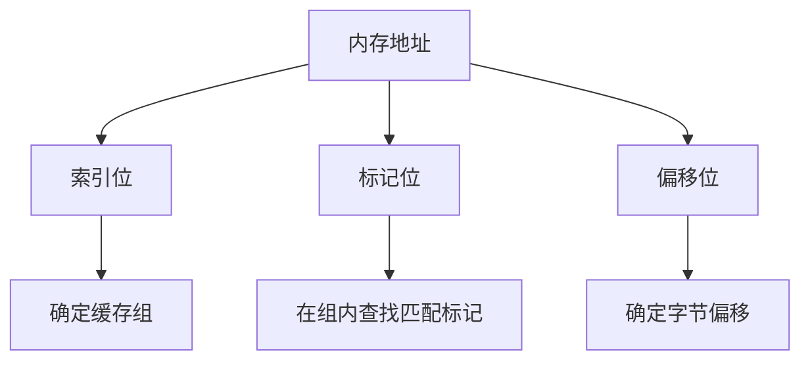
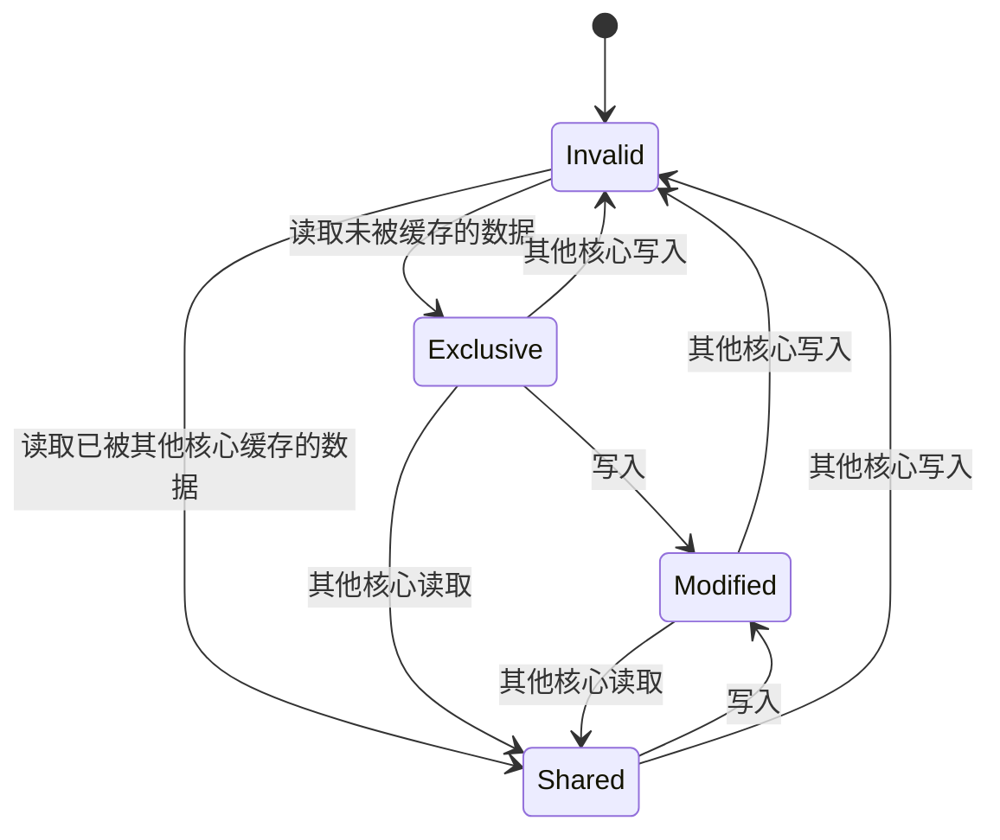

---
tags:
  - 系统编程
  - CPU
  - 性能优化
  - 缓存
---

# CPU缓存层次结构详解

## 缓存基本概念

### 缓存的定义与作用

CPU缓存是位于CPU与主内存之间的小型高速存储器，用于临时存储CPU可能需要的数据，以减少CPU访问主内存的次数，从而提高系统性能。由于CPU处理速度远高于内存访问速度（通常相差10-100倍），缓存的存在显著减轻了这种"内存墙"(Memory Wall)问题。

### 局部性原理

CPU缓存的有效性基于两种局部性原理：

1. **时间局部性**：如果一个数据被访问，那么在不久的将来它很可能再次被访问
2. **空间局部性**：如果一个数据被访问，那么其附近的数据很可能也会被访问



## 现代CPU缓存层次结构

### 多级缓存架构

现代CPU通常采用三级缓存结构：



| 缓存级别 | 典型容量 | 访问延迟 | 特点 |
|---------|---------|---------|------|
| L1缓存  | 32-64KB | 1-3个时钟周期 | 分为指令缓存(L1i)和数据缓存(L1d) |
| L2缓存  | 256KB-1MB | 10-20个时钟周期 | 通常是统一缓存，每个核心独立 |
| L3缓存  | 4-50MB | 40-60个时钟周期 | 所有核心共享 |
| 主内存   | GB级别 | 200-300个时钟周期 | 容量大但速度慢 |

### 缓存组织方式

#### 缓存行(Cache Line)

缓存的基本操作单位是缓存行，而非单个字节。现代处理器的缓存行大小通常为64字节。

```cpp
// 缓存行对齐示例
struct alignas(64) CacheAligned {
    int data;
    // 填充至64字节以避免伪共享
    char padding[60];
};
```

#### 映射方式

1. **直接映射缓存**：每个内存地址只能映射到缓存中的一个特定位置

```
内存地址 % 缓存行数 = 缓存索引
```

2. **全相联缓存**：内存块可以加载到任意缓存行

3. **组相联缓存**：折中方案，N路组相联表示每个内存块可映射到N个缓存行



## 缓存一致性

### MESI协议

多核处理器中，各核心的缓存需要保持一致性，常用的是MESI协议：

- **Modified(修改)**：该缓存行已被修改，与内存不一致，其他核心无此数据
- **Exclusive(独占)**：该缓存行未被修改，与内存一致，其他核心无此数据
- **Shared(共享)**：该缓存行未被修改，与内存一致，其他核心可能有此数据
- **Invalid(无效)**：该缓存行无效



### 缓存一致性开销

缓存一致性维护会导致性能开销，主要表现为：

1. **总线嗅探流量**：核心需要监听总线上的一致性消息
2. **缓存行乒乓**：多核心频繁修改同一缓存行导致缓存失效
3. **伪共享**：不同核心访问同一缓存行中的不同数据

## C++中的缓存优化

### 数据结构布局优化

```cpp
// 优化前：结构体数组
struct Particle {
    float x, y, z;    // 位置
    float vx, vy, vz; // 速度
    float mass;       // 质量
    int type;         // 类型
};
Particle particles[1000];

// 优化后：数组的结构体（SoA）
struct ParticleSystem {
    float x[1000], y[1000], z[1000];    // 位置
    float vx[1000], vy[1000], vz[1000]; // 速度
    float mass[1000];                   // 质量
    int type[1000];                     // 类型
};
```

### 预取指令

```cpp
// 手动预取示例
for (int i = 0; i < N; i++) {
    // 预取未来将要使用的数据
    __builtin_prefetch(&data[i + 16], 0, 3);
    process(data[i]);
}
```

### 避免伪共享

```cpp
// 多线程环境中避免伪共享
struct Counter {
    std::atomic<int> value;
    // 填充至缓存行大小
    char padding[64 - sizeof(std::atomic<int>)];
};
Counter counters[NUM_THREADS];
```

## Rust中的缓存优化

### 数据对齐

```rust
// 缓存行对齐
#[repr(align(64))]
struct CacheAligned {
    data: i32,
    // 填充避免伪共享
    padding: [u8; 60],
}
```

### 内存布局优化

```rust
// 优化前：结构体向量
struct Particle {
    position: [f32; 3],
    velocity: [f32; 3],
    mass: f32,
    particle_type: i32,
}
let particles: Vec<Particle> = vec![Particle::default(); 1000];

// 优化后：平行向量
struct ParticleSystem {
    positions: Vec<[f32; 3]>,
    velocities: Vec<[f32; 3]>,
    masses: Vec<f32>,
    types: Vec<i32>,
}
```

### 预取提示

```rust
// 使用core::intrinsics::prefetch_read_data
unsafe {
    for i in 0..data.len() {
        // 预取未来数据
        if i + 16 < data.len() {
            core::intrinsics::prefetch_read_data(data.get_unchecked(i + 16), 3);
        }
        process(&data[i]);
    }
}
```

## 性能测试与分析

### 缓存命中率测量

使用性能计数器测量缓存命中率：

```bash
# 使用perf测量L1缓存命中/缺失
perf stat -e L1-dcache-loads,L1-dcache-load-misses ./program

# 使用PCM工具监控缓存
pcm.x -c core -- ./program
```

### 缓存行填充效果测试

```cpp
// 测试伪共享影响
#include <benchmark/benchmark.h>

struct NoPadding {
    std::atomic<int> counter;
};

struct WithPadding {
    std::atomic<int> counter;
    char padding[64 - sizeof(std::atomic<int>)];
};

// 多线程更新无填充计数器
static void BM_NoPadding(benchmark::State& state) {
    // 测试代码
}

// 多线程更新有填充计数器
static void BM_WithPadding(benchmark::State& state) {
    // 测试代码
}
```

## 实际应用案例

### 矩阵乘法优化

```cpp
// 缓存不友好版本
void matrix_multiply_naive(float* A, float* B, float* C, int n) {
    for (int i = 0; i < n; i++) {
        for (int j = 0; j < n; j++) {
            float sum = 0;
            for (int k = 0; k < n; k++) {
                sum += A[i * n + k] * B[k * n + j];
            }
            C[i * n + j] = sum;
        }
    }
}

// 缓存优化版本（分块）
void matrix_multiply_blocked(float* A, float* B, float* C, int n) {
    const int block_size = 32; // 根据缓存大小调整
    for (int i = 0; i < n; i += block_size) {
        for (int j = 0; j < n; j += block_size) {
            for (int k = 0; k < n; k += block_size) {
                // 处理块内元素
                for (int ii = i; ii < std::min(i + block_size, n); ii++) {
                    for (int jj = j; jj < std::min(j + block_size, n); jj++) {
                        float sum = C[ii * n + jj];
                        for (int kk = k; kk < std::min(k + block_size, n); kk++) {
                            sum += A[ii * n + kk] * B[kk * n + jj];
                        }
                        C[ii * n + jj] = sum;
                    }
                }
            }
        }
    }
}
```

### 链表遍历优化

```cpp
// 传统链表（缓存不友好）
struct Node {
    int data;
    Node* next;
};

// 缓存友好链表
struct CacheNode {
    static const int NODES_PER_BLOCK = 16;
    int data[NODES_PER_BLOCK];
    CacheNode* next;
};
```

## 总结与最佳实践

### 缓存优化核心原则

1. **提高空间局部性**：相关数据放在一起
2. **提高时间局部性**：重复使用已缓存的数据
3. **减少工作集大小**：使数据适合缓存容量
4. **避免伪共享**：多线程环境中防止缓存行争用
5. **合理预取**：提前加载即将使用的数据

### 常见陷阱与注意事项

1. **过度优化**：缓存优化可能增加代码复杂度，应权衡利弊
2. **硬件依赖**：不同CPU架构缓存特性不同，优化策略可能需要调整
3. **编译器优化**：现代编译器已包含许多缓存优化，避免与之冲突

## 参考资源

- [What Every Programmer Should Know About Memory](https://people.freebsd.org/~lstewart/articles/cpumemory.pdf)
- [Intel® 64 and IA-32 Architectures Optimization Reference Manual](https://www.intel.com/content/www/us/en/developer/articles/technical/intel-sdm.html)
- [Rust Performance Book](https://nnethercote.github.io/perf-book/)