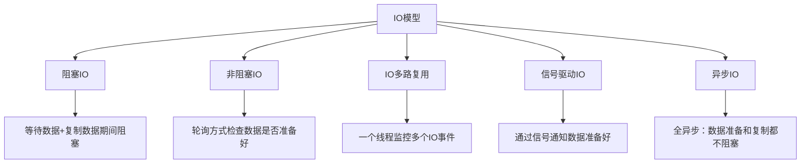
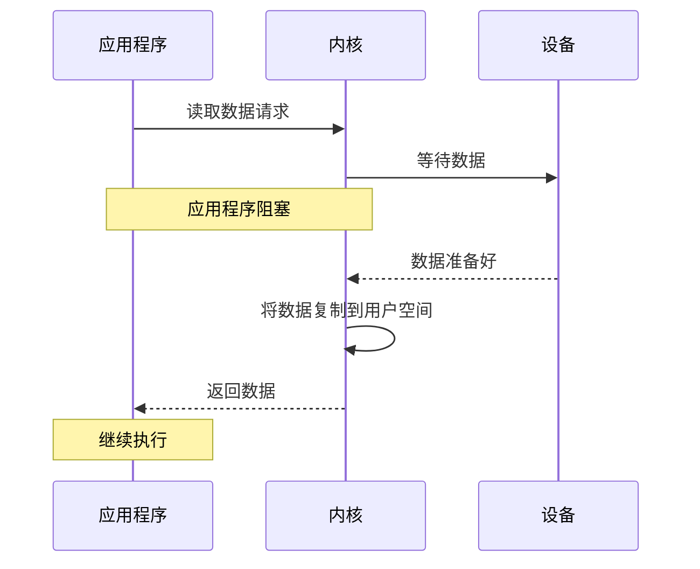
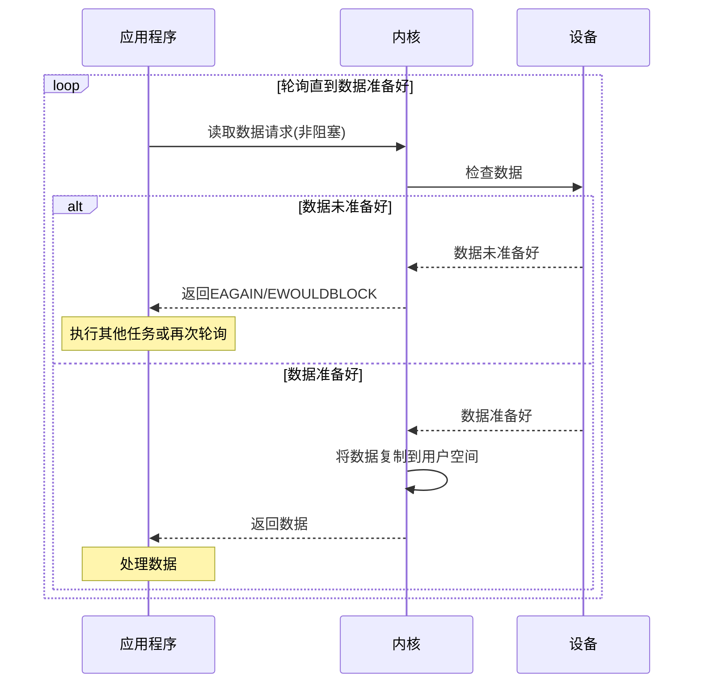
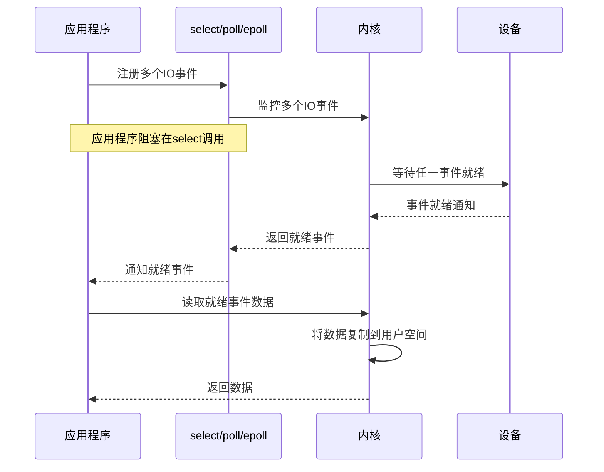
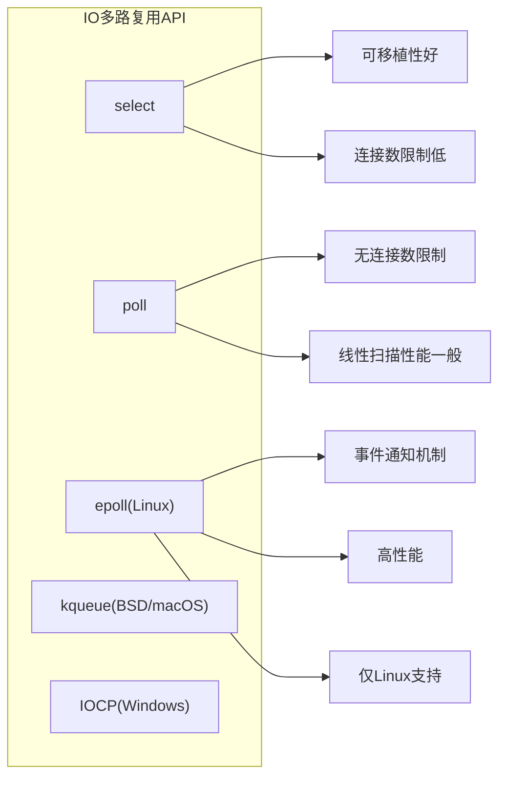
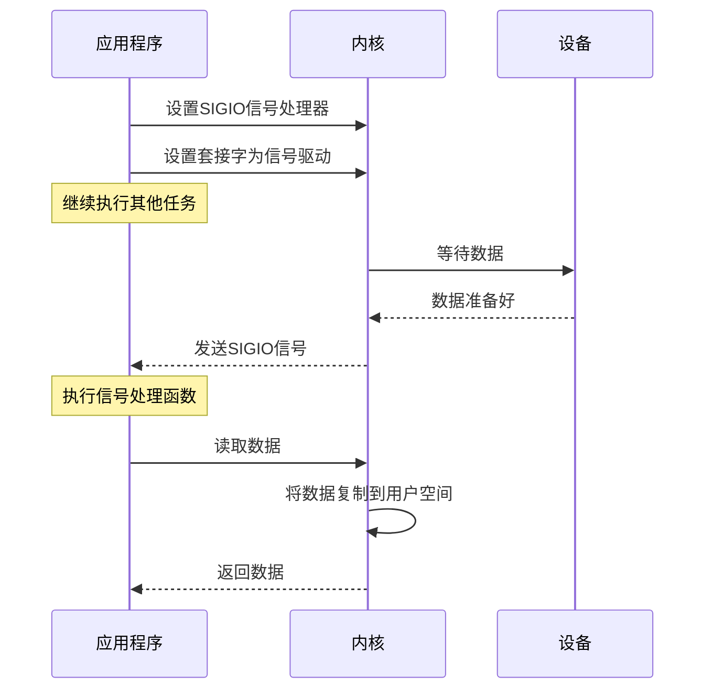
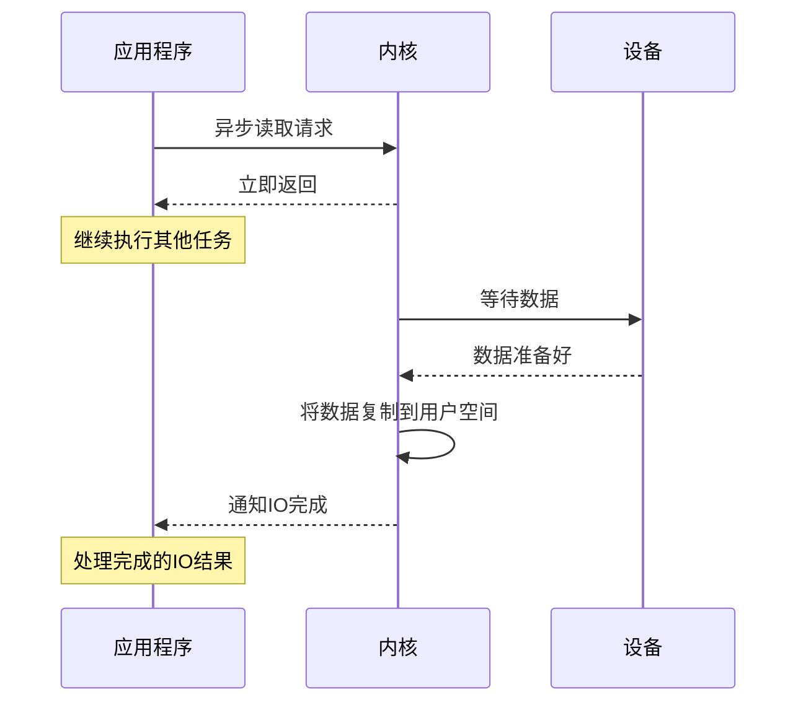
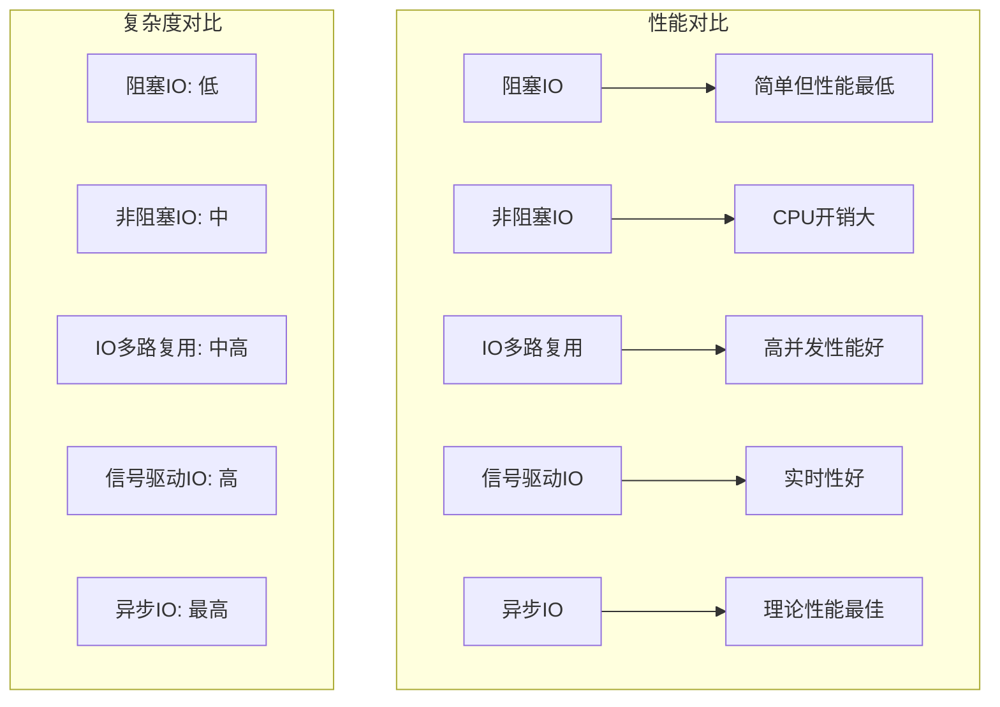
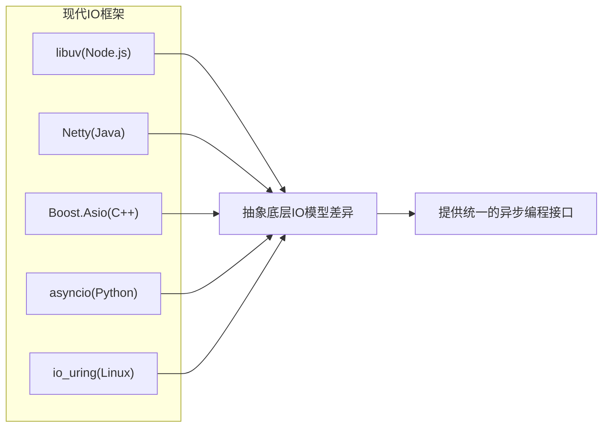

# 五种IO模型对比

## IO模型基本概念

IO模型是操作系统提供的不同数据输入输出处理方式，影响着应用程序如何与外部设备（如磁盘、网络等）交互。不同的IO模型在性能、复杂度和适用场景上各有特点。

### IO操作的两个阶段

1. **等待数据准备好**：例如，等待数据从网络到达
2. **将数据从内核复制到用户空间**：数据准备好后，将其从内核缓冲区复制到应用程序缓冲区

## 五种IO模型概览

## 阻塞IO模型

阻塞IO是最简单的IO模型，应用程序发起IO操作后会被阻塞，直到数据准备好并复制到用户空间。

### 阻塞IO特点

1. **简单直观**：编程模型简单，易于理解
2. **资源利用率低**：IO等待期间线程被阻塞，无法执行其他任务
3. **适用场景**：连接数少、IO等待时间短的应用

## 非阻塞IO模型

非阻塞IO允许应用程序发起IO请求后立即返回，应用程序需要通过轮询方式检查数据是否准备好。

### 非阻塞IO特点

1. **不会阻塞应用程序**：可以同时处理其他任务
2. **CPU使用率高**：频繁轮询会消耗大量CPU资源
3. **适用场景**：需要同时处理多个连接但不想使用多线程的应用

## IO多路复用模型

IO多路复用允许应用程序通过一个线程监控多个IO事件，只有当IO事件就绪时才进行处理。

### IO多路复用特点

1. **一个线程处理多个IO**：避免了为每个连接创建线程的开销
2. **较高的伸缩性**：可以处理大量连接
3. **实现复杂度增加**：相比阻塞IO，编程模型更复杂
4. **适用场景**：高并发服务器，如网络服务器、代理服务器

### 常见的IO多路复用API

## 信号驱动IO模型

信号驱动IO使用信号机制，当数据准备好时，内核通过信号通知应用程序。

### 信号驱动IO特点

1. **异步通知**：数据准备好时才通知应用程序
2. **无需轮询**：避免了非阻塞IO的轮询开销
3. **信号处理复杂**：信号处理机制较为复杂
4. **适用场景**：对实时性要求较高的应用

## 异步IO模型

异步IO是最完整的异步模型，应用程序发起IO请求后立即返回，内核负责完成数据准备和复制，然后通知应用程序IO操作完成。

### 异步IO特点

1. **完全非阻塞**：数据准备和复制阶段都不阻塞应用程序
2. **编程复杂度高**：需要处理回调或通知机制
3. **系统开销大**：内核需要管理异步操作和通知
4. **适用场景**：高性能服务器、实时应用

## 五种IO模型性能对比

## 实际应用选择

### 应用场景匹配

1. **阻塞IO**：简单应用、学习示例
2. **非阻塞IO**：简单的并发应用
3. **IO多路复用**：高性能网络服务器（如Nginx、Redis）
4. **信号驱动IO**：实时数据处理系统
5. **异步IO**：高性能数据库、分布式系统

### 现代IO框架

## IO模型选择建议

1. **考虑应用需求**：并发连接数、响应时间要求
2. **平台兼容性**：不同操作系统支持的IO模型有差异
3. **开发复杂度**：权衡性能与开发维护成本
4. **使用成熟框架**：避免直接处理底层IO模型的复杂性