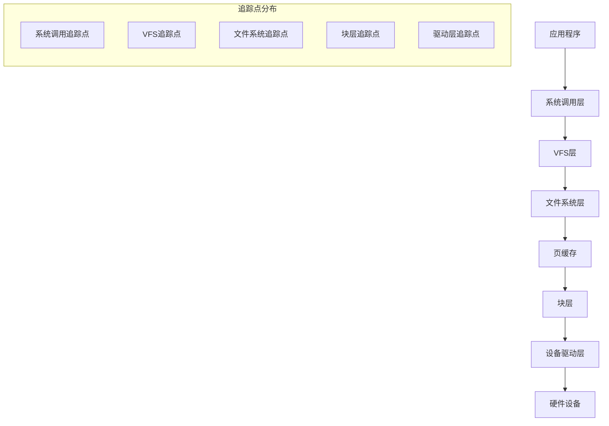
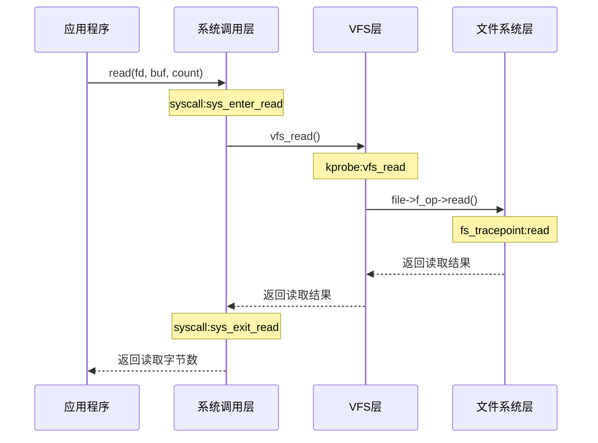
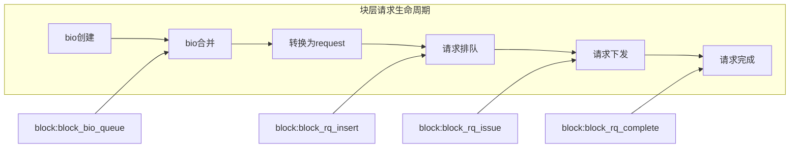

---
tags:
  - 系统编程
  - IO
  - 性能分析
---

# Linux IO流程追踪详解

## IO栈架构概览

Linux IO栈是一个复杂的多层次系统，从应用层到设备层，每一层都有其特定的功能和追踪点。理解这些层次及其追踪机制对于性能分析和问题排查至关重要。



## 系统调用层追踪

系统调用是应用程序与内核交互的接口，是IO操作的入口点。

### 关键追踪点

- **syscall:sys_enter_read/write**: 读写系统调用入口
- **syscall:sys_exit_read/write**: 读写系统调用返回
- **syscall:sys_enter_open/close**: 文件打开/关闭系统调用
- **syscall:sys_enter_fsync**: 文件同步系统调用

### 追踪方法

```bash
# 使用ftrace追踪读写系统调用
sudo trace-cmd record -e syscalls:sys_enter_read -e syscalls:sys_exit_read -p <PID>

# 使用perf追踪文件操作系统调用
sudo perf record -e syscalls:sys_enter_open -e syscalls:sys_exit_open -p <PID>

# 使用eBPF/bpftrace追踪
sudo bpftrace -e 'tracepoint:syscalls:sys_enter_write { printf("%s %d\n", comm, args->count); }'
```

## VFS层追踪

VFS (虚拟文件系统) 提供了统一的文件操作接口，是连接系统调用和具体文件系统的桥梁。

### 关键追踪点

- **vfs_read/vfs_write**: VFS读写函数
- **vfs_open/vfs_create**: 文件打开/创建
- **vfs_unlink**: 文件删除
- **vfs_fsync**: 文件同步

### 追踪方法

```bash
# 使用kprobe追踪VFS读写函数
sudo trace-cmd record -p function_graph -g vfs_read -g vfs_write

# 使用eBPF追踪VFS操作
sudo bpftrace -e 'kprobe:vfs_read { printf("vfs_read: %s\n", str(arg1)); }'
```



## 文件系统层追踪

文件系统层负责具体文件系统的实现，如ext4、xfs等。

### 关键追踪点

- **ext4_file_read_iter/ext4_file_write_iter**: ext4文件读写
- **ext4_da_write_begin/ext4_da_write_end**: ext4延迟分配写入
- **ext4_sync_file**: ext4文件同步
- **ext4_getattr/ext4_setattr**: 获取/设置文件属性

### 追踪方法

```bash
# 追踪ext4文件系统操作
sudo trace-cmd record -e ext4:ext4_da_write_begin -e ext4:ext4_da_write_end

# 使用eBPF追踪ext4文件系统
sudo bpftrace -e 'kprobe:ext4_file_write_iter { printf("ext4 write: %s\n", comm); }'
```

## 页缓存层追踪

页缓存是Linux内核中的重要缓存机制，用于加速文件IO操作。

### 关键追踪点

- **add_to_page_cache_lru**: 页面添加到缓存
- **mark_page_accessed**: 页面被访问
- **writepage**: 页面写回
- **readpage**: 页面读取

### 追踪方法

```bash
# 追踪页缓存操作
sudo trace-cmd record -p function -l '*page*'

# 使用eBPF追踪页缓存
sudo bpftrace -e 'kprobe:add_to_page_cache_lru { printf("add to page cache: %s\n", comm); }'
```

## 块层追踪

块层是文件系统和设备驱动之间的接口，负责IO调度和块设备操作。

### 关键追踪点

- **block:block_rq_issue**: 请求发送到设备
- **block:block_rq_complete**: 请求完成
- **block:block_rq_insert**: 请求插入队列
- **block:block_bio_queue**: bio请求入队

### 追踪方法

```bash
# 追踪块层请求
sudo trace-cmd record -e block:block_rq_issue -e block:block_rq_complete

# 使用blktrace工具
sudo blktrace -d /dev/sda -o - | blkparse -i -

# 使用eBPF追踪块层
sudo bpftrace -e 'tracepoint:block:block_rq_issue { printf("block request: %d bytes\n", args->bytes); }'
```



## 设备驱动层追踪

设备驱动层是内核与硬件设备交互的接口，负责具体的IO操作执行。

### 关键追踪点

- **scsi:scsi_dispatch_cmd_start**: SCSI命令开始
- **scsi:scsi_dispatch_cmd_done**: SCSI命令完成
- **nvme:nvme_setup_cmd**: NVMe命令设置
- **nvme:nvme_complete_rq**: NVMe请求完成

### 追踪方法

```bash
# 追踪SCSI命令
sudo trace-cmd record -e scsi:scsi_dispatch_cmd_start -e scsi:scsi_dispatch_cmd_done

# 追踪NVMe命令
sudo trace-cmd record -e nvme:nvme_setup_cmd -e nvme:nvme_complete_rq

# 使用eBPF追踪设备驱动
sudo bpftrace -e 'kprobe:nvme_setup_cmd { printf("nvme cmd: %s\n", comm); }'
```

## 端到端IO延迟分析

通过组合不同层次的追踪点，可以分析IO操作的端到端延迟。

```mermaid
gantt
    title IO操作延迟分解
    dateFormat  s
    axisFormat %S
    
    section 系统调用层
    系统调用处理      :a1, 0, 0.001s
    
    section VFS层
    VFS处理           :a2, after a1, 0.002s
    
    section 文件系统层
    文件系统处理      :a3, after a2, 0.005s
    
    section 页缓存层
    页缓存处理        :a4, after a3, 0.003s
    
    section 块层
    块层处理          :a5, after a4, 0.01s
    
    section 设备驱动层
    驱动处理          :a6, after a5, 0.02s
    
    section 设备层
    设备IO执行        :a7, after a6, 0.1s
```



### 综合追踪方法

```bash
# 使用ftrace追踪完整IO路径
sudo trace-cmd record -p function_graph -g 'vfs_*' -g 'ext4_*' -g 'blk_*'

# 使用eBPF/bcc工具biosnoop追踪块IO延迟
sudo biosnoop

# 使用perf记录IO相关事件
sudo perf record -e block:* -e ext4:* -e syscalls:sys_enter_read -e syscalls:sys_exit_read -g -- sleep 10
```

## 常见IO性能问题及追踪方法

### 1. IO延迟高

```bash
# 使用iostat监控设备级IO统计
isotat -x 1

# 使用biolatency分析块IO延迟分布
sudo biolatency

# 追踪块层请求完成时间
sudo bpftrace -e 'tracepoint:block:block_rq_complete { @usecs = hist(nsecs - args->io_start_ts); }'
```

### 2. 写入抖动

```bash
# 追踪pdflush/flush/jbd2进程活动
sudo trace-cmd record -p function -l '*writeback*'

# 监控ext4日志提交
sudo trace-cmd record -e ext4:ext4_journal_start
```

### 3. 缓存命中率低

```bash
# 分析页缓存访问
sudo bpftrace -e 'kprobe:mark_page_accessed { @[comm] = count(); }'

# 监控页面回收活动
sudo trace-cmd record -e vmscan:mm_vmscan_direct_reclaim_begin -e vmscan:mm_vmscan_direct_reclaim_end
```

## 总结

Linux IO栈的追踪需要综合考虑各个层次的追踪点，根据具体问题选择合适的追踪方法。通过系统性地分析IO路径上的各个环节，可以有效定位性能瓶颈和异常行为。

在实际问题排查中，建议采用自顶向下的方法，先从系统调用和块层等高层次入手，确定问题区域后再深入到具体的文件系统或设备驱动层进行细粒度分析。