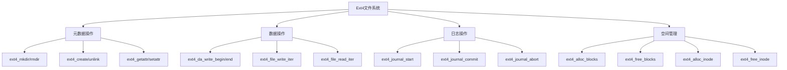
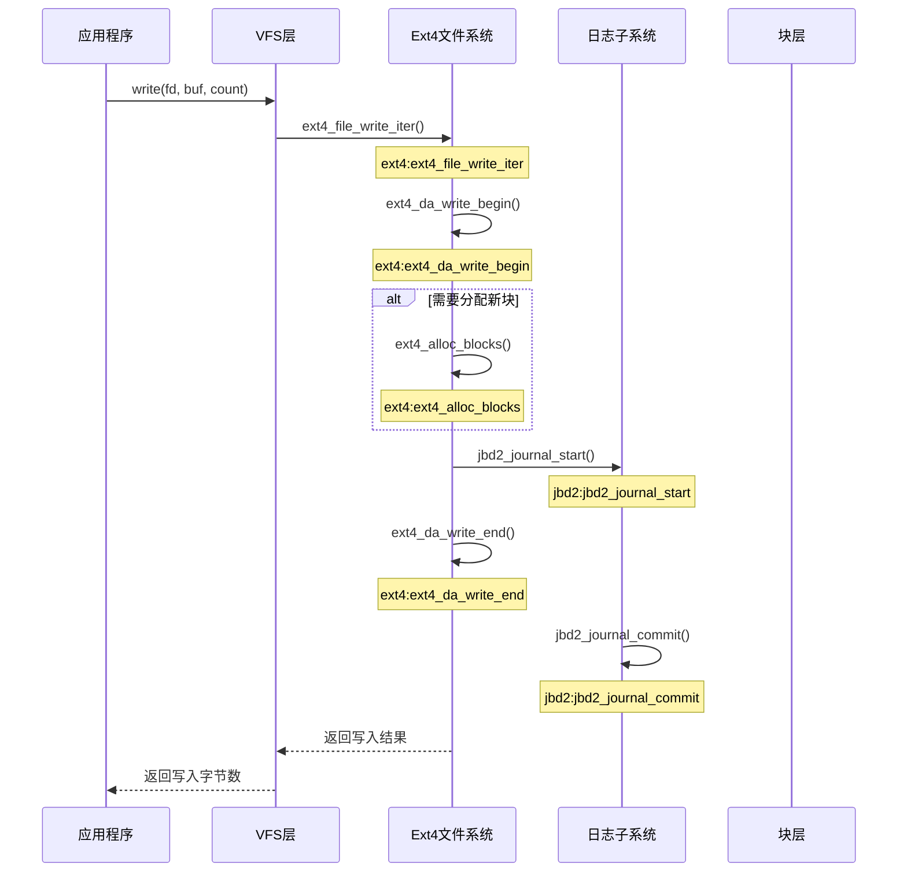

---
tags:
  - 系统编程
  - IO
  - 文件系统
  - 性能分析
---

# Ext4文件系统Tracepoints详解

## Ext4 Tracepoints概述

Ext4文件系统在Linux内核中提供了丰富的tracepoint，这些静态追踪点可以帮助开发者和系统管理员深入了解文件系统的行为、性能特征和潜在问题。本文将详细介绍这些tracepoint及其在性能监控和问题排查中的应用。



## 文件操作相关Tracepoints

### 文件创建与删除

```bash
# 跟踪文件创建
sudo trace-cmd record -e ext4:ext4_create

# 跟踪文件删除
sudo trace-cmd record -e ext4:ext4_unlink
```

#### 关键Tracepoints

- **ext4_create**: 文件创建操作
- **ext4_unlink**: 文件删除操作
- **ext4_rename**: 文件重命名操作
- **ext4_mkdir**: 目录创建操作
- **ext4_rmdir**: 目录删除操作

### 文件读写操作

```bash
# 跟踪文件读取
sudo trace-cmd record -e ext4:ext4_file_read_iter

# 跟踪文件写入
sudo trace-cmd record -e ext4:ext4_file_write_iter
```

#### 关键Tracepoints

- **ext4_file_read_iter**: 文件读取操作
- **ext4_file_write_iter**: 文件写入操作
- **ext4_da_write_begin**: 延迟分配写入开始
- **ext4_da_write_end**: 延迟分配写入结束
- **ext4_sync_file_enter**: 文件同步开始
- **ext4_sync_file_exit**: 文件同步结束

## 元数据操作Tracepoints

### inode操作

```bash
# 跟踪inode分配
sudo trace-cmd record -e ext4:ext4_alloc_inode

# 跟踪inode释放
sudo trace-cmd record -e ext4:ext4_free_inode
```

#### 关键Tracepoints

- **ext4_alloc_inode**: inode分配
- **ext4_free_inode**: inode释放
- **ext4_getattr**: 获取文件属性
- **ext4_setattr**: 设置文件属性
- **ext4_mark_inode_dirty**: 标记inode为脏

### 目录操作

```bash
# 跟踪目录项查找
sudo trace-cmd record -e ext4:ext4_lookup
```

#### 关键Tracepoints

- **ext4_lookup**: 目录项查找
- **ext4_readdir**: 读取目录内容
- **ext4_htree_readdir**: 哈希树目录读取

## 块管理Tracepoints

### 块分配与释放

```bash
# 跟踪块分配
sudo trace-cmd record -e ext4:ext4_alloc_blocks

# 跟踪块释放
sudo trace-cmd record -e ext4:ext4_free_blocks
```

#### 关键Tracepoints

- **ext4_alloc_blocks**: 块分配
- **ext4_free_blocks**: 块释放
- **ext4_request_blocks**: 请求分配块
- **ext4_allocate_blocks**: 分配块
- **ext4_mb_new_group_pa**: 创建新的预分配



## 日志操作Tracepoints

### 日志事务

```bash
# 跟踪日志开始
sudo trace-cmd record -e ext4:ext4_journal_start

# 跟踪日志提交
sudo trace-cmd record -e jbd2:jbd2_start_commit -e jbd2:jbd2_end_commit
```

#### 关键Tracepoints

- **ext4_journal_start**: 开始日志事务
- **jbd2_start_commit**: 开始提交日志事务
- **jbd2_end_commit**: 结束提交日志事务
- **jbd2_submit_inode_data**: 提交inode数据
- **jbd2_run_stats**: 日志统计信息

## 性能监控与问题排查

### 常见性能问题及对应Tracepoints

#### 1. 写入延迟高

```bash
# 监控写入延迟
sudo bpftrace -e 'tracepoint:ext4:ext4_da_write_begin { @start[args->ino] = nsecs; }
tracepoint:ext4:ext4_da_write_end { @latency_ns = hist(nsecs - @start[args->ino]); delete(@start[args->ino]); }'
```

#### 2. 日志提交频繁

```bash
# 监控日志提交频率
sudo bpftrace -e 'tracepoint:jbd2:jbd2_start_commit { printf("%s %s\n", comm, args->dev_name); @commits = count(); }'
```

#### 3. 元数据操作密集

```bash
# 监控inode分配/释放
sudo bpftrace -e 'tracepoint:ext4:ext4_alloc_inode { @alloc[comm] = count(); }
tracepoint:ext4:ext4_free_inode { @free[comm] = count(); }'
```

### 综合性能分析方法

```bash
# 使用ext4slower BCC工具监控慢操作
sudo ext4slower 10

# 使用fileslower BCC工具监控慢文件操作
sudo fileslower

# 使用biolatency监控块IO延迟
sudo biolatency -F
```

## Ext4 Tracepoints与其他工具结合

### 与perf结合

```bash
# 记录ext4相关事件
sudo perf record -e ext4:* -a -g -- sleep 10

# 分析结果
sudo perf report
```

### 与eBPF/BCC结合

```bash
# 使用BCC工具ext4dist分析ext4操作延迟分布
sudo ext4dist 10

# 自定义eBPF程序监控ext4操作
sudo bpftrace -e 'tracepoint:ext4:ext4_file_write_iter { @bytes = hist(args->count); }'
```

## 实际案例分析

### 案例1: 文件系统写入性能抖动

```mermaid
gantt
    title Ext4写入延迟分解
    dateFormat  s
    axisFormat %S
    
    section 应用层
    系统调用处理      :a1, 0, 0.001s
    
    section Ext4层
    ext4_file_write_iter :a2, after a1, 0.002s
    ext4_da_write_begin  :a3, after a2, 0.003s
    ext4_alloc_blocks    :a4, after a3, 0.01s
    ext4_da_write_end    :a5, after a4, 0.002s
    
    section 日志层
    jbd2_journal_start   :a6, after a3, 0.005s
    jbd2_journal_commit  :a7, after a6, 0.05s
```



分析步骤：

1. 使用ext4slower确认写入延迟
2. 跟踪ext4_da_write_begin/end计算写入时间
3. 监控jbd2_journal_commit事件频率和延迟
4. 分析块分配延迟

### 案例2: 元数据密集型工作负载

```bash
# 监控文件创建/删除操作
sudo bpftrace -e 'tracepoint:ext4:ext4_create { @create[comm] = count(); }
tracepoint:ext4:ext4_unlink { @unlink[comm] = count(); }'
```

## 总结

Ext4文件系统的tracepoints提供了深入了解文件系统内部工作机制的窗口，通过合理利用这些追踪点，可以有效地监控文件系统性能、定位性能瓶颈和解决各种文件系统相关问题。在实际应用中，应根据具体场景选择合适的tracepoints组合，并结合其他性能分析工具进行综合分析。