# 文件系统实现原理

## 文件系统基本概念

文件系统是操作系统中负责管理持久存储设备上数据的子系统，它提供了文件的组织、存储、检索和访问控制机制。

### 文件系统的主要功能

1. **文件管理**：创建、删除、读写和查找文件
2. **空间管理**：分配和回收存储空间
3. **元数据管理**：维护文件属性、权限和目录结构
4. **一致性保证**：确保系统崩溃后数据完整性

## 文件系统架构

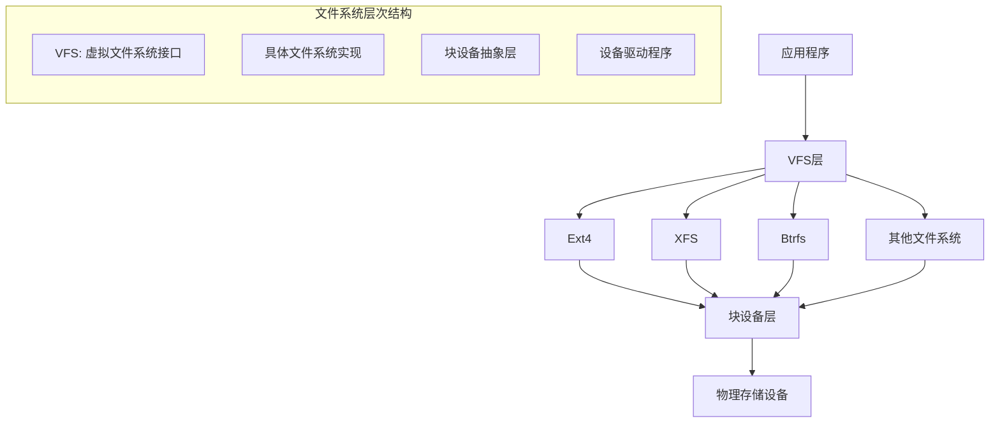

### 虚拟文件系统（VFS）

VFS提供了统一的接口，使应用程序可以通过相同的系统调用访问不同类型的文件系统。

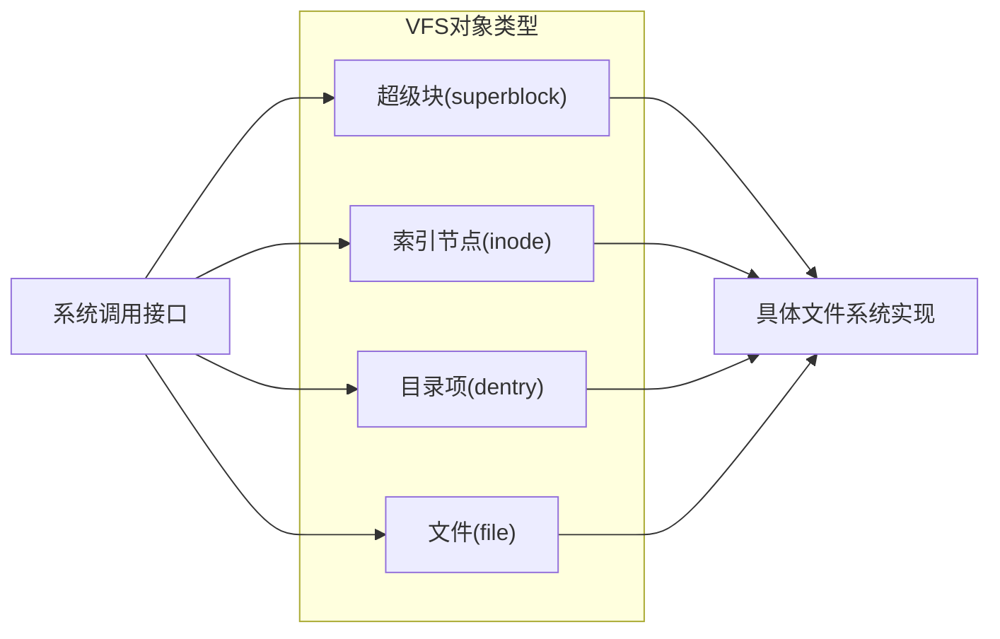

## inode与数据块

### inode（索引节点）

inode是文件系统中的核心数据结构，存储了文件的元数据信息，但不包含文件名。

### 数据块寻址

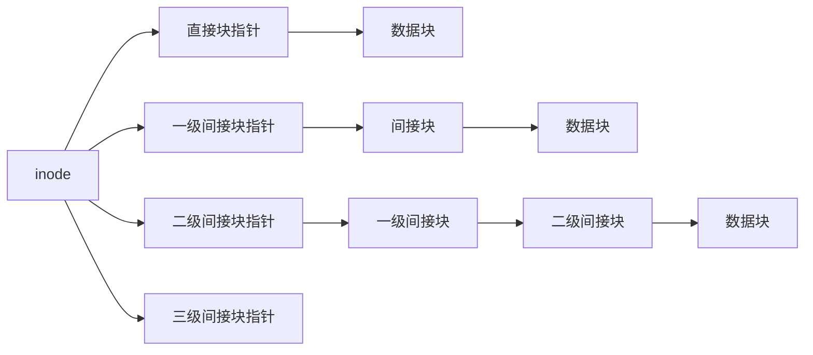

### 目录结构

目录本质上是一种特殊的文件，其内容是文件名与inode号的映射表。

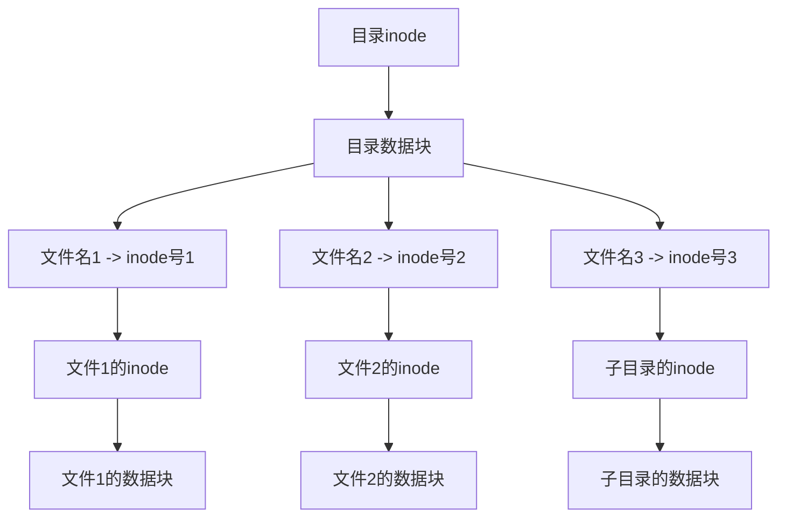

## 文件系统类型

### Ext4文件系统

Ext4是Linux中广泛使用的日志文件系统，是Ext2/Ext3的继承者。

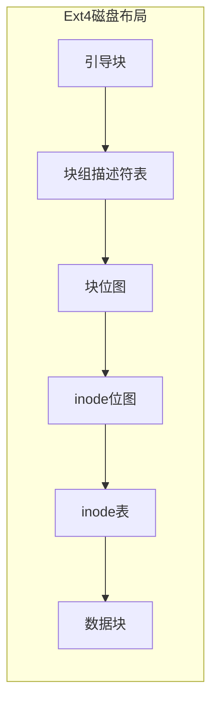

#### Ext4特性

1. **块组**：将磁盘分为多个块组，每个块组包含自己的inode表和数据块
2. **区段分配**：预分配连续的磁盘空间，减少碎片
3. **延迟分配**：推迟块分配决策，优化数据布局
4. **日志校验和**：提高日志可靠性

### XFS文件系统

XFS是一个高性能的64位日志文件系统，特别适合大文件和高吞吐量场景。

## 日志文件系统

日志文件系统通过记录文件系统操作的日志来保证系统崩溃后的一致性。

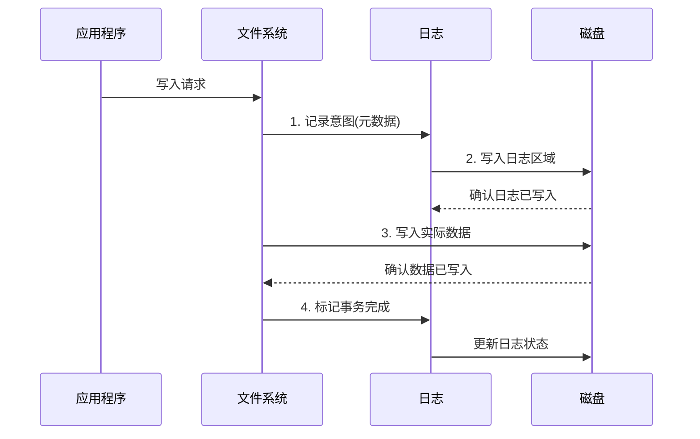

### 日志模式

1. **数据日志模式**：记录元数据和文件数据的变化
2. **元数据日志模式**：只记录元数据的变化，数据直接写入
3. **有序模式**：先写数据，再记录元数据日志

## 文件系统缓存

### 页缓存（Page Cache）

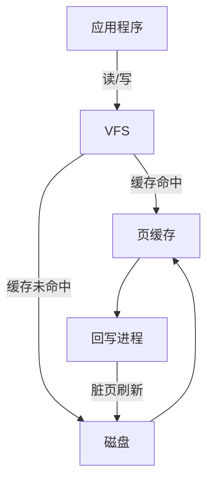

### 缓存策略

1. **预读**：预先读取可能需要的数据到缓存
2. **回写**：延迟写入，批量刷新脏页
3. **直接I/O**：绕过缓存，直接访问设备

## 文件系统一致性

### 一致性检查

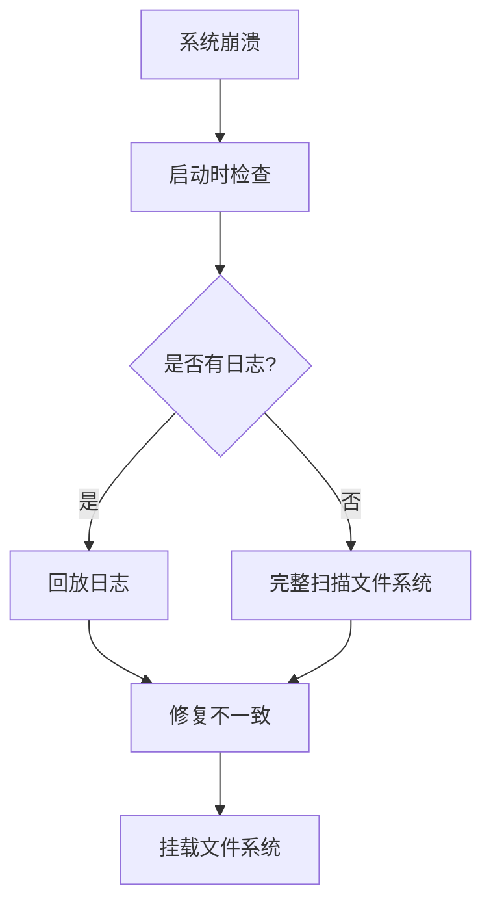

### 一致性技术

1. **日志**：记录操作意图，系统崩溃后回放
2. **写时复制（CoW）**：不覆盖原数据，而是写入新位置
3. **软更新**：控制元数据更新顺序，确保一致性
4. **检查点**：定期创建一致性快照

## 现代文件系统特性

### 写时复制文件系统（如Btrfs、ZFS）

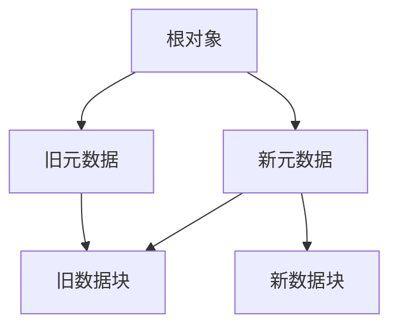

### 快照与克隆

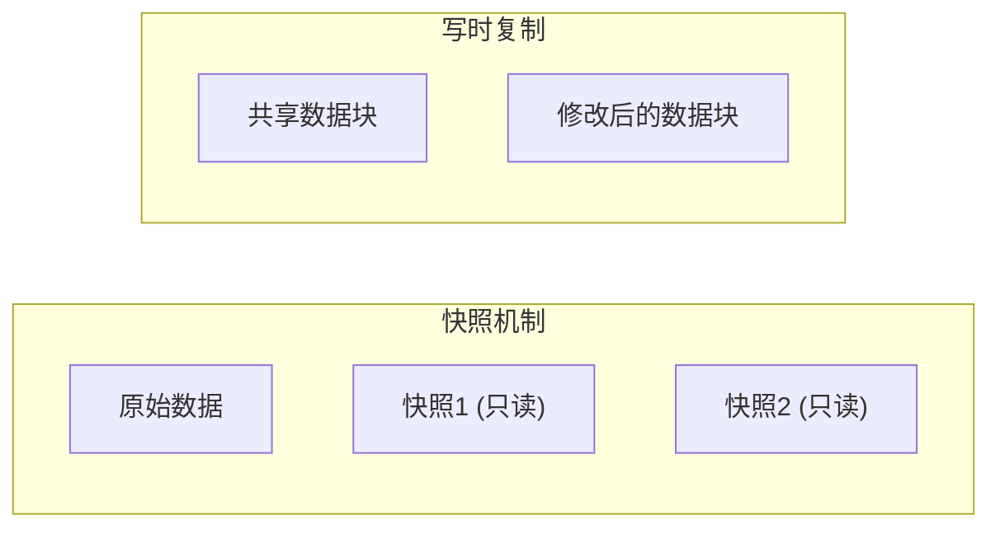

### 数据去重与压缩

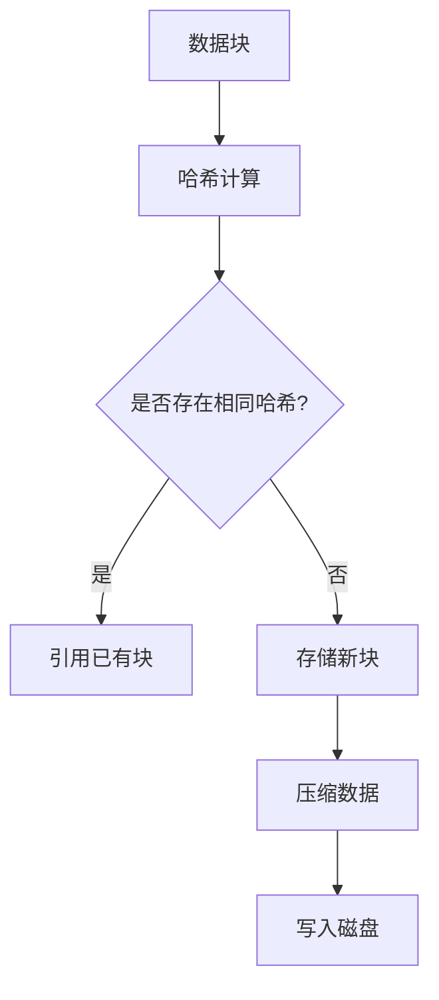

## 性能优化技术

1. **异步I/O**：不阻塞应用程序
2. **I/O调度**：合并和重排I/O请求
3. **预读和回写**：优化缓存使用
4. **延迟分配**：推迟块分配决策
5. **区段分配**：减少碎片

## 文件系统调试与修复

### 常见工具

1. **fsck**：文件系统一致性检查工具
2. **debugfs**：文件系统调试工具
3. **dumpe2fs**：显示文件系统信息
4. **blktrace**：块I/O跟踪工具