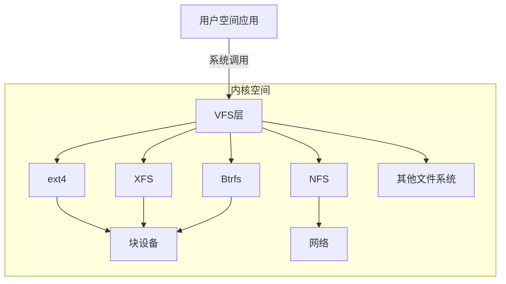
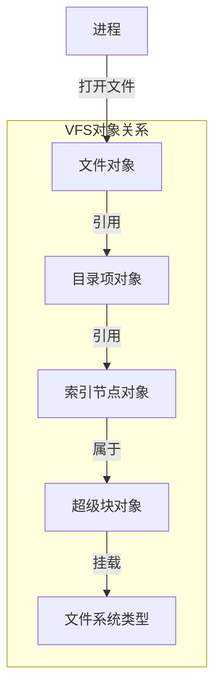

# 虚拟文件系统（VFS）层

## 概述

虚拟文件系统（Virtual File System，简称VFS）是Linux内核中的一个关键子系统，它提供了一个统一的接口层，使得用户空间应用程序可以通过相同的系统调用访问不同类型的文件系统。本文深入分析VFS的设计理念、核心数据结构和接口实现。

## VFS 架构



## VFS 设计理念

VFS的核心设计理念是抽象和统一：

1. **抽象文件系统操作**：将所有文件系统的共同操作抽象为统一接口
2. **面向对象设计**：使用对象和操作方法模拟面向对象编程范式
3. **分层架构**：清晰的层次结构，便于扩展和维护
4. **缓存机制**：提供统一的缓存框架，提高性能

## 核心数据结构

### 1. 超级块对象（Superblock Object）

超级块对象表示一个已挂载的文件系统实例：

```c
struct super_block {
    struct list_head    s_list;         /* 超级块链表 */
    dev_t               s_dev;          /* 设备标识符 */
    unsigned long       s_blocksize;    /* 块大小 */
    unsigned char       s_blocksize_bits;/* 块大小位数 */
    unsigned char       s_dirt;         /* 脏标志 */
    unsigned long long  s_maxbytes;     /* 最大文件大小 */
    struct file_system_type *s_type;    /* 文件系统类型 */
    const struct super_operations *s_op; /* 超级块操作 */
    struct dentry        *s_root;       /* 根目录项 */
    struct rw_semaphore  s_umount;      /* 卸载信号量 */
    struct mutex         s_lock;        /* 超级块锁 */
    int                  s_count;       /* 引用计数 */
    atomic_t             s_active;      /* 活跃引用计数 */
    /* ... 更多字段 ... */
};
```

超级块操作函数表定义了文件系统实现的方法：

```c
struct super_operations {
    struct inode *(*alloc_inode)(struct super_block *sb);
    void (*destroy_inode)(struct inode *);
    void (*dirty_inode)(struct inode *, int flags);
    int (*write_inode)(struct inode *, struct writeback_control *);
    int (*drop_inode)(struct inode *);
    void (*evict_inode)(struct inode *);
    void (*put_super)(struct super_block *);
    int (*sync_fs)(struct super_block *sb, int wait);
    int (*freeze_fs)(struct super_block *);
    int (*unfreeze_fs)(struct super_block *);
    int (*statfs)(struct dentry *, struct kstatfs *);
    int (*remount_fs)(struct super_block *, int *, char *);
    void (*umount_begin)(struct super_block *);
    /* ... 更多操作 ... */
};
```

### 2. 索引节点对象（Inode Object）

索引节点对象表示文件系统中的一个文件：

```c
struct inode {
    umode_t             i_mode;      /* 文件类型和访问权限 */
    unsigned short      i_opflags;   /* 操作标志 */
    kuid_t              i_uid;       /* 用户ID */
    kgid_t              i_gid;       /* 组ID */
    unsigned int        i_flags;     /* 文件系统标志 */
    struct hlist_node   i_hash;      /* 哈希链表 */
    struct list_head    i_list;      /* 索引节点链表 */
    struct list_head    i_sb_list;   /* 超级块链表 */
    struct list_head    i_dentry;    /* 目录项链表 */
    unsigned long       i_ino;       /* 索引节点号 */
    atomic_t            i_count;     /* 引用计数 */
    unsigned int        i_nlink;     /* 硬链接数 */
    dev_t               i_rdev;      /* 实际设备标识符 */
    loff_t              i_size;      /* 文件大小 */
    struct timespec64   i_atime;     /* 访问时间 */
    struct timespec64   i_mtime;     /* 修改时间 */
    struct timespec64   i_ctime;     /* 改变时间 */
    const struct inode_operations *i_op; /* 索引节点操作 */
    const struct file_operations *i_fop; /* 文件操作 */
    struct super_block *i_sb;        /* 所属超级块 */
    struct address_space *i_mapping; /* 地址空间 */
    /* ... 更多字段 ... */
};
```

索引节点操作函数表：

```c
struct inode_operations {
    struct dentry * (*lookup) (struct inode *, struct dentry *, unsigned int);
    const char * (*get_link) (struct dentry *, struct inode *, struct delayed_call *);
    int (*permission) (struct inode *, int);
    struct posix_acl * (*get_acl)(struct inode *, int);
    int (*readlink) (struct dentry *, char __user *, int);
    int (*create) (struct inode *, struct dentry *, umode_t, bool);
    int (*link) (struct dentry *, struct inode *, struct dentry *);
    int (*unlink) (struct inode *, struct dentry *);
    int (*symlink) (struct inode *, struct dentry *, const char *);
    int (*mkdir) (struct inode *, struct dentry *, umode_t);
    int (*rmdir) (struct inode *, struct dentry *);
    int (*mknod) (struct inode *, struct dentry *, umode_t, dev_t);
    int (*rename) (struct inode *, struct dentry *, struct inode *, struct dentry *, unsigned int);
    /* ... 更多操作 ... */
};
```

### 3. 目录项对象（Dentry Object）

目录项对象表示文件路径中的一个组件：

```c
struct dentry {
    unsigned int d_flags;           /* 目录项标志 */
    seqcount_t d_seq;               /* 序列计数器 */
    struct hlist_bl_node d_hash;    /* 哈希链表节点 */
    struct dentry *d_parent;        /* 父目录项 */
    struct qstr d_name;             /* 目录项名称 */
    struct inode *d_inode;          /* 关联的索引节点 */
    unsigned char d_iname[DNAME_INLINE_LEN]; /* 短名称 */
    struct lockref d_lockref;       /* 引用计数和锁 */
    const struct dentry_operations *d_op; /* 目录项操作 */
    struct super_block *d_sb;       /* 所属超级块 */
    unsigned long d_time;           /* 重新验证时间 */
    void *d_fsdata;                 /* 文件系统特定数据 */
    struct list_head d_lru;         /* LRU链表 */
    struct list_head d_child;       /* 子目录项链表 */
    struct list_head d_subdirs;     /* 子目录链表 */
    /* ... 更多字段 ... */
};
```

目录项操作函数表：

```c
struct dentry_operations {
    int (*d_revalidate)(struct dentry *, unsigned int);
    int (*d_weak_revalidate)(struct dentry *, unsigned int);
    int (*d_hash)(const struct dentry *, struct qstr *);
    int (*d_compare)(const struct dentry *, unsigned int, const char *, const struct qstr *);
    int (*d_delete)(const struct dentry *);
    void (*d_release)(struct dentry *);
    void (*d_prune)(struct dentry *);
    void (*d_iput)(struct dentry *, struct inode *);
    char *(*d_dname)(struct dentry *, char *, int);
    /* ... 更多操作 ... */
};
```

### 4. 文件对象（File Object）

文件对象表示进程打开的文件：

```c
struct file {
    struct path f_path;             /* 包含dentry和挂载点 */
    struct inode *f_inode;          /* 缓存的索引节点 */
    const struct file_operations *f_op; /* 文件操作 */
    spinlock_t f_lock;              /* 文件锁 */
    atomic_long_t f_count;          /* 文件引用计数 */
    unsigned int f_flags;           /* 打开标志 */
    fmode_t f_mode;                 /* 文件访问模式 */
    struct mutex f_pos_lock;        /* 文件位置锁 */
    loff_t f_pos;                   /* 文件位置 */
    struct fown_struct f_owner;     /* 所有者信息 */
    const struct cred *f_cred;      /* 凭证 */
    struct file_ra_state f_ra;      /* 预读状态 */
    u64 f_version;                  /* 版本号 */
    void *f_security;               /* 安全模块数据 */
    void *private_data;             /* 文件私有数据 */
    struct list_head f_ep_links;    /* 事件轮询链表 */
    struct address_space *f_mapping;/* 页缓存映射 */
    /* ... 更多字段 ... */
};
```

文件操作函数表：

```c
struct file_operations {
    struct module *owner;
    loff_t (*llseek) (struct file *, loff_t, int);
    ssize_t (*read) (struct file *, char __user *, size_t, loff_t *);
    ssize_t (*write) (struct file *, const char __user *, size_t, loff_t *);
    ssize_t (*read_iter) (struct kiocb *, struct iov_iter *);
    ssize_t (*write_iter) (struct kiocb *, struct iov_iter *);
    int (*iterate) (struct file *, struct dir_context *);
    int (*iterate_shared) (struct file *, struct dir_context *);
    unsigned int (*poll) (struct file *, struct poll_table_struct *);
    long (*unlocked_ioctl) (struct file *, unsigned int, unsigned long);
    long (*compat_ioctl) (struct file *, unsigned int, unsigned long);
    int (*mmap) (struct file *, struct vm_area_struct *);
    int (*open) (struct inode *, struct file *);
    int (*flush) (struct file *, fl_owner_t id);
    int (*release) (struct inode *, struct file *);
    int (*fsync) (struct file *, loff_t, loff_t, int datasync);
    /* ... 更多操作 ... */
};
```

## VFS 对象关系



## 文件系统注册与挂载

### 1. 文件系统类型注册

文件系统类型结构：

```c
struct file_system_type {
    const char *name;                /* 文件系统名称 */
    int fs_flags;                    /* 文件系统标志 */
    struct dentry *(*mount) (struct file_system_type *, int,
                       const char *, void *);
    void (*kill_sb) (struct super_block *);
    struct module *owner;            /* 所属模块 */
    struct file_system_type *next;   /* 链表指针 */
    /* ... 更多字段 ... */
};
```

注册文件系统：

```c
int register_filesystem(struct file_system_type *fs)
{
    /* 检查文件系统类型是否已注册 */
    /* 添加到全局文件系统类型链表 */
    /* 返回成功或错误码 */
}
```

###