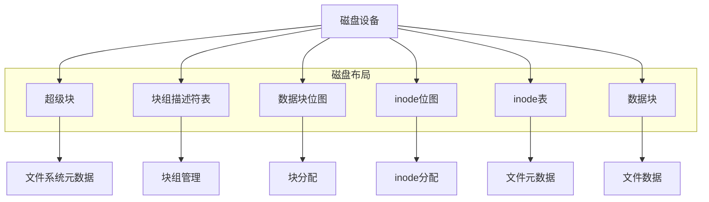
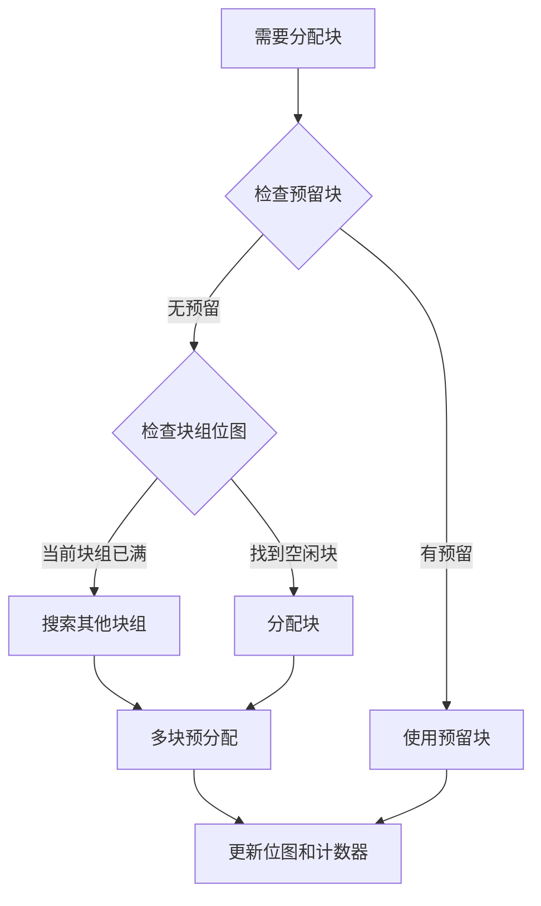
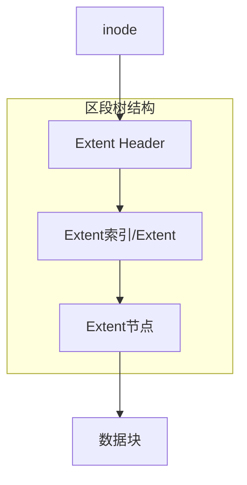
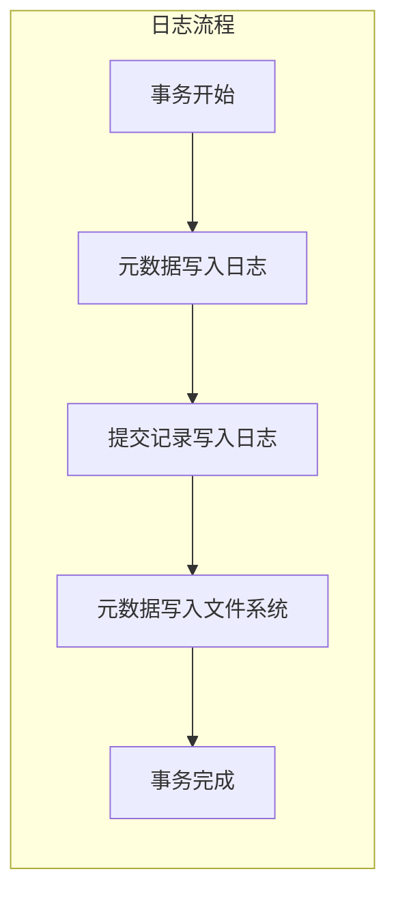
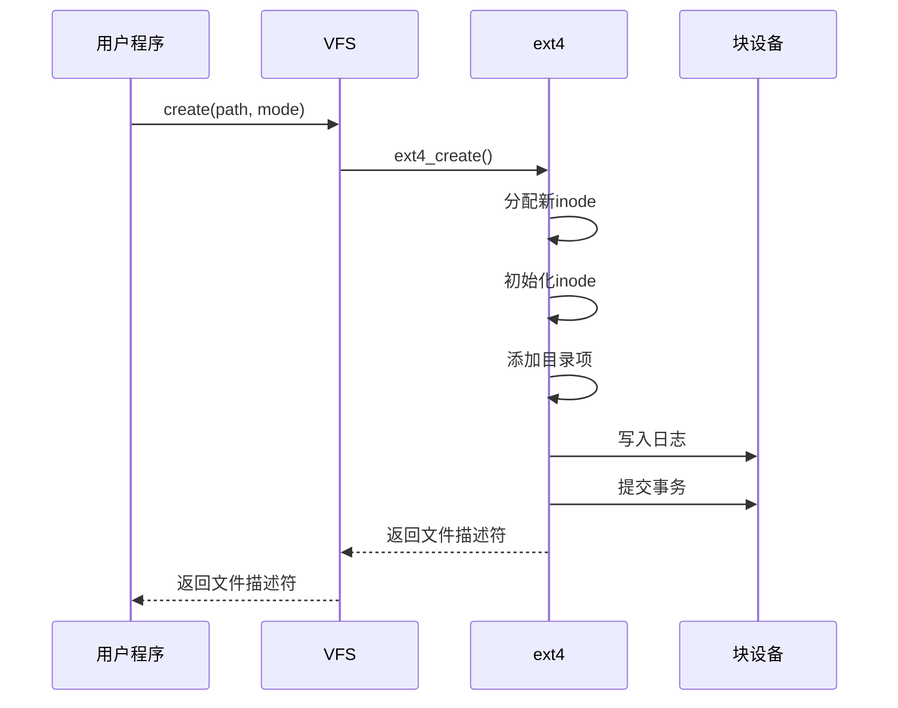
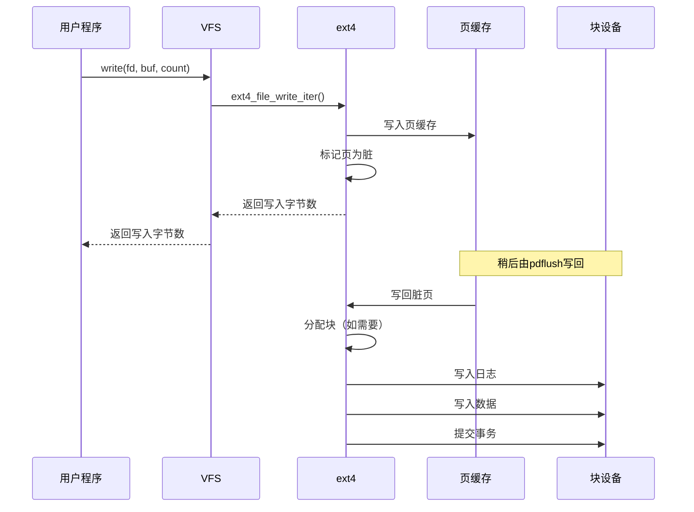

# ext4文件系统实现

## 概述

ext4（Fourth Extended Filesystem）是Linux系统中广泛使用的文件系统，它是ext3的后继者，提供了更好的性能、可靠性和扩展性。本文深入分析ext4文件系统的关键数据结构和算法实现。

## 文件系统架构



## 关键数据结构

### 1. 超级块（Superblock）

超级块是文件系统的核心数据结构，包含文件系统的全局信息：

```c
struct ext4_super_block {
    __le32 s_inodes_count;      /* Inodes计数 */
    __le32 s_blocks_count_lo;   /* 块计数 */
    __le32 s_r_blocks_count_lo; /* 保留块计数 */
    __le32 s_free_blocks_count_lo; /* 空闲块计数 */
    __le32 s_free_inodes_count; /* 空闲inode计数 */
    __le32 s_first_data_block;  /* 第一个数据块 */
    __le32 s_log_block_size;    /* 块大小 = 2^(10+s_log_block_size) */
    __le32 s_log_cluster_size;  /* 簇大小 */
    __le32 s_blocks_per_group;  /* 每组块数 */
    __le32 s_clusters_per_group;/* 每组簇数 */
    __le32 s_inodes_per_group;  /* 每组inode数 */
    __le32 s_mtime;            /* 挂载时间 */
    __le32 s_wtime;            /* 写入时间 */
    /* ... 更多字段 ... */
};
```

超级块在磁盘上有多个副本，以防主副本损坏。

### 2. 块组描述符（Block Group Descriptor）

块组描述符表包含每个块组的元数据：

```c
struct ext4_group_desc {
    __le32 bg_block_bitmap_lo;   /* 块位图位置 */
    __le32 bg_inode_bitmap_lo;   /* inode位图位置 */
    __le32 bg_inode_table_lo;    /* inode表位置 */
    __le16 bg_free_blocks_count_lo; /* 空闲块计数 */
    __le16 bg_free_inodes_count_lo; /* 空闲inode计数 */
    __le16 bg_used_dirs_count_lo;   /* 目录计数 */
    __le16 bg_flags;              /* 标志 */
    /* ... 64位扩展字段 ... */
};
```

### 3. inode结构（Inode Structure）

inode存储文件的元数据，但不包含文件名：

```c
struct ext4_inode {
    __le16 i_mode;        /* 文件类型和访问权限 */
    __le16 i_uid;         /* 低16位所有者UID */
    __le32 i_size_lo;     /* 文件大小（低32位） */
    __le32 i_atime;       /* 访问时间 */
    __le32 i_ctime;       /* 创建时间 */
    __le32 i_mtime;       /* 修改时间 */
    __le32 i_dtime;       /* 删除时间 */
    __le16 i_gid;         /* 低16位组GID */
    __le16 i_links_count; /* 硬链接计数 */
    __le32 i_blocks_lo;   /* 块计数 */
    __le32 i_flags;       /* 文件标志 */
    /* ... */
    __le32 i_block[EXT4_N_BLOCKS]; /* 指向数据块的指针 */
    /* ... 更多字段 ... */
};
```

### 4. 目录项（Directory Entry）

目录项将文件名与inode号关联：

```c
struct ext4_dir_entry_2 {
    __le32 inode;         /* inode号 */
    __le16 rec_len;       /* 目录项长度 */
    __u8  name_len;       /* 名称长度 */
    __u8  file_type;      /* 文件类型 */
    char  name[EXT4_NAME_LEN]; /* 文件名 */
};
```

## 块分配与管理

### 1. 块分配策略



ext4使用多块分配器（Multiblock Allocator）一次分配多个连续块，减少磁盘碎片：

1. **延迟分配**：写入时不立即分配块，而是在刷新到磁盘时才分配
2. **持久预分配**：为文件预留空间，但不计入文件大小
3. **在线碎片整理**：在文件系统挂载时可进行碎片整理

### 2. 区段（Extent）树

ext4使用区段树替代传统的间接块映射，提高大文件性能：



区段头部结构：

```c
struct ext4_extent_header {
    __le16 eh_magic;      /* 魔数 0xF30A */
    __le16 eh_entries;    /* 有效条目数 */
    __le16 eh_max;        /* 最大条目数 */
    __le16 eh_depth;      /* 树深度 */
    __le32 eh_generation; /* 生成号 */
};
```

区段索引和区段结构：

```c
struct ext4_extent_idx {
    __le32 ei_block;     /* 逻辑块号 */
    __le32 ei_leaf_lo;   /* 指向下级节点的指针 */
    __le16 ei_leaf_hi;   /* 高16位指针 */
    __u16  ei_unused;
};

struct ext4_extent {
    __le32 ee_block;     /* 起始逻辑块号 */
    __le16 ee_len;       /* 区段长度 */
    __le16 ee_start_hi;  /* 起始物理块高16位 */
    __le32 ee_start_lo;  /* 起始物理块低32位 */
};
```

## 日志机制

### 1. 日志概述

ext4使用日志（Journal）确保文件系统一致性：



### 2. 日志模式

ext4支持三种日志模式：

1. **Journal模式**：数据和元数据都写入日志
2. **Ordered模式**（默认）：只有元数据写入日志，但确保数据在元数据之前写入磁盘
3. **Writeback模式**：只有元数据写入日志，不保证数据写入顺序

### 3. 日志数据结构

```c
struct journal_header_s {
    __be32 h_magic;      /* 魔数 */
    __be32 h_blocktype;  /* 块类型 */
    __be32 h_sequence;   /* 序列号 */
};

struct journal_superblock_s {
    __be32 s_header.h_magic;    /* 日志魔数 */
    __be32 s_header.h_blocktype; /* 超级块类型 */
    __be32 s_blocksize;         /* 日志块大小 */
    __be32 s_maxlen;            /* 日志总块数 */
    /* ... 更多字段 ... */
};
```

## 性能优化特性

### 1. 延迟inode表初始化

文件系统创建时不初始化所有inode表，而是按需初始化，加快大文件系统的创建速度。

### 2. 多块分配器

一次分配多个连续块，减少磁盘寻道时间和碎片。

### 3. 持久预分配

为文件预留磁盘空间但不计入文件大小，减少未来写入时的碎片。

### 4. 快速fsck

使用未使用inode和块的检查点，加快文件系统检查速度。

## 文件操作实现

### 1. 文件创建流程



### 2. 文件读写流程



## 文件系统特性

### 1. 大文件支持

ext4支持最大16TB的文件（使用4KB块大小）和最大1EB的文件系统（使用64位特性）。

### 2. 目录索引

使用HTree索引加速大目录的查找操作：

```mermaid
graph TD
    A[根索引块] --> B[索引节点1]
    A --> C[索引节点2]
    A --> D[索引节点3]
    B --> E[叶节点1]
    B --> F[叶节点2]
    C --> G[叶节点3]
    C --> H[叶节点4]
    D --> I[叶节点5]
    D --> J[叶节点6]
    
    subgraph HTree结构
    A
    B
    C
    D
    E
    F
    G
    H
    I
    J
    end