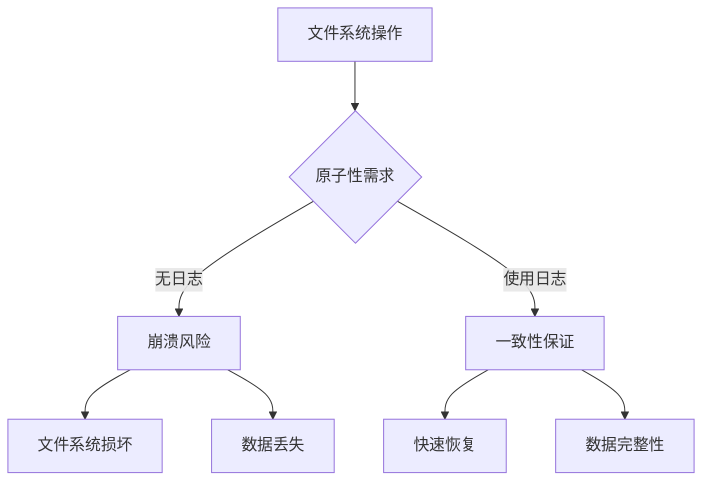
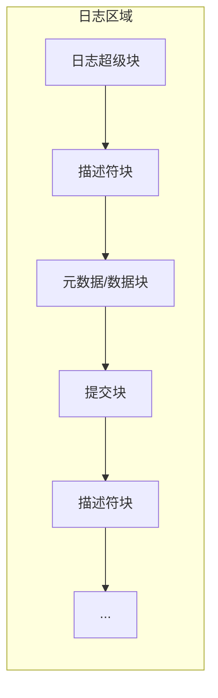
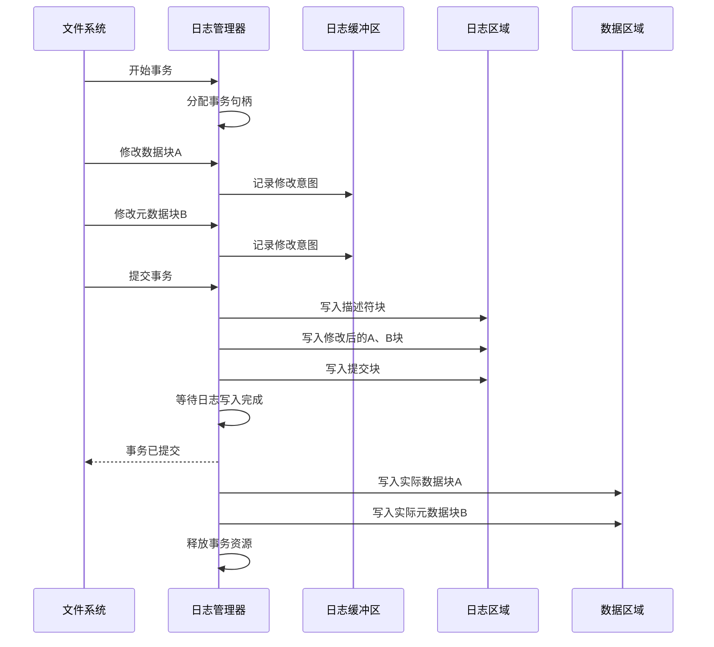
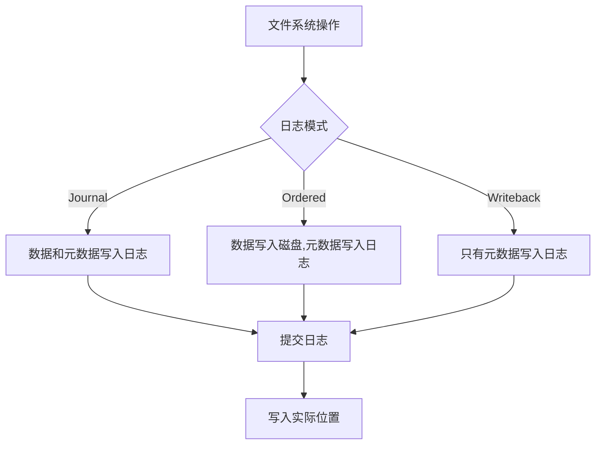
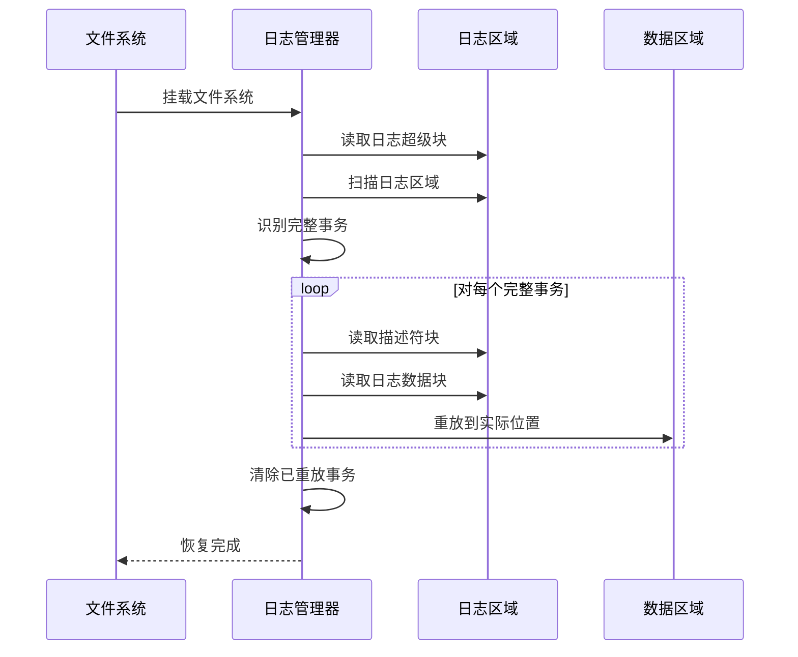
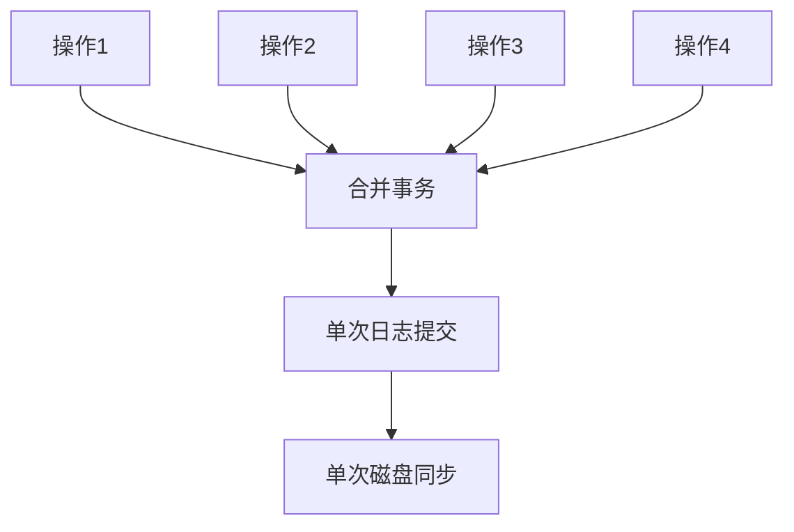
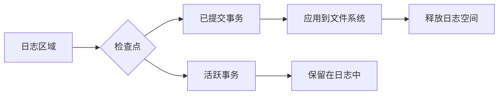
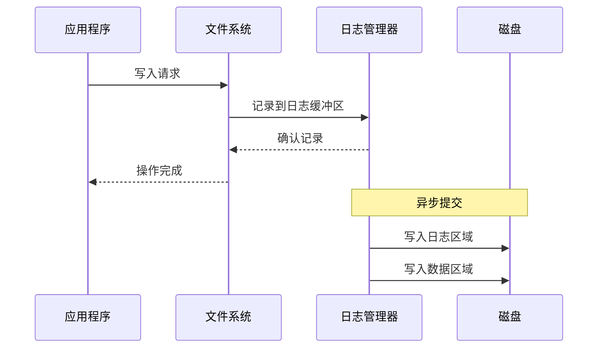
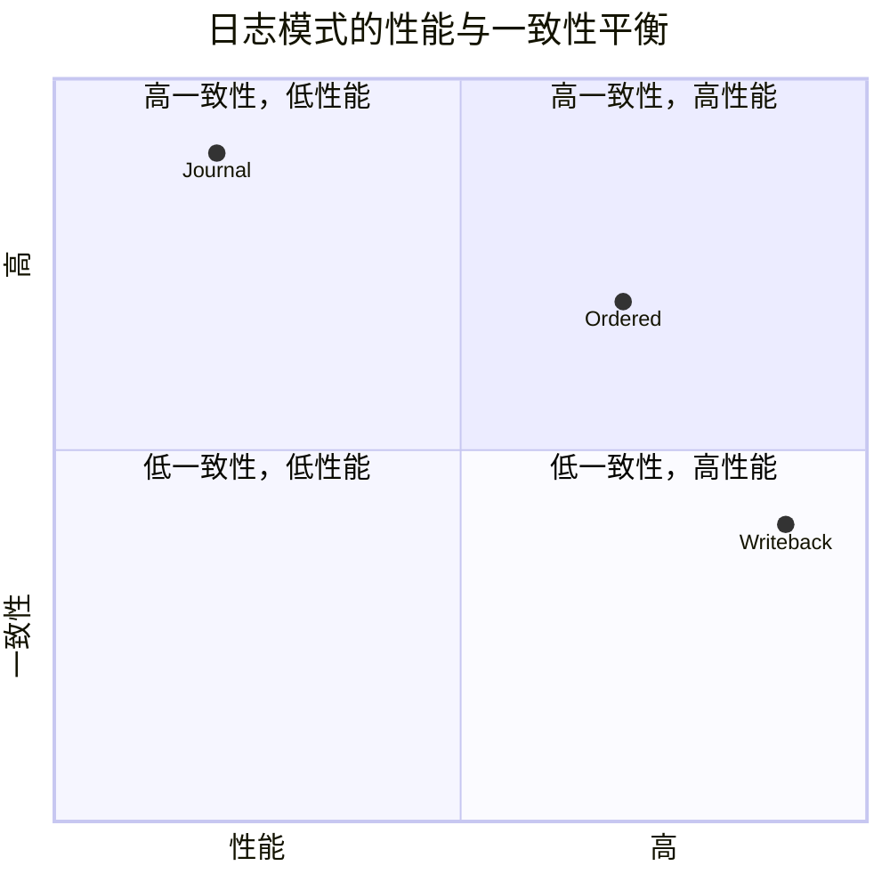

# 文件系统日志（Journal）实现

## 概述

文件系统日志（Journal）是现代文件系统中保证数据一致性的关键机制。本文深入分析日志机制的实现原理，特别是以ext4文件系统为例，探讨其如何通过日志保证文件系统在系统崩溃或断电情况下的一致性。

## 日志的必要性



文件系统操作通常涉及多个磁盘写入操作，例如：

1. 创建文件需要：分配inode、更新inode位图、添加目录项、更新目录inode
2. 删除文件需要：释放数据块、更新块位图、释放inode、更新inode位图、删除目录项

如果这些操作过程中系统崩溃，可能导致文件系统处于不一致状态。日志机制通过先记录操作意图，再执行实际操作的方式，确保即使在崩溃后也能恢复到一致状态。

## 日志架构


### 1. 日志区域布局

日志通常位于文件系统的特定区域，包含以下组件：



- **日志超级块**：包含日志的基本信息，如块大小、总块数、第一个有效事务的序列号等
- **描述符块**：描述接下来的元数据/数据块的信息
- **元数据/数据块**：实际的文件系统元数据或数据
- **提交块**：标记一个完整事务的结束

### 2. 日志超级块结构

```c
struct journal_superblock_s {
    __be32 s_header.h_magic;      /* 日志魔数 (0xC03B3998) */
    __be32 s_header.h_blocktype;  /* 超级块类型 */
    __be32 s_blocksize;           /* 日志块大小 */
    __be32 s_maxlen;              /* 日志总块数 */
    __be32 s_first;               /* 第一个有效块 */
    __be32 s_sequence;            /* 第一个有效事务序列号 */
    __be32 s_start;               /* 日志开始块号 */
    /* ... 更多字段 ... */
};
```

### 3. 描述符块和提交块

```c
struct journal_header_s {
    __be32 h_magic;      /* 魔数 (0xC03B3998) */
    __be32 h_blocktype;  /* 块类型 */
    __be32 h_sequence;   /* 事务序列号 */
};

/* 描述符块 */
struct journal_block_tag_s {
    __be32 t_blocknr;    /* 目标块号 */
    __be32 t_flags;      /* 标志 */
};
```

## 日志操作流程

### 1. 写入流程（事务处理）



### 2. 日志模式

以ext4为例，支持三种日志模式：

1. **Journal模式**（数据日志）：
   - 所有数据和元数据都写入日志
   - 最安全但性能最低
   - 写入流程：日志数据 → 日志元数据 → 提交 → 实际数据 → 实际元数据

2. **Ordered模式**（默认，有序模式）：
   - 只有元数据写入日志
   - 确保数据在相关元数据提交前写入磁盘
   - 写入流程：实际数据 → 日志元数据 → 提交 → 实际元数据

3. **Writeback模式**（回写模式）：
   - 只有元数据写入日志
   - 不保证数据和元数据的写入顺序
   - 写入流程：日志元数据 → 提交 → 实际元数据和数据（顺序不定）



## 恢复机制

### 1. 恢复流程



### 2. 恢复算法

1. **扫描阶段**：
   - 读取日志超级块，获取第一个有效事务序列号
   - 扫描日志区域，识别所有完整事务（有描述符块和提交块的事务）
   - 构建需要重放的事务列表

2. **重放阶段**：
   - 按事务序列号顺序重放每个完整事务
   - 对每个事务，将日志中的块复制到文件系统的实际位置

3. **清理阶段**：
   - 更新日志超级块，标记已重放的事务
   - 准备接收新的日志条目

## 性能优化

### 1. 批处理提交

将多个逻辑操作合并为一个物理事务，减少日志写入次数：



### 2. 日志检查点

定期将日志中的更改应用到文件系统，释放日志空间：



### 3. 异步提交

允许在日志提交到磁盘前返回给应用程序，提高吞吐量：



## 日志实现挑战

### 1. 日志空间管理

日志空间有限，需要及时清理：

- **循环日志**：日志区域作为循环缓冲区使用
- **检查点阈值**：当日志使用率达到阈值时触发检查点
- **紧急检查点**：当日志几乎用尽时，强制执行检查点

### 2. 原子性保证

确保日志操作本身的原子性：

- **两阶段提交**：先写入所有数据，再写入提交记录
- **提交块校验**：使用校验和验证提交块完整性
- **序列号机制**：使用递增序列号标识事务，防止重放旧事务

### 3. 性能与一致性平衡

不同日志模式提供不同级别的一致性保证和性能：



## 实际应用案例

### 1. ext4日志实现

ext4使用JBD2（Journaling Block Device 2）作为其日志层：

- 支持三种日志模式（Journal、Ordered、Writeback）
- 默认使用Ordered模式，平衡性能和一致性
- 使用事务组合和提交批处理优化性能

### 2. XFS日志实现

XFS使用元数据日志：

- 只记录元数据变更，不记录数据
- 使用日志序列号（LSN）跟踪日志条目
- 支持外部日志设备，可将日志放在单独的磁盘上

### 3. Btrfs日志实现

Btrfs使用写时复制（CoW）和日志树：

- 不使用传统的预写日志
- 使用树日志（Tree-Log）记录短期变更
- 结合CoW机制提供崩溃一致性

## 结论

文件系统日志机制是保证数据一致性的关键技术，通过记录操作意图并确保原子性提交，有效防止系统崩溃导致的文件系统损坏。不同的日志实现在性能和一致性保证之间做出不同的权衡，适用