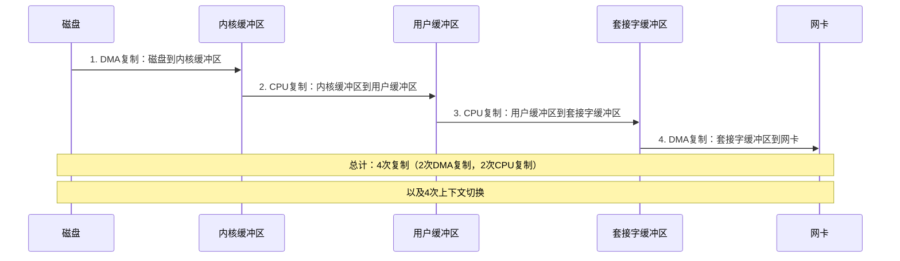
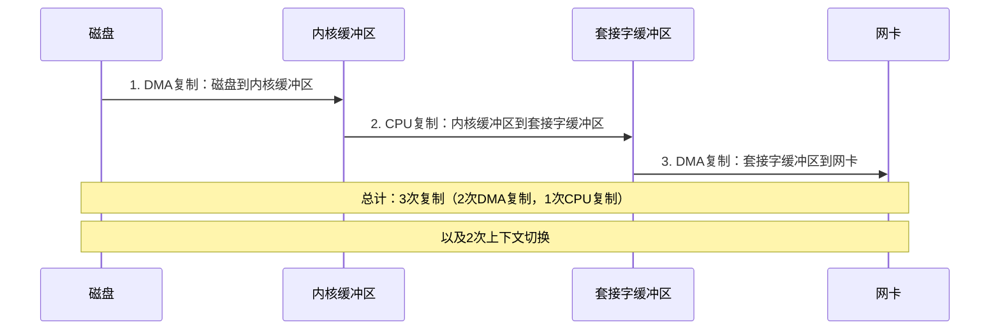
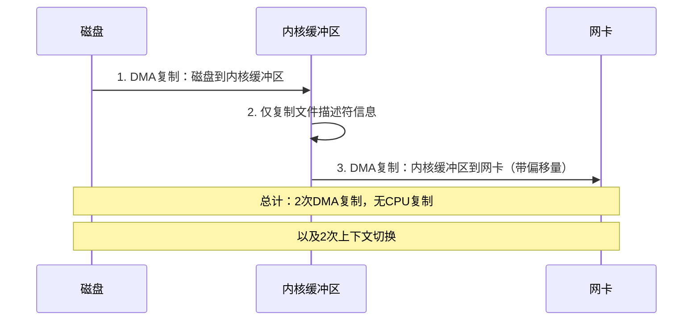
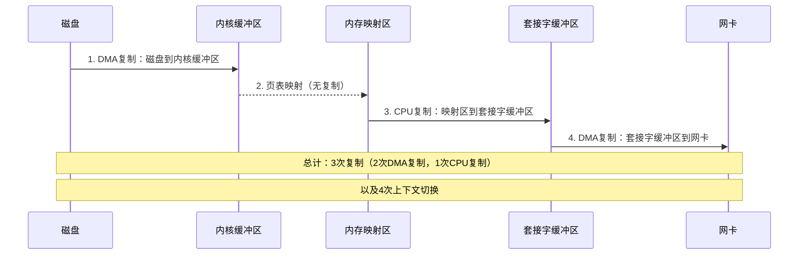
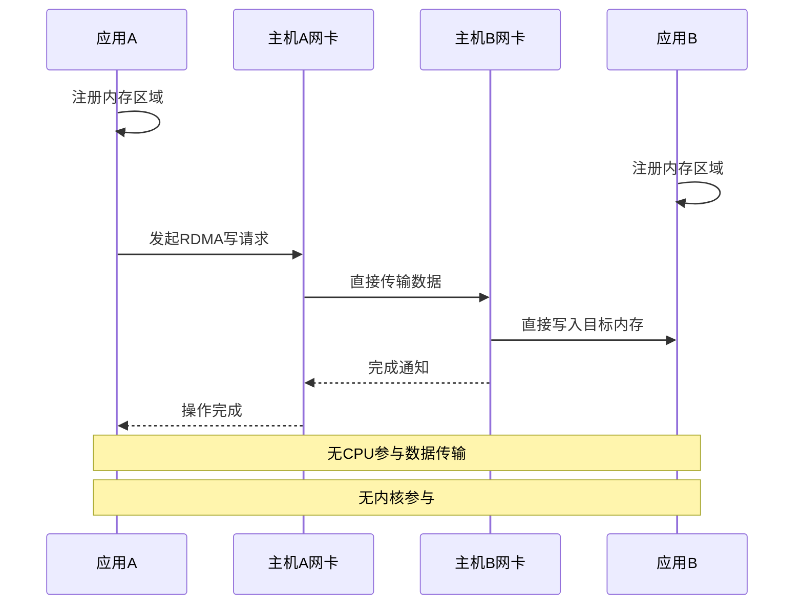
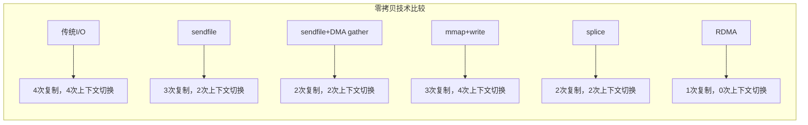

# 零拷贝技术实现

## 零拷贝基本概念

零拷贝（Zero-Copy）是一种优化数据传输的技术，通过减少或消除CPU参与的数据复制操作，显著提高I/O操作的性能。传统I/O操作中，数据在内核空间和用户空间之间会发生多次复制，而零拷贝技术旨在消除这些不必要的复制。

### 传统I/O操作的问题

在传统的文件传输过程中（如从磁盘读取文件并通过网络发送），数据通常经历以下复制过程：



这种方式存在的问题：
1. **CPU开销大**：CPU需要参与数据复制，消耗处理能力
2. **内存带宽浪费**：数据在内存中多次移动
3. **上下文切换开销**：在用户空间和内核空间之间切换
4. **缓存污染**：大量数据复制会刷新CPU缓存

## 零拷贝实现技术

### sendfile系统调用

sendfile是Linux提供的一种零拷贝技术，可以直接在文件描述符之间传输数据，无需经过用户空间。



#### sendfile优化版本（带DMA scatter/gather）

在支持DMA scatter/gather的系统上，sendfile可以进一步优化，完全消除CPU复制：



#### sendfile使用示例

```c
#include <sys/sendfile.h>
#include <fcntl.h>

int main() {
    int in_fd = open("input.file", O_RDONLY);
    int out_fd = open("output.file", O_WRONLY | O_CREAT | O_TRUNC, 0644);
    
    // 获取文件大小
    struct stat stat_buf;
    fstat(in_fd, &stat_buf);
    
    // 使用sendfile传输数据
    sendfile(out_fd, in_fd, 0, stat_buf.st_size);
    
    close(in_fd);
    close(out_fd);
    return 0;
}
```

### mmap + write实现

mmap将文件映射到内存，避免了内核缓冲区到用户缓冲区的复制：



#### mmap使用示例

```c
#include <sys/mman.h>
#include <fcntl.h>
#include <unistd.h>

int main() {
    int in_fd = open("input.file", O_RDONLY);
    int out_fd = open("output.file", O_WRONLY | O_CREAT | O_TRUNC, 0644);
    
    // 获取文件大小
    struct stat stat_buf;
    fstat(in_fd, &stat_buf);
    
    // 内存映射文件
    void *src = mmap(NULL, stat_buf.st_size, PROT_READ, MAP_SHARED, in_fd, 0);
    
    // 写入数据
    write(out_fd, src, stat_buf.st_size);
    
    // 解除映射
    munmap(src, stat_buf.st_size);
    
    close(in_fd);
    close(out_fd);
    return 0;
}
```

### splice系统调用

splice允许在两个文件描述符之间移动数据，无需经过用户空间，且至少有一个文件描述符必须是管道：


#### splice使用示例

```c
#include <fcntl.h>
#include <unistd.h>

int main() {
    int in_fd = open("input.file", O_RDONLY);
    int out_fd = open("output.file", O_WRONLY | O_CREAT | O_TRUNC, 0644);
    
    // 创建管道
    int pipefd[2];
    pipe(pipefd);
    
    // 获取文件大小
    struct stat stat_buf;
    fstat(in_fd, &stat_buf);
    size_t size = stat_buf.st_size;
    
    // 从输入文件splice到管道
    splice(in_fd, NULL, pipefd[1], NULL, size, SPLICE_F_MOVE);
    
    // 从管道splice到输出文件
    splice(pipefd[0], NULL, out_fd, NULL, size, SPLICE_F_MOVE);
    
    close(pipefd[0]);
    close(pipefd[1]);
    close(in_fd);
    close(out_fd);
    return 0;
}
```

### 直接I/O

直接I/O（O_DIRECT）绕过内核缓冲区，直接在用户缓冲区和设备之间传输数据：


#### 直接I/O使用示例

```c
#include <fcntl.h>
#include <unistd.h>
#include <stdlib.h>

int main() {
    // 打开文件，使用O_DIRECT标志
    int fd = open("file.data", O_RDWR | O_DIRECT);
    
    // 分配对齐的内存（通常需要按扇区大小对齐，如512字节）
    void *buf;
    posix_memalign(&buf, 512, 4096);  // 分配4KB，按512字节对齐
    
    // 直接读写
    read(fd, buf, 4096);
    write(fd, buf, 4096);
    
    free(buf);
    close(fd);
    return 0;
}
```

### RDMA（远程直接内存访问）

RDMA允许网络设备直接访问远程主机的内存，完全绕过CPU和操作系统：



## 零拷贝技术对比



### 适用场景

1. **sendfile**：适合网络文件服务器、静态内容Web服务器
2. **mmap**：适合需要随机访问文件内容的场景
3. **splice**：适合流媒体服务、数据管道处理
4. **直接I/O**：适合数据库系统、需要自定义缓存的应用
5. **RDMA**：适合高性能计算、大数据传输、存储网络

## 零拷贝在现代系统中的应用

### Nginx中的零拷贝

Nginx使用sendfile系统调用来提高静态文件服务性能：

```nginx
http {
    sendfile on;           # 启用sendfile
    tcp_nopush on;         # 优化TCP传输
    tcp_nodelay on;        # 禁用Nagle算法
    
    server {
        listen 80;
        location /static/ {
            root /var/www;
        }
    }
}
```

### Kafka中的零拷贝

Kafka使用TransferTo（Java中的sendfile封装）来高效传输消息：

```java
// Kafka中的零拷贝实现示例
public long transferFrom(FileChannel fileChannel, long