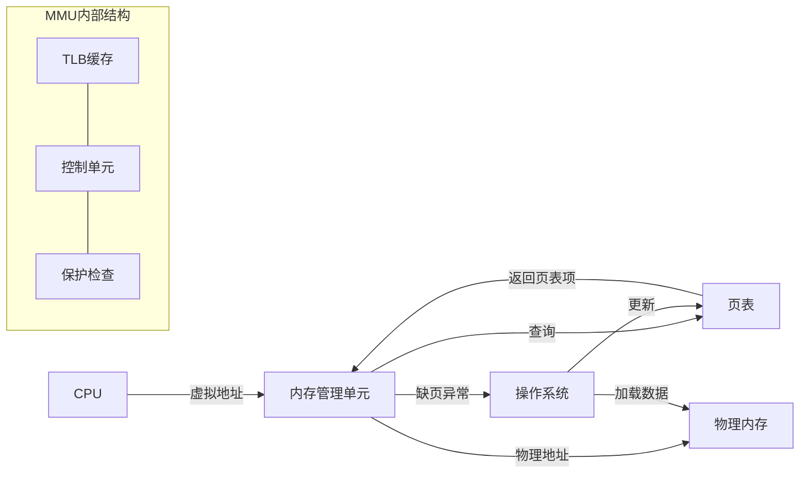
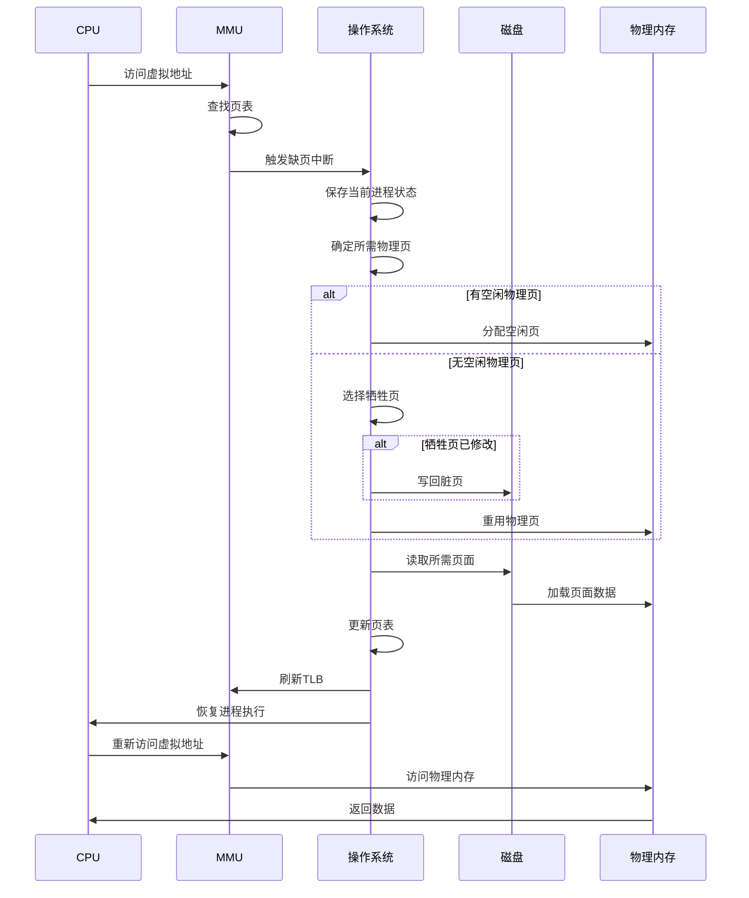

# MMU与缺页中断机制

## MMU基本概念

MMU（Memory Management Unit，内存管理单元）是计算机系统中负责处理CPU内存访问请求的硬件组件，它将虚拟地址转换为物理地址，并提供内存保护功能。

### MMU的主要功能

1. **地址转换**：将程序使用的虚拟地址转换为实际的物理内存地址
2. **访问权限控制**：检查内存访问是否合法（读/写/执行权限）
3. **缓存控制**：管理内存区域的缓存属性
4. **内存保护**：防止进程访问其他进程的内存空间

## MMU工作原理



### 地址转换过程

1. CPU生成虚拟地址并发送给MMU
2. MMU首先检查TLB（快表）是否有对应的地址映射
3. 如果TLB命中，直接获取物理地址
4. 如果TLB未命中，MMU查询页表获取映射关系
5. 检查访问权限，如果违反权限则产生异常
6. 如果页表项标记为不在内存中，触发缺页中断
7. 如果一切正常，MMU返回物理地址给CPU

## 缺页中断机制

缺页中断（Page Fault）是当程序访问的页面不在物理内存中时，由MMU触发的一种异常。操作系统捕获这个异常并将所需页面从磁盘加载到内存中。

### 缺页中断处理流程



### 缺页中断类型

1. **主缺页中断**：页面从未被加载到内存中
2. **次缺页中断**：页面曾经在内存中，但被换出到交换空间
3. **无效缺页中断**：访问了无效的内存地址（通常导致段错误）
4. **写保护缺页中断**：尝试写入只读页面

## 按需分页机制

按需分页（Demand Paging）是一种内存管理技术，只有当程序实际访问某个页面时，才将其加载到物理内存中。

```mermaid
flowchart TD
    A[程序启动] --> B[创建页表]
    B --> C[标记所有页面为"不在内存中"]
    C --> D[程序执行]
    D --> E{访问内存}
    E -->|页面在内存中| F[正常访问]
    E -->|页面不在内存中| G[触发缺页中断]
    G --> H[加载页面到内存]
    H --> F
    F --> E
```

### 按需分页的优势

1. **减少内存占用**：只加载实际需要的页面
2. **加快程序启动**：无需等待整个程序加载完成
3. **支持更大的程序**：允许程序大小超过物理内存容量

## 页面置换算法

当物理内存不足时，操作系统需要选择一个页面换出到磁盘，为新页面腾出空间。

### 常见页面置换算法


1. **FIFO（先进先出）**：置换最早进入内存的页面
2. **LRU（最近最少使用）**：置换最长时间未被访问的页面
3. **Clock（时钟算法）**：LRU的近似实现，使用访问位
4. **LFU（最不经常使用）**：置换访问次数最少的页面
5. **OPT（最优算法）**：置换最长时间不会被访问的页面（理论算法）

## MMU在不同架构中的实现

### x86-64架构

- 支持4级页表结构
- 提供PAE（物理地址扩展）
- 支持NX位（禁止执行）保护

### ARM架构

- 支持两级MMU（TTBR0和TTBR1）
- 提供LPAE（大物理地址扩展）
- 支持多种页面大小（4KB, 64KB, 1MB, 16MB）