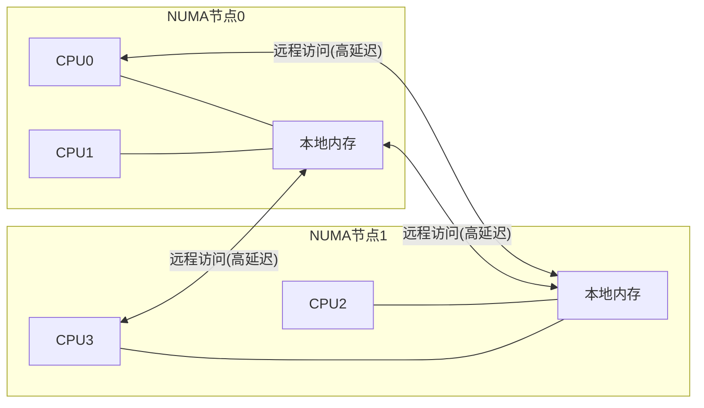

# NUMA架构下的内存优化

## NUMA架构基础

### 什么是NUMA架构

NUMA (Non-Uniform Memory Access) 是一种多处理器计算机内存设计方法，其中内存访问时间取决于内存相对于处理器的位置。在NUMA架构中，处理器访问自己本地内存的速度比访问非本地内存（其他处理器的本地内存）要快。



### NUMA架构的关键特性

1. **非均匀访问延迟**：访问本地内存比远程内存快2-10倍
2. **节点亲和性**：进程/线程应尽量使用本地节点内存
3. **内存带宽隔离**：每个节点有独立的内存带宽
4. **可扩展性**：相比SMP架构，NUMA可以支持更多的处理器
5. **硬件拓扑**：处理器、内存和I/O设备组织成多个节点

### NUMA架构的演进

1. **早期NUMA**：专有互连技术，如SGI的NUMAlink
2. **ccNUMA**：缓存一致性NUMA，通过硬件保持缓存一致性
3. **现代NUMA**：集成内存控制器，如AMD的Infinity Fabric和Intel的UPI

## NUMA内存访问模式分析

### 内存访问延迟特性

在NUMA系统中，内存访问延迟取决于多个因素：

```mermaid
bar
    title NUMA内存访问延迟对比(相对值)
    x-axis [访问延迟(ns)]
    y-axis [访问类型]
    "本地内存访问" 100
    "一跳远程访问" 250
    "两跳远程访问" 350
    "三跳远程访问" 450
```

### 内存访问模式分类

1. **本地访问优化型**：应用程序主要访问本地内存
2. **共享数据密集型**：多个处理器频繁访问共享数据
3. **混合访问模式**：部分数据局部访问，部分数据共享访问

### 访问模式检测工具

```bash
# 使用numastat查看NUMA统计信息
numastat -p <pid>

# 使用perf分析NUMA访问模式
perf c2c record -a ./your_application
perf c2c report
```

## NUMA感知内存分配器

### 基本原理

NUMA感知内存分配器需要考虑内存访问的局部性，确保数据尽可能地分配在访问它的处理器所在的NUMA节点上。

### C++实现

#### 使用libnuma库

```cpp
#include <numa.h>
#include <numaif.h>
#include <sched.h>

class NumaAwareAllocator {
public:
    // 在当前CPU所在节点分配内存
    void* allocateLocal(size_t size) {
        if (!numa_available()) {
            return malloc(size);
        }
        return numa_alloc_local(size);
    }
    
    // 在指定节点分配内存
    void* allocateOnNode(size_t size, int node) {
        if (!numa_available() || node < 0 || node >= numa_num_configured_nodes()) {
            return malloc(size);
        }
        return numa_alloc_onnode(size, node);
    }
    
    // 在所有节点上交错分配内存
    void* allocateInterleaved(size_t size) {
        if (!numa_available()) {
            return malloc(size);
        }
        return numa_alloc_interleaved(size);
    }
    
    // 在指定节点集上交错分配内存
    void* allocateInterleaved(size_t size, const std::vector<int>& nodes) {
        if (!numa_available()) {
            return malloc(size);
        }
        
        struct bitmask* mask = numa_bitmask_alloc(numa_num_configured_nodes());
        numa_bitmask_clearall(mask);
        
        for (int node : nodes) {
            if (node >= 0 && node < numa_num_configured_nodes()) {
                numa_bitmask_setbit(mask, node);
            }
        }
        
        void* ptr = numa_alloc_interleaved_subset(size, mask);
        numa_bitmask_free(mask);
        return ptr;
    }
    
    // 释放NUMA分配的内存
    void deallocate(void* ptr, size_t size) {
        if (!numa_available()) {
            free(ptr);
            return;
        }
        numa_free(ptr, size);
    }
};
```

#### 自定义STL分配器

```cpp
template <typename T>
class NumaAwareStlAllocator {
public:
    using value_type = T;
    
    NumaAwareStlAllocator() noexcept {
        _node = numa_node_of_cpu(sched_getcpu());
    }
    
    template <typename U>
    NumaAwareStlAllocator(const NumaAwareStlAllocator<U>& other) noexcept
        : _node(other._node) {}
    
    T* allocate(size_t n) {
        if (n > std::numeric_limits<size_t>::max() / sizeof(T)) {
            throw std::bad_alloc();
        }
        
        if (!numa_available() || _node < 0) {
            return static_cast<T*>(::operator new(n * sizeof(T)));
        }
        
        void* ptr = numa_alloc_onnode(n * sizeof(T), _node);
        if (!ptr) throw std::bad_alloc();
        return static_cast<T*>(ptr);
    }
    
    void deallocate(T* p, size_t n) noexcept {
        if (!numa_available() || _node < 0) {
            ::operator delete(p);
            return;
        }
        numa_free(p, n * sizeof(T));
    }
    
    int getNode() const { return _node; }
    void setNode(int node) { _node = node; }
    
private:
    int _node;
    
    template <typename U>
    friend class NumaAwareStlAllocator;
};

// 使用示例
std::vector<int, NumaAwareStlAllocator<int>> numaVector;
```

### Rust实现

#### 基于libnuma的Rust绑定

```rust
use std::alloc::{GlobalAlloc, Layout, System};
use std::ptr::NonNull;

#[link(name = "numa")]
extern "C" {
    fn numa_available() -> i32;
    fn numa_node_of_cpu(cpu: i32) -> i32;
    fn numa_alloc_onnode(size: usize, node: i32) -> *mut u8;
    fn numa_free(start: *mut u8, size: usize);
    fn sched_getcpu() -> i32;
}

pub struct NumaAllocator;

unsafe impl GlobalAlloc for NumaAllocator {
    unsafe fn alloc(&self, layout: Layout) -> *mut u8 {
        if numa_available() <= 0 {
            return System.alloc(layout);
        }
        
        let cpu = sched_getcpu();
        if cpu < 0 {
            return System.alloc(layout);
        }
        
        let node = numa_node_of_cpu(cpu);
        if node < 0 {
            return System.alloc(layout);
        }
        
        let ptr = numa_alloc_onnode(layout.size(), node);
        if ptr.is_null() {
            return System.alloc(layout);
        }
        
        ptr
    }
    
    unsafe fn dealloc(&self, ptr: *mut u8, layout: Layout) {
        if numa_available() <= 0 {
            System.dealloc(ptr, layout);
            return;
        }
        
        numa_free(ptr, layout.size());
    }
}

// 全局分配器声明
#[global_allocator]
static ALLOCATOR: NumaAllocator = NumaAllocator;
```

#### 高级Rust NUMA内存管理

```rust
use std::alloc::{AllocError, Allocator, Layout};
use std::ptr::NonNull;

pub struct NumaNodeAllocator {
    node: i32,
}

impl NumaNodeAllocator {
    pub fn new(node: i32) -> Self {
        Self { node }
    }
    
    pub fn current_node() -> Self {
        unsafe {
            let cpu = sched_getcpu();
            let node = if cpu >= 0 { numa_node_of_cpu(cpu) } else { 0 };
            Self { node: node.max(0) }
        }
    }
}

unsafe impl Allocator for NumaNodeAllocator {
    fn allocate(&self, layout: Layout) -> Result<NonNull<[u8]>, AllocError> {
        unsafe {
            if numa_available() <= 0 {
                return Err(AllocError);
            }
            
            let ptr = numa_alloc_onnode(layout.size(), self.node);
            if ptr.is_null() {
                return Err(AllocError);
            }
            
            let slice_ptr = std::slice::from_raw_parts_mut(ptr, layout.size());
            Ok(NonNull::new_unchecked(slice_ptr))
        }
    }
    
    unsafe fn deallocate(&self, ptr: NonNull<u8>, layout: Layout) {
        if numa_available() > 0 {
            numa_free(ptr.as_ptr(), layout.size());
        }
    }
}

// 使用示例
fn main() {
    let allocator = NumaNodeAllocator::current_node();
    let mut vec = Vec::new_in(allocator);
    vec.push(1);
    vec.push(2);
    vec.push(3);
}
```

## NUMA优化策略

### 内存分配策略

1. **本地优先策略**
   - 默认策略，优先在本地节点分配内存
   - 适用于大多数应用程序

2. **绑定策略**
   - 严格在指定节点上分配内存
   - 适用于性能关键型应用

3. **交错策略**
   - 在多个节点上轮流分配内存页
   - 适用于共享数据密集型应用

4. **首次接触策略**
   - 内存页在首次访问时才实际分配到NUMA节点
   - 确保内存分配在使用该内存的线程所在节点

### 线程与内存亲和性

```cpp
// 设置线程亲和性
void set_thread_affinity(int node_id) {
    int num_nodes = numa_num_configured_nodes();
    if (node_id >= num_nodes) return;
    
    struct bitmask* mask = numa_allocate_cpumask();
    numa_node_to_cpus(node_id, mask);
    
    numa_sched_setaffinity(0, mask);
    numa_free_cpumask(mask);
}

// 设置内存策略
void set_memory_policy(int node_id) {
    struct bitmask* mask = numa_allocate_nodemask();
    numa_bitmask_clearall(mask);
    numa_bitmask_setbit(mask, node_id);
    
    numa_set_membind(mask);
    numa_free_nodemask(mask);
}
```

### 数据分区与分布

对于大型数据结构，可以根据访问模式进行分区：

```cpp
template <typename T>
class NumaPartitionedArray {
public:
    struct NodeData {
        T* data;
        size_t size;
    };
    
    NumaPartitionedArray(size_t total_size) {
        int num_nodes = numa_num_configured_nodes();
        _node_data.resize(num_nodes);
        
        size_t per_node_size = (total_size + num_nodes - 1) / num_nodes;
        for (int i = 0; i < num_nodes; i++) {
            void* ptr = numa_alloc_onnode(per_node_size * sizeof(T), i);
            _node_data[i].data = static_cast<T*>(ptr);
            _node_data[i].size = per_node_size;
        }
        
        _total_size = total_size;
    }
    
    ~NumaPartitionedArray() {
        for (auto& node_data : _node_data) {
            if (node_data.data) {
                numa_free(node_data.data, node_data.size * sizeof(T));
            }
        }
    }
    
    // 获取当前线程所在节点的数据
    T* getLocalData(size_t& size) {
        int node = numa_node_of_cpu(sched_getcpu());
        if (node < 0 || node >= _node_data.size()) {
            node = 0;
        }
        
        size = _node_data[node].size;
        return _node_data[node].data;
    }
    
    // 获取指定节点的数据
    T* getNodeData(int node, size_t& size) {
        if (node < 0 || node >= _node_data.size()) {
            size = 0;
            return nullptr;
        }
        
        size = _node_data[node].size;
        return _node_data[node].data;
    }
    
private:
    std::vector<NodeData> _node_data;
    size_t _total_size;
};

// 使用示例
NumaPartitionedArray<float> partitioned_array(1000000); // 分配一百万个浮点数

### 自动NUMA平衡

Linux内核提供了自动NUMA平衡功能，可以自动检测和优化内存放置：

```bash
# 检查自动NUMA平衡状态
cat /proc/sys/kernel/numa_balancing

# 启用自动NUMA平衡
echo 1 > /proc/sys/kernel/numa_balancing

# 禁用自动NUMA平衡
echo 0 > /proc/sys/kernel/numa_balancing
```

自动NUMA平衡的工作原理：

1. **页错误跟踪**：内核周期性地将内存页标记为不可访问
2. **访问监控**：当线程访问这些页面时，触发页错误
3. **统计收集**：内核收集哪些线程访问哪些内存页的统计信息
4. **内存迁移**：将内存页迁移到访问频率最高的线程所在的NUMA节点

### 跨节点访问优化

当无法避免跨节点访问时，可以采用以下优化策略：

#### 1. 数据复制

对于只读数据，可以在多个NUMA节点上保留副本：

```cpp
class NumaReplicatedReadOnlyData {
public:
    NumaReplicatedReadOnlyData(const void* src_data, size_t size) {
        _size = size;
        int num_nodes = numa_num_configured_nodes();
        _replicas.resize(num_nodes);
        
        for (int i = 0; i < num_nodes; i++) {
            _replicas[i] = numa_alloc_onnode(size, i);
            memcpy(_replicas[i], src_data, size);
        }
    }
    
    ~NumaReplicatedReadOnlyData() {
        for (void* ptr : _replicas) {
            if (ptr) numa_free(ptr, _size);
        }
    }
    
    const void* getLocalData() const {
        int node = numa_node_of_cpu(sched_getcpu());
        if (node < 0 || node >= _replicas.size()) {
            node = 0;
        }
        return _replicas[node];
    }
    
private:
    std::vector<void*> _replicas;
    size_t _size;
};
```

#### 2. 预取技术

使用软件预取减轻跨节点访问延迟：

```cpp
// 使用预取指令
void prefetch_data(const void* addr) {
    __builtin_prefetch(addr, 0, 3); // 读取，时间局部性高
}

// 批量预取示例
void process_remote_data(const float* remote_data, size_t size) {
    const size_t prefetch_distance = 16; // 预取距离
    
    for (size_t i = 0; i < size; i++) {
        // 预取未来将要访问的数据
        if (i + prefetch_distance < size) {
            prefetch_data(&remote_data[i + prefetch_distance]);
        }
        
        // 处理当前数据
        process_item(remote_data[i]);
    }
}
```

#### 3. 批量访问

将多个小型跨节点访问合并为较少的大型访问：

```cpp
// 优化前：多次小型远程访问
for (int i = 0; i < 1000; i++) {
    remote_sum += remote_array[i]; // 每次都是远程访问
}

// 优化后：批量获取，本地处理
float local_buffer[1000];
memcpy(local_buffer, remote_array, 1000 * sizeof(float)); // 一次性批量复制

for (int i = 0; i < 1000; i++) {
    local_sum += local_buffer[i]; // 本地内存访问
}
```

## 性能测试与调优

### NUMA性能测试工具

```bash
# 使用numactl测试不同NUMA策略的性能
numactl --membind=0 --cpunodebind=0 ./benchmark
numactl --interleave=all ./benchmark

# 使用numademo进行NUMA性能测试
numademo

# 使用Intel Memory Latency Checker
mlc --latency_matrix
```

### 性能监控指标

监控以下指标来识别NUMA相关性能问题：

1. **远程内存访问率**：使用`perf c2c`或`numastat`监控
2. **NUMA命中率**：本地内存访问占总内存访问的比例
3. **跨节点流量**：使用`numastat -m`监控节点间内存流量
4. **页迁移统计**：使用`/proc/vmstat`中的`numa_*`指标

### 常见NUMA性能问题及解决方案

| 问题 | 症状 | 解决方案 |
|------|------|----------|
| 内存分配不均衡 | 某些节点内存使用率高，其他节点低 | 使用交错分配策略 |
| 远程访问率高 | 高延迟，`numastat`显示大量远程访问 | 调整线程亲和性，使用本地优先策略 |
| 线程迁移频繁 | 线程在不同NUMA节点间频繁迁移 | 设置线程亲和性，绑定到特定核心 |
| 共享数据竞争 | 多个节点频繁访问同一数据 | 数据分区或复制，减少共享 |

## 与零拷贝技术的结合

### NUMA感知零拷贝

NUMA架构下的零拷贝技术需要考虑内存位置：

```cpp
// NUMA感知的零拷贝文件读取
void* numa_aware_mmap_file(const char* filename, size_t* size) {
    int fd = open(filename, O_RDONLY);
    if (fd == -1) return nullptr;
    
    struct stat sb;
    if (fstat(fd, &sb) == -1) {
        close(fd);
        return nullptr;
    }
    
    *size = sb.st_size;
    
    // 在当前NUMA节点上分配内存
    void* addr = numa_alloc_local(*size);
    if (!addr) {
        close(fd);
        return nullptr;
    }
    
    // 读取文件内容到本地内存
    if (read(fd, addr, *size) != *size) {
        numa_free(addr, *size);
        close(fd);
        return nullptr;
    }
    
    close(fd);
    return addr;
}
```

### RDMA与NUMA结合

在RDMA（远程直接内存访问）应用中，NUMA感知尤为重要：

```cpp
// NUMA感知的RDMA内存注册
struct ibv_mr* register_numa_aware_rdma_memory(struct ibv_pd* pd, size_t size) {
    // 在本地NUMA节点分配内存
    void* addr = numa_alloc_local(size);
    if (!addr) return nullptr;
    
    // 注册RDMA内存区域
    struct ibv_mr* mr = ibv_reg_mr(pd, addr, size, 
        IBV_ACCESS_LOCAL_WRITE | IBV_ACCESS_REMOTE_WRITE | IBV_ACCESS_REMOTE_READ);
    
    if (!mr) {
        numa_free(addr, size);
        return nullptr;
    }
    
    return mr;
}
```

## 结论

NUMA架构下的内存优化是高性能计算和大规模服务器应用的关键。通过理解NUMA架构特性，采用适当的内存分配策略，实现NUMA感知的内存分配器，以及优化跨节点访问，可以显著提高应用程序性能。

在实际应用中，应根据工作负载特性选择合适的NUMA优化策略，并通过性能测试和监控持续调优系统行为。结合零拷贝和RDMA等技术，可以进一步提升NUMA系统的性能和效率。