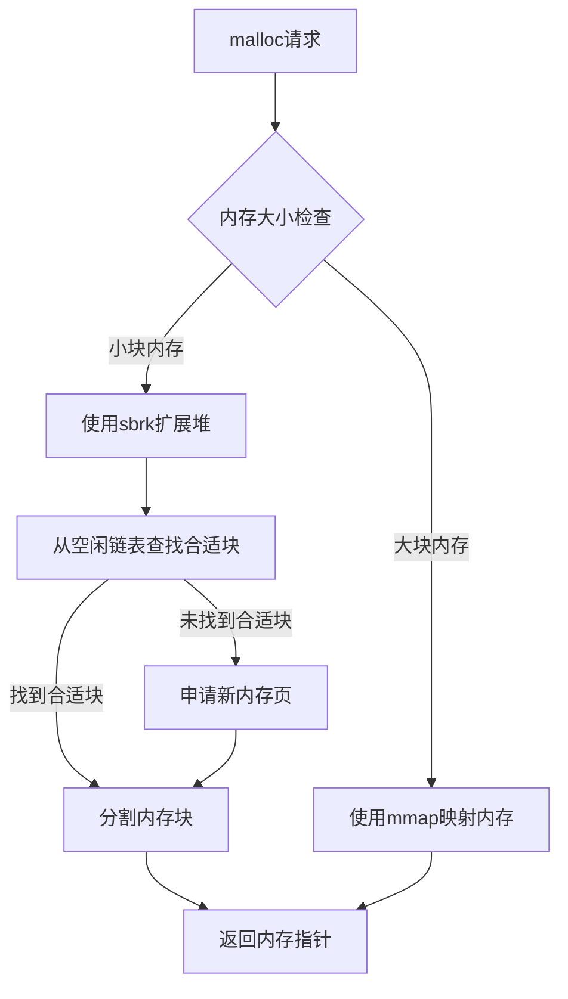
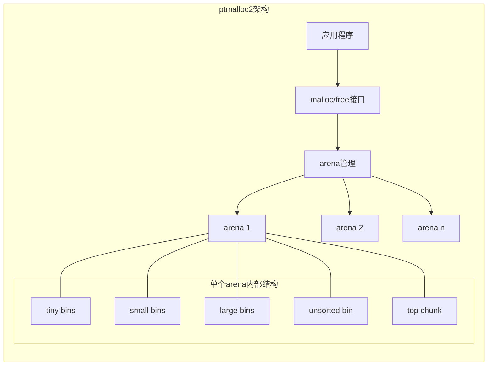
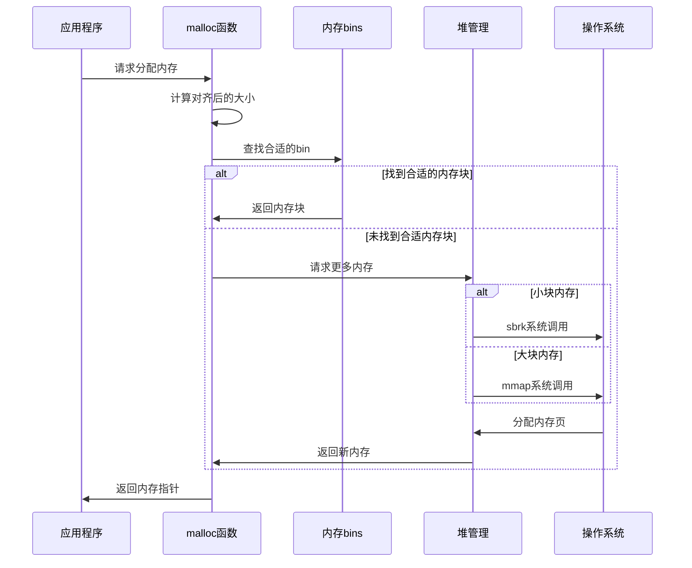
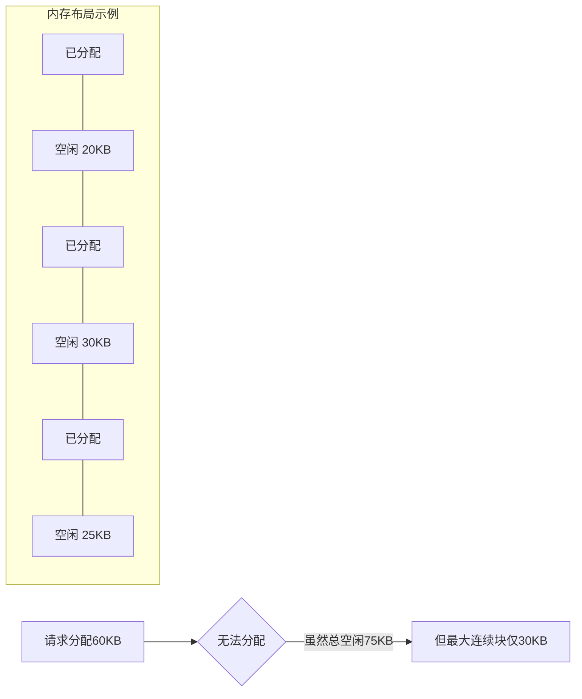
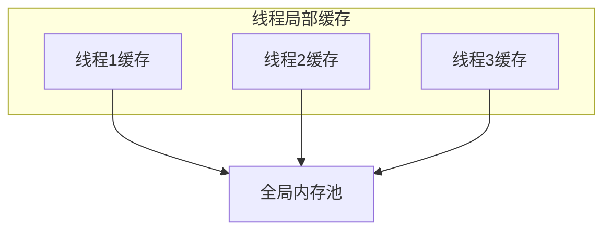

# malloc底层原理与内存分配策略

## malloc基本概念

malloc是C/C++中用于动态内存分配的标准库函数，它在堆上分配指定大小的内存块，并返回指向该内存块的指针。

### malloc函数族

- **malloc**：分配指定字节数的内存
- **calloc**：分配指定数量的元素，并初始化为0
- **realloc**：调整已分配内存的大小
- **free**：释放已分配的内存

## 内存分配策略

### 小块内存分配

对于小块内存（通常<128KB），malloc使用sbrk系统调用扩展进程的堆空间。这种方式的特点是：

1. **连续内存**：堆是连续的虚拟地址空间
2. **低开销**：避免了系统调用的频繁开销
3. **内存池**：使用空闲链表管理已分配但被释放的内存块

### 大块内存分配

对于大块内存（通常≥128KB），malloc使用mmap系统调用直接从操作系统映射内存。这种方式的特点是：

1. **独立映射**：每个大块内存是独立的内存映射
2. **直接归还**：释放时直接归还给操作系统
3. **页对齐**：内存块按页对齐，减少内部碎片

## 内存分配器实现

### glibc中的ptmalloc2

#### 多级缓存结构

1. **Fast Bins**：小内存块的快速缓存，LIFO队列，不合并
2. **Unsorted Bin**：刚释放的内存块先放入此处
3. **Small Bins**：固定大小的小内存块（<512字节）
4. **Large Bins**：不同大小范围的大内存块
5. **Top Chunk**：arena中最顶部的空闲内存块

### 内存分配算法

## 内存碎片问题

### 内部碎片

内部碎片是指分配给用户的内存块中未被使用的部分。产生原因：

1. **对齐要求**：内存块需要按特定边界对齐
2. **最小分配大小**：分配器可能有最小分配单元

### 外部碎片

外部碎片是指空闲内存块之间的碎片化，导致虽然总空闲内存足够，但无法满足大块内存请求。

### 碎片化解决方案

1. **内存块合并**：相邻空闲块合并为更大的块
2. **内存紧凑**：重新排列已分配块，合并空闲空间
3. **内存池**：特定大小的对象使用专用内存池
4. **伙伴系统**：基于2的幂次划分内存块

## 内存分配器优化技术

### 线程局部缓存

为每个线程维护一个小型内存缓存，减少线程间竞争。

### 内存预分配

预先分配一定量的内存，减少系统调用次数。

### 内存对齐

按照硬件架构要求对内存进行对齐，提高访问效率。

## 自定义内存分配器

在特定场景下，自定义内存分配器可以提供更好的性能：

1. **对象池**：预分配固定大小对象的内存池
2. **区域分配器**：一次分配大块内存，然后快速子分配
3. **栈式分配器**：LIFO方式分配和释放，适用于特定算法

## 内存泄漏与调试

### 常见内存问题

1. **内存泄漏**：分配的内存未被释放
2. **悬挂指针**：指向已释放内存的指针
3. **缓冲区溢出**：写入超出分配范围的内存
4. **重复释放**：对同一内存块多次调用free

### 内存调试工具

1. **Valgrind**：检测内存泄漏和非法访问
2. **AddressSanitizer**：快速内存错误检测器
3. **mtrace**：跟踪内存分配和释放
4. **jemalloc/tcmalloc**：高性能内存分配器，带调试功能