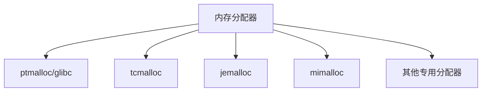
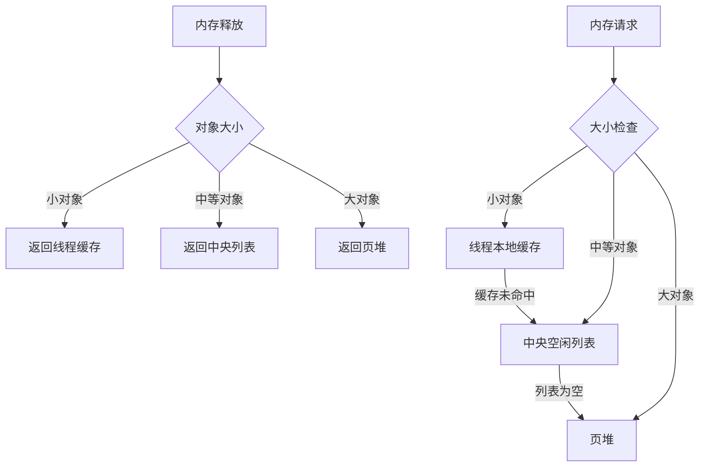
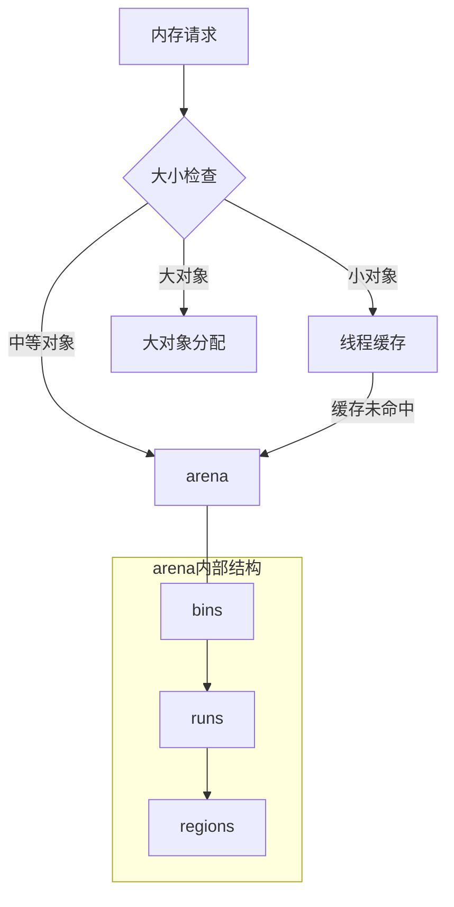
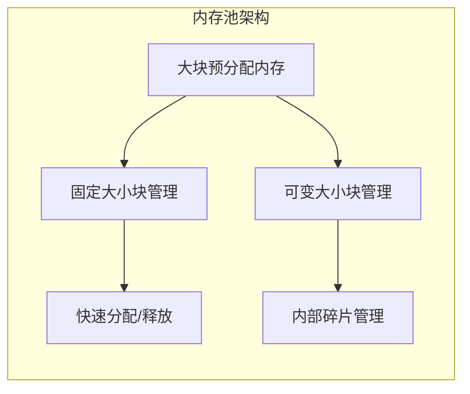
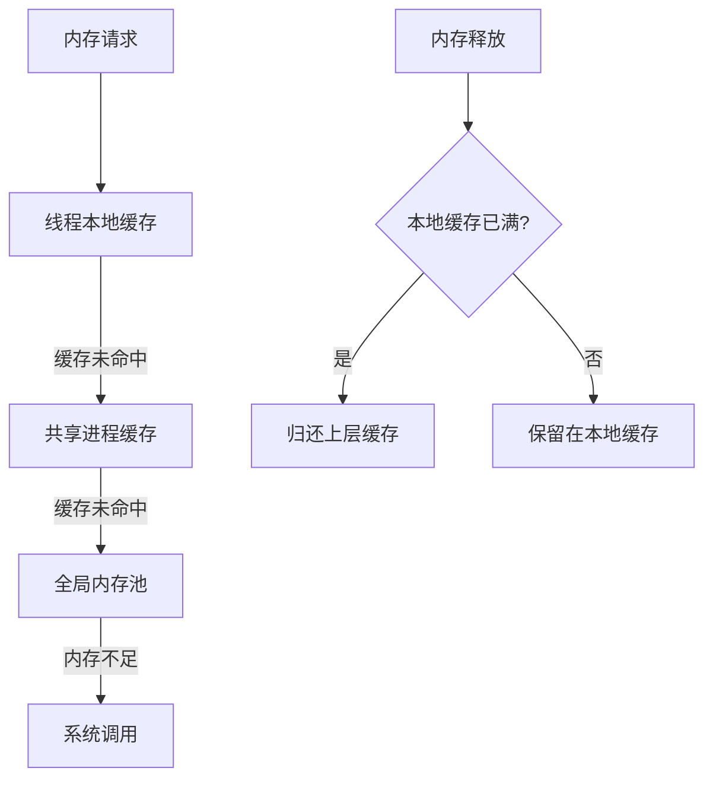
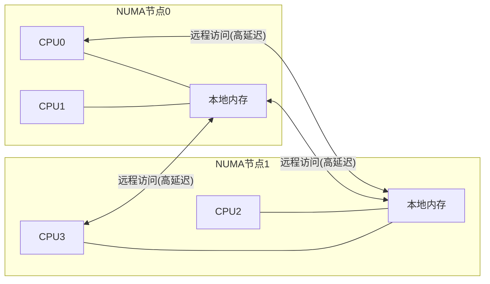
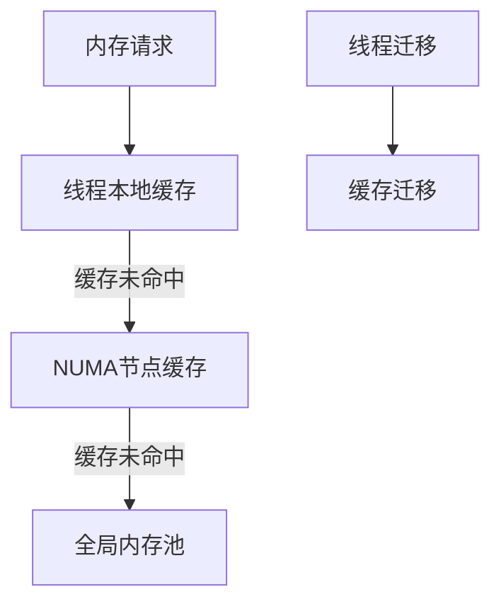
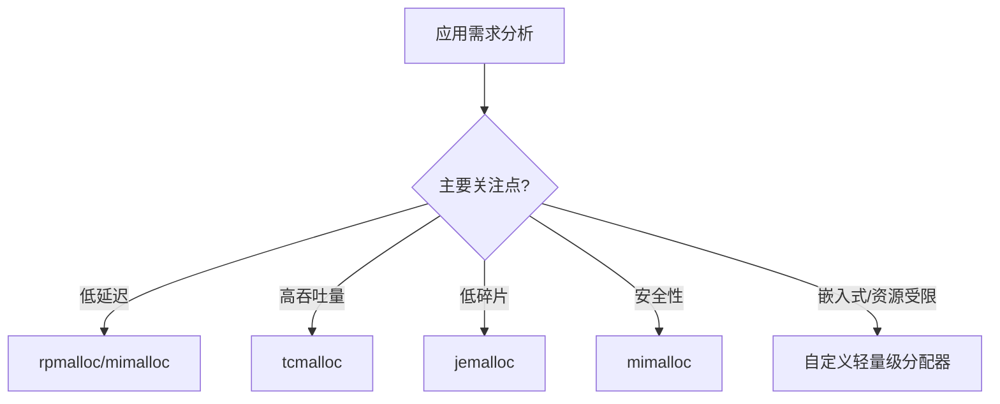

---
tags:
  - 系统编程
  - 内存管理
  - 性能优化
  - C++
  - Rust
---

# 内存分配器优化

## 现代内存分配器概述

内存分配器是系统编程中的关键组件，负责管理堆内存的分配和释放。高性能内存分配器对应用程序性能有显著影响，特别是在内存密集型应用中。

### 内存分配器的核心目标

1. **高性能**：快速分配和释放内存
2. **内存效率**：最小化内存碎片和开销
3. **可扩展性**：在多线程环境中高效工作
4. **稳定性**：避免内存泄漏和崩溃

### 主流高性能内存分配器对比



| 分配器 | 开发者 | 特点 | 适用场景 |
|-------|-------|------|----------|
| ptmalloc | GNU/glibc | 多线程支持，per-thread arena | 通用场景，Linux默认 |
| tcmalloc | Google | 线程缓存，低碎片，高并发 | 网络服务器，大型应用 |
| jemalloc | Facebook/FreeBSD | 精细粒度管理，低碎片 | 长时间运行的服务，数据库 |
| mimalloc | Microsoft | 安全性高，低碎片，高性能 | 需要安全保障的应用 |
| rpmalloc | 开源 | 超轻量级，极低延迟 | 实时系统，游戏引擎 |

## 高性能内存分配器原理

### tcmalloc原理与优化

TCMalloc (Thread-Caching Malloc) 是Google开发的高性能内存分配器，广泛应用于Chrome浏览器和其他Google产品。

#### 核心架构



#### 关键优化技术

1. **线程本地缓存 (Thread Cache)**
   - 每个线程维护独立的小对象缓存
   - 无锁分配，显著减少线程竞争
   - 定期回收过多的缓存对象

2. **大小类别 (Size Classes)**
   - 将内存请求舍入到预定义的大小类别
   - 减少内部碎片和管理开销
   - 典型实现有约80个大小类别

3. **页堆管理 (Page Heap)**
   - 使用伙伴系统管理大块内存
   - 支持快速合并相邻空闲页
   - 维护不同大小的空闲页列表

4. **跨度管理 (Span Management)**
   - 跨度是连续页的集合
   - 使用页映射表快速定位跨度
   - 优化内存回收和合并

### jemalloc原理与优化

Jemalloc是由Facebook维护的高性能内存分配器，最初为FreeBSD开发，现广泛用于高性能服务器和数据库系统。

#### 核心架构



#### 关键优化技术

1. **多层次缓存结构**
   - tcache (线程缓存)
   - arena (内存区域，每个CPU核心一个)
   - bins (按大小分类的内存块容器)

2. **精细的大小分类**
   - 小间隔的大小类别减少内部碎片
   - 指数增长的大小类别覆盖广泛需求

3. **内存碎片追踪与管理**
   - 实时监控内部和外部碎片
   - 自动调整分配策略减少碎片
   - 支持周期性碎片整理

4. **透明大页支持**
   - 利用操作系统大页特性
   - 减少TLB缺失，提高内存访问性能

### mimalloc创新特性

Mimalloc是Microsoft开发的相对较新的内存分配器，专注于安全性和性能。

#### 关键创新

1. **安全堆设计**
   - 隔离元数据和用户数据
   - 防止缓冲区溢出攻击

2. **延迟合并策略**
   - 避免立即合并释放的块
   - 减少碎片整理开销

3. **快速地址计算**
   - 优化的数学计算确定内存块位置
   - 减少指针追踪和间接访问

## 内存池与对象池技术

### 内存池基本原理

内存池是一种预分配大块内存，然后进行高效子分配的技术，可以显著减少系统调用开销和内存碎片。



### 固定大小对象池

适用于频繁分配和释放相同大小对象的场景，如网络连接、缓冲区等。

```cpp
// C++简化的固定大小对象池示例
template <typename T, size_t BlockSize = 4096>
class FixedObjectPool {
    struct Block {
        char data[BlockSize];
        Block* next;
    };

    struct FreeNode {
        FreeNode* next;
    };

    Block* blocks_ = nullptr;
    FreeNode* free_list_ = nullptr;
    std::mutex mutex_;

public:
    T* allocate() {
        std::lock_guard<std::mutex> lock(mutex_);
        if (!free_list_) {
            // 分配新块
            Block* block = new Block;
            block->next = blocks_;
            blocks_ = block;
            
            // 初始化空闲列表
            size_t count = BlockSize / sizeof(T);
            char* data = block->data;
            for (size_t i = 0; i < count; ++i) {
                FreeNode* node = reinterpret_cast<FreeNode*>(data + i * sizeof(T));
                node->next = free_list_;
                free_list_ = node;
            }
        }
        
        // 从空闲列表分配
        FreeNode* node = free_list_;
        free_list_ = node->next;
        return reinterpret_cast<T*>(node);
    }
    
    void deallocate(T* ptr) {
        std::lock_guard<std::mutex> lock(mutex_);
        FreeNode* node = reinterpret_cast<FreeNode*>(ptr);
        node->next = free_list_;
        free_list_ = node;
    }
    
    ~FixedObjectPool() {
        while (blocks_) {
            Block* next = blocks_->next;
            delete blocks_;
            blocks_ = next;
        }
    }
};
```

### 多级缓存设计

多级缓存设计是高性能内存池的关键技术，类似CPU缓存层次结构：

1. **L1缓存**：线程本地缓存，无锁访问
2. **L2缓存**：进程级共享缓存，轻量级锁
3. **L3缓存**：全局内存池，完整锁保护



### 无锁内存池实现

无锁内存池通过原子操作和无锁数据结构实现高并发性能：

```cpp
// C++11无锁空闲列表示例
class LockFreeMemoryPool {
    struct FreeNode {
        FreeNode* next;
    };

    std::atomic<FreeNode*> free_list_{nullptr};
    
public:
    void* allocate(size_t size) {
        // 尝试从空闲列表分配
        FreeNode* old_head = free_list_.load(std::memory_order_relaxed);
        FreeNode* new_head;
        
        do {
            if (!old_head) {
                // 空闲列表为空，从系统分配
                return ::malloc(size);
            }
            new_head = old_head->next;
        } while (!free_list_.compare_exchange_weak(
            old_head, new_head, 
            std::memory_order_release, 
            std::memory_order_relaxed));
        
        return old_head;
    }
    
    void deallocate(void* ptr) {
        if (!ptr) return;
        
        FreeNode* node = static_cast<FreeNode*>(ptr);
        FreeNode* old_head = free_list_.load(std::memory_order_relaxed);
        
        do {
            node->next = old_head;
        } while (!free_list_.compare_exchange_weak(
            old_head, node,
            std::memory_order_release,
            std::memory_order_relaxed));
    }
};
```

### 内存碎片处理策略

1. **合并策略**
   - 即时合并：释放时立即尝试合并相邻块
   - 延迟合并：定期执行碎片整理
   - 从不合并：某些场景下接受碎片换取性能

2. **分配策略**
   - 最佳适配：寻找最接近请求大小的块
   - 首次适配：使用第一个足够大的块
   - 隔离适配：不同大小的请求使用不同的内存池

3. **紧凑技术**
   - 内存压缩：重新排列已分配块
   - 内存迁移：将对象移动到新位置
   - 垃圾回收：自动识别和回收未使用内存

## C++中的内存分配器优化

### 自定义STL分配器

C++标准库容器支持自定义分配器，可以显著提高性能：

```cpp
// 自定义内存池分配器
template <typename T>
class PoolAllocator {
public:
    using value_type = T;
    
    PoolAllocator() noexcept {}
    
    template <typename U>
    PoolAllocator(const PoolAllocator<U>&) noexcept {}
    
    T* allocate(std::size_t n) {
        if (n > std::numeric_limits<std::size_t>::max() / sizeof(T))
            throw std::bad_alloc();
            
        if (auto p = static_cast<T*>(MemoryPool::instance().allocate(n * sizeof(T))))
            return p;
            
        throw std::bad_alloc();
    }
    
    void deallocate(T* p, std::size_t n) noexcept {
        MemoryPool::instance().deallocate(p, n * sizeof(T));
    }
};

// 使用示例
std::vector<int, PoolAllocator<int>> vec;
```

### 智能指针与内存管理

C++智能指针提供自动内存管理，但在高性能场景中需要特别优化：

1. **自定义删除器**：为智能指针指定内存池释放函数

```cpp
// 使用内存池的智能指针
auto custom_deleter = [](void* ptr) { MemoryPool::instance().deallocate(ptr); };
std::unique_ptr<MyObject, decltype(custom_deleter)> ptr(
    static_cast<MyObject*>(MemoryPool::instance().allocate(sizeof(MyObject))),
    custom_deleter
);
```

2. **内存对齐**：确保对象按缓存线对齐，减少伪共享

```cpp
// C++17对齐内存分配
std::aligned_storage<sizeof(T), alignof(T)>::type storage;
T* obj = new (&storage) T();

// C++17 aligned_alloc
void* aligned_mem = std::aligned_alloc(64, size); // 按缓存线对齐
```

3. **对象池与智能指针结合**：实现高效的对象复用

```cpp
template <typename T>
class ObjectPool {
    // 实现略
public:
    std::shared_ptr<T> acquire() {
        T* obj = allocate_from_pool();
        return std::shared_ptr<T>(obj, [this](T* p) { this->return_to_pool(p); });
    }
};
```

## Rust中的内存分配器优化

Rust的所有权系统提供了内存安全保证，同时其灵活的分配器架构允许高性能优化。

### Rust全局分配器

Rust 1.28引入了全局分配器API，允许替换默认的系统分配器：

```rust
// 在Rust中使用jemalloc作为全局分配器
use jemallocator::Jemalloc;

#[global_allocator]
static GLOBAL: Jemalloc = Jemalloc;

fn main() {
    // 所有内存分配都将使用jemalloc
    let vec = vec![1, 2, 3, 4];
}
```

### 自定义分配器实现

Rust允许实现自定义分配器，只需实现`GlobalAlloc` trait：

```rust
use std::alloc::{GlobalAlloc, Layout, System};

// 简单的跟踪分配器示例
struct TracingAllocator;

unsafe impl GlobalAlloc for TracingAllocator {
    unsafe fn alloc(&self, layout: Layout) -> *mut u8 {
        let ptr = System.alloc(layout);
        println!("Alloc: {:p}, size: {}", ptr, layout.size());
        ptr
    }

    unsafe fn dealloc(&self, ptr: *mut u8, layout: Layout) {
        println!("Dealloc: {:p}, size: {}", ptr, layout.size());
        System.dealloc(ptr, layout);
    }
}

#[global_allocator]
static ALLOCATOR: TracingAllocator = TracingAllocator;
```

### 内存池与对象池

Rust中实现高性能内存池需要使用`unsafe`代码，但可以通过安全抽象封装：

```rust
use std::alloc::{alloc, dealloc, Layout};
use std::cell::UnsafeCell;
use std::ptr::NonNull;
use std::sync::Mutex;

// 简化的固定大小对象池
struct ObjectPool<T> {
    free_list: Mutex<Vec<NonNull<T>>>,
    layout: Layout,
}

impl<T> ObjectPool<T> {
    pub fn new() -> Self {
        let layout = Layout::new::<T>();
        ObjectPool {
            free_list: Mutex::new(Vec::new()),
            layout,
        }
    }
    
    pub fn acquire(&self) -> *mut T {
        let mut free_list = self.free_list.lock().unwrap();
        match free_list.pop() {
            Some(ptr) => ptr.as_ptr(),
            None => unsafe { alloc(self.layout) as *mut T }
        }
    }
    
    pub fn release(&self, ptr: *mut T) {
        if !ptr.is_null() {
            let mut free_list = self.free_list.lock().unwrap();
            free_list.push(unsafe { NonNull::new_unchecked(ptr) });
        }
    }
}

impl<T> Drop for ObjectPool<T> {
    fn drop(&mut self) {
        let free_list = self.free_list.get_mut().unwrap();
        for ptr in free_list.drain(..) {
            unsafe { dealloc(ptr.as_ptr() as *mut u8, self.layout); }
        }
    }
}
```

### 无锁内存分配器

Rust的原子类型和内存顺序模型使实现高性能无锁内存分配器成为可能：

```rust
use std::sync::atomic::{AtomicPtr, Ordering};

// 简化的无锁空闲列表示例
struct LockFreePool {
    head: AtomicPtr<Node>,
}

struct Node {
    next: *mut Node,
}

impl LockFreePool {
    pub fn new() -> Self {
        LockFreePool {
            head: AtomicPtr::new(std::ptr::null_mut()),
        }
    }
    
    pub fn acquire(&self) -> *mut u8 {
        let mut current = self.head.load(Ordering::Relaxed);
        
        loop {
            if current.is_null() {
                // 空闲列表为空，从系统分配
                return unsafe { std::alloc::alloc(std::alloc::Layout::new::<Node>()) };
            }
            
            let next = unsafe { (*current).next };
            match self.head.compare_exchange_weak(
                current, next, Ordering::Release, Ordering::Relaxed
            ) {
                Ok(_) => return current as *mut u8,
                Err(new_current) => current = new_current,
            }
        }
    }
    
    pub fn release(&self, ptr: *mut u8) {
        if ptr.is_null() { return; }
        
        let node = ptr as *mut Node;
        let mut current = self.head.load(Ordering::Relaxed);
        
        loop {
            unsafe { (*node).next = current; }
            
            match self.head.compare_exchange_weak(
                current, node, Ordering::Release, Ordering::Relaxed
            ) {
                Ok(_) => break,
                Err(new_head) => current = new_head,
            }
        }
    }
}
```

## NUMA架构下的内存优化

NUMA (Non-Uniform Memory Access) 架构在多处理器系统中引入了内存访问不均匀性，对内存分配器提出了新的挑战。

### NUMA架构基本原理



NUMA架构的关键特性：

1. **非均匀访问延迟**：访问本地内存比远程内存快2-10倍
2. **节点亲和性**：进程/线程应尽量使用本地节点内存
3. **内存带宽隔离**：每个节点有独立的内存带宽

### NUMA感知内存分配器

高性能内存分配器需要针对NUMA架构进行特殊优化：

#### 1. 节点亲和性分配

```cpp
// Linux下的NUMA节点亲和性分配示例
#include <numa.h>
#include <numaif.h>

void* numa_aware_malloc(size_t size) {
    int node = numa_node_of_cpu(sched_getcpu());
    void* ptr = numa_alloc_onnode(size, node);
    return ptr;
}

void numa_aware_free(void* ptr, size_t size) {
    numa_free(ptr, size);
}
```

#### 2. 多层次NUMA缓存



#### 3. 内存页交错

对于需要在多个NUMA节点间共享的大型数据结构，可以使用页交错技术：

```cpp
// 使用libnuma进行页交错分配
void* interleaved_alloc(size_t size) {
    // 在所有在线节点上交错分配
    return numa_alloc_interleaved(size);
}

// 在特定节点集上交错分配
void* custom_interleaved_alloc(size_t size, const int* node_ids, int num_nodes) {
    struct bitmask* nodes = numa_bitmask_alloc(numa_max_node() + 1);
    for (int i = 0; i < num_nodes; i++) {
        numa_bitmask_setbit(nodes, node_ids[i]);
    }
    void* ptr = numa_alloc_interleaved_subset(size, nodes);
    numa_bitmask_free(nodes);
    return ptr;
}
```

### NUMA优化策略

1. **首次接触分配策略**
   - 内存在首次访问时才实际分配到NUMA节点
   - 确保内存分配在使用该内存的线程所在节点

2. **内存绑定**
   - 将进程/线程绑定到特定NUMA节点
   - 将内存分配限制在特定节点集

3. **自动NUMA平衡**
   - Linux内核的AutoNUMA功能
   - 自动检测和迁移内存页到访问频率最高的节点

4. **NUMA感知调度**
   - 调度器考虑内存位置和CPU亲和性
   - 减少跨节点内存访问

## 内存分配器性能对比与分析

### 分配器性能基准测试

不同内存分配器在各种工作负载下的性能对比：

| 分配器 | 小对象分配 | 大对象分配 | 多线程扩展性 | 内存碎片 | 内存占用 |
|-------|----------|----------|------------|---------|--------|
| ptmalloc (glibc) | 中等 | 中等 | 一般 | 较高 | 中等 |
| tcmalloc | 快 | 快 | 优秀 | 低 | 较高 |
| jemalloc | 快 | 快 | 优秀 | 极低 | 中等 |
| mimalloc | 极快 | 快 | 优秀 | 低 | 低 |
| rpmalloc | 极快 | 中等 | 良好 | 中等 | 极低 |

### 真实应用场景性能分析

```mermaid
bar
    title 不同分配器在Web服务器场景下的性能对比
    x-axis [吞吐量(请求/秒)]
    y-axis [内存分配器]
    "ptmalloc" 10000
    "tcmalloc" 14500
    "jemalloc" 15200
    "mimalloc" 15800
```

#### 1. Web服务器场景

- **jemalloc**：在长时间运行的Web服务器中表现最佳，内存碎片率低
- **tcmalloc**：在高并发短连接场景中表现优异
- **mimalloc**：在需要安全保障的Web应用中是理想选择

#### 2. 数据库系统

- **jemalloc**：被PostgreSQL、Redis等采用，碎片管理出色
- **tcmalloc**：在大内存缓存场景中表现良好

#### 3. 游戏引擎

- **rpmalloc**：极低延迟，适合实时系统
- **mimalloc**：安全性和性能平衡，适合多平台游戏

## 内存分配器优化最佳实践

### 选择合适的分配器



### 分配器调优技巧

1. **tcmalloc调优**
   - `TCMALLOC_RELEASE_RATE`：控制内存归还操作系统的速率
   - `TCMALLOC_LARGE_ALLOC_REPORT_THRESHOLD`：报告大内存分配
   - `TCMALLOC_HEAP_PROFILE_ALLOCATION_INTERVAL`：控制堆分析频率

2. **jemalloc调优**
   - `MALLOC_CONF=purge:decay,lg_chunk:20`：控制内存归还和块大小
   - `prof_active:true,prof_leak:true`：启用内存泄漏检测
   - `narenas:N`：设置arena数量，通常设为CPU核心数

3. **mimalloc调优**
   - `MIMALLOC_SHOW_STATS=1`：显示内存使用统计
   - `MIMALLOC_SECURE=1`：启用安全模式
   - `MIMALLOC_LARGE_OS_PAGES=1`：使用大页优化

### 内存分配模式优化

1. **批量分配**：减少分配调用次数

```cpp
// 优化前：频繁小对象分配
for (int i = 0; i < 1000; i++) {
    objects[i] = new Object();
}

// 优化后：批量分配
char* memory = (char*)malloc(1000 * sizeof(Object));
for (int i = 0; i < 1000; i++) {
    objects[i] = new(memory + i * sizeof(Object)) Object();
}
```

2. **对象池复用**：避免频繁分配/释放

```cpp
// 使用对象池处理频繁创建/销毁的对象
template<typename T>
class ObjectPool {
    // 实现略
};

// 使用示例
ObjectPool<Connection> connection_pool(100); // 预分配100个连接对象
Connection* conn = connection_pool.acquire();
// 使用连接
connection_pool.release(conn); // 归还到池中而非销毁
```

3. **内存预分配**：减少动态扩容

```cpp
// 优化前：频繁扩容
std::vector<int> vec;
for (int i = 0; i < 10000; i++) {
    vec.push_back(i); // 可能多次触发扩容和内存复制
}

// 优化后：预分配
std::vector<int> vec;
vec.reserve(10000); // 一次性分配足够空间
for (int i = 0; i < 10000; i++) {
    vec.push_back(i); // 不会触发扩容
}
```

### 内存分析与监控

1. **内存使用分析工具**
   - Valgrind/Massif：详细的堆分析
   - jemalloc的prof功能：内存分配热点分析
   - Google Performance Tools：内存和CPU分析

2. **内存指标监控**
   - 内存碎片率：`实际内存使用 / 申请内存总量`
   - 分配延迟：分配操作的平均/最大延迟
   - 缓存命中率：从本地缓存满足的分配请求比例

3. **自定义内存追踪**

```cpp
// 简单的内存追踪包装器
template <typename Allocator>
class TracingAllocator : public Allocator {
public:
    void* allocate(size_t size) {
        auto start = std::chrono::high_resolution_clock::now();
        void* ptr = Allocator::allocate(size);
        auto end = std::chrono::high_resolution_clock::now();
        
        std::lock_guard<std::mutex> lock(mutex_);
        allocation_count_++;
        allocated_bytes_ += size;
        allocation_time_ += (end - start);
        
        return ptr;
    }
    
    void deallocate(void* ptr, size_t size) {
        std::lock_guard<std::mutex> lock(mutex_);
        deallocation_count_++;
        freed_bytes_ += size;
        
        Allocator::deallocate(ptr, size);
    }
    
    void print_stats() {
        std::lock_guard<std::mutex> lock(mutex_);
        std::cout << "Allocations: " << allocation_count_ << "\n";
        std::cout << "Deallocations: " << deallocation_count_ << "\n";
        std::cout << "Bytes allocated: " << allocated_bytes_ << "\n";
        std::cout << "Bytes freed: " << freed_bytes_ << "\n";
        std::cout << "Average allocation time: " 
                  << std::chrono::duration_cast<std::chrono::nanoseconds>(allocation_time_).count() / 
                     (allocation_count_ ? allocation_count_ : 1) << " ns\n";
    }
    
private:
    std::mutex mutex_;
    size_t allocation_count_ = 0;
    size_t deallocation_count_ = 0;
    size_t allocated_bytes_ = 0;
    size_t freed_bytes_ = 0;
    std::chrono::duration<double> allocation_time_ = std::chrono::duration<double>::zero();
};
```
```
```