---
tags:
  - 系统编程
  - 内存管理
  - 性能优化
  - C++
  - Rust
---

# 内存分配器深度剖析

## 内存分配器基础

内存分配器是系统和应用程序之间的中间层，负责高效地管理堆内存。它接收来自应用程序的内存分配请求，并与操作系统交互以获取和释放物理内存资源。

### 内存分配器的核心职责


1. **内存分配**：响应应用程序的内存请求，返回满足大小要求的内存块
2. **内存释放**：回收不再使用的内存，使其可以被重新分配
3. **内存重分配**：调整已分配内存块的大小
4. **内存碎片管理**：减少内部和外部碎片，提高内存利用率
5. **多线程支持**：在并发环境中高效工作，避免竞争条件
6. **性能优化**：最小化分配/释放操作的延迟和开销

### 内存分配器面临的挑战

1. **性能与内存利用率的权衡**：更快的分配通常意味着更多的内存浪费
2. **碎片化问题**：长时间运行的程序可能导致严重的内存碎片
3. **多线程扩展性**：在高并发环境中保持高性能
4. **局部性优化**：提高缓存命中率和内存访问效率
5. **安全性考虑**：防止缓冲区溢出、释放后使用等内存安全问题

## ptmalloc深度剖析

ptmalloc（pthread malloc）是GNU C库（glibc）中的默认内存分配器，源自dlmalloc，但增加了对多线程的支持。

### 架构设计

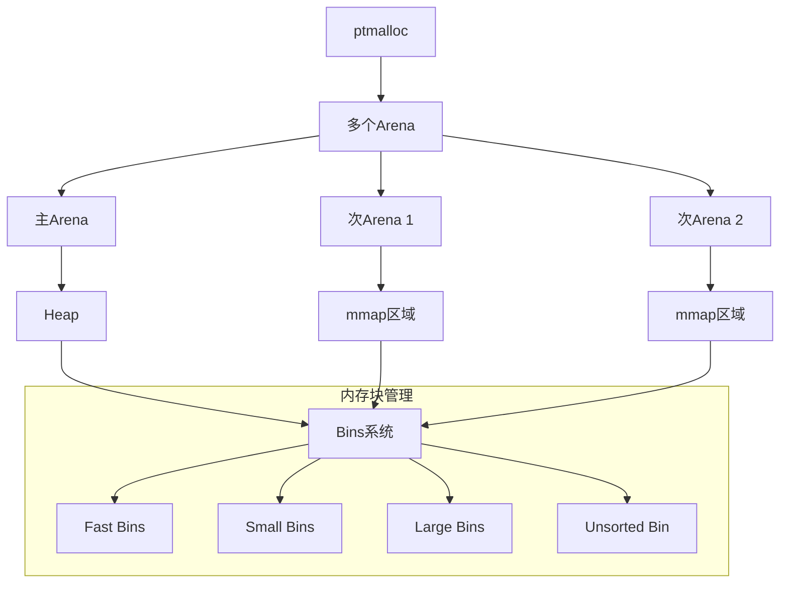

### 核心组件

1. **Arena**：内存分配区域，用于隔离不同线程的内存分配
   - 主Arena：使用sbrk()系统调用管理的连续内存区域
   - 次Arena：使用mmap()系统调用创建的独立内存区域
   - Arena数量通常与CPU核心数相关

2. **Bins系统**：按大小分类管理空闲内存块
   - **Fast Bins**：小内存块的快速缓存（最大约80字节），LIFO队列，不合并
   - **Small Bins**：固定大小的小内存块（最大约512字节），FIFO队列
   - **Large Bins**：不同大小范围的大内存块，按大小排序
   - **Unsorted Bin**：刚释放的内存块先放入此处，延迟合并和分类

3. **Chunk**：内存块的基本单位
   ```c
   struct malloc_chunk {
     size_t prev_size;      // 前一个chunk的大小（如果前一个chunk空闲）
     size_t size;          // 当前chunk的大小和标志位
     struct malloc_chunk* fd;  // 双向链表前向指针（仅用于空闲chunk）
     struct malloc_chunk* bk;  // 双向链表后向指针（仅用于空闲chunk）
     // 仅用于大型空闲块
     struct malloc_chunk* fd_nextsize; // 跳跃链表前向指针
     struct malloc_chunk* bk_nextsize; // 跳跃链表后向指针
   };
   ```

### 内存分配流程

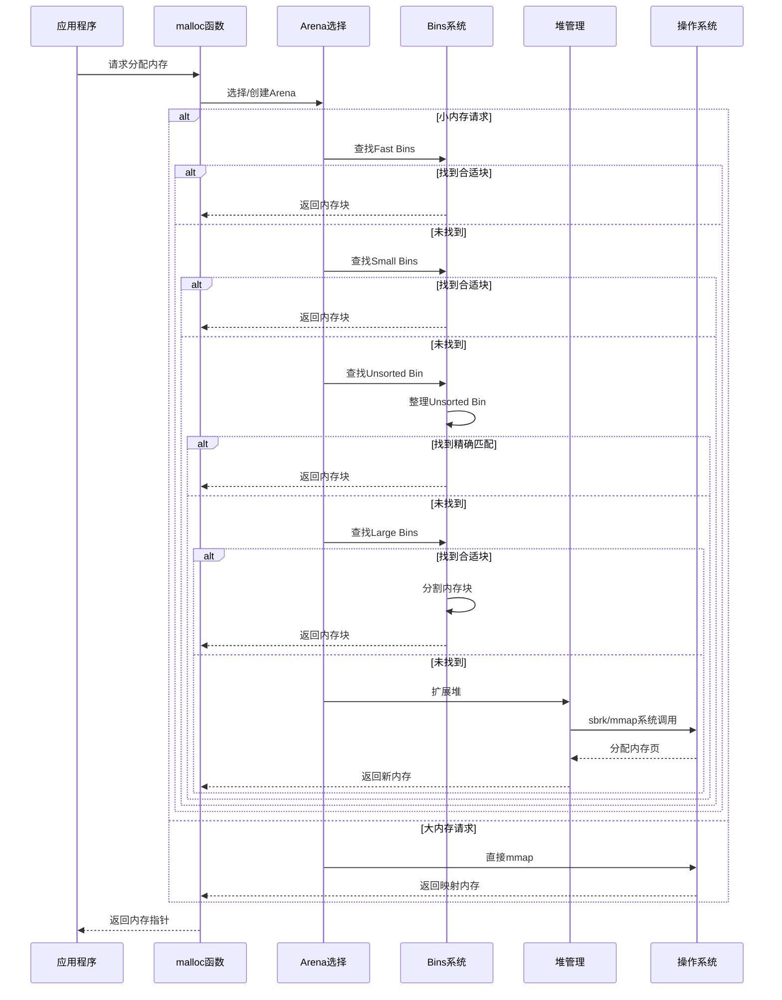

### 内存释放流程

1. 确定内存块所属的Arena
2. 检查相邻块是否空闲，如果是则合并
3. 根据块大小和策略，放入适当的bin中或直接返回操作系统

### ptmalloc的优缺点

**优点**：
- 通用性强，适应各种内存分配模式
- 多线程支持，通过多Arena减少锁竞争
- 内存利用率较高，通过精细的bin系统减少碎片

**缺点**：
- 锁粒度较粗，Arena级别的锁可能成为性能瓶颈
- 内存不会主动归还给操作系统，可能导致内存膨胀
- 内存碎片在长时间运行后可能变得严重
- 元数据开销较大，每个chunk都有额外的管理信息

## tcmalloc深度剖析

tcmalloc（Thread-Caching Malloc）是Google开发的高性能内存分配器，广泛应用于Chrome浏览器和其他Google产品。

### 架构设计

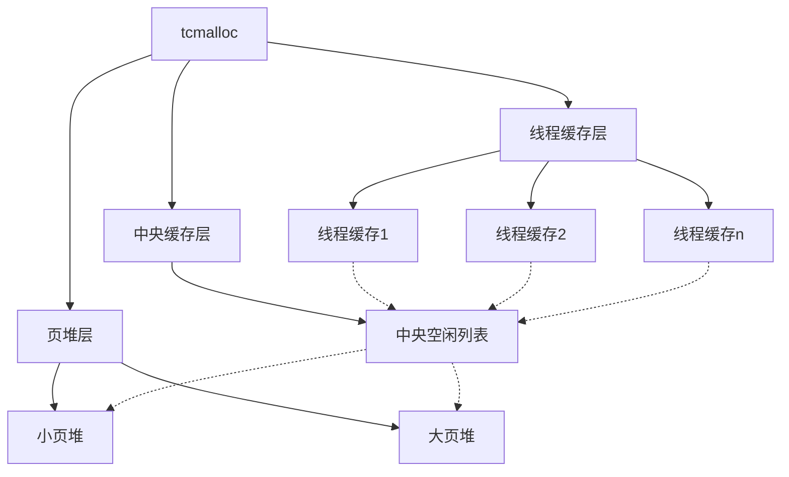

### 核心组件

1. **线程缓存（Thread Cache）**：
   - 每个线程独立的对象缓存
   - 无锁操作，避免线程间竞争
   - 按大小类别组织的自由列表
   - 定期回收过多的缓存对象

2. **中央缓存（Central Cache）**：
   - 所有线程共享的中间层缓存
   - 使用细粒度锁，每个大小类别一个锁
   - 当线程缓存未命中时使用
   - 管理跨度（spans）的分配和回收

3. **页堆（Page Heap）**：
   - 管理从操作系统获取的内存页
   - 使用伙伴系统高效管理大块内存
   - 支持将连续页组合成更大的块
   - 维护不同大小的空闲页列表

4. **大小类别（Size Classes）**：
   - 将内存请求舍入到预定义的大小类别
   - 减少内部碎片和管理开销
   - 典型实现有约170个大小类别

### 内存分配流程

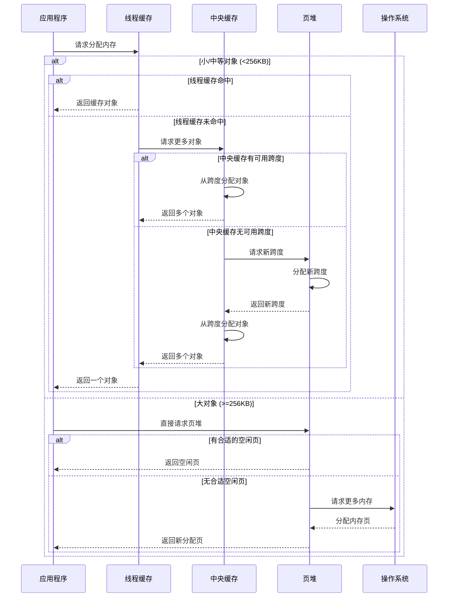

### 内存释放流程

1. 小/中等对象：返回到线程缓存
   - 线程缓存过大时，部分对象返回中央缓存
   - 中央缓存合并空闲跨度，返回页堆

2. 大对象：直接返回页堆
   - 页堆尝试合并相邻空闲页
   - 空闲内存超过阈值时，部分返回操作系统

### 关键优化技术

1. **页映射表（Page Map）**：
   - 快速将地址映射到元数据
   - 三级查找表减少内存占用
   - 支持O(1)时间复杂度的对象定位

2. **跨度（Span）管理**：
   - 跨度是连续页的集合
   - 使用红黑树高效管理空闲跨度
   - 支持快速分配和合并

3. **缓存局部性优化**：
   - 线程缓存使用LIFO策略提高缓存命中率
   - 相关对象分配在相邻内存位置

4. **内存回收机制**：
   - 周期性扫描回收过多的线程缓存对象
   - 基于使用率的自适应缓存大小调整
   - 空闲内存定期返回操作系统

### tcmalloc的优缺点

**优点**：
- 极高的分配/释放性能，特别是小对象
- 出色的多线程扩展性，几乎无锁竞争
- 内存碎片较少，特别是在长时间运行后
- 支持内存使用统计和调试功能

**缺点**：
- 初始内存占用较高，不适合内存受限环境
- 大小类别固定，某些分配模式可能导致内部碎片
- 复杂的实现增加了维护难度

## jemalloc深度剖析

jemalloc是由Facebook维护的高性能内存分配器，最初为FreeBSD开发，现广泛用于高性能服务器和数据库系统。

### 架构设计

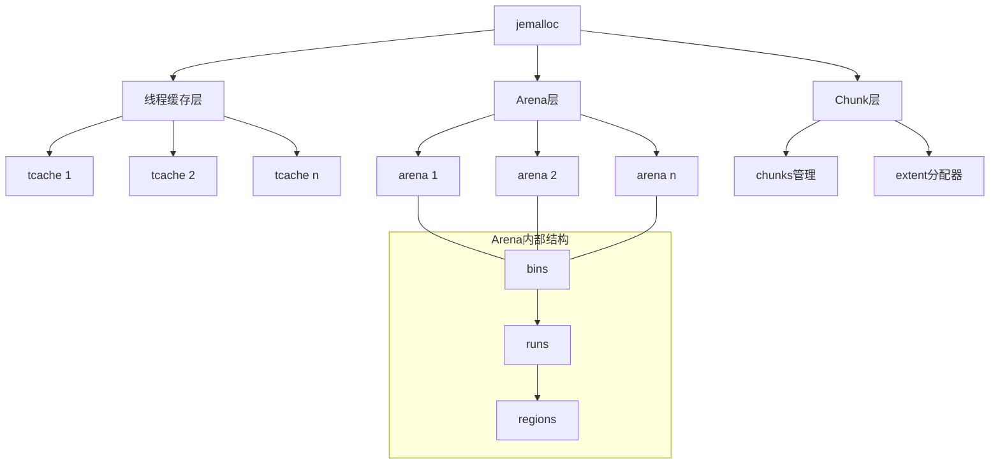

### 核心组件

1. **线程缓存（Thread Cache）**：
   - 每个线程独立的对象缓存
   - 无锁操作，避免线程间竞争
   - 按大小类别组织的自由列表
   - 定期清理过多的缓存对象

2. **Arena**：
   - 内存分配区域，通常每个CPU核心一个
   - 使用细粒度锁，减少竞争
   - 包含多个bins，管理不同大小的内存块
   - 动态调整大小，根据负载平衡资源

3. **Bins和Runs**：
   - Bins：按大小分类的内存块容器
   - Runs：连续内存页的集合，用于分配小/中等对象
   - Regions：Run内部的固定大小内存块

4. **Chunks和Extents**：
   - Chunk：从操作系统获取的大块内存（通常2MB）
   - Extent：内存区域的抽象，可能包含多个chunk
   - 使用红黑树和其他数据结构高效管理

5. **大小类别系统**：
   ```c
   // jemalloc大小类别示例（简化）
   static const size_t small_size_classes[] = {
     8, 16, 32, 48, 64, 80, 96, 112, 128, 160, 192, 224, 256,
     320, 384, 448, 512, 640, 768, 896, 1024, 1280, 1536, 1792,
     2048, 2560, 3072, 3584, 4096, 5120, 6144, 7168, 8192,
     10240, 12288, 14336, 16384
   };
   ```
   - 精细的大小分类减少内部碎片
   - 小间隔的小对象类别（常用大小）
   - 指数增长的大对象类别

### 内存分配流程

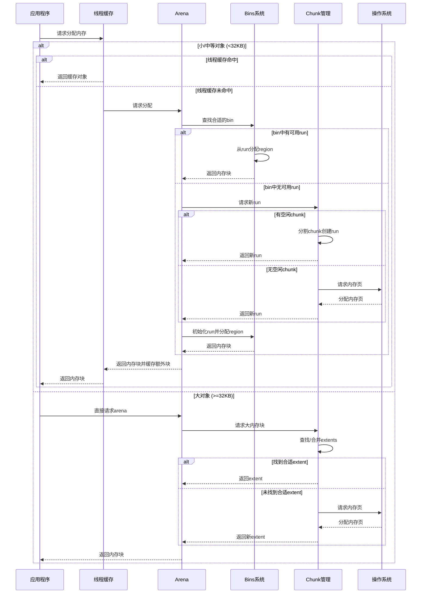

### 内存释放流程

1. 小/中等对象：
   - 首先返回到线程缓存
   - 线程缓存过大时，部分对象返回arena
   - arena合并空闲runs，返回chunk管理器

2. 大对象：
   - 直接返回arena和chunk管理器
   - 尝试与相邻空闲extents合并
   - 根据策略决定是否返回操作系统

### 关键优化技术

1. **精细的内存碎片管理**：
   - 实时监控内部和外部碎片率
   - 自适应调整分配策略减少碎片
   - 定期整理和合并空闲内存

2. **多层次缓存结构**：
   - 线程缓存减少锁竞争
   - arena隔离不同CPU核心的内存分配
   - bins和runs优化不同大小对象的分配

3. **透明大页支持**：
   - 利用操作系统大页特性
   - 减少TLB缺失，提高内存访问性能

4. **内存分析和统计**：
   - 详细的内存使用统计
   - 内存泄漏和碎片检测工具
   - 性能分析和调优接口

### jemalloc的优缺点

**优点**：
- 极低的内存碎片率，特别适合长时间运行的服务
- 出色的多线程扩展性，细粒度锁设计
- 丰富的调试和分析工具
- 内存会定期归还给操作系统，避免内存膨胀
- 广泛应用于高性能系统（如Redis、FreeBSD）

**缺点**：
- 小对象分配性能略低于tcmalloc
- 实现复杂，调优参数众多
- 初始内存占用较高
- 在某些特定工作负载下可能不如专用分配器

## mimalloc深度剖析

mimalloc（Microsoft malloc）是由微软研究院开发的相对较新的内存分配器，专注于安全性和性能的平衡。

### 架构设计

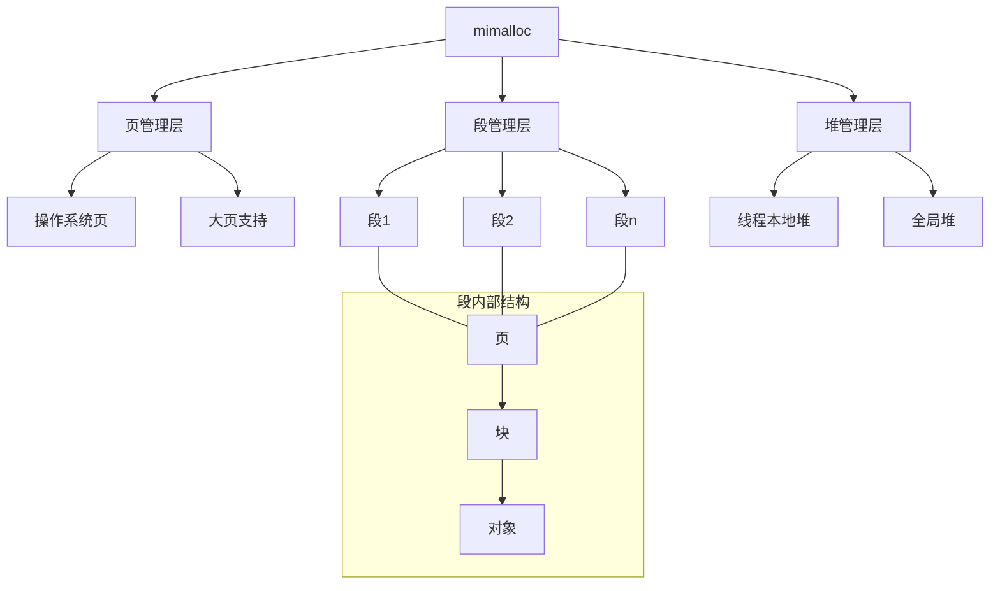

### 核心组件

1. **页（Pages）**：
   - 基本内存管理单元，通常为4KB
   - 每个页专用于特定大小类别的对象
   - 页元数据与用户数据分离，提高安全性

2. **段（Segments）**：
   - 连续内存区域，通常为64MB
   - 包含多个页，用于批量内存管理
   - 支持快速地址计算和对象定位

3. **堆（Heaps）**：
   - 线程本地堆：每个线程独立的内存分配区域
   - 全局堆：共享资源，用于大对象和跨线程释放
   - 支持延迟初始化，减少启动开销

4. **自由列表（Free Lists）**：
   - 本地自由列表：线程私有，无锁操作
   - 延迟自由列表：处理跨线程释放
   - 使用位图跟踪内存块状态

5. **安全堆设计**：
   ```c
   // mimalloc页结构（简化）
   typedef struct mi_page_s {
     // 元数据区（与用户数据分离）
     uint8_t              segment_idx;      // 所属段索引
     uint8_t              block_size;       // 块大小
     uint16_t             reserved;         // 对齐填充
     uint32_t             used;             // 已使用块数
     uint32_t             capacity;         // 总块数
     mi_bitmap_field_t    free_bitmap[MI_BITMAP_FIELD_COUNT]; // 空闲块位图
     // 其他元数据...
     
     // 指向用户数据区的指针（实际数据存储在单独区域）
     void*                blocks;
   } mi_page_t;
   ```

### 内存分配流程

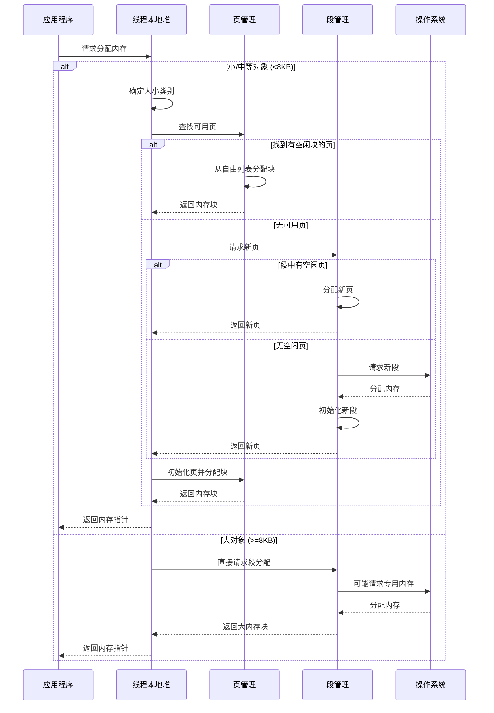

### 内存释放流程

1. **本地释放**：
   - 确定内存块所属的页
   - 更新页的自由列表和位图
   - 如果页完全空闲，可能返回给段

2. **跨线程释放**：
   - 使用延迟自由列表暂存释放的块
   - 定期批量处理延迟释放的内存
   - 避免线程间同步开销

3. **大对象释放**：
   - 直接返回给操作系统或重用
   - 使用引用计数跟踪共享大对象

### 关键优化技术

1. **安全堆设计**：
   - 元数据与用户数据分离
   - 防止缓冲区溢出和释放后使用漏洞
   - 支持随机化和保护页

2. **快速地址计算**：
   - 使用数学计算而非指针追踪
   - 通过位操作快速定位页和段
   - 减少缓存未命中和间接访问

3. **延迟合并策略**：
   - 避免立即合并释放的块
   - 减少碎片整理开销
   - 按需整理内存

4. **大页支持**：
   - 利用操作系统大页特性
   - 减少TLB缺失，提高内存访问性能

### mimalloc的优缺点

**优点**：
- 出色的安全性，防止多种内存相关漏洞
- 极高的分配/释放性能，特别是小对象
- 内存占用较低，适合嵌入式系统
- 简洁的实现，易于维护和集成
- 跨平台支持，包括Windows、Linux、macOS等

**缺点**：
- 相对较新，生产环境验证较少
- 在某些特定工作负载下可能不如专用分配器
- 碎片管理不如jemalloc精细
- 调试和分析工具相对有限

## rpmalloc深度剖析

rpmalloc是一个超轻量级、极低延迟的内存分配器，专为实时系统和游戏引擎设计。

### 架构设计

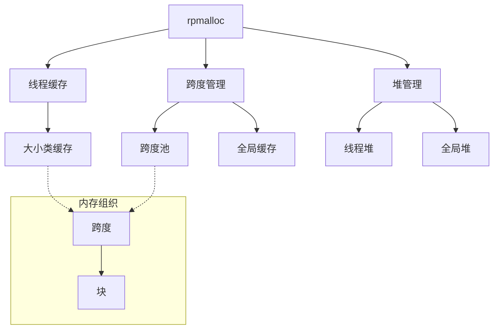

### 核心组件

1. **线程缓存**：
   - 每个线程独立的内存缓存
   - 无锁设计，避免线程间同步
   - 按大小类别组织的自由列表

2. **跨度（Spans）**：
   - 基本内存管理单元，通常为64KB
   - 每个跨度专用于特定大小类别
   - 使用位图跟踪内存块状态

3. **堆（Heaps）**：
   - 线程堆：线程私有的内存管理单元
   - 全局堆：共享资源，用于跨线程操作
   - 极简设计，最小化管理开销

4. **大小类别系统**：
   ```c
   // rpmalloc大小类别示例（简化）
   #define SMALL_CLASS_COUNT       64      // 小对象类别数量
   #define SMALL_GRANULARITY       16      // 小对象粒度
   #define MEDIUM_CLASS_COUNT      32      // 中等对象类别数量
   #define MEDIUM_GRANULARITY      512     // 中等对象粒度
   #define LARGE_CLASS_COUNT       32      // 大对象类别数量
   ```
   - 简化的大小类别，减少决策开销
   - 固定粒度增长，易于计算和管理

### 内存分配流程

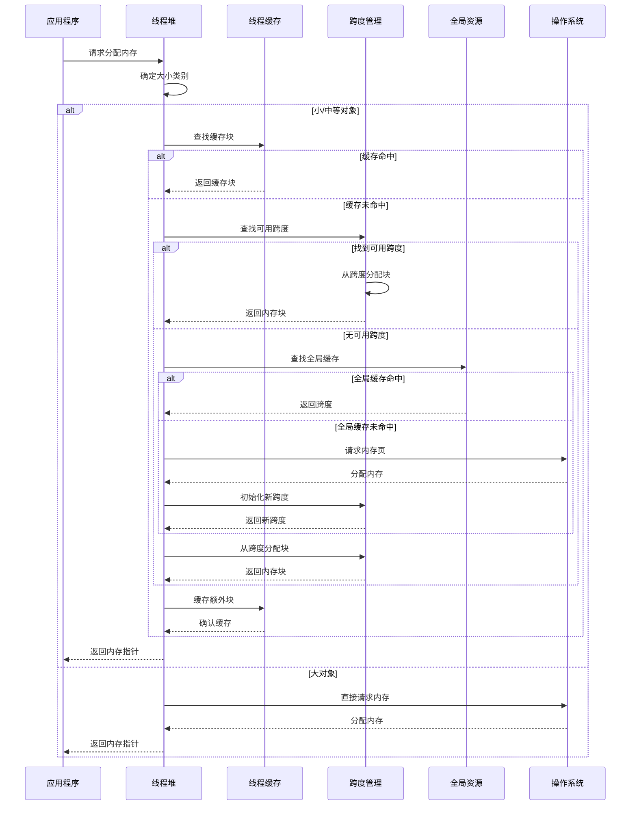

### 内存释放流程

1. **本地释放**：
   - 确定内存块所属的跨度
   - 更新跨度的自由列表和位图
   - 如果跨度完全空闲，可能缓存或释放

2. **跨线程释放**：
   - 使用原子操作安全释放
   - 避免复杂的延迟释放机制
   - 最小化线程间同步开销

### 关键优化技术

1. **极简设计**：
   - 最小化代码路径长度
   - 减少分支预测失败
   - 优化关键路径性能

2. **内存预取**：
   - 预取下一个可能使用的内存块
   - 减少缓存未命中
   - 提高内存访问效率

3. **局部性优化**：
   - 相关对象分配在相邻位置
   - 提高缓存命中率
   - 减少TLB缺失

4. **无锁设计**：
   - 避免线程同步开销
   - 使用原子操作处理并发
   - 最小化线程间干扰

### rpmalloc的优缺点

**优点**：
- 极低的分配/释放延迟，适合实时系统
- 极小的内存占用，适合资源受限环境
- 简洁的代码实现，易于集成和定制
- 出色的多线程扩展性，几乎无锁竞争
- 跨平台支持，包括主流操作系统

**缺点**：
- 功能相对简单，缺乏高级特性
- 调试和分析工具有限
- 内存碎片管理不如jemalloc精细
- 在某些复杂工作负载下可能不如专用分配器
- 社区支持相对较小

## 内存分配器选择指南

### 分配器性能对比

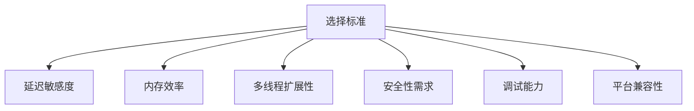

| 分配器 | 小对象分配 | 大对象分配 | 多线程扩展性 | 内存碎片 | 内存占用 |
|-------|----------|----------|------------|---------|--------|
| ptmalloc | 中等 | 中等 | 一般 | 高 | 中等 |
| tcmalloc | 极快 | 快 | 优秀 | 中等 | 高 |
| jemalloc | 快 | 快 | 优秀 | 极低 | 中等 |
| mimalloc | 极快 | 快 | 优秀 | 低 | 低 |
| rpmalloc | 极快 | 中等 | 良好 | 中等 | 极低 |

### 应用场景匹配

1. **长时间运行的服务器应用**：
   - 推荐：jemalloc
   - 原因：低碎片率，定期内存回收，优秀的多线程扩展性

2. **高并发Web服务**：
   - 推荐：tcmalloc
   - 原因：极高的小对象分配性能，出色的线程缓存设计

3. **安全关键型应用**：
   - 推荐：mimalloc
   - 原因：安全堆设计，元数据保护，防止内存相关漏洞

4. **实时系统和游戏引擎**：
   - 推荐：rpmalloc
   - 原因：极低延迟，最小化内存占用，简洁实现

5. **嵌入式系统**：
   - 推荐：自定义轻量级分配器或rpmalloc
   - 原因：资源受限环境需要最小化内存占用

### 选择决策流程

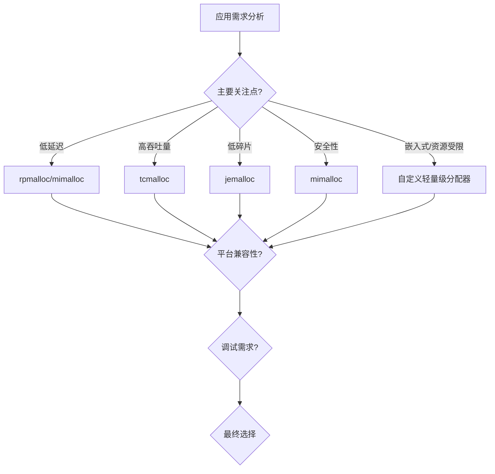

## 实际应用案例

### 案例1：大型Web服务器内存优化

**问题**：一个处理数百万并发连接的Web服务器在长时间运行后出现内存碎片和性能下降。

**解决方案**：
1. 从默认的ptmalloc切换到jemalloc
2. 配置jemalloc的碎片整理参数
3. 启用详细的内存使用统计

**结果**：
- 内存使用减少35%
- 服务器重启频率从每周一次降低到每月一次
- 请求延迟降低15%

### 案例2：游戏引擎内存分配优化

**问题**：一个3D游戏引擎在密集场景中出现帧率下降，分析显示内存分配是主要瓶颈。

**解决方案**：
1. 实现自定义内存池，预分配常用对象
2. 将全局分配器从ptmalloc切换到rpmalloc
3. 优化内存布局提高缓存局部性

**结果**：
- 帧率提升40%
- 内存分配延迟降低80%
- 内存占用略微增加5%，但更加稳定

### 案例3：数据库系统内存管理

**问题**：一个关系型数据库在高负载下内存使用不断增长，最终导致OOM错误。

**解决方案**：
1. 从tcmalloc切换到jemalloc
2. 配置jemalloc的内存回收参数
3. 使用jemalloc的分析工具识别内存泄漏

**结果**：
- 内存使用峰值降低25%
- 系统稳定性显著提高
- 识别并修复了多个内存泄漏问题

## 结论

内存分配器是系统性能的关键组件，选择合适的分配器可以显著提升应用程序的性能、稳定性和资源利用率。不同的分配器针对不同的使用场景进行了优化，了解它们的内部工作原理和权衡取舍，可以帮助开发者做出更明智的选择。

随着硬件和应用需求的不断演进，内存分配器也在持续发展。新一代分配器如mimalloc和rpmalloc展示了创新设计如何解决传统分配器的局限性。对于性能关键型应用，定制或调优内存分配策略仍然是一个值得投入的优化方向。