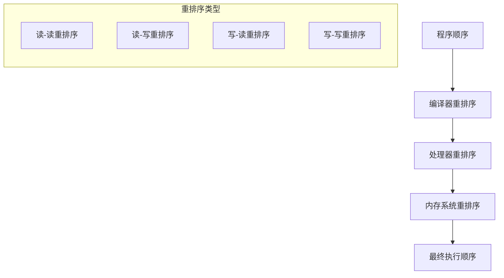
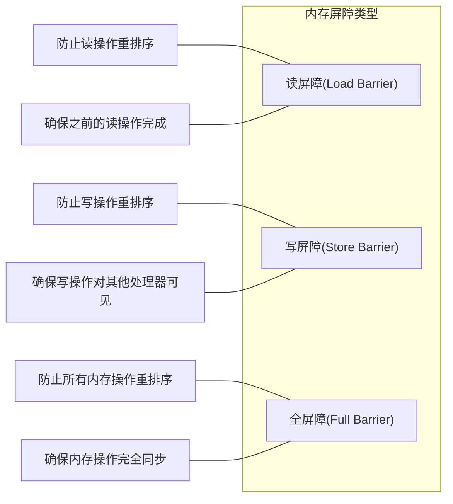
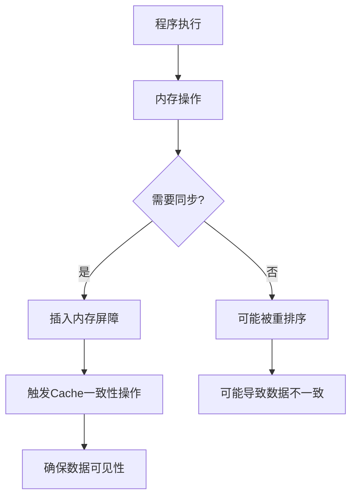

# 内存屏障与Cache一致性

## 内存屏障基本概念

内存屏障（Memory Barrier）是一种同步原语，用于控制处理器执行指令的顺序和内存访问的可见性，确保在多处理器系统中内存操作按照预期顺序执行。

### 内存屏障的主要作用

1. **防止指令重排序**：限制编译器和处理器对内存操作的重排序
2. **保证内存可见性**：确保一个处理器对内存的修改对其他处理器可见
3. **同步多处理器操作**：在多核/多处理器系统中协调内存访问

## 内存模型与重排序



### 重排序类型

1. **编译器重排序**：编译器为了优化性能而改变指令顺序
2. **处理器重排序**：CPU为了提高执行效率而乱序执行指令
3. **内存系统重排序**：由于缓存、写缓冲区等导致的内存操作可见性延迟

## 内存屏障类型



### 不同架构的内存屏障指令

1. **x86/x64架构**
   - `MFENCE`：全内存屏障
   - `SFENCE`：写内存屏障
   - `LFENCE`：读内存屏障

2. **ARM架构**
   - `DMB`：数据内存屏障
   - `DSB`：数据同步屏障
   - `ISB`：指令同步屏障

3. **PowerPC架构**
   - `sync`：同步
   - `lwsync`：轻量级同步
   - `isync`：指令同步

## 编程语言中的内存屏障

### C/C++内存序（Memory Order）

```cpp
std::atomic<int> x = 0;
std::atomic<int> y = 0;

// 线程1
void thread1() {
    x.store(1, std::memory_order_relaxed); // 无同步
    std::atomic_thread_fence(std::memory_order_release); // 释放屏障
    y.store(1, std::memory_order_relaxed);
}

// 线程2
void thread2() {
    while (y.load(std::memory_order_relaxed) == 0) {}
    std::atomic_thread_fence(std::memory_order_acquire); // 获取屏障
    assert(x.load(std::memory_order_relaxed) == 1); // 永远不会失败
}
```

### Java内存模型中的volatile和synchronized

```java
class MemoryBarrierExample {
    private volatile boolean flag = false;
    private int data = 0;
    
    public void writer() {
        data = 42;        // 写入数据
        flag = true;      // volatile写入，包含写屏障
    }
    
    public void reader() {
        if (flag) {       // volatile读取，包含读屏障
            System.out.println(data); // 一定能看到42
        }
    }
}
```

## Cache一致性协议

多处理器系统中，每个处理器都有自己的缓存，需要一致性协议来保证数据的一致性。

### MESI协议

```mermaid
stateDiagram-v2
    [*] --> Invalid
    Invalid --> Modified: 本地写
    Invalid --> Shared: 本地读
    Modified --> Invalid: 其他处理器读/写
    Modified --> Shared: 其他处理器读
    Shared --> Modified: 本地写
    Shared --> Invalid: 其他处理器写
    Exclusive --> Modified: 本地写
    Exclusive --> Shared: 其他处理器读
    Exclusive --> Invalid: 其他处理器写
    Invalid --> Exclusive: 本地读(独占)
    
    state Modified {
        description: "已修改，独占"
    }
    state Exclusive {
        description: "未修改，独占"
    }
    state Shared {
        description: "多处理器共享"
    }
    state Invalid {
        description: "无效状态"
    }
```

### MESI协议状态

1. **Modified（已修改）**：缓存行已被修改，与内存不一致，独占
2. **Exclusive（独占）**：缓存行与内存一致，独占，可直接修改
3. **Shared（共享）**：缓存行与内存一致，多个处理器共享
4. **Invalid（无效）**：缓存行无效，需要从内存或其他缓存获取

## 内存屏障与Cache一致性的关系



### 内存屏障如何影响Cache一致性

1. **写屏障**：确保写操作完成并对其他处理器可见，通常会刷新写缓冲区
2. **读屏障**：确保读取的是最新数据，通常会使本地缓存失效
3. **全屏障**：同时确保读写操作的顺序和可见性

## 实际应用场景

### 无锁数据结构

```cpp
// 简化的无锁队列示例
template<typename T>
class LockFreeQueue {
    struct Node {
        T data;
        std::atomic<Node*> next;
    };
    
    std::atomic<Node*> head;
    std::atomic<Node*> tail;
    
    void enqueue(T value) {
        Node* new_node = new Node{value, nullptr};
        Node* old_tail = tail.load(std::memory_order_relaxed);
        
        while (!tail.compare_exchange_weak(
            old_tail, new_node,
            std::memory_order_release,  // 成功时使用释放语义
            std::memory_order_relaxed)) // 失败时使用宽松语义
        {}
        
        // 更新前一个节点的next指针
        old_tail->next.store(new_node, std::memory_order_release);
    }
};
```

### 双重检查锁定模式

```cpp
// C++11正确的双重检查锁定
class Singleton {
 private:
    static std::atomic<Singleton*> instance;
    static std::mutex mutex;
    
 public:
    static Singleton* getInstance() {
        Singleton* p = instance.load(std::memory_order_acquire);
        if (p == nullptr) {
            std::lock_guard<std::mutex> lock(mutex);
            p = instance.load(std::memory_order_relaxed);
            if (p == nullptr) {
                p = new Singleton();
                instance.store(p, std::memory_order_release);
            }
        }
        return p;
    }
};
```

## 性能考虑

1. **过度使用内存屏障**：会显著降低性能，应谨慎使用
2. **内存屏障开销**：全屏障 > 写屏障 > 读屏障
3. **不同架构差异**：x86提供较强的内存模型，而ARM/PowerPC则更宽松
4. **编译器优化**：编译器可能会优化掉看似无用的内存操作，需要使用volatile或内存屏障防止