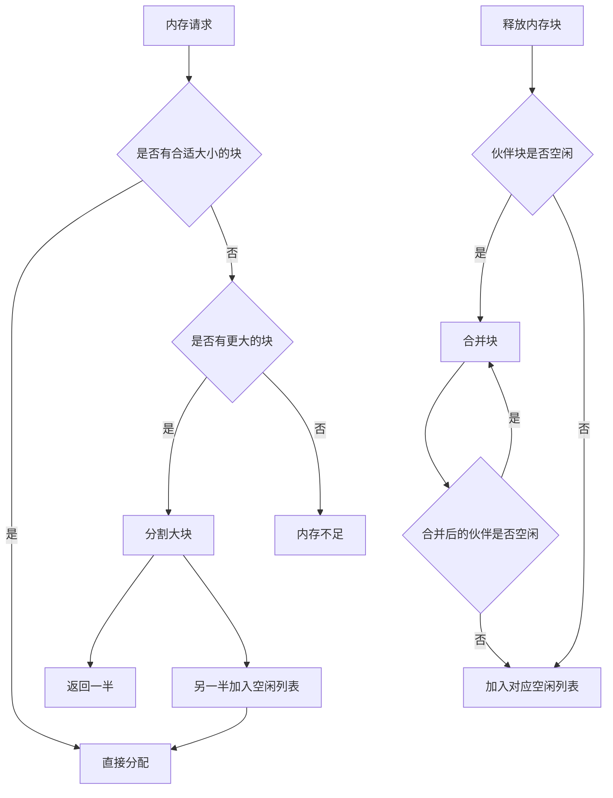
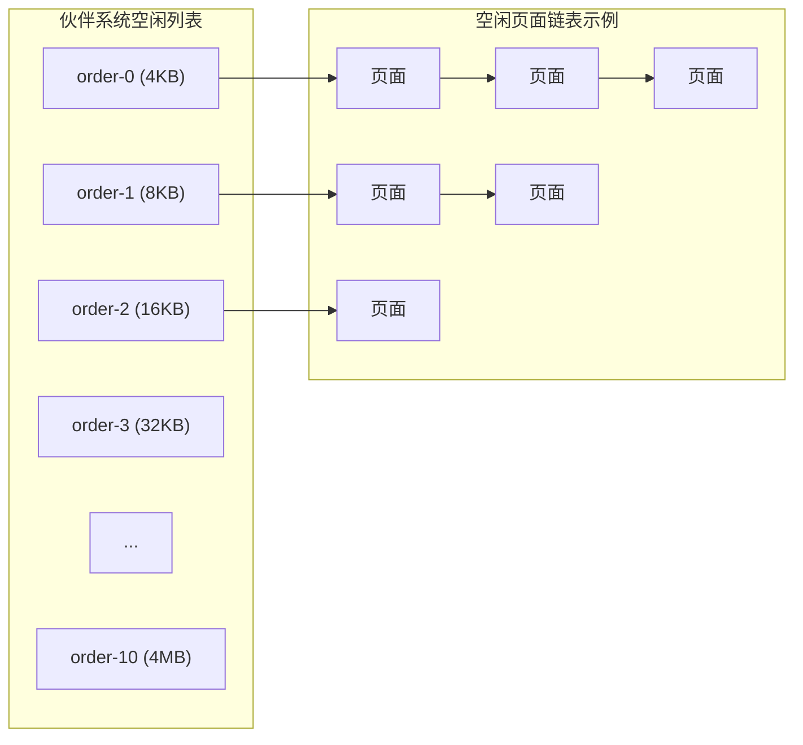
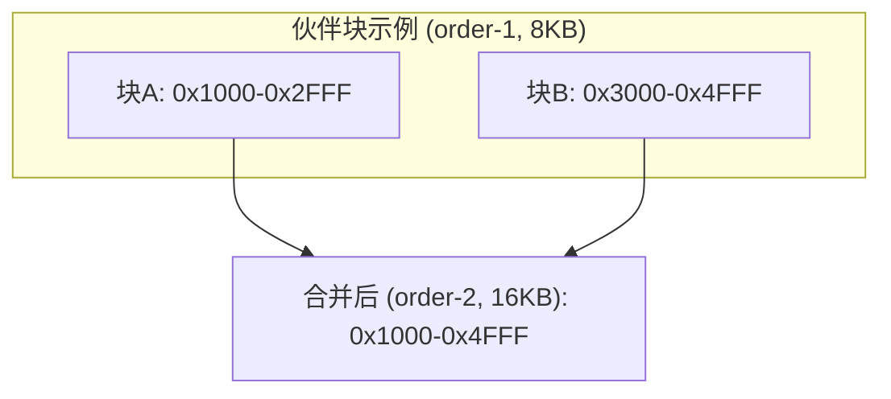
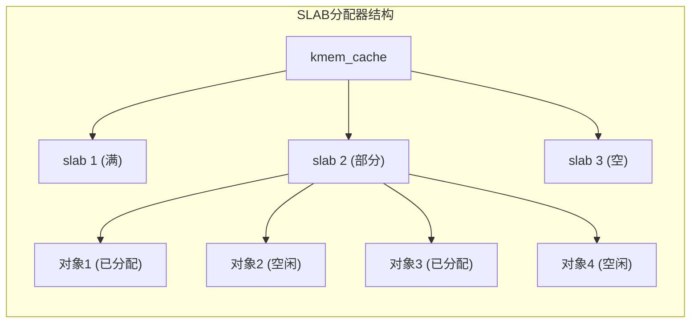
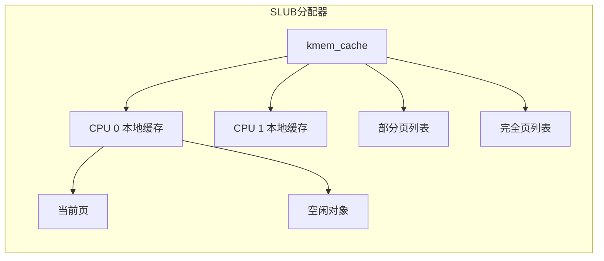
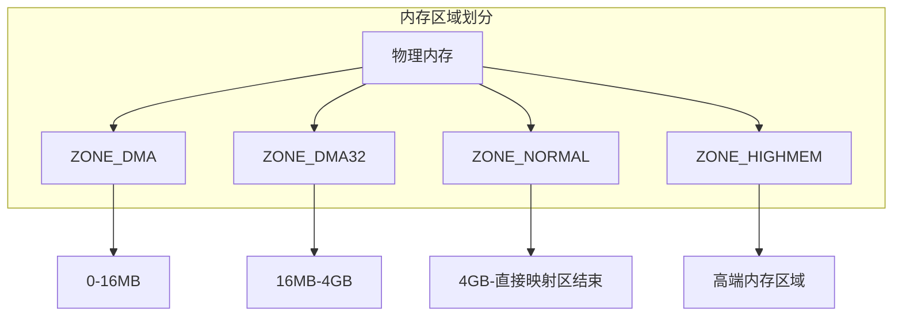
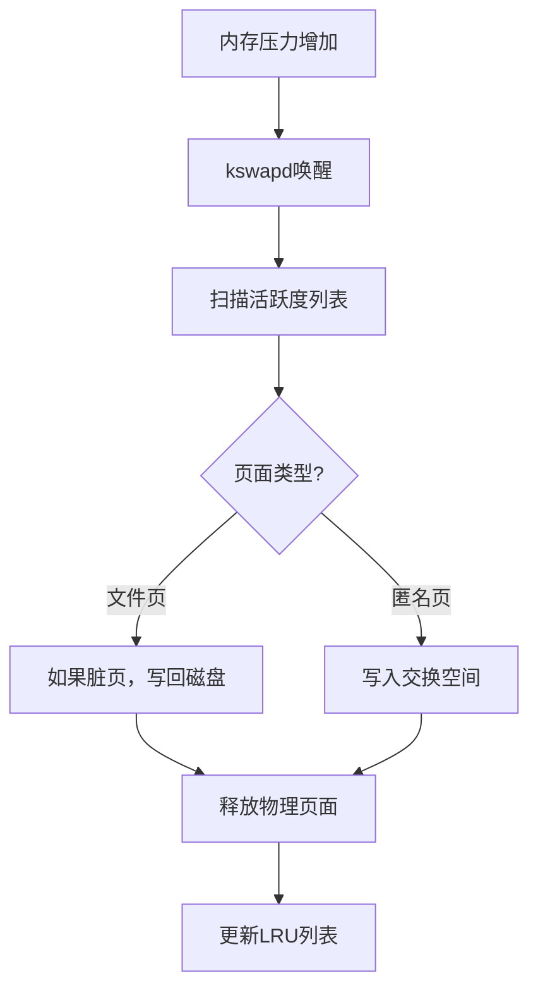
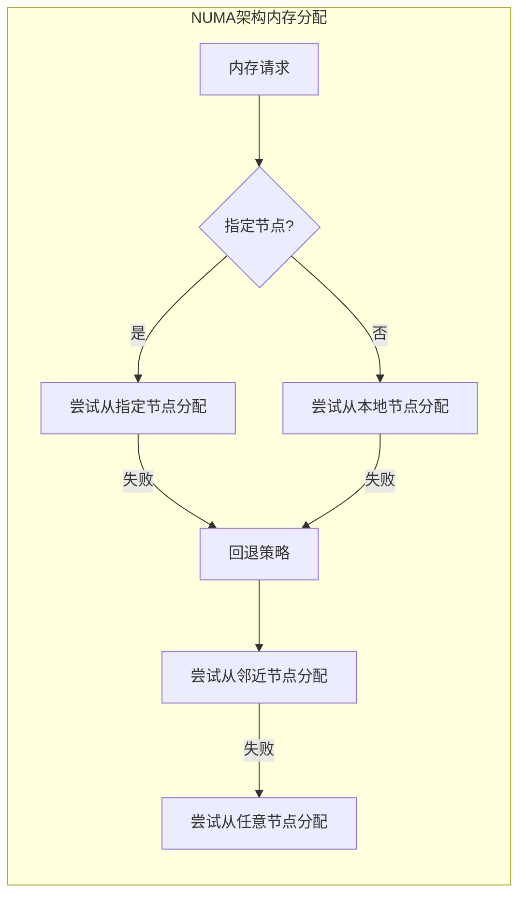

# 内核内存管理

## 内核内存管理概述

内核内存管理是操作系统核心功能之一，负责高效分配和回收内核空间中的内存资源。与用户空间内存管理不同，内核内存管理需要处理更复杂的场景，如中断上下文分配、DMA内存、NUMA架构等。

### 内核内存管理的特点

1. **无虚拟内存保护**：内核代码运行在特权模式，可以访问所有内存
2. **不可分页**：内核内存通常不会被换出到磁盘
3. **多种分配尺寸**：从几字节到几兆字节不等
4. **实时性要求**：某些场景（如中断处理）对分配延迟敏感
5. **碎片敏感**：长时间运行的系统需要最小化内存碎片

## 伙伴系统（Buddy System）

伙伴系统是Linux内核中用于管理物理页面的主要算法，它通过将内存分割为2的幂次大小的块，高效地管理内存分配和释放。

### 伙伴系统工作原理

### 伙伴系统数据结构

### 伙伴关系判定

两个内存块是伙伴的条件：
1. 大小相同（同一order）
2. 物理地址连续
3. 第一个块的起始地址是2^(order+1)的倍数

## 内存分配器

在伙伴系统之上，Linux内核实现了多种内存分配器，用于不同场景的内存分配需求。

### SLAB分配器

SLAB分配器用于高效分配小块内存，它基于对象缓存的概念，为常用内核对象预分配内存。

#### SLAB分配器特点

1. **对象复用**：避免频繁初始化和销毁对象
2. **硬件缓存对齐**：减少缓存失效
3. **着色技术**：减少缓存冲突

### SLUB分配器

SLUB是SLAB的改进版本，简化了管理结构，减少了内存开销。

### SLOB分配器

SLOB（Simple List of Blocks）是为嵌入式系统设计的简单分配器，适用于内存受限的环境。

## 内存区域（Zone）

Linux内核将物理内存划分为不同的区域，以适应硬件限制和特殊需求。

### 内存区域类型

1. **ZONE_DMA**：适用于旧式DMA设备，通常是0-16MB
2. **ZONE_DMA32**：适用于32位DMA设备，通常是16MB-4GB
3. **ZONE_NORMAL**：正常可直接映射的内存
4. **ZONE_HIGHMEM**：高端内存，需要动态映射才能访问

## 内存回收机制

当系统内存不足时，内核需要回收内存以满足新的分配请求。

### 页面回收策略

1. **直接回收**：分配失败时同步回收
2. **kswapd后台回收**：在内存压力下异步回收
3. **最少最近使用(LRU)**：优先回收长时间未访问的页面
4. **页面活跃度跟踪**：通过访问位判断页面活跃度

## NUMA感知内存分配

在NUMA（非统一内存访问）架构中，内存访问延迟取决于内存相对于处理器的位置。

### NUMA优化策略

1. **本地优先**：优先从当前CPU所在节点分配内存
2. **内存策略**：进程可以设置NUMA内存策略
3. **内存迁移**：在可能的情况下将内存页迁移到更接近使用它的CPU
4. **NUMA平衡**：自动检测和修复不良的NUMA放置

## 内核内存调试工具

1. **kmemleak**：内核内存泄漏检测器
2. **SLUB debug**：SLUB分配器调试功能
3. **page_owner**：跟踪页面分配者
4. **memtest**：内存硬件测试工具

## 性能优化考虑

1. **大页支持**：使用2MB或1GB页面减少TLB压力
2. **NUMA感知应用**：应用程序应考虑NUMA拓扑
3. **内存碎片整理**：周期性内存碎片整理
4. **内存控制组**：通过cgroups限制进程内存使用