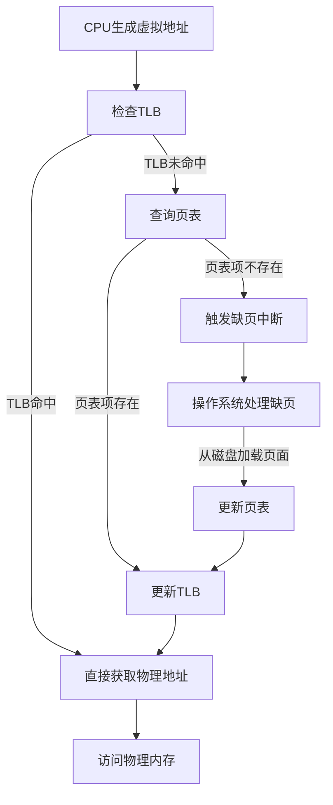
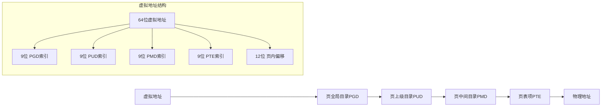
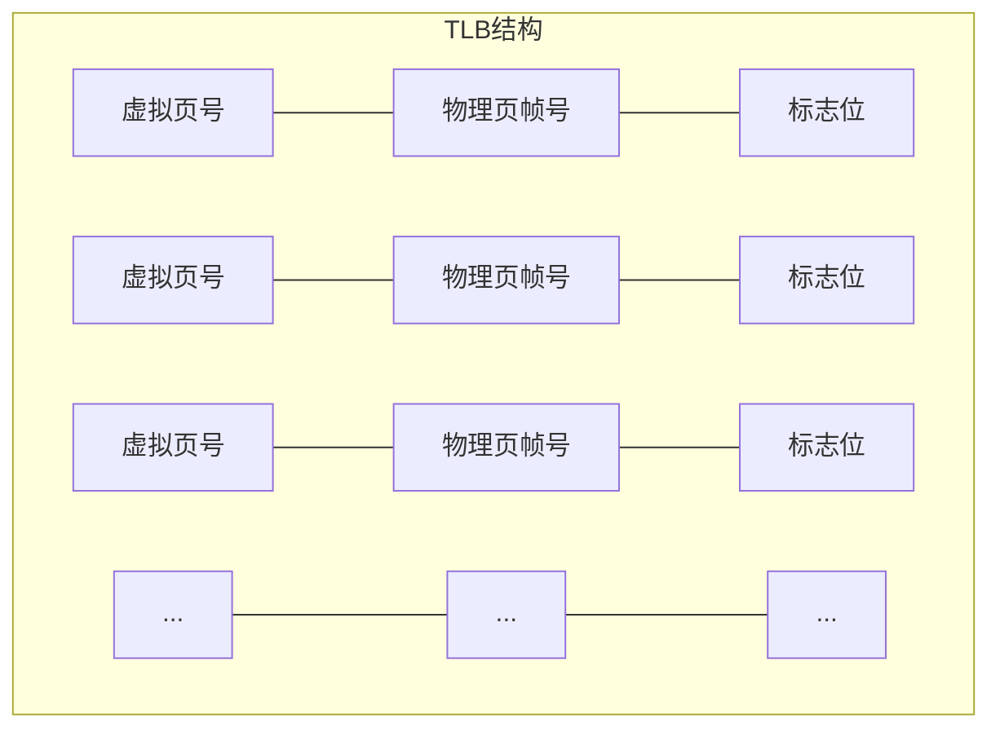

# 虚拟内存、页表、TLB工作原理

## 虚拟内存概述

虚拟内存是一种内存管理技术，为进程提供独立的地址空间，实现了进程间的内存隔离，同时允许程序使用比物理内存更大的地址空间。

### 虚拟内存的主要优势

1. **地址空间隔离**：每个进程拥有独立的虚拟地址空间，互不干扰
2. **内存保护**：防止进程访问非法内存区域
3. **内存映射**：可以将文件映射到内存，简化I/O操作
4. **按需分配**：只有实际使用的内存页才会分配物理内存
5. **超过物理内存限制**：允许运行所需内存超过物理内存的程序

## 地址转换流程

## 页表结构

### 多级页表

为了减少页表占用的内存空间，现代操作系统通常采用多级页表结构。以x86-64架构为例，通常采用4级页表：

### 页表项内容

每个页表项通常包含以下信息：

- 物理页帧号（Physical Page Frame Number）
- 存在位（Present bit）：表示页面是否在物理内存中
- 读/写位（Read/Write bit）：控制页面的读写权限
- 用户/超级用户位（User/Supervisor bit）：控制访问权限
- 脏位（Dirty bit）：表示页面是否被修改过
- 访问位（Accessed bit）：表示页面是否被访问过
- 缓存禁用位（Cache Disable bit）：控制是否缓存该页面

## TLB工作原理

TLB（Translation Lookaside Buffer）是一种硬件缓存，用于加速虚拟地址到物理地址的转换过程。

### TLB结构

### TLB工作流程

1. **TLB查找**：CPU生成虚拟地址后，首先在TLB中查找对应的虚拟页号
2. **TLB命中**：如果找到匹配项，直接使用TLB中的物理页帧号，跳过页表查询
3. **TLB未命中**：如果未找到匹配项，需要查询页表获取物理地址，并将结果更新到TLB
4. **TLB刷新**：当进程切换或页表更新时，需要刷新TLB

### TLB类型

- **指令TLB（ITLB）**：专门用于指令获取的地址转换
- **数据TLB（DTLB）**：专门用于数据访问的地址转换
- **共享TLB（STLB）**：二级TLB，由ITLB和DTLB共享

## 性能优化考虑

1. **页面大小选择**：较大的页面可以减少TLB未命中率，但可能导致内部碎片
2. **TLB预取**：预测并预先加载可能需要的地址转换
3. **超大页（Huge Pages）**：使用2MB或1GB的页面减少TLB压力
4. **NUMA感知内存分配**：在NUMA系统中，将内存分配在靠近使用它的CPU的节点上

## 虚拟内存在现代处理器中的实现

### x86-64架构

- 支持48位虚拟地址空间（256TB）
- 4级页表结构
- 支持4KB、2MB和1GB页面大小

### ARM64架构

- 支持48位虚拟地址空间
- 4级页表结构（类似x86-64）
- 支持4KB、16KB、64KB页面大小