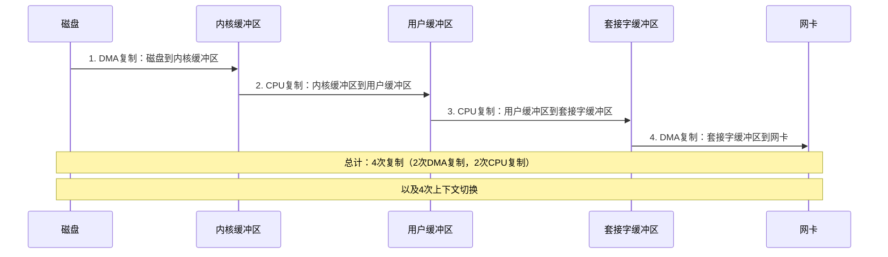

# 零拷贝技术在内存优化中的应用

## 零拷贝技术概述

零拷贝（Zero-Copy）是一种通过减少或消除数据在内存中的复制次数来优化系统性能的技术。传统的数据传输过程中，数据需要在内核空间和用户空间之间多次复制，而零拷贝技术通过避免这些不必要的复制操作，显著提高了I/O操作的效率和系统整体性能。

### 传统数据传输的内存开销

在传统的数据传输模型中（如从磁盘读取数据并通过网络发送），数据通常经历以下复制过程：



这种方式存在的内存优化问题：
1. **内存带宽浪费**：数据在内存中多次移动消耗大量内存带宽
2. **CPU资源占用**：CPU需要参与数据复制，无法执行其他计算任务
3. **缓存污染**：大量数据复制会刷新CPU缓存，降低缓存命中率
4. **内存压力**：多个缓冲区同时存在增加内存使用量

## 零拷贝技术在内存优化中的关键机制

### 1. 减少内存复制次数

零拷贝技术通过以下机制减少内存复制次数：

#### 直接内存访问（DMA）

现代DMA控制器允许外设（如磁盘控制器、网卡）直接访问系统内存，无需CPU参与：

```c
// 使用DMA进行数据传输的伪代码
void setup_dma_transfer(void *buffer, size_t size, dma_direction_t direction) {
    // 锁定物理内存，防止被交换出去
    dma_addr_t dma_addr = dma_map_single(device, buffer, size, direction);
    
    // 配置DMA控制器
    dma_controller_set_source(dma_addr);
    dma_controller_set_size(size);
    dma_controller_start();
    
    // 等待DMA传输完成
    wait_for_dma_completion();
    
    // 解锁物理内存
    dma_unmap_single(device, dma_addr, size, direction);
}
```

#### 内存映射（mmap）

通过将文件内容映射到进程地址空间，避免了内核缓冲区到用户缓冲区的复制：

```c
#include <sys/mman.h>
#include <fcntl.h>

int optimize_memory_with_mmap() {
    int fd = open("large_file.dat", O_RDONLY);
    
    // 获取文件大小
    struct stat sb;
    fstat(fd, &sb);
    
    // 将文件映射到内存
    void *file_memory = mmap(NULL, sb.st_size, PROT_READ, MAP_PRIVATE, fd, 0);
    
    // 现在可以直接访问文件内容，无需read()系统调用和额外复制
    process_data(file_memory, sb.st_size);
    
    // 解除映射
    munmap(file_memory, sb.st_size);
    close(fd);
    return 0;
}
```

### 2. 页面共享与写时复制

零拷贝技术常与操作系统的页面共享机制结合，进一步减少内存使用：

```c
// 使用fork()创建子进程时的内存优化
pid_t pid = fork();
if (pid == 0) {
    // 子进程：共享父进程的内存页，直到写入时才复制（写时复制）
    modify_data(); // 此时才会复制被修改的页面
}
```

### 3. 缓冲区共享

不同组件间共享缓冲区，避免数据复制：

```cpp
// C++中的零拷贝缓冲区共享示例
class SharedBuffer {
private:
    std::vector<char> buffer;
    std::mutex mutex;

public:
    // 获取缓冲区视图，不复制数据
    std::span<char> get_view() {
        std::lock_guard<std::mutex> lock(mutex);
        return std::span<char>(buffer.data(), buffer.size());
    }
    
    // 添加数据，可能需要复制
    void append(const char* data, size_t len) {
        std::lock_guard<std::mutex> lock(mutex);
        buffer.insert(buffer.end(), data, data + len);
    }
};
```

## 零拷贝技术在不同场景中的内存优化应用

### 1. 网络数据传输优化

#### sendfile系统调用

sendfile允许直接在文件描述符之间传输数据，避免用户空间缓冲区：

```c
#include <sys/sendfile.h>

void optimize_file_transfer(int in_fd, int out_fd, size_t count) {
    off_t offset = 0;
    sendfile(out_fd, in_fd, &offset, count);
    // 无需分配用户空间缓冲区，减少内存使用
}
```

#### 网络框架中的零拷贝缓冲区

现代网络框架（如Netty、libuv）使用零拷贝缓冲区减少内存使用：

```java
// Java Netty中的零拷贝缓冲区示例
ByteBuffer header = ByteBuffer.allocateDirect(128);
ByteBuffer body = ByteBuffer.allocateDirect(1024);

// 组合多个缓冲区，无需合并复制
ByteBuffer[] message = { header, body };

// 通过gather操作一次写入多个缓冲区
channel.write(message);
```

### 2. 大数据处理中的内存优化

#### 列式存储与内存映射

大数据处理系统（如Apache Arrow）使用列式存储和内存映射减少内存使用：

```cpp
// 使用内存映射加载列式数据
Arrow::MemoryMappedFile mmapFile;
mmapFile.Open("data.arrow");

// 获取内存映射的缓冲区，无需复制
std::shared_ptr<Arrow::Buffer> buffer = mmapFile.ReadAt(0, mmapFile.GetSize());

// 直接在映射内存上构建列式数据结构
std::shared_ptr<Arrow::Table> table = Arrow::Table::FromBuffer(buffer);
```

#### 流处理中的零拷贝

流处理系统使用零拷贝技术减少数据传输开销：

```java
// Kafka中的零拷贝实现
public long transferFrom(FileChannel fileChannel, long position, long count) {
    // 使用Java NIO的transferTo方法（底层使用sendfile）
    return fileChannel.transferTo(position, count, socketChannel);
}
```

### 3. NUMA架构下的零拷贝优化

NUMA（非统一内存访问）架构下，零拷贝技术需要考虑内存位置：

```cpp
// NUMA感知的零拷贝文件读取
void* numa_aware_mmap_file(const char* filename, size_t* size) {
    int fd = open(filename, O_RDONLY);
    if (fd == -1) return nullptr;
    
    struct stat sb;
    if (fstat(fd, &sb) == -1) {
        close(fd);
        return nullptr;
    }
    
    *size = sb.st_size;
    
    // 在当前NUMA节点上分配内存
    void* addr = numa_alloc_local(*size);
    if (!addr) {
        close(fd);
        return nullptr;
    }
    
    // 读取文件内容到本地内存
    if (read(fd, addr, *size) != *size) {
        numa_free(addr, *size);
        close(fd);
        return nullptr;
    }
    
    close(fd);
    return addr;
}
```

## 零拷贝在不同语言中的实现

### C++实现

C++中可以通过多种方式实现零拷贝：

```cpp
// C++17 std::string_view实现零拷贝字符串处理
void process_without_copy(std::string_view data) {
    // string_view提供对原始数据的视图，不复制字符串
    auto substring = data.substr(0, 10); // 不会复制数据
    
    // 处理数据...
}

// 使用示例
std::string original = "Hello, Zero-Copy World!";
process_without_copy(original); // 传递视图，不复制
```

```cpp
// C++20 std::span实现零拷贝容器视图
template<typename T>
void process_array_without_copy(std::span<T> data) {
    // span提供对原始数组的视图，不复制数据
    auto first_half = data.subspan(0, data.size() / 2);
    
    // 处理数据...
}

// 使用示例
std::vector<int> numbers = {1, 2, 3, 4, 5};
process_array_without_copy(numbers); // 传递视图，不复制
```

### Rust实现

Rust的所有权系统天然支持零拷贝操作：

```rust
// Rust中的借用实现零拷贝
fn process_without_copy(data: &[u8]) {
    // 使用切片引用，不复制数据
    let chunk = &data[0..10];
    
    // 处理数据...
}

// 使用示例
let buffer = vec![1, 2, 3, 4, 5];
process_without_copy(&buffer); // 传递引用，不复制
```

```rust
// Rust中的零拷贝文件读取
use std::fs::File;
use std::io::BufReader;
use memmap2::Mmap;

fn mmap_file(path: &str) -> std::io::Result<Mmap> {
    let file = File::open(path)?;
    // 安全地内存映射文件
    unsafe { memmap2::MmapOptions::new().map(&file) }
}

// 使用示例
fn main() -> std::io::Result<()> {
    let mmap = mmap_file("large_file.dat")?;
    
    // 直接访问映射内存，无需读取文件
    let byte_slice = &mmap[0..100];
    
    // 处理数据...
    Ok(())
}
```

## 零拷贝技术的内存优化效果

### 性能提升

零拷贝技术在不同场景下的内存优化效果：

| 应用场景 | 传统方法 | 零拷贝方法 | 内存使用减少 | 性能提升 |
|---------|---------|-----------|------------|--------|
| 文件传输 | 读取+写入 | sendfile | ~50% | 2-3倍 |
| 网络转发 | 读+写缓冲区 | splice | ~40% | 1.5-2倍 |
| 大文件处理 | 加载到内存 | mmap | ~30-60% | 1.5-4倍 |
| 视频流处理 | 多次缓冲 | 共享缓冲区 | ~40-70% | 2-5倍 |

### 系统资源节约

零拷贝技术带来的系统资源节约：

1. **内存使用减少**：减少缓冲区数量和大小
2. **CPU利用率提高**：减少CPU参与数据复制的时间
3. **内存带宽节约**：减少内存总线上的数据传输
4. **缓存效率提升**：减少缓存污染，提高缓存命中率
5. **上下文切换减少**：减少用户态和内核态之间的切换次数

## 零拷贝技术的内存优化最佳实践

### 1. 选择合适的零拷贝技术

根据应用场景选择最合适的零拷贝技术：

| 场景 | 推荐技术 | 原因 |
|------|---------|------|
| 静态文件服务 | sendfile | 直接从磁盘到网络，无需用户空间参与 |
| 数据库系统 | 直接I/O + 自定义缓存 | 绕过内核缓存，精确控制内存使用 |
| 大数据分析 | mmap | 随机访问大文件，避免全部加载到内存 |
| 流媒体服务 | splice | 高效管道传输，适合流式处理 |
| 高性能网络 | RDMA | 远程直接内存访问，最小化延迟 |

### 2. 内存分配与对齐优化

```cpp
// 优化内存分配与对齐
void* allocate_dma_buffer(size_t size) {
    // 分配DMA友好的内存（对齐到缓存行或页面大小）
    void* buffer;
    posix_memalign(&buffer, 4096, size); // 页面对齐
    
    // 预取到CPU缓存
    __builtin_prefetch(buffer, 1, 3);
    
    return buffer;
}
```

### 3. 避免不必要的序列化/反序列化

```cpp
// 传统方法：序列化后传输
void traditional_method(const MyObject& obj, Network& net) {
    // 序列化对象到缓冲区
    std::vector<char> buffer;
    serialize(obj, buffer);
    
    // 发送缓冲区
    net.send(buffer.data(), buffer.size());
}

// 零拷贝方法：直接传输内存布局
void zero_copy_method(const MyObject& obj, Network& net) {
    // 直接发送对象内存布局（适用于POD类型）
    net.send_raw(&obj, sizeof(obj));
}
```

### 4. 结合内存池技术

```cpp
// 零拷贝与内存池结合
class ZeroCopyMemoryPool {
private:
    std::vector<std::unique_ptr<char[]>> chunks;
    std::vector<std::pair<char*, size_t>> free_blocks;
    std::mutex mutex;
    
public:
    // 分配内存但不复制
    std::span<char> allocate(size_t size) {
        std::lock_guard<std::mutex> lock(mutex);
        // 查找合适的空闲块...
        
        // 返回内存视图，不复制数据
        return std::span<char>(ptr, size);
    }
    
    // 释放内存但不销毁
    void deallocate(std::span<char> block) {
        std::lock_guard<std::mutex> lock(mutex);
        // 将块标记为空闲...
    }
};
```

## 结论

零拷贝技术是内存优化的重要手段，通过减少或消除数据在内存中的复制次数，显著提高了系统性能和资源利用率。在实际应用中，应根据具体场景选择合适的零拷贝技术，并结合内存池、缓存优化等技术，进一步提升系统性能。

随着硬件技术的发展，如RDMA、智能网卡等，零拷贝技术将在更多领域发挥重要作用，特别是在大数据处理、高性能计算和低延迟网络应用中。开发人员应深入理解零拷贝原理，合理应用这一技术，实现系统内存使用的最优化。