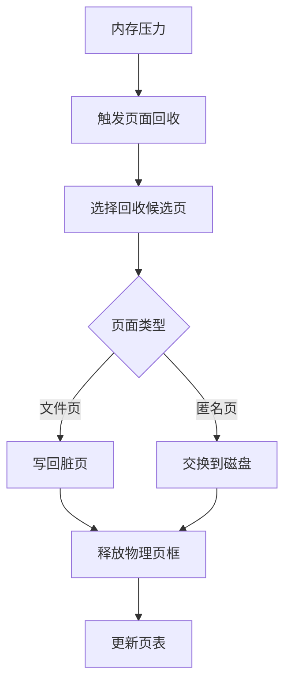
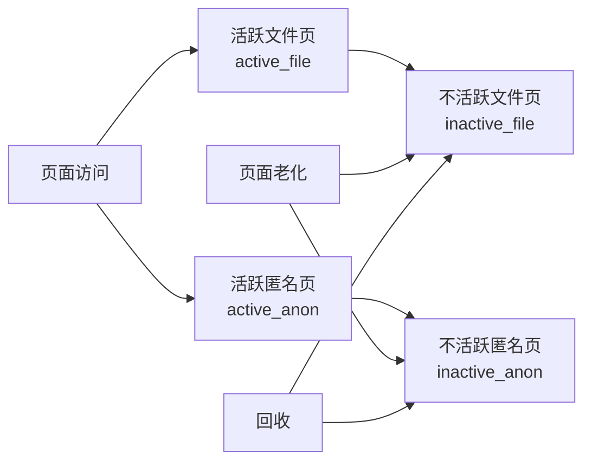
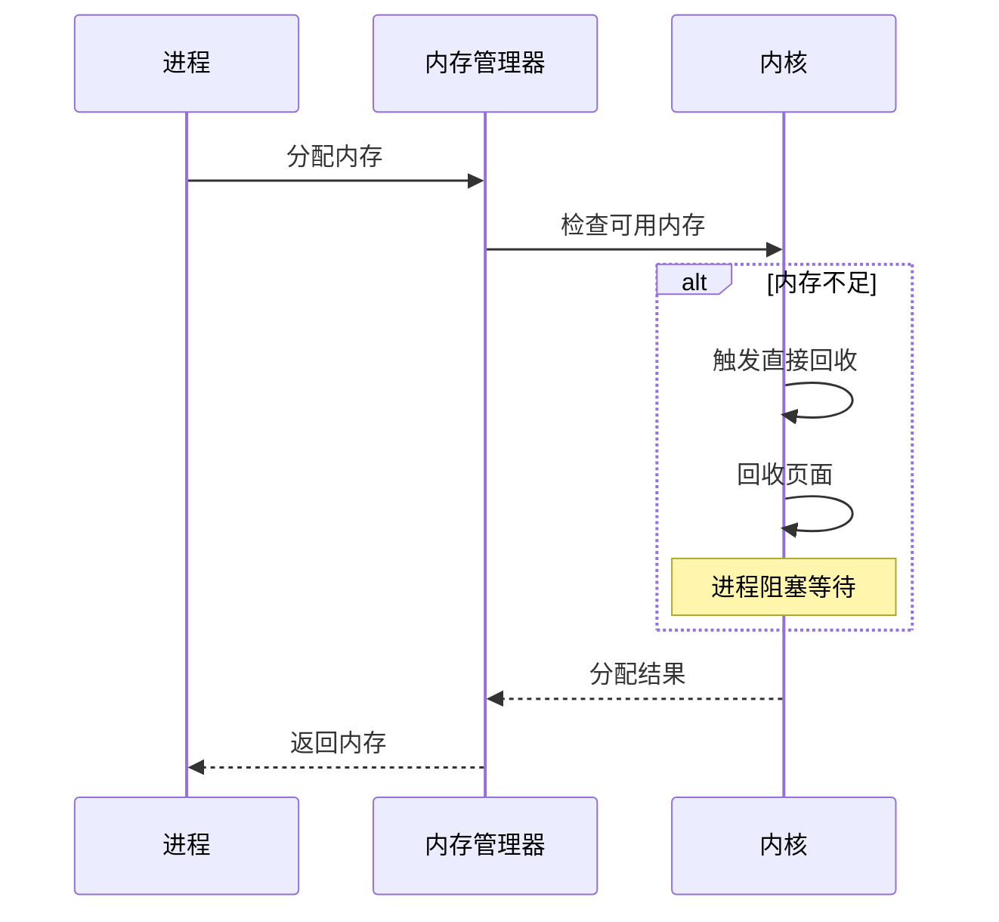
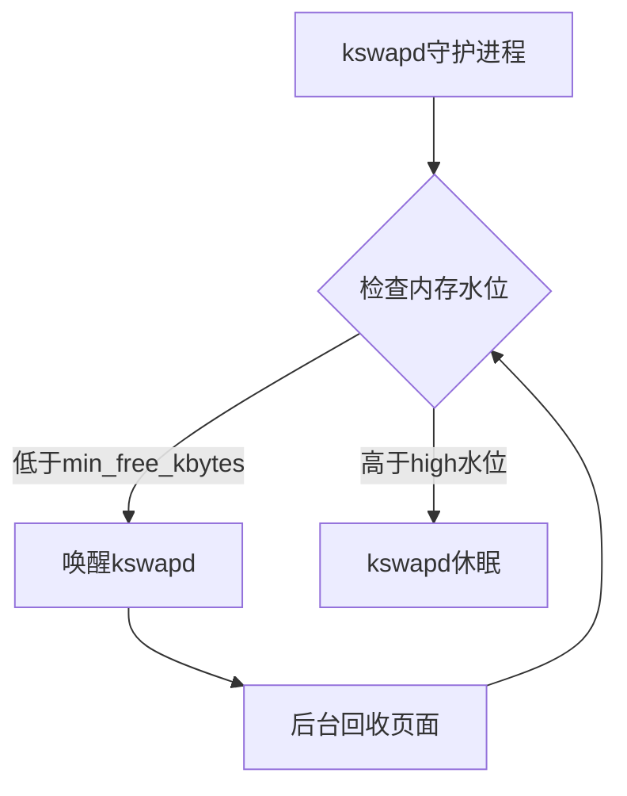
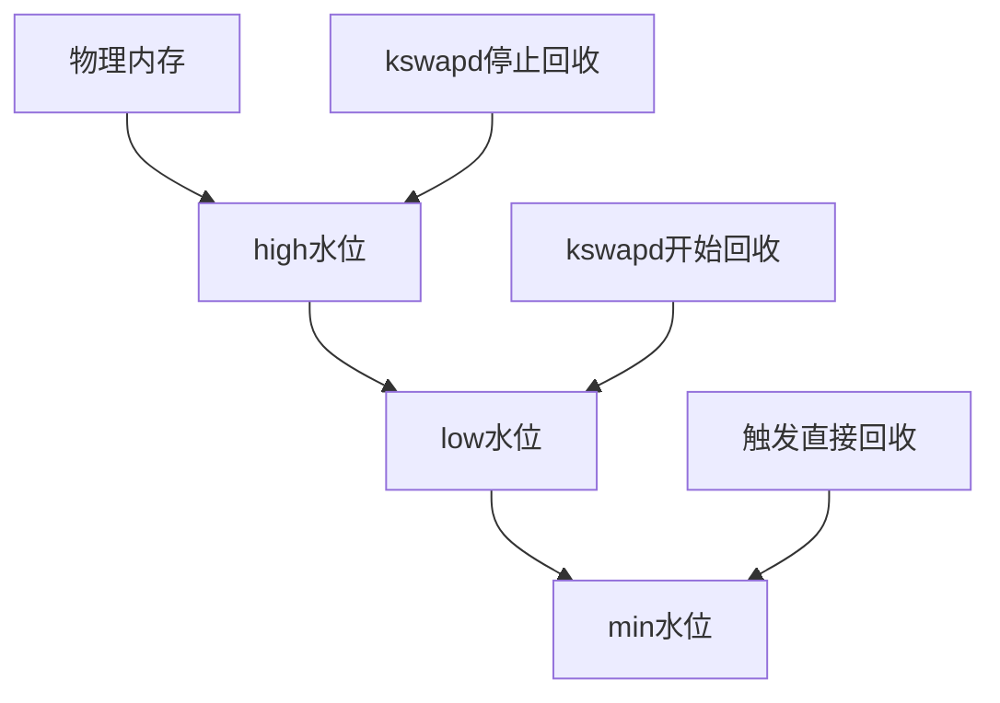
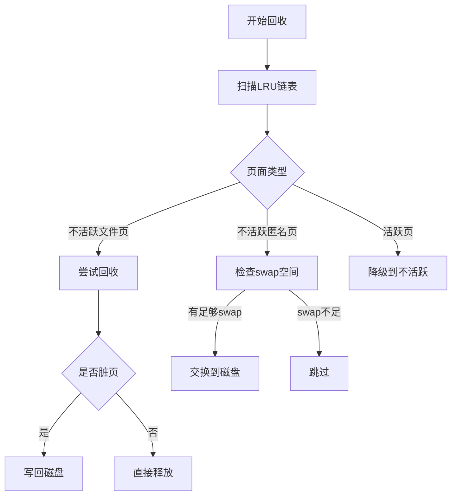
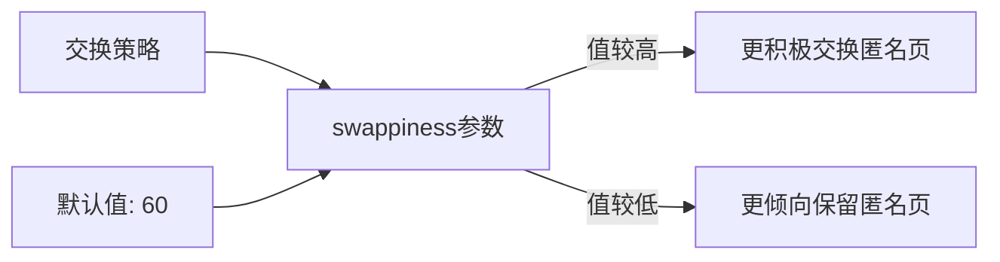
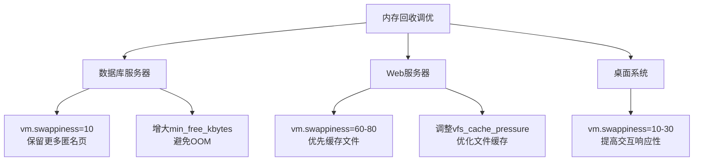
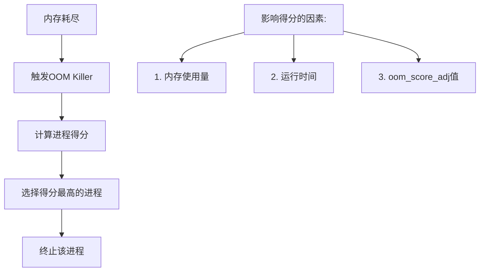

---
tags:
  - 系统编程
  - 内存管理
  - 性能优化
---

# Linux内存页面回收机制详解

## 内存回收基本概念

### 内存回收的必要性

操作系统需要在有限的物理内存资源下，为应用程序提供看似无限的内存空间。当物理内存不足时，系统通过页面回收机制释放不常用的内存页面，以满足新的内存分配请求。

### 页面回收的基本原理



## Linux内存分类与回收策略

### 内存页面类型

1. **文件映射页(File-backed Pages)**：与磁盘文件关联的页面，包括程序代码、内存映射文件等
2. **匿名页(Anonymous Pages)**：没有对应磁盘文件的页面，如堆、栈等
3. **页缓存(Page Cache)**：用于加速文件I/O的缓存
4. **缓冲区(Buffer)**：用于块设备I/O的缓冲区

### LRU链表

Linux使用多级LRU(最近最少使用)链表管理内存页面：



## 回收触发机制

### 直接回收

当系统内存不足，无法满足当前内存分配请求时，触发直接回收(direct reclaim)。这会导致当前进程阻塞，直到回收足够的内存。



### 后台回收

kswapd守护进程负责在后台监控内存使用情况，当内存使用超过特定阈值时，主动回收内存页面。



### 内存水位线



## 页面回收算法

### PFRA (Page Frame Reclaiming Algorithm)

PFRA是Linux内核使用的页面回收算法，它基于以下原则：

1. 优先回收不活跃页面
2. 优先回收文件页而非匿名页
3. 考虑页面的访问频率和脏状态



### 页面老化机制

Linux使用页面访问位和引用计数来跟踪页面的活跃度：

1. 页面被访问时，设置访问位
2. 周期性扫描时，检查访问位并更新页面活跃度
3. 长时间未被访问的页面从活跃链表移至不活跃链表

## 交换空间管理

### 交换区(Swap)配置

交换区可以是专用的交换分区或交换文件：

```bash
# 查看当前交换空间使用情况
swapon -s

# 创建交换文件
dd if=/dev/zero of=/swapfile bs=1M count=1024
mkswap /swapfile
swapon /swapfile
```

### 交换策略



## 内存回收调优

### 关键内核参数

1. **vm.swappiness**：控制匿名页与文件页的回收倾向性
2. **vm.min_free_kbytes**：设置最小空闲内存
3. **vm.vfs_cache_pressure**：控制回收目录项和inode缓存的倾向性
4. **vm.dirty_ratio/vm.dirty_background_ratio**：控制脏页写回策略

```bash
# 查看当前参数值
sysctl -a | grep vm

# 临时修改参数
sysctl -w vm.swappiness=10

# 永久修改参数
echo "vm.swappiness=10" >> /etc/sysctl.conf
sysctl -p
```

### 调优建议



## 监控与分析工具

### 内存使用监控

```bash
# 查看内存使用概况
free -m

# 查看详细内存统计
cat /proc/meminfo

# 查看进程内存使用
top -o %MEM
```

### 页面回收监控

```bash
# 使用vmstat监控页面活动
vmstat 1

# 使用sar监控内存和交换活动
sar -r 1

# 使用/proc/vmstat查看详细统计
cat /proc/vmstat | grep -E 'pgpgin|pgpgout|pswpin|pswpout'
```

### 使用eBPF/BCC工具

```bash
# 跟踪页面回收事件
sudo trace-cmd record -e vmscan:mm_vmscan_direct_reclaim_begin -e vmscan:mm_vmscan_direct_reclaim_end

# 使用BCC工具memleak检测内存泄漏
sudo memleak -p <PID>

# 使用bpftrace跟踪页面回收
sudo bpftrace -e 'tracepoint:vmscan:mm_vmscan_direct_reclaim_begin { printf("direct reclaim started: %s\n", comm); }'
```

## 常见问题与解决方案

### OOM (Out of Memory) Killer

OOM Killer是Linux内核的一种机制，当系统内存严重不足时，选择并终止某些进程以释放内存。



### 调整OOM行为

```bash
# 查看进程的OOM得分
cat /proc/<PID>/oom_score

# 调整进程的OOM优先级
echo -1000 > /proc/<PID>/oom_score_adj  # 降低被杀概率
echo 1000 > /proc/<PID>/oom_score_adj   # 提高被杀概率
```

### 内存碎片化问题

长时间运行的系统可能面临内存碎片化问题，特别是对于需要大块连续内存的应用。

```bash
# 查看内存碎片情况
cat /proc/buddyinfo

# 触发内存压缩
echo 1 > /proc/sys/vm/compact_memory

# 启用透明大页
echo always > /sys/kernel/mm/transparent_hugepage/enabled
```

## 实际案例分析

### 案例1: 数据库服务器内存调优

数据库服务器通常需要大量内存用于缓存数据和索引，避免频繁的页面交换至关重要。

调优步骤：

1. 设置较低的swappiness值（5-10）
2. 增大min_free_kbytes，确保有足够的内存缓冲
3. 监控并调整dirty_ratio参数，避免I/O突发
4. 为关键数据库进程设置较低的oom_score_adj

### 案例2: 高并发Web服务器

高并发Web服务器需要平衡文件缓存和应用内存使用。

调优步骤：

1. 适当提高swappiness值（60-80）
2. 调整vfs_cache_pressure，优化文件缓存
3. 使用cgroup限制各服务的内存使用
4. 监控swap使用情况，避免过度交换

## 总结

Linux内存页面回收机制是内核内存管理的核心组成部分，通过合理配置和调优，可以显著提高系统性能和稳定性。理解页面回收的原理和策略，有助于解决内存相关问题，优化应用程序性能，特别是在资源受限或高负载环境中。