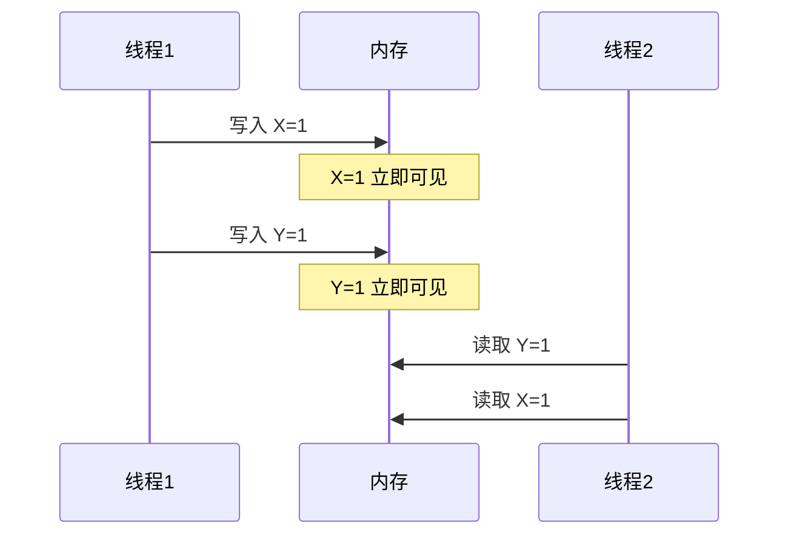
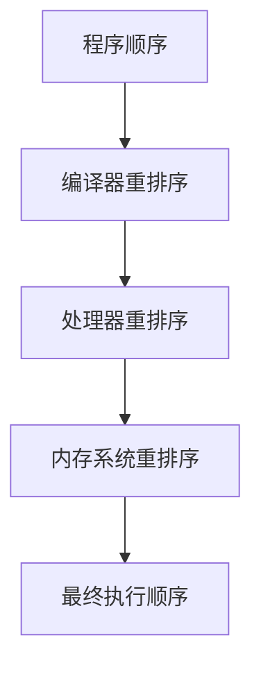
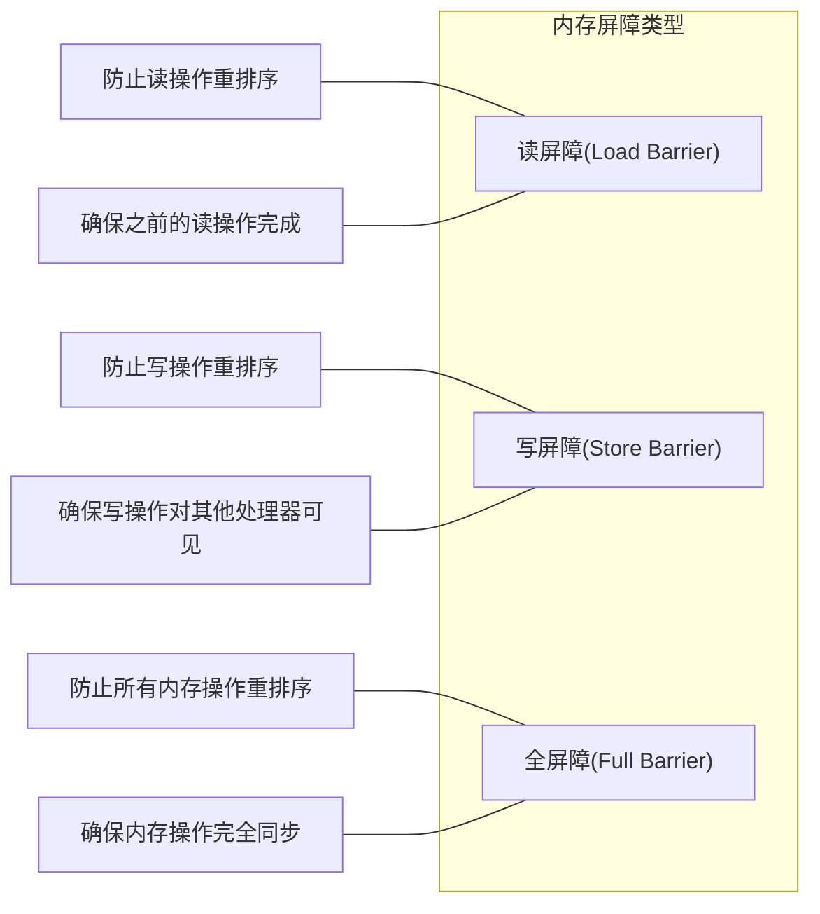

# 内存模型与内存顺序

## 内存模型基础

内存模型定义了多线程程序中内存操作的行为规则，包括操作的可见性、原子性和顺序性。理解内存模型对于编写正确的并发程序至关重要。

### 顺序一致性模型

顺序一致性（Sequential Consistency）是最直观的内存模型，它假设：

1. 程序按照代码的编写顺序执行
2. 所有处理器看到的内存操作顺序相同
3. 所有内存操作立即对所有处理器可见



然而，现代处理器和编译器为了提高性能，会进行指令重排序和内存访问优化，导致实际执行不符合顺序一致性模型。

### 松散内存模型

现代处理器通常采用松散内存模型（Relaxed Memory Model），允许以下重排序：

1. **编译器重排序**：编译器优化导致的指令重排
2. **处理器重排序**：CPU乱序执行导致的指令重排
3. **内存系统重排序**：缓存、写缓冲区等导致的可见性延迟



## 内存屏障类型

内存屏障（Memory Barrier）是一种同步原语，用于控制内存操作的顺序和可见性。

### 基本内存屏障类型

1. **读屏障（Load Barrier）**：
   - 确保读屏障之前的所有读操作先于读屏障之后的读操作完成
   - 防止读-读重排序

2. **写屏障（Store Barrier）**：
   - 确保写屏障之前的所有写操作先于写屏障之后的写操作完成
   - 防止写-写重排序
   - 确保写操作对其他处理器可见

3. **全屏障（Full Barrier）**：
   - 同时具有读屏障和写屏障的功能
   - 防止所有类型的内存操作重排序



## C++内存模型

C++11引入了标准化的内存模型，通过`std::atomic`类型和内存序（memory order）来控制内存操作的顺序和可见性。

### 内存序（Memory Order）

C++提供了六种内存序选项：

1. **memory_order_relaxed**：最宽松的内存序，只保证操作的原子性，不提供同步或顺序保证
2. **memory_order_consume**：数据依赖顺序，保证依赖于当前读取的后续读取按顺序执行（很少使用）
3. **memory_order_acquire**：获取语义，用于读操作，建立与释放操作的同步
4. **memory_order_release**：释放语义，用于写操作，建立与获取操作的同步
5. **memory_order_acq_rel**：同时具有获取和释放语义，用于读-修改-写操作
6. **memory_order_seq_cst**：顺序一致性，最严格的内存序，提供全局总顺序

### 内存序性能比较

| 内存序 | 性能开销 | 同步保证 | 适用场景 |
|-------|---------|---------|----------|
| relaxed | 最低 | 仅原子性 | 计数器、状态标志 |
| acquire | 中等 | 单向同步 | 读取共享数据 |
| release | 中等 | 单向同步 | 写入共享数据 |
| acq_rel | 较高 | 双向同步 | 读-修改-写操作 |
| seq_cst | 最高 | 全序关系 | 需要严格顺序保证的场景 |

### 实际应用示例

#### 使用relaxed内存序的计数器

```cpp
std::atomic<int> counter{0};

void increment() {
    // 只需要原子性，不需要同步
    counter.fetch_add(1, std::memory_order_relaxed);
}

int get_count() {
    // 只需要原子性，不需要同步
    return counter.load(std::memory_order_relaxed);
}
```

#### 使用acquire/release实现同步

```cpp
std::atomic<int> data{0};
std::atomic<bool> flag{false};

void producer() {
    data.store(42, std::memory_order_relaxed);  // 准备数据
    flag.store(true, std::memory_order_release); // 释放，标记数据就绪
}

void consumer() {
    // 获取，等待数据就绪
    while (!flag.load(std::memory_order_acquire)) {
        std::this_thread::yield();
    }
    // 此时能保证看到producer中的数据写入
    assert(data.load(std::memory_order_relaxed) == 42);
}
```

#### 使用seq_cst保证全局顺序

```cpp
std::atomic<bool> x{false};
std::atomic<bool> y{false};
std::atomic<int> z{0};

void thread1() {
    x.store(true, std::memory_order_seq_cst);
}

void thread2() {
    y.store(true, std::memory_order_seq_cst);
}

void thread3() {
    while (!x.load(std::memory_order_seq_cst)) { }
    if (y.load(std::memory_order_seq_cst)) {
        ++z;
    }
}

void thread4() {
    while (!y.load(std::memory_order_seq_cst)) { }
    if (x.load(std::memory_order_seq_cst)) {
        ++z;
    }
}

// 在顺序一致性下，z的最终值一定大于0
```

## Rust内存模型

Rust的内存模型在很大程度上借鉴了C++11的内存模型，但通过所有权系统提供了更强的安全保证。

### Rust的原子类型和内存序

Rust提供了与C++类似的内存序选项：

1. **Relaxed**：最宽松的内存序，只保证原子性
2. **Acquire**：获取语义，用于读操作
3. **Release**：释放语义，用于写操作
4. **AcqRel**：同时具有获取和释放语义
5. **SeqCst**：顺序一致性，最严格的内存序

### Rust示例

#### 使用Relaxed的计数器

```rust
use std::sync::atomic::{AtomicUsize, Ordering};

let counter = AtomicUsize::new(0);

// 只需要原子性，不需要同步
counter.fetch_add(1, Ordering::Relaxed);
```

#### 使用Acquire/Release实现同步

```rust
use std::sync::atomic::{AtomicBool, AtomicUsize, Ordering};
use std::thread;

let data = AtomicUsize::new(0);
let flag = AtomicBool::new(false);

// 生产者线程
let producer = thread::spawn(move || {
    data.store(42, Ordering::Relaxed);  // 准备数据
    flag.store(true, Ordering::Release); // 释放，标记数据就绪
});

// 消费者线程
let consumer = thread::spawn(move || {
    // 获取，等待数据就绪
    while !flag.load(Ordering::Acquire) {
        thread::yield_now();
    }
    // 此时能保证看到producer中的数据写入
    assert_eq!(data.load(Ordering::Relaxed), 42);
});
```

## 内存顺序优化策略

选择合适的内存顺序对于并发程序的性能至关重要。以下是一些优化策略：

### 1. 最小化同步范围

```cpp
// 不推荐：过度同步
void update_data(std::vector<int>& data) {
    std::lock_guard<std::mutex> lock(mutex);  // 锁住整个函数
    for (int i = 0; i < data.size(); ++i) {
        data[i] = process(data[i]);
    }
}

// 推荐：最小化同步范围
void update_data(std::vector<int>& data) {
    for (int i = 0; i < data.size(); ++i) {
        int new_value = process(data[i]);
        {
            std::lock_guard<std::mutex> lock(mutex);  // 只锁住关键部分
            data[i] = new_value;
        }
    }
}
```

### 2. 使用最宽松的内存序

```cpp
// 不推荐：过度使用seq_cst
std::atomic<int> counter{0};
void increment() {
    counter.fetch_add(1);  // 默认使用memory_order_seq_cst
}

// 推荐：使用适当的内存序
void increment_optimized() {
    counter.fetch_add(1, std::memory_order_relaxed);  // 对于简单计数器足够
}
```

### 3. 批量处理同步操作

```cpp
// 不推荐：频繁同步
void process_items(const std::vector<Item>& items) {
    for (const auto& item : items) {
        std::lock_guard<std::mutex> lock(mutex);
        process_item(item);
    }
}

// 推荐：批量处理
void process_items_optimized(const std::vector<Item>& items) {
    std::vector<Result> local_results;
    local_results.reserve(items.size());
    
    // 无锁处理
    for (const auto& item : items) {
        local_results.push_back(process_item_local(item));
    }
    
    // 一次性同步
    {
        std::lock_guard<std::mutex> lock(mutex);
        for (const auto& result : local_results) {
            update_shared_state(result);
        }
    }
}
```

### 4. 使用读写锁替代互斥锁

```cpp
// 不推荐：所有操作使用互斥锁
std::mutex mutex;
int data;

int read_data() {
    std::lock_guard<std::mutex> lock(mutex);
    return data;
}

void write_data(int new_value) {
    std::lock_guard<std::mutex> lock(mutex);
    data = new_value;
}

// 推荐：使用读写锁
std::shared_mutex rwlock;

int read_data_optimized() {
    std::shared_lock<std::shared_mutex> lock(rwlock);  // 共享锁
    return data;
}

void write_data_optimized(int new_value) {
    std::unique_lock<std::shared_mutex> lock(rwlock);  // 独占锁
    data = new_value;
}
```

## 内存顺序常见陷阱

### 1. 双重检查锁定问题

```cpp
// 错误的双重检查锁定
Singleton* getInstance() {
    if (instance == nullptr) {  // 第一次检查，无锁
        std::lock_guard<std::mutex> lock(mutex);
        if (instance == nullptr) {  // 第二次检查，有锁
            instance = new Singleton();  // 问题：构造和赋值可能被重排序
        }
    }
    return instance;
}

// 正确的双重检查锁定（C++11）
std::atomic<Singleton*> instance{nullptr};
Singleton* getInstance() {
    Singleton* p = instance.load(std::memory_order_acquire);
    if (p == nullptr) {
        std::lock_guard<std::mutex> lock(mutex);
        p = instance.load(std::memory_order_relaxed);
        if (p == nullptr) {
            p = new Singleton();
            instance.store(p, std::memory_order_release);
        }
    }
    return p;
}
```

### 2. 忽略内存序导致的竞态条件

```cpp
// 错误：忽略内存序
std::atomic<bool> ready{false};
int data = 0;

void producer() {
    data = 42;  // 非原子操作
    ready.store(true);  // 默认memory_order_seq_cst
}

void consumer() {
    while (!ready.load()) {}  // 默认memory_order_seq_cst
    assert(data == 42);  // 可能失败！
}

// 正确：使用适当的内存序
void producer_fixed() {
    data = 42;
    ready.store(true, std::memory_order_release);
}

void consumer_fixed() {
    while (!ready.load(std::memory_order_acquire)) {}
    assert(data == 42);  // 一定成功
}
```

### 3. 过度使用内存屏障

```cpp
// 不推荐：过度使用内存屏障
std::atomic<int> counter{0};

void increment_all(int n) {
    for (int i = 0; i < n; ++i) {
        counter.fetch_add(1, std::memory_order_seq_cst);  // 每次操作都使用全序
    }
}

// 推荐：只在必要时使用强内存序
void increment_all_optimized(int n) {
    for (int i = 0; i < n; ++i) {
        counter.fetch_add(1, std::memory_order_relaxed);  // 中间操作使用宽松序
    }
    // 如果需要，最后一次操作使用更强的内存序
    std::atomic_thread_fence(std::memory_order_seq_cst);
}
```

## 不同架构下的内存模型差异

不同处理器架构的内存模型存在显著差异，这会影响并发程序的行为和性能。

### x86/x64架构

x86架构提供了相对较强的内存模型（TSO - Total Store Order）：

- 写-写操作不会重排序
- 读-读操作不会重排序
- 读-写操作不会重排序
- 写-读操作可能会重排序（通过写缓冲区）

```cpp
// 在x86上，这段代码几乎不需要内存屏障
void x86_example() {
    x.store(1, std::memory_order_relaxed);
    // 在x86上，不需要写屏障，写操作已经有序
    y.store(1, std::memory_order_relaxed);
}
```

### ARM/PowerPC架构

ARM和PowerPC提供了更宽松的内存模型：

- 写-写操作可能重排序
- 读-读操作可能重排序
- 读-写操作可能重排序
- 写-读操作可能重排序

```cpp
// 在ARM上，这段代码需要显式内存屏障
void arm_example() {
    x.store(1, std::memory_order_relaxed);
    // 在ARM上，需要写屏障确保顺序
    std::atomic_thread_fence(std::memory_order_release);
    y.store(1, std::memory_order_relaxed);
}
```

### 跨平台考虑

编写跨平台并发代码时，应该：

1. 使用标准库提供的内存序，而不是依赖特定架构的行为
2. 在性能关键路径上，可以针对特定架构优化内存序使用
3. 全面测试在不同架构上的行为

## 线程模型与内存模型的关系

线程模型定义了线程的创建、调度和同步机制，而内存模型定义了线程间共享内存的访问规则。两者紧密相关：

1. **线程创建**：创建线程时，需要确保线程能看到正确的初始内存状态
2. **线程同步**：同步原语（如互斥锁、条件变量）依赖内存模型提供的保证
3. **线程终止**：终止线程时，需要确保其他线程能看到终止线程的最终内存状态

```cpp
// 线程创建与内存模型
std::vector<int> data;
std::atomic<bool> ready{false};

void prepare_data() {
    data.push_back(42);
    ready.store(true, std::memory_order_release);  // 确保数据对新线程可见
}

void thread_func() {
    while (!ready.load(std::memory_order_acquire)) {}  // 等待数据准备好
    // 此时能看到完整的data
    process(data);
}

int main() {
    std::thread t1(prepare_data);
    std::thread t2(thread_func);
    t1.join();
    t2.join();
    return 0;
}
```

## 总结

内存模型和内存顺序是并发编程中至关重要的概念，它们定义了多线程程序中内存操作的行为规则。理解和正确使用内存模型可以帮助开发者编写高效、正确的并发程序。

关键要点：

1. **选择合适的内存序**：根据实际需求选择最宽松但足够的内存序
2. **理解同步关系**：acquire/release配对使用建立同步关系
3. **避免常见陷阱**：如双重检查锁定问题、过度同步等
4. **考虑架构差异**：不同处理器架构的内存模型存在显著差异
5. **性能与正确性平衡**：在保证正确性的前提下优化性能

let counter = AtomicUsize::new(0);

// 只需要原子性，不需要同步
counter.fetch_add(1, Ordering::Relaxed);
```

#### 使用Acquire/Release实现同步

```rust
use std::sync::atomic::{AtomicBool, AtomicUsize, Ordering};
use std::thread;

let data = AtomicUsize::new(0);
let flag = AtomicBool::new(false);

// 生产者线程
let producer = thread::spawn(move || {
    data.store(42, Ordering::Relaxed);  // 准备数据
    flag.store(true, Ordering::Release); // 释放，标记数据就绪
});

// 消费者线程
let consumer = thread::spawn(move || {
    // 获取，等待数据就绪
    while !flag.load(Ordering::Acquire) {
        thread::yield_now();
    }
    // 此时能保证看到producer中的数据写入
    assert_eq!(data.load(Ordering::Relaxed), 42);
});
```

## 内存顺序优化策略

选择合适的内存顺序对于并发程序的性能至关重要。以下是一些优化策略：

### 1. 最小化同步范围

```cpp
// 不推荐：过度同步
void update_data(std::vector<int>& data) {
    std::lock_guard<std::mutex> lock(mutex);  // 锁住整个函数
    for (int i = 0; i < data.size(); ++i) {
        data[i] = process(data[i]);
    }
}

// 推荐：最小化同步范围
void update_data(std::vector<int>& data) {
    for (int i = 0; i < data.size(); ++i) {
        int new_value = process(data[i]);
        {
            std::lock_guard<std::mutex> lock(mutex);  // 只锁住关键部分
            data[i] = new_value;
        }
    }
}
```

### 2. 使用最宽松的内存序

```cpp
// 不推荐：过度使用seq_cst
std::atomic<int> counter{0};
void increment() {
    counter.fetch_add(1);  // 默认使用memory_order_seq_cst
}

// 推荐：使用适当的内存序
void increment_optimized() {
    counter.fetch_add(1, std::memory_order_relaxed);  // 对于简单计数器足够
}
```

### 3. 批量处理同步操作

```cpp
// 不推荐：频繁同步
void process_items(const std::vector<Item>& items) {
    for (const auto& item : items) {
        std::lock_guard<std::mutex> lock(mutex);
        process_item(item);
    }
}

// 推荐：批量处理
void process_items_optimized(const std::vector<Item>& items) {
    std::vector<Result> local_results;
    local_results.reserve(items.size());
    
    // 无锁处理
    for (const auto& item : items) {
        local_results.push_back(process_item_local(item));
    }
    
    // 一次性同步
    {
        std::lock_guard<std::mutex> lock(mutex);
        for (const auto& result : local_results) {
            update_shared_state(result);
        }
    }
}
```

### 4. 使用读写锁替代互斥锁

```cpp
// 不推荐：所有操作使用互斥锁
std::mutex mutex;
int data;

int read_data() {
    std::lock_guard<std::mutex> lock(mutex);
    return data;
}

void write_data(int new_value) {
    std::lock_guard<std::mutex> lock(mutex);
    data = new_value;
}

// 推荐：使用读写锁
std::shared_mutex rwlock;

int read_data_optimized() {
    std::shared_lock<std::shared_mutex> lock(rwlock);  // 共享锁
    return data;
}

void write_data_optimized(int new_value) {
    std::unique_lock<std::shared_mutex> lock(rwlock);  // 独占锁
    data = new_value;
}
```

## 内存顺序常见陷阱

### 1. 双重检查锁定问题

```cpp
// 错误的双重检查锁定
Singleton* getInstance() {
    if (instance == nullptr) {  // 第一次检查，无锁
        std::lock_guard<std::mutex> lock(mutex)