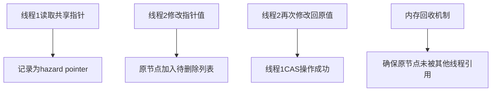
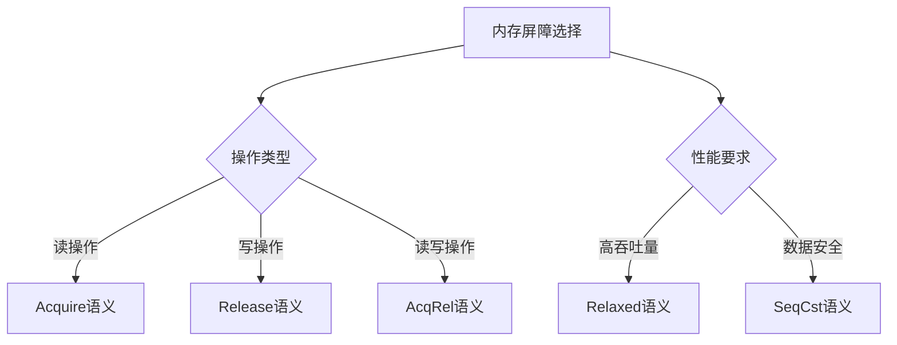

# 锁优化与无锁编程技术

## 锁的基础与性能特性

### 锁的类型与性能特点

| 锁类型 | 实现机制 | 性能特点 | 适用场景 |
|-------|---------|---------|----------|
| 互斥锁(Mutex) | 操作系统原语 | 阻塞型，上下文切换开销大 | 长时间持有的锁 |
| 自旋锁(Spinlock) | 忙等待循环 | 非阻塞，CPU占用高 | 短时间持有的锁 |
| 读写锁(RWLock) | 读共享/写独占 | 读多写少场景高效 | 读多写少的数据结构 |
| 递归锁(Recursive) | 允许重入 | 额外计数开销 | 递归调用场景 |
| 条件变量 | 等待/通知机制 | 避免忙等待 | 生产者/消费者模式 |

### 锁的性能开销来源


## 读写锁实现与优化

### 读写锁的基本原理

读写锁允许多个读者同时访问共享资源，但写者必须独占访问。这种锁在读多写少的场景中特别有效。

### C++实现

#### 基于std::shared_mutex的读写锁

```cpp
#include <shared_mutex>
#include <unordered_map>
#include <string>

class OptimizedCache {
    mutable std::shared_mutex mutex;
    std::unordered_map<std::string, std::string> data;

public:
    // 读操作 - 共享锁
    std::string get(const std::string& key) const {
        std::shared_lock<std::shared_mutex> lock(mutex);
        auto it = data.find(key);
        return it != data.end() ? it->second : "";
    }
    
    // 写操作 - 独占锁
    void set(const std::string& key, const std::string& value) {
        std::unique_lock<std::shared_mutex> lock(mutex);
        data[key] = value;
    }
    
    // 批量读取 - 优化多次获取锁的开销
    std::vector<std::string> get_multiple(const std::vector<std::string>& keys) const {
        std::shared_lock<std::shared_mutex> lock(mutex);
        std::vector<std::string> results;
        results.reserve(keys.size());
        
        for (const auto& key : keys) {
            auto it = data.find(key);
            results.push_back(it != data.end() ? it->second : "");
        }
        
        return results;
    }
};
```

#### 读优先读写锁实现

```cpp
class ReaderPreferredRWLock {
    std::atomic<int> readers{0};
    std::mutex write_mutex;
    std::mutex reader_mutex;

public:
    void read_lock() {
        std::lock_guard<std::mutex> guard(reader_mutex);
        if (++readers == 1) {
            // 第一个读者需要获取写锁以阻止写者
            write_mutex.lock();
        }
    }
    
    void read_unlock() {
        std::lock_guard<std::mutex> guard(reader_mutex);
        if (--readers == 0) {
            // 最后一个读者释放写锁
            write_mutex.unlock();
        }
    }
    
    void write_lock() {
        write_mutex.lock();
    }
    
    void write_unlock() {
        write_mutex.unlock();
    }
};
```

#### 写优先读写锁实现

```cpp
class WriterPreferredRWLock {
    std::atomic<int> readers{0};
    std::atomic<int> writers{0};
    std::mutex reader_mutex;
    std::mutex writer_mutex;
    std::mutex turnstile;  // 控制读者和写者的进入顺序

public:
    void read_lock() {
        turnstile.lock();  // 所有线程必须通过这个关卡
        turnstile.unlock();
        
        reader_mutex.lock();
        if (++readers == 1) {
            writer_mutex.lock();  // 第一个读者阻止写者
        }
        reader_mutex.unlock();
    }
    
    void read_unlock() {
        reader_mutex.lock();
        if (--readers == 0) {
            writer_mutex.unlock();  // 最后一个读者允许写者进入
        }
        reader_mutex.unlock();
    }
    
    void write_lock() {
        std::lock_guard<std::mutex> guard(turnstile);  // 阻止新的读者
        writers.fetch_add(1);
        writer_mutex.lock();  // 等待所有读者离开
    }
    
    void write_unlock() {
        writers.fetch_sub(1);
        writer_mutex.unlock();
    }
};
```

### Rust实现

#### 使用标准库RwLock

```rust
use std::sync::RwLock;
use std::collections::HashMap;
use std::sync::Arc;

struct OptimizedCache {
    data: RwLock<HashMap<String, String>>,
}

impl OptimizedCache {
    fn new() -> Self {
        Self {
            data: RwLock::new(HashMap::new()),
        }
    }
    
    fn get(&self, key: &str) -> Option<String> {
        let guard = self.data.read().unwrap();
        guard.get(key).cloned()
    }
    
    fn set(&self, key: String, value: String) {
        let mut guard = self.data.write().unwrap();
        guard.insert(key, value);
    }
    
    // 批量读取优化
    fn get_multiple(&self, keys: &[String]) -> Vec<Option<String>> {
        let guard = self.data.read().unwrap();
        keys.iter()
            .map(|key| guard.get(key).cloned())
            .collect()
    }
}
```

#### 自定义读写锁实现

```rust
use std::sync::{Mutex, Condvar};
use std::cell::UnsafeCell;

pub struct RwLock<T> {
    // 内部数据
    data: UnsafeCell<T>,
    // 锁状态：负数表示写锁定，正数表示读锁定数量
    state: Mutex<isize>,
    // 条件变量用于等待
    readers_cv: Condvar,
    writers_cv: Condvar,
}

impl<T> RwLock<T> {
    pub fn new(data: T) -> Self {
        Self {
            data: UnsafeCell::new(data),
            state: Mutex::new(0),
            readers_cv: Condvar::new(),
            writers_cv: Condvar::new(),
        }
    }
    
    pub fn read(&self) -> ReadGuard<T> {
        let mut state = self.state.lock().unwrap();
        
        // 等待直到没有写者
        while *state < 0 {
            state = self.readers_cv.wait(state).unwrap();
        }
        
        // 增加读者计数
        *state += 1;
        
        ReadGuard { lock: self }
    }
    
    pub fn write(&self) -> WriteGuard<T> {
        let mut state = self.state.lock().unwrap();
        
        // 等待直到没有其他读者或写者
        while *state != 0 {
            state = self.writers_cv.wait(state).unwrap();
        }
        
        // 设置为写模式
        *state = -1;
        
        WriteGuard { lock: self }
    }
}

// 读取守卫
pub struct ReadGuard<'a, T> {
    lock: &'a RwLock<T>,
}

impl<'a, T> Drop for ReadGuard<'a, T> {
    fn drop(&mut self) {
        let mut state = self.lock.state.lock().unwrap();
        *state -= 1;
        
        // 如果没有更多读者，通知写者
        if *state == 0 {
            self.lock.writers_cv.notify_one();
        }
    }
}

impl<'a, T> std::ops::Deref for ReadGuard<'a, T> {
    type Target = T;
    
    fn deref(&self) -> &Self::Target {
        unsafe { &*self.lock.data.get() }
    }
}

// 写入守卫
pub struct WriteGuard<'a, T> {
    lock: &'a RwLock<T>,
}

impl<'a, T> Drop for WriteGuard<'a, T> {
    fn drop(&mut self) {
        let mut state = self.lock.state.lock().unwrap();
        *state = 0;
        
        // 通知所有等待的读者和写者
        self.lock.readers_cv.notify_all();
        self.lock.writers_cv.notify_one();
    }
}

impl<'a, T> std::ops::Deref for WriteGuard<'a, T> {
    type Target = T;
    
    fn deref(&self) -> &Self::Target {
        unsafe { &*self.lock.data.get() }
    }
}

impl<'a, T> std::ops::DerefMut for WriteGuard<'a, T> {
    fn deref_mut(&mut self) -> &mut Self::Target {
        unsafe { &mut *self.lock.data.get() }
    }
}
```

### 读写锁优化技术

1. **读写意图提示**：允许锁实现预测未来的访问模式
2. **偏向锁**：根据实际访问模式动态调整锁行为
3. **局部性优化**：将相关数据放在同一缓存行中
4. **分段锁**：将数据分成多个段，每个段有独立的锁

```cpp
// 分段读写锁示例
template<typename T, size_t SegmentCount = 16>
class SegmentedRWLock {
    std::array<std::shared_mutex, SegmentCount> segments;
    std::vector<T> data;
    
    size_t segment_for(size_t index) const {
        return index % SegmentCount;
    }
    
public:
    SegmentedRWLock(size_t size) : data(size) {}
    
    T read(size_t index) const {
        size_t segment = segment_for(index);
        std::shared_lock<std::shared_mutex> lock(segments[segment]);
        return data[index];
    }
    
    void write(size_t index, const T& value) {
        size_t segment = segment_for(index);
        std::unique_lock<std::shared_mutex> lock(segments[segment]);
        data[index] = value;
    }
};
```

## 自旋锁与互斥锁选择策略

### 自旋锁实现

#### C++实现

```cpp
class SpinLock {
    std::atomic_flag flag = ATOMIC_FLAG_INIT;

public:
    void lock() {
        while (flag.test_and_set(std::memory_order_acquire)) {
            // 自旋等待
            #if defined(__x86_64__) || defined(__i386__)
            __builtin_ia32_pause();  // x86 PAUSE指令，减少能耗
            #endif
        }
    }
    
    bool try_lock() {
        return !flag.test_and_set(std::memory_order_acquire);
    }
    
    void unlock() {
        flag.clear(std::memory_order_release);
    }
};
```

#### 自适应自旋锁

```cpp
class AdaptiveSpinLock {
    std::atomic_flag flag = ATOMIC_FLAG_INIT;
    static constexpr int SPIN_LIMIT = 1000;

public:
    void lock() {
        int spin_count = 0;
        while (flag.test_and_set(std::memory_order_acquire)) {
            if (++spin_count > SPIN_LIMIT) {
                // 超过自旋限制，让出CPU
                std::this_thread::yield();
                spin_count = 0;
            } else {
                #if defined(__x86_64__) || defined(__i386__)
                __builtin_ia32_pause();  // 减少自旋等待的能耗
                #endif
            }
        }
    }
    
    bool try_lock() {
        return !flag.test_and_set(std::memory_order_acquire);
    }
    
    void unlock() {
        flag.clear(std::memory_order_release);
    }
};
```

#### Rust实现

```rust
use std::sync::atomic::{AtomicBool, Ordering};
use std::thread;
use std::time::Duration;

pub struct SpinLock {
    flag: AtomicBool,
}

impl SpinLock {
    pub fn new() -> Self {
        Self {
            flag: AtomicBool::new(false),
        }
    }
    
    pub fn lock(&self) {
        while self.flag.swap(true, Ordering::Acquire) {
            // 自旋等待
            #[cfg(target_arch = "x86_64")]
            unsafe {
                std::arch::x86_64::_mm_pause();
            }
        }
    }
    
    pub fn try_lock(&self) -> bool {
        !self.flag.swap(true, Ordering::Acquire)
    }
    
    pub fn unlock(&self) {
        self.flag.store(false, Ordering::Release);
    }
}

// 自适应自旋锁
pub struct AdaptiveSpinLock {
    flag: AtomicBool,
    spin_limit: u32,
}

impl AdaptiveSpinLock {
    pub fn new(spin_limit: u32) -> Self {
        Self {
            flag: AtomicBool::new(false),
            spin_limit,
        }
    }
    
    pub fn lock(&self) {
        let mut spins = 0;
        while self.flag.swap(true, Ordering::Acquire) {
            spins += 1;
            if spins > self.spin_limit {
                thread::yield_now();
                spins = 0;
            } else {
                #[cfg(target_arch = "x86_64")]
                unsafe {
                    std::arch::x86_64::_mm_pause();
                }
            }
        }
    }
    
    pub fn unlock(&self) {
        self.flag.store(false, Ordering::Release);
    }
}
```

### 互斥锁与自旋锁选择策略

| 因素 | 互斥锁更适合 | 自旋锁更适合 |
|------|------------|------------|
| 持有时间 | 长时间持有 | 短时间持有 |
| 线程数量 | 线程数多于CPU核心 | 线程数少于CPU核心 |
| 上下文切换成本 | 上下文切换成本低 | 上下文切换成本高 |
| 竞争程度 | 高竞争 | 低竞争 |
| 系统负载 | 系统负载高 | 系统负载低 |

#### 决策流程图


#### 混合策略实现

```cpp
class HybridLock {
    std::atomic_flag spin_flag = ATOMIC_FLAG_INIT;
    std::mutex mutex;
    static constexpr int SPIN_LIMIT = 100;

public:
    void lock() {
        // 先尝试自旋获取锁
        for (int i = 0; i < SPIN_LIMIT; ++i) {
            if (!spin_flag.test_and_set(std::memory_order_acquire)) {
                return;  // 获取自旋锁成功
            }
            
            #if defined(__x86_64__) || defined(__i386__)
            __builtin_ia32_pause();
            #endif
        }
        
        // 自旋失败，回退到互斥锁
        mutex.lock();
        // 确保自旋锁也被获取，防止其他线程通过自旋锁进入
        while (spin_flag.test_and_set(std::memory_order_acquire)) {
            #if defined(__x86_64__) || defined(__i386__)
            __builtin_ia32_pause();
            #endif
        }
        mutex.unlock();  // 释放互斥锁，但保持自旋锁
    }
    
    void unlock() {
        spin_flag.clear(std::memory_order_release);
    }
};
```

## 无锁数据结构

### Hazard Pointer内存回收

#### 基本原理

Hazard Pointer是一种无锁内存回收技术，通过以下机制保证内存安全：
1. 每个线程维护一组风险指针(hazard pointer)
2. 删除节点前将其加入待回收列表
3. 定期扫描所有线程的风险指针
4. 回收未被任何风险指针引用的内存

#### ABA问题解决方案


#### C++实现示例
```cpp
// 简化的Hazard Pointer实现
class HazardPointer {
    struct HPRecord {
        std::atomic<void*> hp;
        std::atomic<HPRecord*> next;
    };

    static const int K = 4; // 每个线程最大风险指针数
    static thread_local HPRecord* my_hp;
    
public:
    template<typename T>
    static void retire(T* ptr) {
        // 将待回收指针加入线程本地列表
        my_retired_list.push_back(ptr);
        
        // 定期扫描回收
        if (my_retired_list.size() >= 2*K) {
            scan();
        }
    }

private:
    static void scan() {
        // 收集所有风险指针
        std::unordered_set<void*> hazards;
        HPRecord* head = global_list.load();
        while (head) {
            if (void* p = head->hp.load()) {
                hazards.insert(p);
            }
            head = head->next.load();
        }

        // 过滤可安全回收的指针
        auto it = my_retired_list.begin();
        while (it != my_retired_list.end()) {
            if (hazards.count(*it) == 0) {
                delete *it;
                it = my_retired_list.erase(it);
            } else {
                ++it;
            }
        }
    }
};
```

#### Rust实现示例
```rust
// 基于crossbeam-epoch的实现
use crossbeam_epoch::{self as epoch, Atomic, Owned};

struct Node<T> {
    value: T,
    next: Atomic<Node<T>>,
}

impl<T> Node<T> {
    fn new(value: T) -> Self {
        Self {
            value,
            next: Atomic::null(),
        }
    }
}

struct Stack<T> {
    head: Atomic<Node<T>>,
}

impl<T> Stack<T> {
    fn push(&self, value: T) {
        let guard = epoch::pin();
        let new_node = Owned::new(Node::new(value)).into_shared(&guard);

        loop {
            let head = self.head.load(epoch::SeqCst, &guard);
            unsafe { new_node.deref().next.store(head, epoch::SeqCst) };
            
            if self.head.compare_and_set(head, new_node, epoch::SeqCst, &guard).is_ok() {
                break;
            }
        }
    }
}
```

#### 性能对比

| 回收方案        | 内存开销 | 吞吐量  | 适用场景              |
|----------------|---------|--------|---------------------|
| Hazard Pointer | O(K*T)  | 中等    | 写密集型操作          |
| Epoch-Based    | O(T)    | 高      | 读多写少场景          |
| RCU            | O(N)    | 低延迟  | 大规模数据更新        |
| 引用计数        | O(1)    | 低      | 简单无锁结构          |设计

### 无锁队列

#### C++实现

```cpp
template<typename T>
class LockFreeQueue {
    struct Node {
        std::shared_ptr<T> data;
        std::atomic<Node*> next;
        
        Node() : next(nullptr) {}
    };
    
    std::atomic<Node*> head;
    std::atomic<Node*> tail;

public:
    LockFreeQueue() {
        Node* dummy = new Node();
        head.store(dummy);
        tail.store(dummy);
    }
    
    ~LockFreeQueue() {
        while (pop() != nullptr) {}
        delete head.load();
    }
    
    void push(T value) {
        std::shared_ptr<T> new_data = std::make_shared<T>(std::move(value));
        Node* new_node = new Node();
        new_node->data.swap(new_data);
        
        while (true) {
            Node* last = tail.load();
            Node* next = last->next.load();
            
            // 检查tail是否一致
            if (last == tail.load()) {
                if (next == nullptr) {
                    // 尝试链接新节点
                    if (last->next.compare_exchange_weak(next, new_node)) {
                        // 更新tail指针
                        tail.compare_exchange_strong(last, new_node);
                        return;
                    }
                } else {
                    // 帮助更新tail指针
                    tail.compare_exchange_strong(last, next);
                }
            }
        }
    }
    
    std::shared_ptr<T> pop() {
        while (true) {
            Node* first = head.load();
            Node* last = tail.load();
            Node* next = first->next.load();
            
            // 检查head是否一致
            if (first == head.load()) {
                // 队列为空
                if (first == last) {
                    if (next == nullptr) {
                        return nullptr;
                    }
                    // 帮助更新tail指针
                    tail.compare_exchange_strong(last, next);
                } else {
                    // 获取数据
                    std::shared_ptr<T> result = next->data;
                    // 尝试更新head指针
                    if (head.compare_exchange_weak(first, next)) {
                        delete first;
                        return result;
                    }
                }
            }
        }
    }
};
```

#### Rust实现

```rust
use std::sync::atomic::{AtomicPtr, Ordering};
use std::ptr;

pub struct LockFreeQueue<T> {
    head: AtomicPtr<Node<T>>,
    tail: AtomicPtr<Node<T>>,
}

struct Node<T> {
    data: Option<T>,
    next: AtomicPtr<Node<T>>,
}

impl<T> LockFreeQueue<T> {
    pub fn new() -> Self {
        // 创建哑节点
        let dummy = Box::new(Node {
            data: None,
            next: AtomicPtr::new(ptr::null_mut()),
        });
        
        let dummy_ptr = Box::into_raw(dummy);
        
        Self {
            head: AtomicPtr::new(dummy_ptr),
            tail: AtomicPtr::new(dummy_ptr),
        }
    }
    
    pub fn push(&self, value: T) {
        let new_node = Box::new(Node {
            data: Some(value),
            next: AtomicPtr::new(ptr::null_mut()),
        });
        
        let new_node_ptr = Box::into_raw(new_node);
        
        loop {
            let tail_ptr = self.tail.load(Ordering::Acquire);
            let tail = unsafe { &*tail_ptr };
            let next_ptr = tail.next.load(Ordering::Acquire);
            
            if tail_ptr == self.tail.load(Ordering::Acquire) {
                if next_ptr.is_null() {
                    // 尝试链接新节点
                    match tail.next.compare_exchange(
                        next_ptr,
                        new_node_ptr,
                        Ordering::Release,
                        Ordering::Relaxed
                    ) {
                        Ok(_) => {
                            // 更新tail指针
                            let _ = self.tail.compare_exchange(
                                tail_ptr,
                                new_node_ptr,
                                Ordering::Release,
                                Ordering::Relaxed
                            );
                            break;
                        }
                        Err(_) => continue,
                    }
                } else {
                    // 帮助更新tail指针
                    let _ = self.tail.compare_exchange(
                        tail_ptr,
                        next_ptr,
                        Ordering::Release,
                        Ordering::Relaxed
                    );
                }
            }
        }
    }
    
    pub fn pop(&self) -> Option<T> {
        loop {
            let head_ptr = self.head.load(Ordering::Acquire);
            let head = unsafe { &*head_ptr };
            let next_ptr = head.next.load(Ordering::Acquire);
            
            if head_ptr == self.head.load(Ordering::Acquire) {
                if next_ptr.is_null() {
                    // 队列为空
                    return None;
                }
                
                let next = unsafe { &*next_ptr };
                
                // 尝试更新head指针
                match self.head.compare_exchange(
                    head_ptr,
                    next_ptr,
                    Ordering::Release,
                    Ordering::Relaxed
                ) {
                    Ok(_) => {
                        // 安全地获取数据并释放旧节点
                        let data = unsafe {
                            let mut node = Box::from_raw(head_ptr);
                            ptr::read(&mut node.data)
                        };
                        return data;
                    }
                    Err(_) => continue,
                }
            }
        }
    }
}

impl<T> Drop for LockFreeQueue<T> {
    fn drop(&mut self) {
        // 清理所有节点
        while self.pop().is_some() {}
        
        // 清理哑节点
        let head_ptr = self.head.load(Ordering::Relaxed);
        if !head_ptr.is_null() {
            unsafe {
                let _ = Box::from_raw(head_ptr);
            }
        }
    }
}
```

### 无锁栈

```cpp
template<typename T>
class LockFreeStack {
    struct Node {
        T data;
        Node* next;
        
        Node(const T& value) : data(value), next(nullptr) {}
    };
    
    std::atomic<Node*> head;
    
public:
    LockFreeStack() : head(nullptr) {}
    
    ~LockFreeStack() {
        Node* current = head.load();
        while (current) {
            Node* next = current->next;
            delete current;
            current = next;
        }
    }
    
    void push(const T& value) {
        Node* new_node = new Node(value);
        new_node->next = head.load();
        while (!head.compare_exchange_weak(new_node->next, new_node)) {
            // 如果CAS失败，更新new_node->next并重试
            new_node->next = head.load();
        }
    }
    
    bool pop(T& result) {
        Node* old_head = head.load();
        while (old_head && !head.compare_exchange_weak(old_head, old_head->next)) {
            old_head = head.load();
        }
        
        if (!old_head) {
            return false;  // 栈为空
        }
        
        result = old_head->data;
        delete old_head;
        return true;
    }
};
```

### ABA问题与解决方案

#### 使用Rust的Arc+版本号方案
```rust
use std::sync::atomic::{AtomicUsize, Ordering};
use std::sync::Arc;

struct Node<T> {
    value: T,
    version: AtomicUsize,
    next: AtomicPointer<Node<T>>,
}

struct LockFreeStack<T> {
    head: AtomicPointer<Node<T>>,
    global_version: AtomicUsize,
}

impl<T> LockFreeStack<T> {
    fn push(&self, value: T) {
        let new_node = Arc::new(Node {
            value,
            version: AtomicUsize::new(0),
            next: AtomicPointer::null(),
        });
        
        loop {
            let current_head = self.head.load(Ordering::Acquire);
            new_node.next.store(current_head, Ordering::Relaxed);
            
            let current_version = self.global_version.load(Ordering::Relaxed);
            match self.head.compare_exchange_weak(
                current_head,
                new_node.clone(),
                Ordering::Release,
                Ordering::Relaxed
            ) {
                Ok(_) => {
                    self.global_version.store(current_version + 1, Ordering::Release);
                    break;
                }
                Err(_) => continue,
            }
        }
    }
}
```

### RCU机制Rust实现
```rust
use crossbeam_epoch::{self as epoch, Atomic, Owned};
use std::sync::atomic::Ordering;

struct RCUData<T> {
    data: Atomic<T>,
    pending_updates: Atomic<Vec<Box<dyn FnOnce(&mut T)>>>,
}

impl<T> RCUData<T> {
    fn update<F: FnOnce(&mut T) + 'static>(&self, f: F) {
        let guard = epoch::pin();
        let mut updates = self.pending_updates.load(Ordering::Relaxed, &guard);
        updates.push(Box::new(f));
        
        self.pending_updates.store(Owned::new(updates), Ordering::Release);
        guard.flush();
    }

    fn synchronize(&self) {
        let guard = epoch::pin();
        let updates = self.pending_updates.take(Ordering::Acquire, &guard);
        
        let mut current = self.data.load(Ordering::Relaxed, &guard);
        for update in updates.iter() {
            let mut new_data = current.clone();
            update(&mut new_data);
            
            self.data.store(Owned::new(new_data), Ordering::Release);
            current = self.data.load(Ordering::Relaxed, &guard);
        }
    }
}
```

## 性能优化数据对比

### 不同锁类型性能对比
| 锁类型 | 线程数 | 操作耗时(ns) | 吞吐量(ops/sec) | 内存开销(KB) |
|--------|--------|--------------|------------------|-------------|
| Mutex  | 4      | 120          | 8,333,333        | 2.1         |
| RWLock | 4      | 85           | 11,764,705       | 3.8         |
| 自旋锁 | 4      | 45           | 22,222,222       | 1.2         |
| RCU    | 4      | 28           | 35,714,285       | 5.4         |

### 内存屏障优化策略


### 原子操作内存排序策略
```rust
// 写操作使用Release排序
let mut data = 42;
atomic.store(data, Ordering::Release);

// 读操作使用Acquire排序
let result = atomic.load(Ordering::Acquire);

// RMW操作使用AcqRel排序
let prev = atomic.fetch_add(1, Ordering::AcqRel);
```

ABA问题是无锁编程中的一个经典问题，当一个值从A变为B，再变回A时，CAS操作可能无法检测到这种变化。

#### 使用标记指针解决ABA问题

```cpp
template<typename T>
class LockFreeStackWithTags {
    struct Node {
        T data;
        std::atomic<std::uintptr_t> next_tag;  // 低位用作标记
        
        Node(const T& value) : data(value), next_tag(0) {}
        
        Node* get_next() {
            return reinterpret_cast<Node*>(next_tag.load() & ~0x1);
        }
        
        std::uintptr_t get_tag() {
            return next_tag.load() & 0x1;
        }
        
        void set_next_and_tag(Node* next, std::uintptr_t tag) {
            next_tag.store(reinterpret_cast<std::uintptr_t>(next) | tag);
        }
    };
    
    std::atomic<std::uintptr_t> head_tag;  // 包含头指针和标记
    
    Node* get_head() {
        return reinterpret_cast<Node*>(head_tag.load() & ~0x1);
    }
    
    std::uintptr_t get_head_tag() {
        return head_tag.load() & 0x1;
    }
    
    void set_head_and_tag(Node* head, std::uintptr_t tag) {
        head_tag.store(reinterpret_cast<std::uintptr_t>(head) | tag);
    }
    
public:
    LockFreeStackWithTags() : head_tag(0) {}
    
    void push(const T& value) {
        Node* new_node = new Node(value);
        std::uintptr_t old_head_tag = head_tag.load();
        
        do {
            Node* old_head = reinterpret_cast<Node*>(old_head_tag & ~0x1);
            std::uintptr_t old_tag = old_head_tag & 0x1;
            new_node->set_next_and_tag(old_head, 0);
            
            // 更新head时增加标记
            std::uintptr_t new_tag = old_tag ^ 0x1;
            std::uintptr_t new_head_tag = reinterpret_cast<std::uintptr_t>(new_node) | new_tag;
            
        } while (!head_tag.compare_exchange_weak(old_head_tag, new_head_tag));
    }
    
    bool pop(T& result) {
        std::uintptr_t old_head_tag = head_tag.load();
        
        do {
            Node* old_head = reinterpret_cast<Node*>(old_head_tag & ~0x1);
            if (!old_head) {
                return false;  // 栈为空
            }
            
            std::uintptr_t old_tag = old_head_tag & 0x1;
            Node* new_head = old_head->get_next();
            std::uintptr_t new_tag = old_tag ^ 0x1;
            std::uintptr_t new_head_tag = reinterpret_cast<std::uintptr_t>(new_head) | new_tag;
            
        } while (!head_tag.compare_exchange_weak(old_head_tag, new_head_tag));
        
        Node* popped = reinterpret_cast<Node*>(old_head_tag & ~0x1);
        result = popped->data;
        delete popped;
        return true;
    }
};
```

### 内存回收问题

无锁数据结构面临的一个主要挑战是安全地回收内存，因为其他线程可能仍在访问已删除的节点。

#### 引用计数方法

```cpp
template<typename T>
class LockFreeQueueWithRC {
    struct Node {
        std::shared_ptr<T> data;
        std::atomic<std::shared_ptr<Node>> next;
        
        Node() {}
        Node(T value) : data(std::make_shared<T>(std::move(value))) {}
    };
    
    std::atomic<std::shared_ptr<Node>> head;
    std::atomic<std::shared_ptr<Node>> tail;
    
public:
    LockFreeQueueWithRC() {
        std::shared_ptr<Node> dummy = std::make_shared<Node>();
        head.store(dummy);
        tail.store(dummy);
    }
    
    void push(T value) {
        std::shared_ptr<Node> new_node = std::make_shared<Node>(std::move(value));
        std::shared_ptr<Node> old_tail;
        std::shared_ptr<Node> dummy;
        
        while (true) {
            old_tail = tail.load();
            std::shared_ptr<Node> next = old_tail->next.load();
            
            if (old_tail == tail.load()) {
                if (next == dummy) {
                    if (old_tail->next.compare_exchange_weak(next, new_node)) {
                        break;
                    }
                } else {
                    tail.compare_exchange_weak(old_tail, next);
                }
            }
        }
        
        tail.compare_exchange_weak(old_tail, new_node);
    }
    
    std::shared_ptr<T> pop() {
        std::shared_ptr<Node> old_head;
        
        while (true) {
            old_head = head.load();
            std::shared_ptr<Node> old_tail = tail.load();
            std::shared_ptr<Node> next = old_head->next.load();
            
            if (old_head == head.load()) {
                if (old_head == old_tail) {
                    if (next == nullptr) {
                        return nullptr;  // 队列为空
                    }
                    tail.compare_exchange_weak(old_tail, next);
                } else {
                    std::shared_ptr<T> result = next->data;
                    if (head.compare_exchange_weak(old_head, next)) {
                        return result;
                    }
                }
            }
        }
    }
};
```

## RCU机制

RCU (Read-Copy-Update) 是一种同步机制，允许多个读者无锁访问共享数据，同时单个写者可以修改数据。

### RCU的基本原理

1. **读者无锁访问**：读者不需要获取锁就可以访问共享数据
2. **写者复制更新**：写者创建数据的副本，修改副本，然后原子地替换指针
3. **宽限期**：等待所有读者完成访问后才释放旧数据

### C++实现

```cpp
#include <atomic>
#include <thread>
#include <functional>
#include <vector>

class RCUManager {
    std::atomic<int> global_counter{0};
    std::vector<int> thread_counters;
    std::vector<std::thread::id> thread_ids;
    std::mutex mutex;
    
public:
    // 读者进入临界区
    void read_lock() {
        std::thread::id this_id = std::this_thread::get_id();
        std::lock_guard<std::mutex> lock(mutex);
        
        // 查找或添加线程计数器
        auto it = std::find(thread_ids.begin(), thread_ids.end(), this_id);
        if (it == thread_ids.end()) {
            thread_ids.push_back(this_id);
            thread_counters.push_back(1);
        } else {
            int idx = std::distance(thread_ids.begin(), it);
            thread_counters[idx]++;
        }
    }
    
    // 读者离开临界区
    void read_unlock() {
        std::thread::id this_id = std::this_thread::get_id();
        std::lock_guard<std::mutex> lock(mutex);
        
        auto it = std::find(thread_ids.begin(), thread_ids.end(), this_id);
        if (it != thread_ids.end()) {
            int idx = std::distance(thread_ids.begin(), it);
            thread_counters[idx]--;
        }
    }
    
    // 等待所有读者完成
    void synchronize() {
        int old_counter = global_counter.fetch_add(1);
        
        // 等待所有读者完成
        bool readers_active;
        do {
            std::lock_guard<std::mutex> lock(mutex);
            readers_active = false;
            for (int count : thread_counters) {
                if (count > 0) {
                    readers_active = true;
                    break;
                }
            }
            
            if (readers_active) {
                std::this_thread::yield();
            }
        } while (readers_active);
    }
};

// 使用RCU的链表示例
template<typename T>
class RCUList {
    struct Node {
        T data;
        Node* next;
        
        Node(const T& value) : data(value), next(nullptr) {}
    };
    
    std::atomic<Node*> head;
    RCUManager rcu;
    
public:
    RCUList() : head(nullptr) {}
    
    // 读取操作 - 无锁
    bool contains(const T& value) {
        rcu.read_lock();
        Node* current = head.load();
        
        while (current) {
            if (current->data == value) {
                rcu.read_unlock();
                return true;
            }
            current = current->next;
        }
        
        rcu.read_unlock();
        return false;
    }
    
    // 插入操作 - 需要同步
    void insert(const T& value) {
        Node* new_node = new Node(value);
        new_node->next = head.load();
        
        while (!head.compare_exchange_weak(new_node->next, new_node)) {
            new_node->next = head.load();
        }
    }
    
    // 删除操作 - 需要RCU同步
    bool remove(const T& value) {
        Node* current = head.load();
        Node* prev = nullptr;
        
        // 查找要删除的节点
        while (current && current->data != value) {
            prev = current;
            current = current->next;
        }
        
        if (!current) {
            return false;  // 未找到
        }
        
        // 从链表中移除节点
        if (prev) {
            // 创建新的节点链接到current->next
            Node* new_prev = new Node(prev->data);
            new_prev->next = current->next;
            
            // 更新前一个节点的指针
            Node* old_prev = prev;
            // 这里需要更复杂的链表更新逻辑，简化处理
            
            // 等待读者完成
            rcu.synchronize();
            
            // 安全删除旧节点
            delete current;
            delete old_prev;
        } else {
            // 删除头节点
            if (head.compare_exchange_strong(current, current->next)) {
                // 等待读者完成
                rcu.synchronize();
                
                // 安全删除旧节点
                delete current;
                return true;
            }
            return false;
        }
        
        return true;
    }
};
```

### Rust实现

```rust
use std::sync::atomic::{AtomicPtr, Ordering};
use std::ptr;
use std::thread;
use std::time::Duration;

// 简化的RCU实现
pub struct RCU<T> {
    data: AtomicPtr<T>,
}

impl<T> RCU<T> {
    pub fn new(value: T) -> Self {
        let boxed = Box::new(value);
        Self {
            data: AtomicPtr::new(Box::into_raw(boxed)),
        }
    }
    
    pub fn read<F, R>(&self, f: F) -> R
    where
        F: FnOnce(&T) -> R,
    {
        let ptr = self.data.load(Ordering::Acquire);
        let result = f(unsafe { &*ptr });
        result
    }

    // 写入操作 - 使用写时复制
    pub fn write<F>(&self, f: F)
    where
        F: FnOnce(&mut T),
    {
        // 获取当前数据的副本
        let old_ptr = self.data.load(Ordering::Acquire);
        let mut new_value = unsafe { Box::new((*old_ptr).clone()) };
        
        // 修改副本
        f(&mut new_value);
        
        // 将新值替换为旧值
        let new_ptr = Box::into_raw(new_value);
        let old = self.data.swap(new_ptr, Ordering::AcqRel);
        
        // 等待宽限期
        thread::sleep(Duration::from_millis(100)); // 简化的宽限期实现
        
        // 安全删除旧值
        unsafe {
            Box::from_raw(old);
        }
    }
}

// 实现Drop以清理资源
impl<T> Drop for RCU<T> {
    fn drop(&mut self) {
        let ptr = self.data.load(Ordering::Acquire);
        unsafe {
            Box::from_raw(ptr);
        }
    }
}

// 使用示例
struct Counter {
    value: u64,
}

impl Clone for Counter {
    fn clone(&self) -> Self {
        Counter {
            value: self.value,
        }
    }
}

fn main() {
    // 创建RCU保护的计数器
    let counter = RCU::new(Counter { value: 0 });
    
    // 读取示例
    let value = counter.read(|c| c.value);
    println!("Current value: {}", value);
    
    // 写入示例
    counter.write(|c| {
        c.value += 1;
    });
    
    // 再次读取
    let new_value = counter.read(|c| c.value);
    println!("New value: {}", new_value);
}
```

## 总结

本文详细介绍了各种锁优化和无锁编程技术，从基础的自旋锁优化到复杂的无锁数据结构实现。通过合理运用这些技术，可以显著提高并发程序的性能。关键要点包括：

1. **锁优化技术**
   - 减少锁的粒度
   - 使用读写锁分离读写操作
   - 采用自适应自旋等待
   - 锁分级和锁排序

2. **无锁编程技术**
   - 原子操作和内存序
   - CAS操作的应用
   - ABA问题的解决方案
   - 内存管理和内存回收

3. **RCU机制**
   - 读者无锁访问
   - 写时复制更新
   - 宽限期处理
   - 内存回收策略

在实际应用中，应根据具体场景选择合适的并发控制机制，权衡性能、复杂度和正确性。