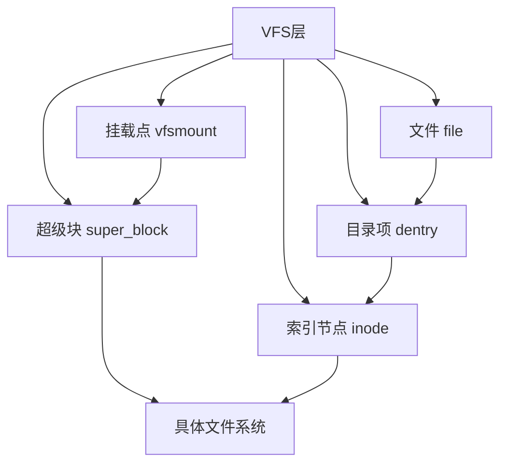
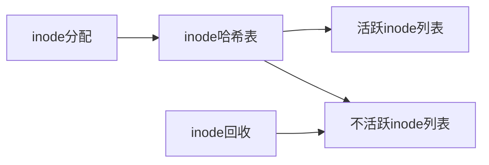
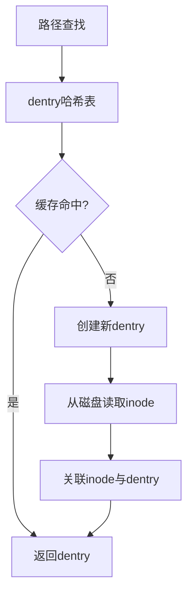
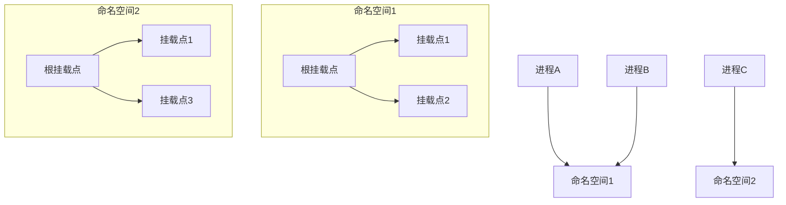
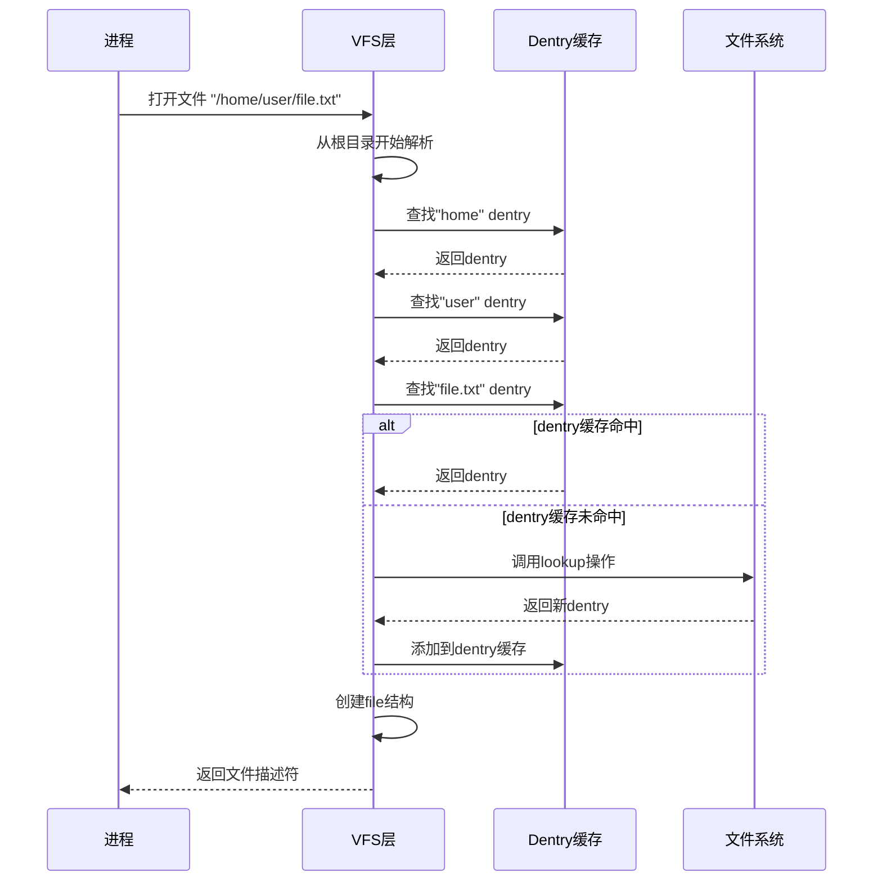
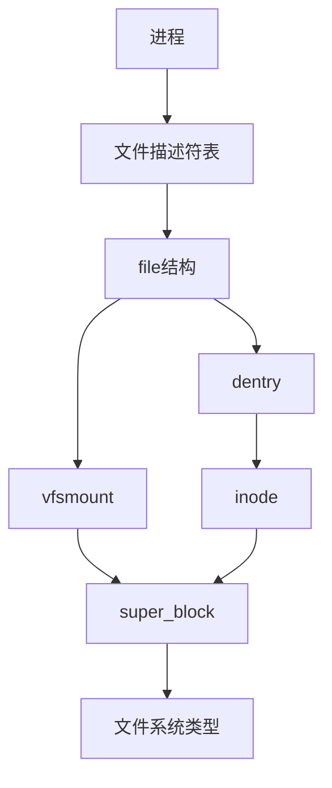
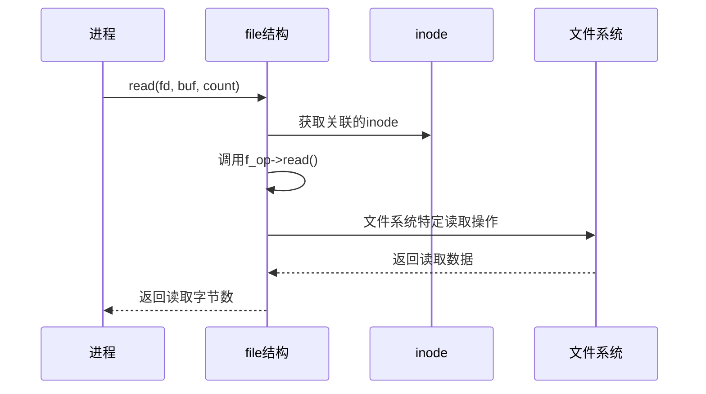

---
tags:
  - 系统编程
  - 文件系统
  - 内核实现
---

# Linux文件系统核心数据结构详解

## 文件系统数据结构概述

Linux文件系统的实现依赖于几个关键的数据结构，它们共同构成了文件系统的骨架。本文将深入分析inode、dentry、mount等核心数据结构及其相互关系，这些结构是理解Linux文件系统内部工作机制的基础。



## inode（索引节点）

### inode概念与作用

inode是文件系统中最基础的数据结构之一，代表文件系统中的一个文件或目录。它存储了文件的元数据信息，但不包含文件名。

### inode数据结构

```c
struct inode {
    umode_t             i_mode;      /* 文件类型和访问权限 */
    uid_t               i_uid;       /* 所有者ID */
    gid_t               i_gid;       /* 组ID */
    dev_t               i_rdev;      /* 设备号（如果是设备文件） */
    loff_t              i_size;      /* 文件大小（字节） */
    struct timespec64   i_atime;     /* 最后访问时间 */
    struct timespec64   i_mtime;     /* 最后修改时间 */
    struct timespec64   i_ctime;     /* 最后改变时间（元数据） */
    unsigned int        i_nlink;     /* 硬链接数 */
    
    const struct inode_operations *i_op;  /* inode操作函数表 */
    const struct file_operations  *i_fop; /* 默认文件操作函数表 */
    struct super_block  *i_sb;       /* 所属超级块 */
    struct address_space *i_mapping; /* 关联的地址空间 */
    
    /* ... 其他字段 ... */
};
```

### inode_operations结构体

inode_operations定义了对inode进行操作的方法：

```c
struct inode_operations {
    struct dentry * (*lookup) (struct inode *, struct dentry *, unsigned int);
    const char * (*get_link) (struct dentry *, struct inode *, struct delayed_call *);
    int (*permission) (struct user_namespace *, struct inode *, int);
    int (*create) (struct user_namespace *, struct inode *, struct dentry *, umode_t, bool);
    int (*link) (struct dentry *, struct inode *, struct dentry *);
    int (*unlink) (struct inode *, struct dentry *);
    int (*mkdir) (struct user_namespace *, struct inode *, struct dentry *, umode_t);
    int (*rmdir) (struct inode *, struct dentry *);
    /* ... 其他方法 ... */
};
```

### inode缓存

Linux内核维护inode缓存以提高文件访问性能：



## dentry（目录项）

### dentry概念与作用

dentry（目录项）是VFS中连接文件路径名和inode的数据结构，它代表路径中的一个组件。dentry维护了文件名到inode的映射关系。

### dentry数据结构

```c
struct dentry {
    struct inode *d_inode;           /* 关联的inode */
    const char *d_name;              /* 文件名 */
    struct dentry *d_parent;         /* 父目录的dentry */
    struct list_head d_child;        /* 子目录链表 */
    struct list_head d_subdirs;      /* 子目录链表头 */
    struct hlist_node d_hash;        /* 哈希表项 */
    struct dentry_operations *d_op;  /* dentry操作函数表 */
    struct super_block *d_sb;        /* 所属超级块 */
    unsigned int d_flags;            /* dentry标志 */
    /* ... 其他字段 ... */
};
```

### dentry_operations结构体

```c
struct dentry_operations {
    int (*d_revalidate)(struct dentry *, unsigned int);
    int (*d_weak_revalidate)(struct dentry *, unsigned int);
    int (*d_hash)(const struct dentry *, struct qstr *);
    int (*d_compare)(const struct dentry *, unsigned int, const char *, const struct qstr *);
    int (*d_delete)(const struct dentry *);
    void (*d_release)(struct dentry *);
    /* ... 其他方法 ... */
};
```

### dentry缓存

dentry缓存（dcache）提高了路径查找性能：



## mount（挂载点）

### mount概念与作用

mount结构表示一个已挂载的文件系统实例，它连接了文件系统与目录树的挂载点。

### 相关数据结构

#### vfsmount结构

```c
struct vfsmount {
    struct dentry *mnt_root;      /* 挂载文件系统的根dentry */
    struct super_block *mnt_sb;   /* 挂载的超级块 */
    int mnt_flags;                /* 挂载标志 */
    /* ... 其他字段 ... */
};
```

#### mount结构

```c
struct mount {
    struct hlist_node mnt_hash;
    struct mount *mnt_parent;     /* 父挂载点 */
    struct dentry *mnt_mountpoint;/* 挂载点dentry */
    struct vfsmount mnt;          /* vfsmount信息 */
    struct list_head mnt_mounts;  /* 子挂载点链表 */
    struct list_head mnt_child;   /* 子链表项 */
    /* ... 其他字段 ... */
};
```

### 挂载命名空间

挂载命名空间允许不同进程看到不同的文件系统层次结构：

```c
struct mnt_namespace {
    atomic_t count;                /* 引用计数 */
    struct mount *root;            /* 命名空间的根挂载点 */
    struct list_head list;         /* 命名空间中所有挂载点的链表 */
    /* ... 其他字段 ... */
};
```



## 超级块（super_block）

### 超级块概念与作用

超级块代表一个已挂载的文件系统实例，包含文件系统的全局信息。

### 超级块数据结构

```c
struct super_block {
    dev_t s_dev;                  /* 设备标识符 */
    unsigned long s_blocksize;     /* 块大小 */
    unsigned char s_blocksize_bits; /* 块大小位数 */
    unsigned long s_magic;         /* 文件系统魔数 */
    struct file_system_type *s_type;/* 文件系统类型 */
    const struct super_operations *s_op; /* 超级块操作函数表 */
    struct dentry *s_root;         /* 文件系统根目录dentry */
    /* ... 其他字段 ... */
};
```

### super_operations结构体

```c
struct super_operations {
    struct inode *(*alloc_inode)(struct super_block *sb);
    void (*destroy_inode)(struct inode *);
    void (*dirty_inode) (struct inode *, int flags);
    int (*write_inode) (struct inode *, struct writeback_control *);
    int (*sync_fs)(struct super_block *, int wait);
    /* ... 其他方法 ... */
};
```

## 文件（file）

### file概念与作用

file结构表示进程打开的文件，它是进程与文件系统交互的主要接口。

### file数据结构

```c
struct file {
    struct path f_path;           /* 包含dentry和vfsmount */
    struct inode *f_inode;         /* 关联的inode */
    const struct file_operations *f_op; /* 文件操作函数表 */
    loff_t f_pos;                 /* 文件位置（偏移量） */
    unsigned int f_flags;          /* 打开标志 */
    fmode_t f_mode;               /* 文件访问模式 */
    struct mutex f_pos_lock;       /* 位置锁 */
    /* ... 其他字段 ... */
};
```

### file_operations结构体

```c
struct file_operations {
    ssize_t (*read) (struct file *, char __user *, size_t, loff_t *);
    ssize_t (*write) (struct file *, const char __user *, size_t, loff_t *);
    int (*open) (struct inode *, struct file *);
    int (*release) (struct inode *, struct file *);
    loff_t (*llseek) (struct file *, loff_t, int);
    /* ... 其他方法 ... */
};
```

## 核心数据结构之间的关系

### 路径解析过程



### 数据结构关系图



## 实际应用案例

### 案例1: 文件读取流程

当进程读取文件时，涉及的数据结构交互：



### 案例2: 目录遍历

```mermaid
sequenceDiagram
    participant P as 进程
    participant VFS