# 线程实现原理

## 线程基本概念

线程是操作系统能够进行运算调度的最小单位，也被称为轻量级进程(LWP, Light Weight Process)。一个进程可以包含多个线程，各线程共享进程的地址空间和资源，但拥有独立的执行栈和寄存器状态。

### 线程与进程的区别

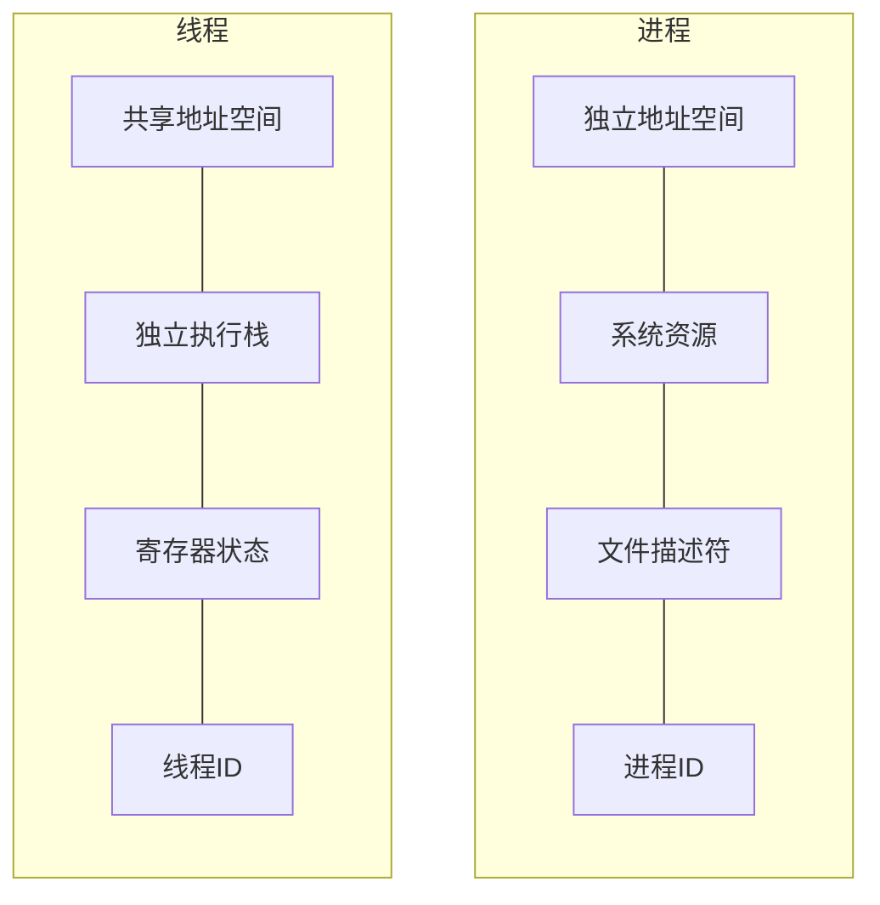

### 线程的优势

1. **资源共享**：线程间共享进程资源，减少内存占用
2. **创建开销小**：创建线程比创建进程的开销小
3. **上下文切换快**：线程间切换比进程间切换更快
4. **响应速度快**：多线程可以提高程序的响应性

## 线程实现模型

### 用户级线程 (User-Level Threads)

用户级线程完全由用户空间的线程库管理，操作系统内核不感知其存在。

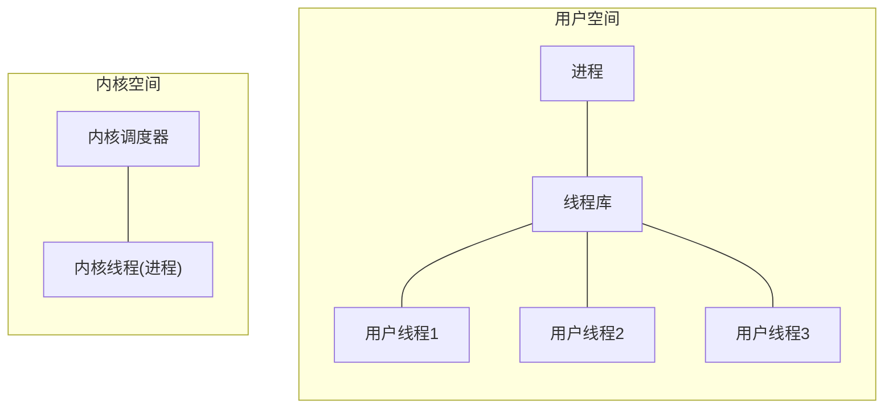

#### 优点
- 线程管理的系统调用开销小
- 可以在不支持线程的操作系统上实现
- 线程切换不需要内核模式切换

#### 缺点
- 一个线程阻塞会导致整个进程阻塞
- 无法利用多处理器并行

### 内核级线程 (Kernel-Level Threads)

内核级线程由操作系统内核直接支持和管理，内核维护线程相关的上下文信息。

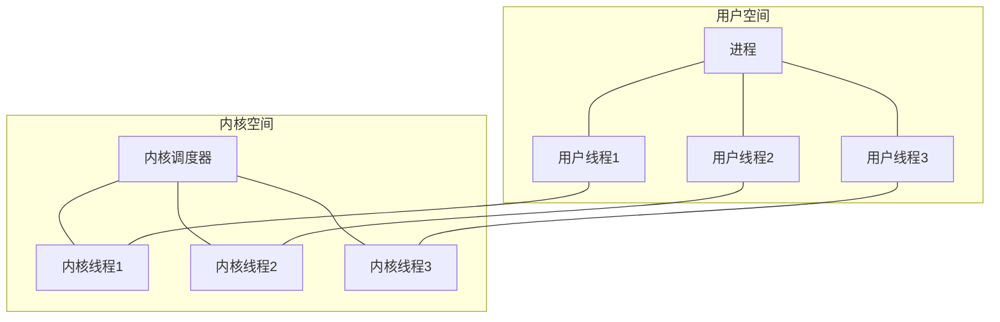

#### 优点
- 一个线程阻塞不会导致整个进程阻塞
- 可以利用多处理器并行
- 内核可以调度同一进程的多个线程

#### 缺点
- 线程操作需要系统调用，开销较大
- 内核需要维护更多的线程状态信息

### 混合实现 (Hybrid Threading)

混合实现结合了用户级线程和内核级线程的优点，多个用户级线程映射到较少数量的内核级线程上。

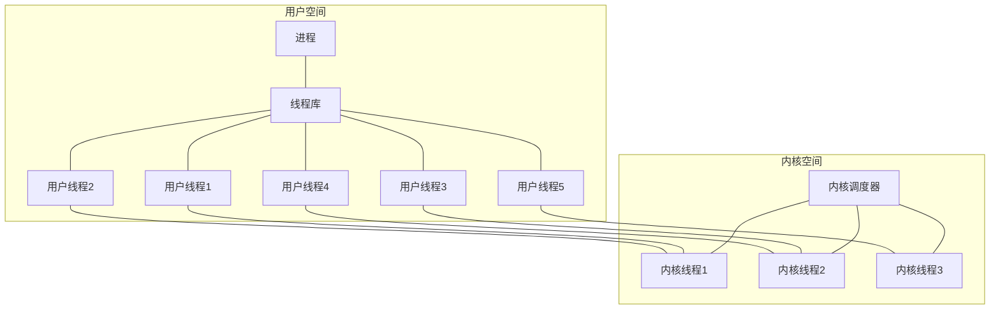

#### 优点
- 结合了两种模型的优点
- 可以根据应用需求调整用户线程与内核线程的比例
- 提供更好的可伸缩性

## 线程实现细节

### 线程控制块 (TCB)

线程控制块存储线程的所有状态信息，类似于进程控制块(PCB)。

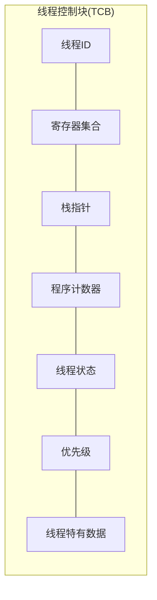

### 线程栈

每个线程拥有独立的栈空间，用于存储函数调用信息、局部变量等。

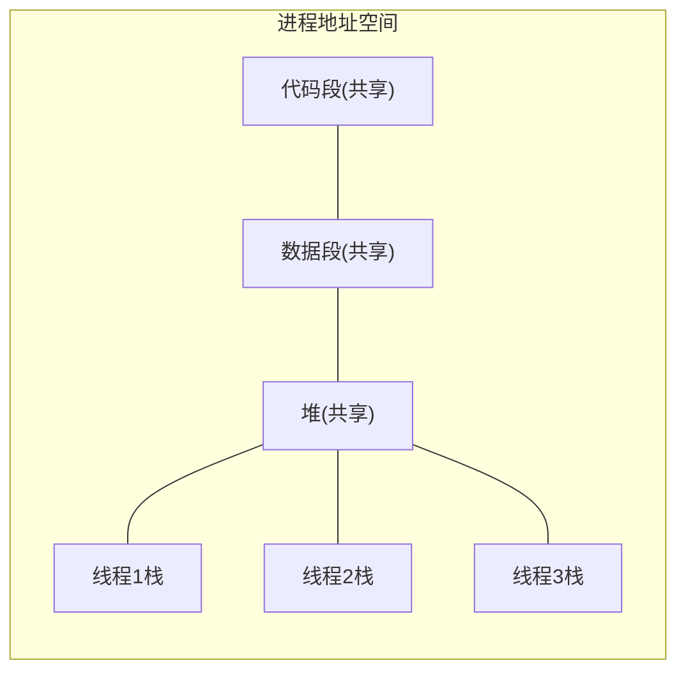

### 线程创建过程

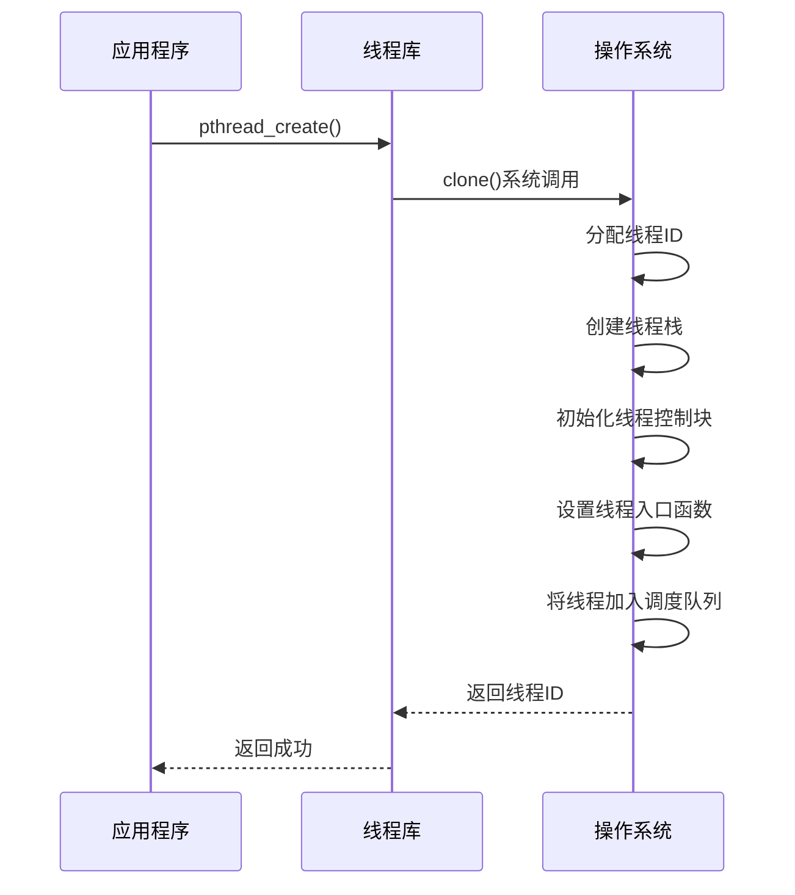

### 线程上下文切换

线程上下文切换比进程上下文切换更轻量，因为不需要切换地址空间和TLB。

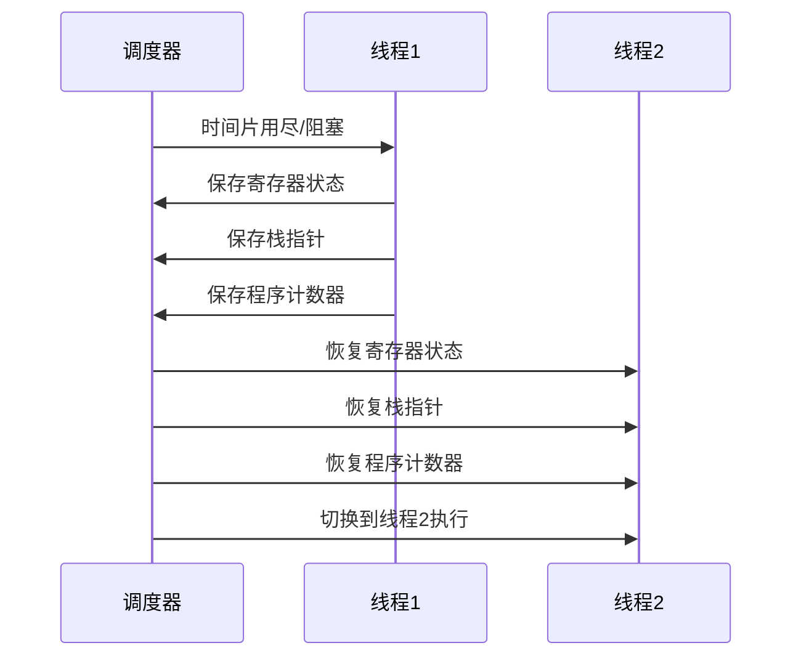

## Linux中的线程实现

Linux使用轻量级进程(LWP)实现线程，通过clone()系统调用创建共享特定资源的进程。

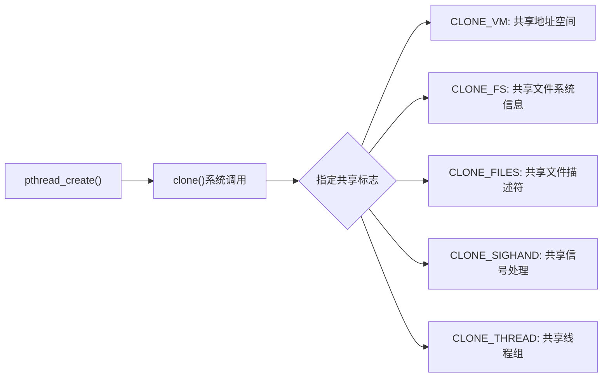

### NPTL (Native POSIX Thread Library)

NPTL是Linux的原生POSIX线程库，提供了高性能的线程实现。

- 1:1线程模型：每个用户线程映射到一个内核线程
- 线程本地存储(TLS)支持
- 线程同步原语的高效实现
- 可扩展到数千个线程

## 线程同步机制

### 互斥锁 (Mutex)

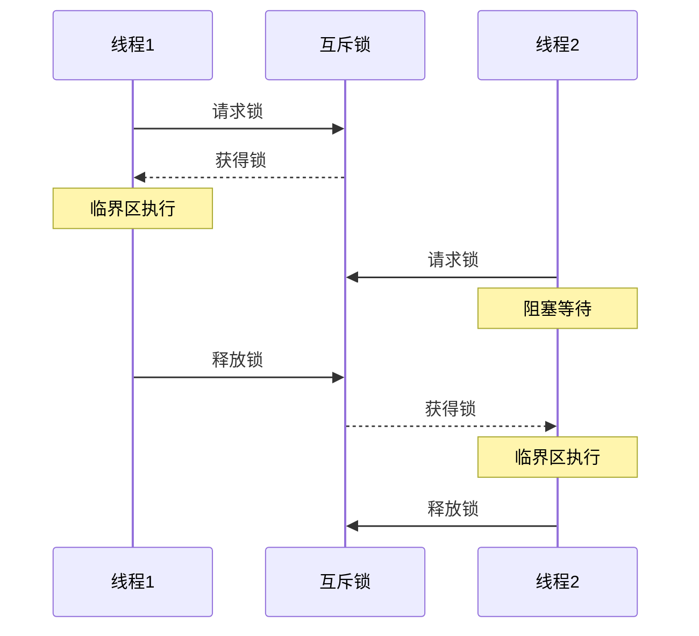

### 条件变量 (Condition Variable)

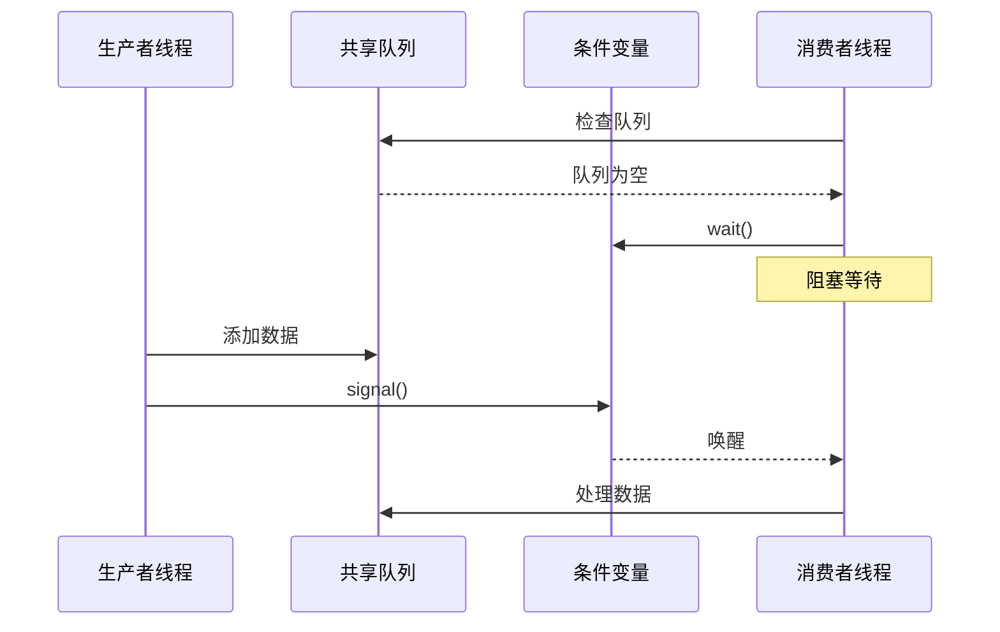

## 线程安全与并发挑战

### 线程安全问题

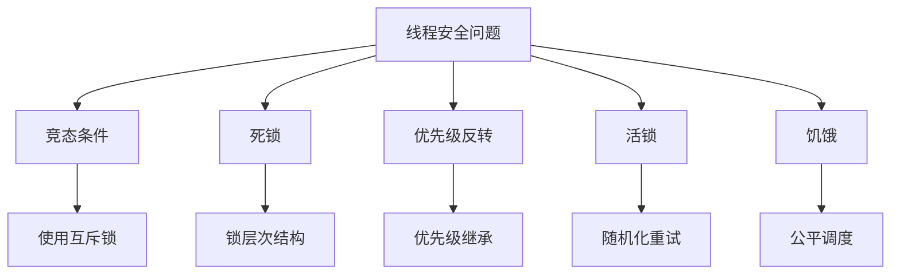

### 线程局部存储 (Thread Local Storage)

线程局部存储允许每个线程拥有全局变量的私有副本，避免共享冲突。

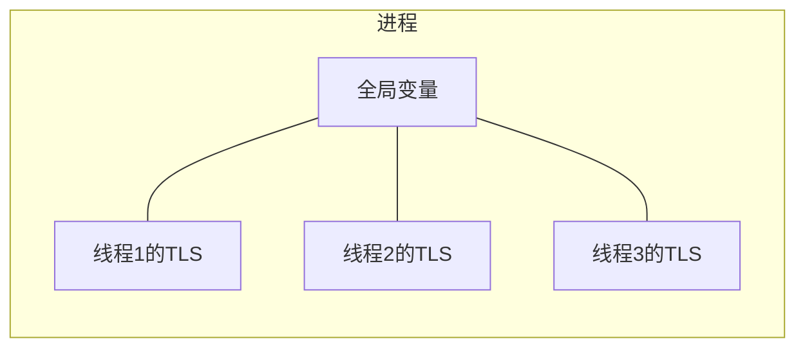

## 线程池设计

线程池是一种线程使用模式，维护多个线程等待分配工作，避免频繁创建和销毁线程的开销。

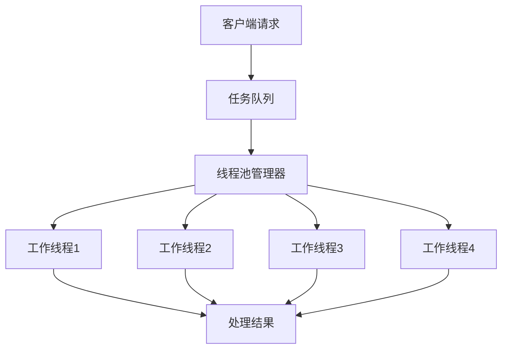

### 线程池核心组件

1. **任务队列**：存储待处理的任务
2. **工作线程**：从任务队列获取任务并执行
3. **线程池管理器**：创建和维护工作线程

### 线程池策略

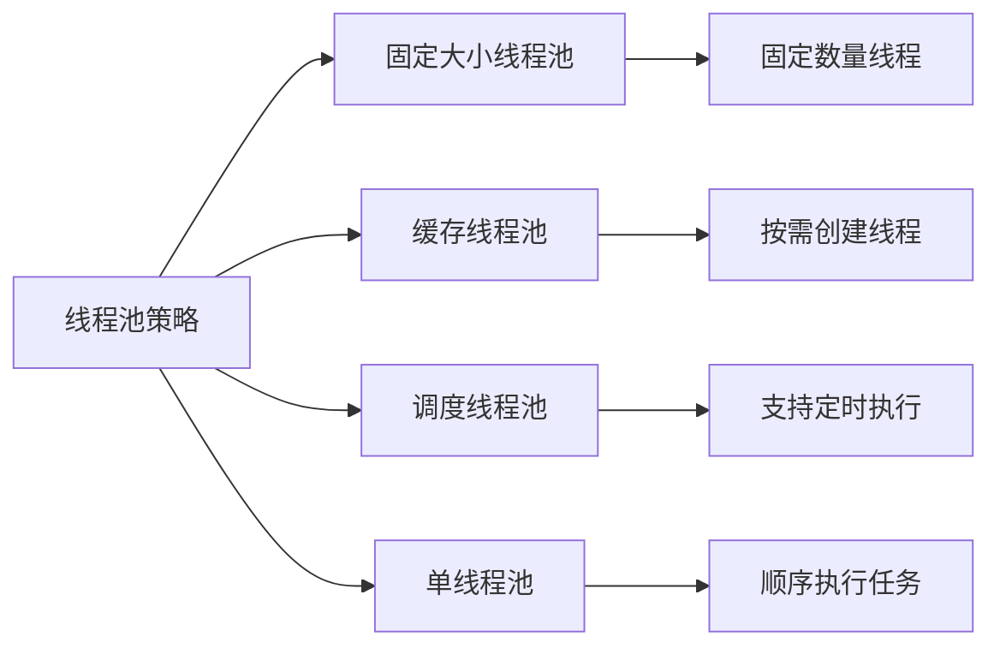

## 协程与纤程

协程(Coroutine)和纤程(Fiber)是比线程更轻量级的执行单元，由用户空间调度，可以实现更高效的并发。

```mermaid
flowchart TD
    subgraph "线程"
    direction LR
    A1["协程1"] <--> A2["协程2"] <--> A3["协程3"]
    end
    
    subgraph "用户空间调度器