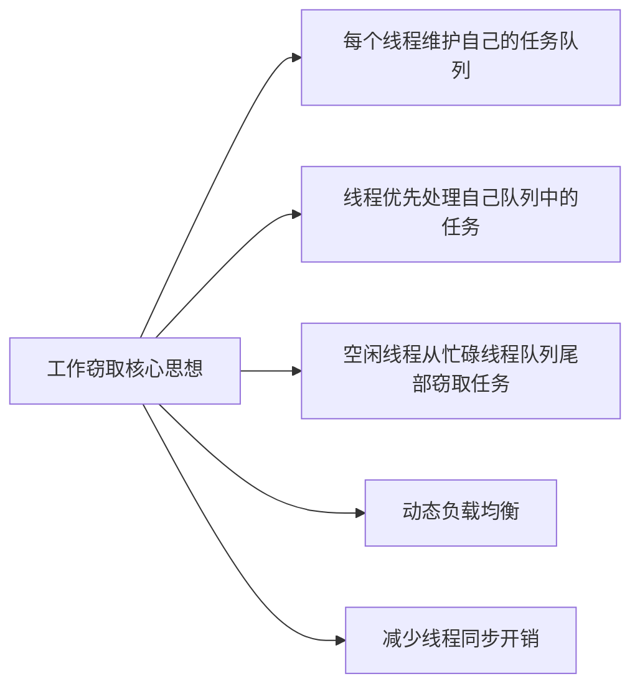
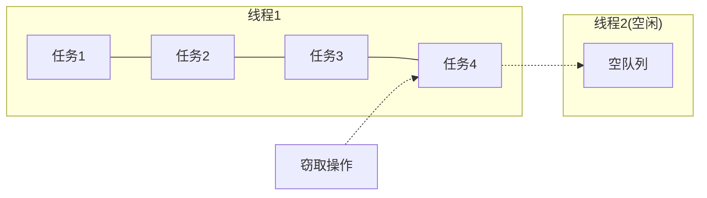
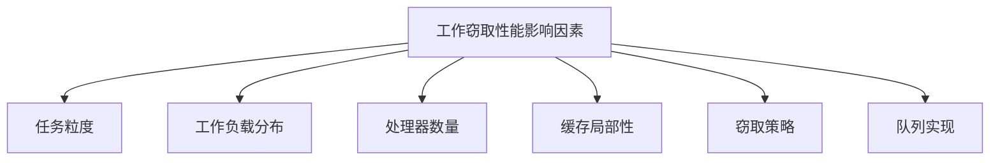
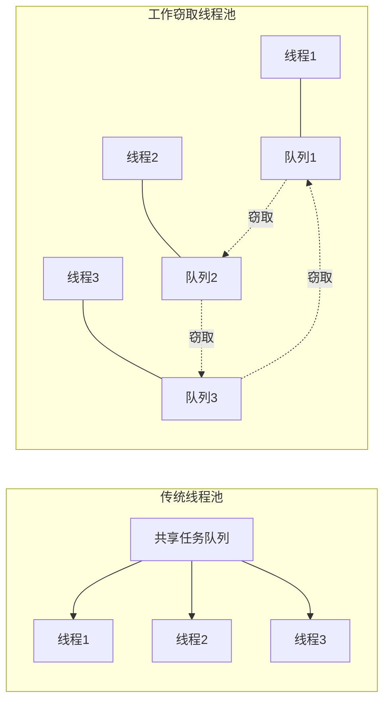

# 工作窃取调度算法

## 基本原理

工作窃取(Work Stealing)是一种用于多线程任务调度的算法，主要用于解决线程负载不均衡问题。在这种算法中，每个线程都有自己的任务队列，当一个线程完成了自己队列中的所有任务后，它会尝试从其他忙碌线程的队列中"窃取"任务来执行。

### 工作窃取的核心思想



### 工作窃取的优势

1. **负载均衡**：自动平衡各线程的工作负载，提高资源利用率
2. **局部性优化**：线程优先处理自己队列中的任务，提高缓存命中率
3. **减少竞争**：每个线程主要操作自己的队列，减少锁竞争
4. **适应性强**：适合处理动态生成的、规模不确定的并行任务
5. **可扩展性好**：随着处理器核心数增加，算法扩展性良好

### 工作窃取的挑战

1. **窃取开销**：窃取操作涉及跨线程通信，可能导致缓存一致性问题
2. **队列设计**：需要高效的并发队列实现，支持两端操作
3. **窃取策略**：需要合理的窃取策略，避免过度窃取或窃取不足
4. **任务粒度**：任务粒度过小会导致窃取开销超过收益

## 工作窃取队列设计

### 双端队列(Deque)实现

工作窃取算法通常使用双端队列(Deque)作为任务队列的数据结构：



- **线程本地操作**：线程在自己的队列前端(LIFO方式)执行push和pop操作
- **窃取操作**：其他线程从队列后端(FIFO方式)执行steal操作

这种设计有几个关键优势：
1. 线程操作自己队列的前端，遵循后进先出(LIFO)原则，有利于提高缓存局部性
2. 窃取操作从队列后端获取任务，遵循先进先出(FIFO)原则，窃取最早的大任务，这些任务可能会产生更多子任务
3. 减少线程间的竞争，因为大多数情况下线程只操作自己的队列

### 无锁实现考虑

为了提高性能，工作窃取队列通常采用无锁或低竞争的实现方式：

1. **Chase-Lev双端队列**：一种经典的无锁工作窃取队列实现
2. **分离关注点**：
   - 队列拥有者(线程自己)对前端的操作可以无锁实现
   - 多个窃取者对后端的操作需要原子操作保证一致性
3. **ABA问题处理**：使用版本计数器或标记指针等技术避免ABA问题

## C++工作窃取队列实现

### 基本实现

```cpp
#include <atomic>
#include <vector>
#include <memory>
#include <functional>

// 简化版Chase-Lev工作窃取队列
class WorkStealingQueue {
private:
    struct CircularArray {
        std::vector<std::function<void()>> items;
        size_t capacity;
        
        CircularArray(size_t capacity) : capacity(capacity), items(capacity) {}
        
        std::function<void()>& operator[](size_t i) {
            return items[i % capacity];
        }
        
        const std::function<void()>& operator[](size_t i) const {
            return items[i % capacity];
        }
        
        std::shared_ptr<CircularArray> grow(size_t top, size_t bottom) {
            auto newArray = std::make_shared<CircularArray>(capacity * 2);
            for (size_t i = top; i < bottom; ++i) {
                (*newArray)[i] = (*this)[i];
            }
            return newArray;
        }
    };
    
    std::atomic<size_t> top;    // 队列顶部索引(steal端)
    std::atomic<size_t> bottom; // 队列底部索引(push/pop端)
    std::shared_ptr<CircularArray> array;
    std::atomic<bool> activeFlag;
    
public:
    WorkStealingQueue() : top(0), bottom(0), activeFlag(true) {
        array = std::make_shared<CircularArray>(32); // 初始容量
    }
    
    ~WorkStealingQueue() {
        activeFlag.store(false, std::memory_order_relaxed);
    }
    
    // 线程本地push操作(底部)
    void push(std::function<void()> task) {
        size_t b = bottom.load(std::memory_order_relaxed);
        size_t t = top.load(std::memory_order_acquire);
        
        // 检查是否需要扩容
        if (b - t >= array->capacity - 1) {
            array = array->grow(t, b);
        }
        
        (*array)[b] = std::move(task);
        std::atomic_thread_fence(std::memory_order_release);
        bottom.store(b + 1, std::memory_order_relaxed);
    }
    
    // 线程本地pop操作(底部)
    std::function<void()> pop() {
        size_t b = bottom.load(std::memory_order_relaxed) - 1;
        bottom.store(b, std::memory_order_relaxed);
        
        size_t t = top.load(std::memory_order_acquire);
        std::function<void()> result;
        
        if (t <= b) {
            // 队列非空
            result = (*array)[b];
            
            if (t == b) {
                // 执行任务
                task();
            } else {
                // 2. 尝试从其他队列窃取任务
                let task = Self::steal_task(&queues, id);
                
                if let Some(task) = task {
                    // 执行窃取的任务
                    task();
                } else {
                    // 3. 如果没有任务可执行，短暂休眠避免CPU空转
                    thread::yield_now();
                    thread::sleep(Duration::from_micros(1));
                }
            }
        }
    }
    
    // 从其他队列窃取任务
    fn steal_task(
        queues: &[Arc<WorkStealingDeque>],
        thief_id: usize,
    ) -> Option<Task> {
        let num_queues = queues.len();
        let mut rng = thread_rng();
        
        // 随机选择起始窃取位置
        let victim_start = rng.gen_range(0..num_queues);
        
        // 尝试从所有其他队列窃取任务
        for i in 0..num_queues {
            let victim_id = (victim_start + i) % num_queues;
            
            // 避免从自己的队列窃取
            if victim_id == thief_id {
                continue;
            }
            
            // 尝试窃取任务
            if let Some(task) = queues[victim_id].steal() {
                return Some(task);
            }
        }
        
        None
    }
}
```

## 工作窃取算法性能分析

### 理论性能分析

工作窃取算法在理论上具有良好的性能特性：

1. **工作均衡性**：对于具有不均衡工作负载的并行计算，工作窃取能够自动平衡各处理器的负载

2. **空间复杂度**：对于深度为d的递归并行算法，工作窃取调度的空间复杂度为O(S₁ + p·d)，其中S₁是串行执行所需空间，p是处理器数量

3. **时间复杂度**：对于工作量为T₁的计算，使用p个处理器的工作窃取调度的预期执行时间为O(T₁/p + T∞)，其中T∞是计算的关键路径长度

4. **窃取开销**：窃取操作的开销主要来自于跨处理器通信和缓存一致性维护，但由于窃取操作相对较少，总体开销可控

### 实际性能表现

在实际应用中，工作窃取算法的性能受多种因素影响：



#### 任务粒度影响

任务粒度是影响工作窃取性能的关键因素：

- **粒度过大**：导致负载不均衡，部分处理器可能长时间空闲
- **粒度过小**：窃取和调度开销超过计算收益，降低整体性能
- **自适应分割**：理想的实现应当根据运行时情况动态调整任务粒度

#### 不同负载场景下的性能

1. **均匀负载**：所有任务计算量相近
   - 工作窃取性能接近于静态负载均衡
   - 窃取操作较少，主要在初始分配不均时发生

2. **不均匀负载**：任务计算量差异大
   - 工作窃取显著优于静态分配
   - 能够自动将长任务分散到多个处理器

3. **动态生成任务**：执行过程中动态创建新任务
   - 工作窃取表现最佳
   - 能够及时处理新生成的任务，保持负载均衡

#### 扩展性分析

工作窃取算法的扩展性随处理器数量增加而变化：

- **低核心数(2-8核)**：几乎线性加速比
- **中等核心数(8-32核)**：良好加速比，但开始受到内存带宽和窃取开销影响
- **高核心数(32+核)**：加速比增长放缓，需要优化窃取策略和内存访问模式

## 工作窃取在线程池中的应用

### 与传统线程池的比较



| 特性 | 传统线程池 | 工作窃取线程池 |
|------|------------|----------------|
| 任务分配 | 集中式 | 分散式 |
| 队列结构 | 单一共享队列 | 每线程一个队列 |
| 同步开销 | 高(所有线程竞争同一队列) | 低(主要操作自己的队列) |
| 缓存局部性 | 较差 | 较好 |
| 负载均衡 | 自动(任务均匀分配) | 动态(通过窃取实现) |
| 适用场景 | 独立同构任务 | 递归并行、异构任务 |

### 实际应用案例

1. **并行计算框架**
   - Intel TBB (Threading Building Blocks)
   - Microsoft PPL (Parallel Patterns Library)
   - Java Fork/Join框架

2. **任务调度系统**
   - 游戏引擎任务系统
   - 高性能计算作业调度
   - 大数据处理框架

3. **Web服务器**
   - Node.js工作线程池
   - Nginx工作进程调度

## 工作窃取算法的最佳实践

### 实现建议

1. **队列设计**
   - 使用无锁或低竞争的双端队列实现
   - 考虑缓存行对齐，避免伪共享问题
   - 为队列设置合理的初始容量，减少动态扩容

2. **窃取策略**
   - 实现随机窃取，避免窃取热点
   - 考虑NUMA架构，优先窃取邻近节点的队列
   - 实现窃取失败后的退避策略

3. **任务设计**
   - 实现可分割的任务结构，支持动态负载均衡
   - 设置合理的任务粒度阈值，避免过度分割
   - 考虑任务亲和性，相关任务分配给同一线程

### 调优技巧

1. **窃取频率调优**
   - 监控窃取成功率，调整窃取策略
   - 在窃取失败后使用指数退避算法
   - 考虑工作推送(work pushing)作为补充

2. **任务粒度调优**
   - 测量不同粒度下的性能表现
   - 实现自适应任务分割机制
   - 考虑任务执行时间的方差

3. **内存访问优化**
   - 优化数据布局，提高缓存命中率
   - 考虑NUMA架构下的内存分配策略
   - 减少跨线程数据共享

## 总结

工作窃取调度算法是一种高效的并行任务调度机制，通过分散式的任务队列和动态负载均衡，能够有效地解决并行计算中的负载不均衡问题。它特别适合处理具有递归并行特性和动态任务生成的应用场景。

工作窃取算法的核心优势在于：
1. 减少线程同步开销
2. 提高缓存局部性
3. 实现自动负载均衡
4. 良好的可扩展性

在实际应用中，工作窃取算法已经成为现代并行计算框架的标准组件，广泛应用于多核处理器编程、分布式计算和高性能计算领域。通过合理的实现和调优，工作窃取算法可以显著提高并行应用的性能和资源利用率。 最后一个元素，需要与steal操作竞争
                if (!top.compare_exchange_strong(t, t + 1, 
                                              std::memory_order_seq_cst,
                                              std::memory_order_relaxed)) {
                    // 执行任务
                task();
            } else {
                // 2. 尝试从其他队列窃取任务
                let task = Self::steal_task(&queues, id);
                
                if let Some(task) = task {
                    // 执行窃取的任务
                    task();
                } else {
                    // 3. 如果没有任务可执行，短暂休眠避免CPU空转
                    thread::yield_now();
                    thread::sleep(Duration::from_micros(1));
                }
            }
        }
    }
    
    // 从其他队列窃取任务
    fn steal_task(
        queues: &[Arc<WorkStealingDeque>],
        thief_id: usize,
    ) -> Option<Task> {
        let num_queues = queues.len();
        let mut rng = thread_rng();
        
        // 随机选择起始窃取位置
        let victim_start = rng.gen_range(0..num_queues);
        
        // 尝试从所有其他队列窃取任务
        for i in 0..num_queues {
            let victim_id = (victim_start + i) % num_queues;
            
            // 避免从自己的队列窃取
            if victim_id == thief_id {
                continue;
            }
            
            // 尝试窃取任务
            if let Some(task) = queues[victim_id].steal() {
                return Some(task);
            }
        }
        
        None
    }
}
```

## 工作窃取算法性能分析

### 理论性能分析

工作窃取算法在理论上具有良好的性能特性：

1. **工作均衡性**：对于具有不均衡工作负载的并行计算，工作窃取能够自动平衡各处理器的负载

2. **空间复杂度**：对于深度为d的递归并行算法，工作窃取调度的空间复杂度为O(S₁ + p·d)，其中S₁是串行执行所需空间，p是处理器数量

3. **时间复杂度**：对于工作量为T₁的计算，使用p个处理器的工作窃取调度的预期执行时间为O(T₁/p + T∞)，其中T∞是计算的关键路径长度

4. **窃取开销**：窃取操作的开销主要来自于跨处理器通信和缓存一致性维护，但由于窃取操作相对较少，总体开销可控

### 实际性能表现

在实际应用中，工作窃取算法的性能受多种因素影响：


#### 任务粒度影响

任务粒度是影响工作窃取性能的关键因素：

- **粒度过大**：导致负载不均衡，部分处理器可能长时间空闲
- **粒度过小**：窃取和调度开销超过计算收益，降低整体性能
- **自适应分割**：理想的实现应当根据运行时情况动态调整任务粒度

#### 不同负载场景下的性能

1. **均匀负载**：所有任务计算量相近
   - 工作窃取性能接近于静态负载均衡
   - 窃取操作较少，主要在初始分配不均时发生

2. **不均匀负载**：任务计算量差异大
   - 工作窃取显著优于静态分配
   - 能够自动将长任务分散到多个处理器

3. **动态生成任务**：执行过程中动态创建新任务
   - 工作窃取表现最佳
   - 能够及时处理新生成的任务，保持负载均衡

#### 扩展性分析

工作窃取算法的扩展性随处理器数量增加而变化：

- **低核心数(2-8核)**：几乎线性加速比
- **中等核心数(8-32核)**：良好加速比，但开始受到内存带宽和窃取开销影响
- **高核心数(32+核)**：加速比增长放缓，需要优化窃取策略和内存访问模式

## 工作窃取在线程池中的应用

### 与传统线程池的比较


| 特性 | 传统线程池 | 工作窃取线程池 |
|------|------------|----------------|
| 任务分配 | 集中式 | 分散式 |
| 队列结构 | 单一共享队列 | 每线程一个队列 |
| 同步开销 | 高(所有线程竞争同一队列) | 低(主要操作自己的队列) |
| 缓存局部性 | 较差 | 较好 |
| 负载均衡 | 自动(任务均匀分配) | 动态(通过窃取实现) |
| 适用场景 | 独立同构任务 | 递归并行、异构任务 |

### 实际应用案例

1. **并行计算框架**
   - Intel TBB (Threading Building Blocks)
   - Microsoft PPL (Parallel Patterns Library)
   - Java Fork/Join框架

2. **任务调度系统**
   - 游戏引擎任务系统
   - 高性能计算作业调度
   - 大数据处理框架

3. **Web服务器**
   - Node.js工作线程池
   - Nginx工作进程调度

## 工作窃取算法的最佳实践

### 实现建议

1. **队列设计**
   - 使用无锁或低竞争的双端队列实现
   - 考虑缓存行对齐，避免伪共享问题
   - 为队列设置合理的初始容量，减少动态扩容

2. **窃取策略**
   - 实现随机窃取，避免窃取热点
   - 考虑NUMA架构，优先窃取邻近节点的队列
   - 实现窃取失败后的退避策略

3. **任务设计**
   - 实现可分割的任务结构，支持动态负载均衡
   - 设置合理的任务粒度阈值，避免过度分割
   - 考虑任务亲和性，相关任务分配给同一线程

### 调优技巧

1. **窃取频率调优**
   - 监控窃取成功率，调整窃取策略
   - 在窃取失败后使用指数退避算法
   - 考虑工作推送(work pushing)作为补充

2. **任务粒度调优**
   - 测量不同粒度下的性能表现
   - 实现自适应任务分割机制
   - 考虑任务执行时间的方差

3. **内存访问优化**
   - 优化数据布局，提高缓存命中率
   - 考虑NUMA架构下的内存分配策略
   - 减少跨线程数据共享

## 总结

工作窃取调度算法是一种高效的并行任务调度机制，通过分散式的任务队列和动态负载均衡，能够有效地解决并行计算中的负载不均衡问题。它特别适合处理具有递归并行特性和动态任务生成的应用场景。

工作窃取算法的核心优势在于：
1. 减少线程同步开销
2. 提高缓存局部性
3. 实现自动负载均衡
4. 良好的可扩展性

在实际应用中，工作窃取算法已经成为现代并行计算框架的标准组件，广泛应用于多核处理器编程、分布式计算和高性能计算领域。通过合理的实现和调优，工作窃取算法可以显著提高并行应用的性能和资源利用率。 竞争失败
                    result = nullptr;
                }
                bottom.store(b + 1, std::memory_order_relaxed);
            }
        } else {
            // 队列为空
            bottom.store(b + 1, std::memory_order_relaxed);
            result = nullptr;
        }
        
        return result;
    }
    
    // 其他线程的steal操作(顶部)
    std::function<void()> steal() {
        if (!activeFlag.load(std::memory_order_relaxed)) {
            return nullptr; // 队列已不活跃
        }
        
        size_t t = top.load(std::memory_order_acquire);
        std::atomic_thread_fence(std::memory_order_seq_cst);
        size_t b = bottom.load(std::memory_order_acquire);
        
        std::function<void()> result;
        
        if (t < b) {
            // 队列非空
            result = (*array)[t];
            
            // 尝试增加top索引
            if (!top.compare_exchange_strong(t, t + 1,
                                          std::memory_order_seq_cst,
                                          std::memory_order_relaxed)) {
                // 执行任务
                task();
            } else {
                // 2. 尝试从其他队列窃取任务
                let task = Self::steal_task(&queues, id);
                
                if let Some(task) = task {
                    // 执行窃取的任务
                    task();
                } else {
                    // 3. 如果没有任务可执行，短暂休眠避免CPU空转
                    thread::yield_now();
                    thread::sleep(Duration::from_micros(1));
                }
            }
        }
    }
    
    // 从其他队列窃取任务
    fn steal_task(
        queues: &[Arc<WorkStealingDeque>],
        thief_id: usize,
    ) -> Option<Task> {
        let num_queues = queues.len();
        let mut rng = thread_rng();
        
        // 随机选择起始窃取位置
        let victim_start = rng.gen_range(0..num_queues);
        
        // 尝试从所有其他队列窃取任务
        for i in 0..num_queues {
            let victim_id = (victim_start + i) % num_queues;
            
            // 避免从自己的队列窃取
            if victim_id == thief_id {
                continue;
            }
            
            // 尝试窃取任务
            if let Some(task) = queues[victim_id].steal() {
                return Some(task);
            }
        }
        
        None
    }
}
```

## 工作窃取算法性能分析

### 理论性能分析

工作窃取算法在理论上具有良好的性能特性：

1. **工作均衡性**：对于具有不均衡工作负载的并行计算，工作窃取能够自动平衡各处理器的负载

2. **空间复杂度**：对于深度为d的递归并行算法，工作窃取调度的空间复杂度为O(S₁ + p·d)，其中S₁是串行执行所需空间，p是处理器数量

3. **时间复杂度**：对于工作量为T₁的计算，使用p个处理器的工作窃取调度的预期执行时间为O(T₁/p + T∞)，其中T∞是计算的关键路径长度

4. **窃取开销**：窃取操作的开销主要来自于跨处理器通信和缓存一致性维护，但由于窃取操作相对较少，总体开销可控

### 实际性能表现

在实际应用中，工作窃取算法的性能受多种因素影响：


#### 任务粒度影响

任务粒度是影响工作窃取性能的关键因素：

- **粒度过大**：导致负载不均衡，部分处理器可能长时间空闲
- **粒度过小**：窃取和调度开销超过计算收益，降低整体性能
- **自适应分割**：理想的实现应当根据运行时情况动态调整任务粒度

#### 不同负载场景下的性能

1. **均匀负载**：所有任务计算量相近
   - 工作窃取性能接近于静态负载均衡
   - 窃取操作较少，主要在初始分配不均时发生

2. **不均匀负载**：任务计算量差异大
   - 工作窃取显著优于静态分配
   - 能够自动将长任务分散到多个处理器

3. **动态生成任务**：执行过程中动态创建新任务
   - 工作窃取表现最佳
   - 能够及时处理新生成的任务，保持负载均衡

#### 扩展性分析

工作窃取算法的扩展性随处理器数量增加而变化：

- **低核心数(2-8核)**：几乎线性加速比
- **中等核心数(8-32核)**：良好加速比，但开始受到内存带宽和窃取开销影响
- **高核心数(32+核)**：加速比增长放缓，需要优化窃取策略和内存访问模式

## 工作窃取在线程池中的应用

### 与传统线程池的比较


| 特性 | 传统线程池 | 工作窃取线程池 |
|------|------------|----------------|
| 任务分配 | 集中式 | 分散式 |
| 队列结构 | 单一共享队列 | 每线程一个队列 |
| 同步开销 | 高(所有线程竞争同一队列) | 低(主要操作自己的队列) |
| 缓存局部性 | 较差 | 较好 |
| 负载均衡 | 自动(任务均匀分配) | 动态(通过窃取实现) |
| 适用场景 | 独立同构任务 | 递归并行、异构任务 |

### 实际应用案例

1. **并行计算框架**
   - Intel TBB (Threading Building Blocks)
   - Microsoft PPL (Parallel Patterns Library)
   - Java Fork/Join框架

2. **任务调度系统**
   - 游戏引擎任务系统
   - 高性能计算作业调度
   - 大数据处理框架

3. **Web服务器**
   - Node.js工作线程池
   - Nginx工作进程调度

## 工作窃取算法的最佳实践

### 实现建议

1. **队列设计**
   - 使用无锁或低竞争的双端队列实现
   - 考虑缓存行对齐，避免伪共享问题
   - 为队列设置合理的初始容量，减少动态扩容

2. **窃取策略**
   - 实现随机窃取，避免窃取热点
   - 考虑NUMA架构，优先窃取邻近节点的队列
   - 实现窃取失败后的退避策略

3. **任务设计**
   - 实现可分割的任务结构，支持动态负载均衡
   - 设置合理的任务粒度阈值，避免过度分割
   - 考虑任务亲和性，相关任务分配给同一线程

### 调优技巧

1. **窃取频率调优**
   - 监控窃取成功率，调整窃取策略
   - 在窃取失败后使用指数退避算法
   - 考虑工作推送(work pushing)作为补充

2. **任务粒度调优**
   - 测量不同粒度下的性能表现
   - 实现自适应任务分割机制
   - 考虑任务执行时间的方差

3. **内存访问优化**
   - 优化数据布局，提高缓存命中率
   - 考虑NUMA架构下的内存分配策略
   - 减少跨线程数据共享

## 总结

工作窃取调度算法是一种高效的并行任务调度机制，通过分散式的任务队列和动态负载均衡，能够有效地解决并行计算中的负载不均衡问题。它特别适合处理具有递归并行特性和动态任务生成的应用场景。

工作窃取算法的核心优势在于：
1. 减少线程同步开销
2. 提高缓存局部性
3. 实现自动负载均衡
4. 良好的可扩展性

在实际应用中，工作窃取算法已经成为现代并行计算框架的标准组件，广泛应用于多核处理器编程、分布式计算和高性能计算领域。通过合理的实现和调优，工作窃取算法可以显著提高并行应用的性能和资源利用率。 竞争失败
                return nullptr;
            }
        } else {
            // 队列为空
            return nullptr;
        }
        
        return result;
    }
    
    bool empty() const {
        size_t b = bottom.load(std::memory_order_relaxed);
        size_t t = top.load(std::memory_order_relaxed);
        return b <= t;
    }
};
```

### 工作窃取线程池实现

```cpp
#include <thread>
#include <vector>
#include <queue>
#include <functional>
#include <mutex>
#include <condition_variable>
#include <atomic>
#include <random>

class WorkStealingThreadPool {
private:
    std::vector<std::thread> workers;
    std::vector<std::unique_ptr<WorkStealingQueue>> queues;
    
    std::atomic<bool> stop;
    std::atomic<size_t> activeTaskCount;
    
    std::mutex waitMutex;
    std::condition_variable waitCondition;
    
    // 随机数生成器，用于随机选择窃取目标
    std::mt19937 rng;
    std::uniform_int_distribution<size_t> dist;
    
public:
    WorkStealingThreadPool(size_t numThreads = std::thread::hardware_concurrency())
        : stop(false), activeTaskCount(0), rng(std::random_device{}()) {
        
        // 为每个工作线程创建一个工作队列
        for (size_t i = 0; i < numThreads; ++i) {
            queues.emplace_back(std::make_unique<WorkStealingQueue>());
        }
        
        dist = std::uniform_int_distribution<size_t>(0, numThreads - 1);
        
        // 创建工作线程
        for (size_t i = 0; i < numThreads; ++i) {
            workers.emplace_back([this, i] { this->workerFunction(i); });
        }
    }
    
    ~WorkStealingThreadPool() {
        stop.store(true, std::memory_order_relaxed);
        waitCondition.notify_all();
        
        for (auto& worker : workers) {
            if (worker.joinable()) {
                worker.join();
            }
        }
    }
    
    // 提交任务到线程池
    template<class F, class... Args>
    void submit(F&& f, Args&&... args) {
        auto task = std::bind(std::forward<F>(f), std::forward<Args>(args)...);
        
        // 获取当前线程ID对应的队列
        size_t queueIndex = getWorkerIndex();
        
        // 如果不是工作线程提交的任务，随机选择一个队列
        if (queueIndex >= queues.size()) {
            queueIndex = dist(rng);
        }
        
        activeTaskCount.fetch_add(1, std::memory_order_relaxed);
        queues[queueIndex]->push([this, task]() {
            task();
            activeTaskCount.fetch_sub(1, std::memory_order_relaxed);
            waitCondition.notify_one();
        });
        
        waitCondition.notify_one();
    }
    
    // 等待所有任务完成
    void waitForAll() {
        std::unique_lock<std::mutex> lock(waitMutex);
        waitCondition.wait(lock, [this] {
            return activeTaskCount.load(std::memory_order_relaxed) == 0;
        });
    }
    
private:
    // 获取当前线程在线程池中的索引
    size_t getWorkerIndex() {
        for (size_t i = 0; i < workers.size(); ++i) {
            if (workers[i].get_id() == std::this_thread::get_id()) {
                return i;
            }
        }
        return std::numeric_limits<size_t>::max(); // 不是工作线程
    }
    
    // 工作线程主函数
    void workerFunction(size_t index) {
        while (!stop.load(std::memory_order_relaxed)) {
            std::function<void()> task;
            
            // 1. 尝试从自己的队列中获取任务
            task = queues[index]->pop();
            
            // 2. 如果自己的队列为空，尝试从其他队列窃取任务
            if (!task) {
                task = stealTask(index);
            }
            
            // 3. 如果获取到任务，执行它
            if (task) {
                task();
            } else {
                // 执行任务
                task();
            } else {
                // 2. 尝试从其他队列窃取任务
                let task = Self::steal_task(&queues, id);
                
                if let Some(task) = task {
                    // 执行窃取的任务
                    task();
                } else {
                    // 3. 如果没有任务可执行，短暂休眠避免CPU空转
                    thread::yield_now();
                    thread::sleep(Duration::from_micros(1));
                }
            }
        }
    }
    
    // 从其他队列窃取任务
    fn steal_task(
        queues: &[Arc<WorkStealingDeque>],
        thief_id: usize,
    ) -> Option<Task> {
        let num_queues = queues.len();
        let mut rng = thread_rng();
        
        // 随机选择起始窃取位置
        let victim_start = rng.gen_range(0..num_queues);
        
        // 尝试从所有其他队列窃取任务
        for i in 0..num_queues {
            let victim_id = (victim_start + i) % num_queues;
            
            // 避免从自己的队列窃取
            if victim_id == thief_id {
                continue;
            }
            
            // 尝试窃取任务
            if let Some(task) = queues[victim_id].steal() {
                return Some(task);
            }
        }
        
        None
    }
}
```

## 工作窃取算法性能分析

### 理论性能分析

工作窃取算法在理论上具有良好的性能特性：

1. **工作均衡性**：对于具有不均衡工作负载的并行计算，工作窃取能够自动平衡各处理器的负载

2. **空间复杂度**：对于深度为d的递归并行算法，工作窃取调度的空间复杂度为O(S₁ + p·d)，其中S₁是串行执行所需空间，p是处理器数量

3. **时间复杂度**：对于工作量为T₁的计算，使用p个处理器的工作窃取调度的预期执行时间为O(T₁/p + T∞)，其中T∞是计算的关键路径长度

4. **窃取开销**：窃取操作的开销主要来自于跨处理器通信和缓存一致性维护，但由于窃取操作相对较少，总体开销可控

### 实际性能表现

在实际应用中，工作窃取算法的性能受多种因素影响：


#### 任务粒度影响

任务粒度是影响工作窃取性能的关键因素：

- **粒度过大**：导致负载不均衡，部分处理器可能长时间空闲
- **粒度过小**：窃取和调度开销超过计算收益，降低整体性能
- **自适应分割**：理想的实现应当根据运行时情况动态调整任务粒度

#### 不同负载场景下的性能

1. **均匀负载**：所有任务计算量相近
   - 工作窃取性能接近于静态负载均衡
   - 窃取操作较少，主要在初始分配不均时发生

2. **不均匀负载**：任务计算量差异大
   - 工作窃取显著优于静态分配
   - 能够自动将长任务分散到多个处理器

3. **动态生成任务**：执行过程中动态创建新任务
   - 工作窃取表现最佳
   - 能够及时处理新生成的任务，保持负载均衡

#### 扩展性分析

工作窃取算法的扩展性随处理器数量增加而变化：

- **低核心数(2-8核)**：几乎线性加速比
- **中等核心数(8-32核)**：良好加速比，但开始受到内存带宽和窃取开销影响
- **高核心数(32+核)**：加速比增长放缓，需要优化窃取策略和内存访问模式

## 工作窃取在线程池中的应用

### 与传统线程池的比较


| 特性 | 传统线程池 | 工作窃取线程池 |
|------|------------|----------------|
| 任务分配 | 集中式 | 分散式 |
| 队列结构 | 单一共享队列 | 每线程一个队列 |
| 同步开销 | 高(所有线程竞争同一队列) | 低(主要操作自己的队列) |
| 缓存局部性 | 较差 | 较好 |
| 负载均衡 | 自动(任务均匀分配) | 动态(通过窃取实现) |
| 适用场景 | 独立同构任务 | 递归并行、异构任务 |

### 实际应用案例

1. **并行计算框架**
   - Intel TBB (Threading Building Blocks)
   - Microsoft PPL (Parallel Patterns Library)
   - Java Fork/Join框架

2. **任务调度系统**
   - 游戏引擎任务系统
   - 高性能计算作业调度
   - 大数据处理框架

3. **Web服务器**
   - Node.js工作线程池
   - Nginx工作进程调度

## 工作窃取算法的最佳实践

### 实现建议

1. **队列设计**
   - 使用无锁或低竞争的双端队列实现
   - 考虑缓存行对齐，避免伪共享问题
   - 为队列设置合理的初始容量，减少动态扩容

2. **窃取策略**
   - 实现随机窃取，避免窃取热点
   - 考虑NUMA架构，优先窃取邻近节点的队列
   - 实现窃取失败后的退避策略

3. **任务设计**
   - 实现可分割的任务结构，支持动态负载均衡
   - 设置合理的任务粒度阈值，避免过度分割
   - 考虑任务亲和性，相关任务分配给同一线程

### 调优技巧

1. **窃取频率调优**
   - 监控窃取成功率，调整窃取策略
   - 在窃取失败后使用指数退避算法
   - 考虑工作推送(work pushing)作为补充

2. **任务粒度调优**
   - 测量不同粒度下的性能表现
   - 实现自适应任务分割机制
   - 考虑任务执行时间的方差

3. **内存访问优化**
   - 优化数据布局，提高缓存命中率
   - 考虑NUMA架构下的内存分配策略
   - 减少跨线程数据共享

## 总结

工作窃取调度算法是一种高效的并行任务调度机制，通过分散式的任务队列和动态负载均衡，能够有效地解决并行计算中的负载不均衡问题。它特别适合处理具有递归并行特性和动态任务生成的应用场景。

工作窃取算法的核心优势在于：
1. 减少线程同步开销
2. 提高缓存局部性
3. 实现自动负载均衡
4. 良好的可扩展性

在实际应用中，工作窃取算法已经成为现代并行计算框架的标准组件，广泛应用于多核处理器编程、分布式计算和高性能计算领域。通过合理的实现和调优，工作窃取算法可以显著提高并行应用的性能和资源利用率。 4. 如果没有任务可执行，短暂休眠避免CPU空转
                std::this_thread::yield();
            }
        }
    }
    
    // 从其他工作队列窃取任务
    std::function<void()> stealTask(size_t thiefIndex) {
        // 随机选择起始窃取位置
        size_t victimIndex = dist(rng);
        
        // 尝试从所有其他队列窃取任务
        for (size_t i = 0; i < queues.size(); ++i) {
            // 计算要窃取的队列索引，避免窃取自己的队列
            size_t index = (victimIndex + i) % queues.size();
            if (index == thiefIndex) continue;
            
            // 尝试窃取任务
            auto task = queues[index]->steal();
            if (task) {
                return task;
            }
        }
        
        return nullptr; // 没有找到可窃取的任务
    }
};
```

### 性能优化考虑

在实现工作窃取线程池时，需要考虑以下性能优化点：

1. **窃取策略优化**：
   - 随机选择窃取目标，避免多个空闲线程同时窃取同一队列
   - 考虑队列长度因素，优先窃取任务较多的队列
   - 实现局部性感知的窃取策略，优先窃取邻近CPU核心上的线程队列

2. **任务分割(Task Splitting)**：
   - 对于大型任务，支持动态分割成更小的子任务
   - 设置合理的任务粒度阈值，避免过度分割

3. **窃取频率控制**：
   - 实现退避策略，避免频繁失败的窃取尝试
   - 在窃取失败后使用指数退避算法增加等待时间

4. **内存布局优化**：
   - 考虑缓存行对齐，减少伪共享(False Sharing)问题
   - 将热点数据(如队列头尾指针)分离存储

## Rust工作窃取队列实现

### 基本实现

```rust
use std::sync::atomic::{AtomicUsize, Ordering};
use std::sync::Arc;
use std::cell::UnsafeCell;

// 任务类型
type Task = Box<dyn FnOnce() + Send + 'static>;

// 工作窃取队列
pub struct WorkStealingDeque {
    // 底部索引(push/pop端)
    bottom: AtomicUsize,
    // 顶部索引(steal端)
    top: AtomicUsize,
    // 任务数组
    buffer: Buffer,
}

// 缓冲区实现
struct Buffer {
    // 使用UnsafeCell实现内部可变性
    buffer: UnsafeCell<Vec<Option<Task>>>,
    // 掩码，用于环形缓冲区索引计算
    mask: usize,
}

// 实现Send和Sync特性，使Buffer可以在线程间安全共享
unsafe impl Send for Buffer {}
unsafe impl Sync for Buffer {}

impl Buffer {
    fn new(size: usize) -> Self {
        // 确保大小是2的幂
        let size = size.next_power_of_two();
        let mut buffer = Vec::with_capacity(size);
        for _ in 0..size {
            buffer.push(None);
        }
        
        Buffer {
            buffer: UnsafeCell::new(buffer),
            mask: size - 1,
        }
    }
    
    // 获取指定索引的任务
    unsafe fn get(&self, index: usize) -> &Option<Task> {
        let buffer = &*self.buffer.get();
        buffer.get_unchecked(index & self.mask)
    }
    
    // 获取指定索引的可变任务引用
    unsafe fn get_mut(&self, index: usize) -> &mut Option<Task> {
        let buffer = &mut *self.buffer.get();
        buffer.get_unchecked_mut(index & self.mask)
    }
    
    // 扩容缓冲区
    unsafe fn grow(&self, top: usize, bottom: usize) -> Self {
        let buffer = &*self.buffer.get();
        let size = buffer.len();
        let new_size = size * 2;
        
        let mut new_buffer = Vec::with_capacity(new_size);
        for _ in 0..new_size {
            new_buffer.push(None);
        }
        
        // 复制旧缓冲区中的任务到新缓冲区
        for i in top..bottom {
            let task = buffer[i & self.mask].take();
            new_buffer[i & (new_size - 1)] = task;
        }
        
        Buffer {
            buffer: UnsafeCell::new(new_buffer),
            mask: new_size - 1,
        }
    }
}

impl WorkStealingDeque {
    // 创建新的工作窃取队列
    pub fn new(initial_size: usize) -> Self {
        WorkStealingDeque {
            bottom: AtomicUsize::new(0),
            top: AtomicUsize::new(0),
            buffer: Buffer::new(initial_size),
        }
    }
    
    // 将任务推入队列底部
    pub fn push(&self, task: Task) {
        let b = self.bottom.load(Ordering::Relaxed);
        let t = self.top.load(Ordering::Acquire);
        
        // 检查是否需要扩容
        if b.wrapping_sub(t) >= self.buffer.mask {
            // 队列已满，需要扩容
            unsafe {
                let new_buffer = self.buffer.grow(t, b);
                self.buffer = new_buffer;
            }
        }
        
        // 将任务放入底部
        unsafe {
            *self.buffer.get_mut(b) = Some(task);
        }
        
        // 确保任务写入完成后再更新bottom索引
        std::sync::atomic::fence(Ordering::Release);
        self.bottom.store(b.wrapping_add(1), Ordering::Relaxed);
    }
    
    // 从队列底部弹出任务
    pub fn pop(&self) -> Option<Task> {
        let b = self.bottom.load(Ordering::Relaxed).wrapping_sub(1);
        self.bottom.store(b, Ordering::Relaxed);
        
        let t = self.top.load(Ordering::Acquire);
        
        if t <= b {
            // 队列非空
            let mut task = unsafe { self.buffer.get_mut(b).take() };
            
            if t == b {
                // 执行任务
                task();
            } else {
                // 2. 尝试从其他队列窃取任务
                let task = Self::steal_task(&queues, id);
                
                if let Some(task) = task {
                    // 执行窃取的任务
                    task();
                } else {
                    // 3. 如果没有任务可执行，短暂休眠避免CPU空转
                    thread::yield_now();
                    thread::sleep(Duration::from_micros(1));
                }
            }
        }
    }
    
    // 从其他队列窃取任务
    fn steal_task(
        queues: &[Arc<WorkStealingDeque>],
        thief_id: usize,
    ) -> Option<Task> {
        let num_queues = queues.len();
        let mut rng = thread_rng();
        
        // 随机选择起始窃取位置
        let victim_start = rng.gen_range(0..num_queues);
        
        // 尝试从所有其他队列窃取任务
        for i in 0..num_queues {
            let victim_id = (victim_start + i) % num_queues;
            
            // 避免从自己的队列窃取
            if victim_id == thief_id {
                continue;
            }
            
            // 尝试窃取任务
            if let Some(task) = queues[victim_id].steal() {
                return Some(task);
            }
        }
        
        None
    }
}
```

## 工作窃取算法性能分析

### 理论性能分析

工作窃取算法在理论上具有良好的性能特性：

1. **工作均衡性**：对于具有不均衡工作负载的并行计算，工作窃取能够自动平衡各处理器的负载

2. **空间复杂度**：对于深度为d的递归并行算法，工作窃取调度的空间复杂度为O(S₁ + p·d)，其中S₁是串行执行所需空间，p是处理器数量

3. **时间复杂度**：对于工作量为T₁的计算，使用p个处理器的工作窃取调度的预期执行时间为O(T₁/p + T∞)，其中T∞是计算的关键路径长度

4. **窃取开销**：窃取操作的开销主要来自于跨处理器通信和缓存一致性维护，但由于窃取操作相对较少，总体开销可控

### 实际性能表现

在实际应用中，工作窃取算法的性能受多种因素影响：


#### 任务粒度影响

任务粒度是影响工作窃取性能的关键因素：

- **粒度过大**：导致负载不均衡，部分处理器可能长时间空闲
- **粒度过小**：窃取和调度开销超过计算收益，降低整体性能
- **自适应分割**：理想的实现应当根据运行时情况动态调整任务粒度

#### 不同负载场景下的性能

1. **均匀负载**：所有任务计算量相近
   - 工作窃取性能接近于静态负载均衡
   - 窃取操作较少，主要在初始分配不均时发生

2. **不均匀负载**：任务计算量差异大
   - 工作窃取显著优于静态分配
   - 能够自动将长任务分散到多个处理器

3. **动态生成任务**：执行过程中动态创建新任务
   - 工作窃取表现最佳
   - 能够及时处理新生成的任务，保持负载均衡

#### 扩展性分析

工作窃取算法的扩展性随处理器数量增加而变化：

- **低核心数(2-8核)**：几乎线性加速比
- **中等核心数(8-32核)**：良好加速比，但开始受到内存带宽和窃取开销影响
- **高核心数(32+核)**：加速比增长放缓，需要优化窃取策略和内存访问模式

## 工作窃取在线程池中的应用

### 与传统线程池的比较


| 特性 | 传统线程池 | 工作窃取线程池 |
|------|------------|----------------|
| 任务分配 | 集中式 | 分散式 |
| 队列结构 | 单一共享队列 | 每线程一个队列 |
| 同步开销 | 高(所有线程竞争同一队列) | 低(主要操作自己的队列) |
| 缓存局部性 | 较差 | 较好 |
| 负载均衡 | 自动(任务均匀分配) | 动态(通过窃取实现) |
| 适用场景 | 独立同构任务 | 递归并行、异构任务 |

### 实际应用案例

1. **并行计算框架**
   - Intel TBB (Threading Building Blocks)
   - Microsoft PPL (Parallel Patterns Library)
   - Java Fork/Join框架

2. **任务调度系统**
   - 游戏引擎任务系统
   - 高性能计算作业调度
   - 大数据处理框架

3. **Web服务器**
   - Node.js工作线程池
   - Nginx工作进程调度

## 工作窃取算法的最佳实践

### 实现建议

1. **队列设计**
   - 使用无锁或低竞争的双端队列实现
   - 考虑缓存行对齐，避免伪共享问题
   - 为队列设置合理的初始容量，减少动态扩容

2. **窃取策略**
   - 实现随机窃取，避免窃取热点
   - 考虑NUMA架构，优先窃取邻近节点的队列
   - 实现窃取失败后的退避策略

3. **任务设计**
   - 实现可分割的任务结构，支持动态负载均衡
   - 设置合理的任务粒度阈值，避免过度分割
   - 考虑任务亲和性，相关任务分配给同一线程

### 调优技巧

1. **窃取频率调优**
   - 监控窃取成功率，调整窃取策略
   - 在窃取失败后使用指数退避算法
   - 考虑工作推送(work pushing)作为补充

2. **任务粒度调优**
   - 测量不同粒度下的性能表现
   - 实现自适应任务分割机制
   - 考虑任务执行时间的方差

3. **内存访问优化**
   - 优化数据布局，提高缓存命中率
   - 考虑NUMA架构下的内存分配策略
   - 减少跨线程数据共享

## 总结

工作窃取调度算法是一种高效的并行任务调度机制，通过分散式的任务队列和动态负载均衡，能够有效地解决并行计算中的负载不均衡问题。它特别适合处理具有递归并行特性和动态任务生成的应用场景。

工作窃取算法的核心优势在于：
1. 减少线程同步开销
2. 提高缓存局部性
3. 实现自动负载均衡
4. 良好的可扩展性

在实际应用中，工作窃取算法已经成为现代并行计算框架的标准组件，广泛应用于多核处理器编程、分布式计算和高性能计算领域。通过合理的实现和调优，工作窃取算法可以显著提高并行应用的性能和资源利用率。 最后一个元素，需要与steal操作竞争
                if !self.top.compare_exchange(t, t.wrapping_add(1), 
                                           Ordering::SeqCst, 
                                           Ordering::Relaxed).is_ok() {
                    // 执行任务
                task();
            } else {
                // 2. 尝试从其他队列窃取任务
                let task = Self::steal_task(&queues, id);
                
                if let Some(task) = task {
                    // 执行窃取的任务
                    task();
                } else {
                    // 3. 如果没有任务可执行，短暂休眠避免CPU空转
                    thread::yield_now();
                    thread::sleep(Duration::from_micros(1));
                }
            }
        }
    }
    
    // 从其他队列窃取任务
    fn steal_task(
        queues: &[Arc<WorkStealingDeque>],
        thief_id: usize,
    ) -> Option<Task> {
        let num_queues = queues.len();
        let mut rng = thread_rng();
        
        // 随机选择起始窃取位置
        let victim_start = rng.gen_range(0..num_queues);
        
        // 尝试从所有其他队列窃取任务
        for i in 0..num_queues {
            let victim_id = (victim_start + i) % num_queues;
            
            // 避免从自己的队列窃取
            if victim_id == thief_id {
                continue;
            }
            
            // 尝试窃取任务
            if let Some(task) = queues[victim_id].steal() {
                return Some(task);
            }
        }
        
        None
    }
}
```

## 工作窃取算法性能分析

### 理论性能分析

工作窃取算法在理论上具有良好的性能特性：

1. **工作均衡性**：对于具有不均衡工作负载的并行计算，工作窃取能够自动平衡各处理器的负载

2. **空间复杂度**：对于深度为d的递归并行算法，工作窃取调度的空间复杂度为O(S₁ + p·d)，其中S₁是串行执行所需空间，p是处理器数量

3. **时间复杂度**：对于工作量为T₁的计算，使用p个处理器的工作窃取调度的预期执行时间为O(T₁/p + T∞)，其中T∞是计算的关键路径长度

4. **窃取开销**：窃取操作的开销主要来自于跨处理器通信和缓存一致性维护，但由于窃取操作相对较少，总体开销可控

### 实际性能表现

在实际应用中，工作窃取算法的性能受多种因素影响：


#### 任务粒度影响

任务粒度是影响工作窃取性能的关键因素：

- **粒度过大**：导致负载不均衡，部分处理器可能长时间空闲
- **粒度过小**：窃取和调度开销超过计算收益，降低整体性能
- **自适应分割**：理想的实现应当根据运行时情况动态调整任务粒度

#### 不同负载场景下的性能

1. **均匀负载**：所有任务计算量相近
   - 工作窃取性能接近于静态负载均衡
   - 窃取操作较少，主要在初始分配不均时发生

2. **不均匀负载**：任务计算量差异大
   - 工作窃取显著优于静态分配
   - 能够自动将长任务分散到多个处理器

3. **动态生成任务**：执行过程中动态创建新任务
   - 工作窃取表现最佳
   - 能够及时处理新生成的任务，保持负载均衡

#### 扩展性分析

工作窃取算法的扩展性随处理器数量增加而变化：

- **低核心数(2-8核)**：几乎线性加速比
- **中等核心数(8-32核)**：良好加速比，但开始受到内存带宽和窃取开销影响
- **高核心数(32+核)**：加速比增长放缓，需要优化窃取策略和内存访问模式

## 工作窃取在线程池中的应用

### 与传统线程池的比较


| 特性 | 传统线程池 | 工作窃取线程池 |
|------|------------|----------------|
| 任务分配 | 集中式 | 分散式 |
| 队列结构 | 单一共享队列 | 每线程一个队列 |
| 同步开销 | 高(所有线程竞争同一队列) | 低(主要操作自己的队列) |
| 缓存局部性 | 较差 | 较好 |
| 负载均衡 | 自动(任务均匀分配) | 动态(通过窃取实现) |
| 适用场景 | 独立同构任务 | 递归并行、异构任务 |

### 实际应用案例

1. **并行计算框架**
   - Intel TBB (Threading Building Blocks)
   - Microsoft PPL (Parallel Patterns Library)
   - Java Fork/Join框架

2. **任务调度系统**
   - 游戏引擎任务系统
   - 高性能计算作业调度
   - 大数据处理框架

3. **Web服务器**
   - Node.js工作线程池
   - Nginx工作进程调度

## 工作窃取算法的最佳实践

### 实现建议

1. **队列设计**
   - 使用无锁或低竞争的双端队列实现
   - 考虑缓存行对齐，避免伪共享问题
   - 为队列设置合理的初始容量，减少动态扩容

2. **窃取策略**
   - 实现随机窃取，避免窃取热点
   - 考虑NUMA架构，优先窃取邻近节点的队列
   - 实现窃取失败后的退避策略

3. **任务设计**
   - 实现可分割的任务结构，支持动态负载均衡
   - 设置合理的任务粒度阈值，避免过度分割
   - 考虑任务亲和性，相关任务分配给同一线程

### 调优技巧

1. **窃取频率调优**
   - 监控窃取成功率，调整窃取策略
   - 在窃取失败后使用指数退避算法
   - 考虑工作推送(work pushing)作为补充

2. **任务粒度调优**
   - 测量不同粒度下的性能表现
   - 实现自适应任务分割机制
   - 考虑任务执行时间的方差

3. **内存访问优化**
   - 优化数据布局，提高缓存命中率
   - 考虑NUMA架构下的内存分配策略
   - 减少跨线程数据共享

## 总结

工作窃取调度算法是一种高效的并行任务调度机制，通过分散式的任务队列和动态负载均衡，能够有效地解决并行计算中的负载不均衡问题。它特别适合处理具有递归并行特性和动态任务生成的应用场景。

工作窃取算法的核心优势在于：
1. 减少线程同步开销
2. 提高缓存局部性
3. 实现自动负载均衡
4. 良好的可扩展性

在实际应用中，工作窃取算法已经成为现代并行计算框架的标准组件，广泛应用于多核处理器编程、分布式计算和高性能计算领域。通过合理的实现和调优，工作窃取算法可以显著提高并行应用的性能和资源利用率。 竞争失败
                    task = None;
                }
                
                self.bottom.store(b.wrapping_add(1), Ordering::Relaxed);
            }
            
            return task;
        } else {
            // 队列为空
            self.bottom.store(b.wrapping_add(1), Ordering::Relaxed);
            return None;
        }
    }
    
    // 从队列顶部窃取任务
    pub fn steal(&self) -> Option<Task> {
        let t = self.top.load(Ordering::Acquire);
        std::sync::atomic::fence(Ordering::SeqCst);
        let b = self.bottom.load(Ordering::Acquire);
        
        if t < b {
            // 队列非空
            let task = unsafe { self.buffer.get(t).as_ref().cloned() };
            
            if let Some(task) = task {
                // 执行任务
                task();
            } else {
                // 2. 尝试从其他队列窃取任务
                let task = Self::steal_task(&queues, id);
                
                if let Some(task) = task {
                    // 执行窃取的任务
                    task();
                } else {
                    // 3. 如果没有任务可执行，短暂休眠避免CPU空转
                    thread::yield_now();
                    thread::sleep(Duration::from_micros(1));
                }
            }
        }
    }
    
    // 从其他队列窃取任务
    fn steal_task(
        queues: &[Arc<WorkStealingDeque>],
        thief_id: usize,
    ) -> Option<Task> {
        let num_queues = queues.len();
        let mut rng = thread_rng();
        
        // 随机选择起始窃取位置
        let victim_start = rng.gen_range(0..num_queues);
        
        // 尝试从所有其他队列窃取任务
        for i in 0..num_queues {
            let victim_id = (victim_start + i) % num_queues;
            
            // 避免从自己的队列窃取
            if victim_id == thief_id {
                continue;
            }
            
            // 尝试窃取任务
            if let Some(task) = queues[victim_id].steal() {
                return Some(task);
            }
        }
        
        None
    }
}
```

## 工作窃取算法性能分析

### 理论性能分析

工作窃取算法在理论上具有良好的性能特性：

1. **工作均衡性**：对于具有不均衡工作负载的并行计算，工作窃取能够自动平衡各处理器的负载

2. **空间复杂度**：对于深度为d的递归并行算法，工作窃取调度的空间复杂度为O(S₁ + p·d)，其中S₁是串行执行所需空间，p是处理器数量

3. **时间复杂度**：对于工作量为T₁的计算，使用p个处理器的工作窃取调度的预期执行时间为O(T₁/p + T∞)，其中T∞是计算的关键路径长度

4. **窃取开销**：窃取操作的开销主要来自于跨处理器通信和缓存一致性维护，但由于窃取操作相对较少，总体开销可控

### 实际性能表现

在实际应用中，工作窃取算法的性能受多种因素影响：


#### 任务粒度影响

任务粒度是影响工作窃取性能的关键因素：

- **粒度过大**：导致负载不均衡，部分处理器可能长时间空闲
- **粒度过小**：窃取和调度开销超过计算收益，降低整体性能
- **自适应分割**：理想的实现应当根据运行时情况动态调整任务粒度

#### 不同负载场景下的性能

1. **均匀负载**：所有任务计算量相近
   - 工作窃取性能接近于静态负载均衡
   - 窃取操作较少，主要在初始分配不均时发生

2. **不均匀负载**：任务计算量差异大
   - 工作窃取显著优于静态分配
   - 能够自动将长任务分散到多个处理器

3. **动态生成任务**：执行过程中动态创建新任务
   - 工作窃取表现最佳
   - 能够及时处理新生成的任务，保持负载均衡

#### 扩展性分析

工作窃取算法的扩展性随处理器数量增加而变化：

- **低核心数(2-8核)**：几乎线性加速比
- **中等核心数(8-32核)**：良好加速比，但开始受到内存带宽和窃取开销影响
- **高核心数(32+核)**：加速比增长放缓，需要优化窃取策略和内存访问模式

## 工作窃取在线程池中的应用

### 与传统线程池的比较


| 特性 | 传统线程池 | 工作窃取线程池 |
|------|------------|----------------|
| 任务分配 | 集中式 | 分散式 |
| 队列结构 | 单一共享队列 | 每线程一个队列 |
| 同步开销 | 高(所有线程竞争同一队列) | 低(主要操作自己的队列) |
| 缓存局部性 | 较差 | 较好 |
| 负载均衡 | 自动(任务均匀分配) | 动态(通过窃取实现) |
| 适用场景 | 独立同构任务 | 递归并行、异构任务 |

### 实际应用案例

1. **并行计算框架**
   - Intel TBB (Threading Building Blocks)
   - Microsoft PPL (Parallel Patterns Library)
   - Java Fork/Join框架

2. **任务调度系统**
   - 游戏引擎任务系统
   - 高性能计算作业调度
   - 大数据处理框架

3. **Web服务器**
   - Node.js工作线程池
   - Nginx工作进程调度

## 工作窃取算法的最佳实践

### 实现建议

1. **队列设计**
   - 使用无锁或低竞争的双端队列实现
   - 考虑缓存行对齐，避免伪共享问题
   - 为队列设置合理的初始容量，减少动态扩容

2. **窃取策略**
   - 实现随机窃取，避免窃取热点
   - 考虑NUMA架构，优先窃取邻近节点的队列
   - 实现窃取失败后的退避策略

3. **任务设计**
   - 实现可分割的任务结构，支持动态负载均衡
   - 设置合理的任务粒度阈值，避免过度分割
   - 考虑任务亲和性，相关任务分配给同一线程

### 调优技巧

1. **窃取频率调优**
   - 监控窃取成功率，调整窃取策略
   - 在窃取失败后使用指数退避算法
   - 考虑工作推送(work pushing)作为补充

2. **任务粒度调优**
   - 测量不同粒度下的性能表现
   - 实现自适应任务分割机制
   - 考虑任务执行时间的方差

3. **内存访问优化**
   - 优化数据布局，提高缓存命中率
   - 考虑NUMA架构下的内存分配策略
   - 减少跨线程数据共享

## 总结

工作窃取调度算法是一种高效的并行任务调度机制，通过分散式的任务队列和动态负载均衡，能够有效地解决并行计算中的负载不均衡问题。它特别适合处理具有递归并行特性和动态任务生成的应用场景。

工作窃取算法的核心优势在于：
1. 减少线程同步开销
2. 提高缓存局部性
3. 实现自动负载均衡
4. 良好的可扩展性

在实际应用中，工作窃取算法已经成为现代并行计算框架的标准组件，广泛应用于多核处理器编程、分布式计算和高性能计算领域。通过合理的实现和调优，工作窃取算法可以显著提高并行应用的性能和资源利用率。 尝试增加top索引
                if self.top.compare_exchange(t, t.wrapping_add(1), 
                                          Ordering::SeqCst, 
                                          Ordering::Relaxed).is_ok() {
                    return unsafe { self.buffer.get_mut(t).take() };
                }
            }
        }
        
        None
    }
    
    // 检查队列是否为空
    pub fn is_empty(&self) -> bool {
        let b = self.bottom.load(Ordering::Relaxed);
        let t = self.top.load(Ordering::Relaxed);
        b <= t
    }
}
```

### Rust工作窃取线程池

```rust
use std::sync::{Arc, Mutex, Condvar};
use std::thread;
use std::time::Duration;
use rand::{Rng, thread_rng};

// 工作窃取线程池
pub struct WorkStealingThreadPool {
    // 工作队列集合
    queues: Vec<Arc<WorkStealingDeque>>,
    // 工作线程句柄
    workers: Vec<thread::JoinHandle<()>>,
    // 停止标志
    stop: Arc<std::sync::atomic::AtomicBool>,
    // 活动任务计数
    active_tasks: Arc<std::sync::atomic::AtomicUsize>,
    // 等待条件变量
    wait_condition: Arc<(Mutex<bool>, Condvar)>,
}

impl WorkStealingThreadPool {
    // 创建新的线程池
    pub fn new(num_threads: usize) -> Self {
        let num_threads = if num_threads == 0 {
            num_cpus::get()
        } else {
            num_threads
        };
        
        let stop = Arc::new(std::sync::atomic::AtomicBool::new(false));
        let active_tasks = Arc::new(std::sync::atomic::AtomicUsize::new(0));
        let wait_condition = Arc::new((Mutex::new(false), Condvar::new()));
        
        // 创建工作队列
        let mut queues = Vec::with_capacity(num_threads);
        for _ in 0..num_threads {
            queues.push(Arc::new(WorkStealingDeque::new(1024)));
        }
        
        // 创建工作线程
        let mut workers = Vec::with_capacity(num_threads);
        for i in 0..num_threads {
            let queues_clone = queues.clone();
            let stop_clone = stop.clone();
            let active_tasks_clone = active_tasks.clone();
            let wait_condition_clone = wait_condition.clone();
            
            let handle = thread::spawn(move || {
                Self::worker_loop(i, queues_clone, stop_clone, active_tasks_clone, wait_condition_clone);
            });
            
            workers.push(handle);
        }
        
        WorkStealingThreadPool {
            queues,
            workers,
            stop,
            active_tasks,
            wait_condition,
        }
    }
    
    // 提交任务到线程池
    pub fn submit<F>(&self, f: F)
    where
        F: FnOnce() + Send + 'static,
    {
        // 将任务包装为Box<dyn FnOnce()>
        let task = Box::new(f) as Task;
        
        // 增加活动任务计数
        self.active_tasks.fetch_add(1, Ordering::Relaxed);
        
        // 包装任务，在执行完成后减少活动任务计数
        let active_tasks = self.active_tasks.clone();
        let wait_condition = self.wait_condition.clone();
        let wrapped_task = Box::new(move || {
            task();
            
            // 减少活动任务计数并通知等待线程
            active_tasks.fetch_sub(1, Ordering::Relaxed);
            let (lock, cvar) = &*wait_condition;
            let mut completed = lock.lock().unwrap();
            *completed = true;
            cvar.notify_one();
        }) as Task;
        
        // 随机选择一个队列提交任务
        let mut rng = thread_rng();
        let queue_index = rng.gen_range(0..self.queues.len());
        self.queues[queue_index].push(wrapped_task);
    }
    
    // 等待所有任务完成
    pub fn wait_for_all(&self) {
        let (lock, cvar) = &*self.wait_condition;
        let mut completed = lock.lock().unwrap();
        
        while self.active_tasks.load(Ordering::Relaxed) > 0 {
            completed = cvar.wait(completed).unwrap();
        }
    }
    
    // 工作线程主循环
    fn worker_loop(
        id: usize,
        queues: Vec<Arc<WorkStealingDeque>>,
        stop: Arc<std::sync::atomic::AtomicBool>,
        active_tasks: Arc<std::sync::atomic::AtomicUsize>,
        wait_condition: Arc<(Mutex<bool>, Condvar)>,
    ) {
        let mut rng = thread_rng();
        
        while !stop.load(Ordering::Relaxed) {
            // 1. 尝试从自己的队列中获取任务
            let task = queues[id].pop();
            
            if let Some(task) = task {
                // 执行任务
                task();
            } else {
                // 2. 尝试从其他队列窃取任务
                let task = Self::steal_task(&queues, id);
                
                if let Some(task) = task {
                    // 执行窃取的任务
                    task();
                } else {
                    // 3. 如果没有任务可执行，短暂休眠避免CPU空转
                    thread::yield_now();
                    thread::sleep(Duration::from_micros(1));
                }
            }
        }
    }
    
    // 从其他队列窃取任务
    fn steal_task(
        queues: &[Arc<WorkStealingDeque>],
        thief_id: usize,
    ) -> Option<Task> {
        let num_queues = queues.len();
        let mut rng = thread_rng();
        
        // 随机选择起始窃取位置
        let victim_start = rng.gen_range(0..num_queues);
        
        // 尝试从所有其他队列窃取任务
        for i in 0..num_queues {
            let victim_id = (victim_start + i) % num_queues;
            
            // 避免从自己的队列窃取
            if victim_id == thief_id {
                continue;
            }
            
            // 尝试窃取任务
            if let Some(task) = queues[victim_id].steal() {
                return Some(task);
            }
        }
        
        None
    }
}
```

## 工作窃取算法性能分析

### 理论性能分析

工作窃取算法在理论上具有良好的性能特性：

1. **工作均衡性**：对于具有不均衡工作负载的并行计算，工作窃取能够自动平衡各处理器的负载

2. **空间复杂度**：对于深度为d的递归并行算法，工作窃取调度的空间复杂度为O(S₁ + p·d)，其中S₁是串行执行所需空间，p是处理器数量

3. **时间复杂度**：对于工作量为T₁的计算，使用p个处理器的工作窃取调度的预期执行时间为O(T₁/p + T∞)，其中T∞是计算的关键路径长度

4. **窃取开销**：窃取操作的开销主要来自于跨处理器通信和缓存一致性维护，但由于窃取操作相对较少，总体开销可控

### 实际性能表现

在实际应用中，工作窃取算法的性能受多种因素影响：


#### 任务粒度影响

任务粒度是影响工作窃取性能的关键因素：

- **粒度过大**：导致负载不均衡，部分处理器可能长时间空闲
- **粒度过小**：窃取和调度开销超过计算收益，降低整体性能
- **自适应分割**：理想的实现应当根据运行时情况动态调整任务粒度

#### 不同负载场景下的性能

1. **均匀负载**：所有任务计算量相近
   - 工作窃取性能接近于静态负载均衡
   - 窃取操作较少，主要在初始分配不均时发生

2. **不均匀负载**：任务计算量差异大
   - 工作窃取显著优于静态分配
   - 能够自动将长任务分散到多个处理器

3. **动态生成任务**：执行过程中动态创建新任务
   - 工作窃取表现最佳
   - 能够及时处理新生成的任务，保持负载均衡

#### 扩展性分析

工作窃取算法的扩展性随处理器数量增加而变化：

- **低核心数(2-8核)**：几乎线性加速比
- **中等核心数(8-32核)**：良好加速比，但开始受到内存带宽和窃取开销影响
- **高核心数(32+核)**：加速比增长放缓，需要优化窃取策略和内存访问模式

## 工作窃取在线程池中的应用

### 与传统线程池的比较


| 特性 | 传统线程池 | 工作窃取线程池 |
|------|------------|----------------|
| 任务分配 | 集中式 | 分散式 |
| 队列结构 | 单一共享队列 | 每线程一个队列 |
| 同步开销 | 高(所有线程竞争同一队列) | 低(主要操作自己的队列) |
| 缓存局部性 | 较差 | 较好 |
| 负载均衡 | 自动(任务均匀分配) | 动态(通过窃取实现) |
| 适用场景 | 独立同构任务 | 递归并行、异构任务 |

### 实际应用案例

1. **并行计算框架**
   - Intel TBB (Threading Building Blocks)
   - Microsoft PPL (Parallel Patterns Library)
   - Java Fork/Join框架

2. **任务调度系统**
   - 游戏引擎任务系统
   - 高性能计算作业调度
   - 大数据处理框架

3. **Web服务器**
   - Node.js工作线程池
   - Nginx工作进程调度

## 工作窃取算法的最佳实践

### 实现建议

1. **队列设计**
   - 使用无锁或低竞争的双端队列实现
   - 考虑缓存行对齐，避免伪共享问题
   - 为队列设置合理的初始容量，减少动态扩容

2. **窃取策略**
   - 实现随机窃取，避免窃取热点
   - 考虑NUMA架构，优先窃取邻近节点的队列
   - 实现窃取失败后的退避策略

3. **任务设计**
   - 实现可分割的任务结构，支持动态负载均衡
   - 设置合理的任务粒度阈值，避免过度分割
   - 考虑任务亲和性，相关任务分配给同一线程

### 调优技巧

1. **窃取频率调优**
   - 监控窃取成功率，调整窃取策略
   - 在窃取失败后使用指数退避算法
   - 考虑工作推送(work pushing)作为补充

2. **任务粒度调优**
   - 测量不同粒度下的性能表现
   - 实现自适应任务分割机制
   - 考虑任务执行时间的方差

3. **内存访问优化**
   - 优化数据布局，提高缓存命中率
   - 考虑NUMA架构下的内存分配策略
   - 减少跨线程数据共享

## 总结

工作窃取调度算法是一种高效的并行任务调度机制，通过分散式的任务队列和动态负载均衡，能够有效地解决并行计算中的负载不均衡问题。它特别适合处理具有递归并行特性和动态任务生成的应用场景。

工作窃取算法的核心优势在于：
1. 减少线程同步开销
2. 提高缓存局部性
3. 实现自动负载均衡
4. 良好的可扩展性

在实际应用中，工作窃取算法已经成为现代并行计算框架的标准组件，广泛应用于多核处理器编程、分布式计算和高性能计算领域。通过合理的实现和调优，工作窃取算法可以显著提高并行应用的性能和资源利用率。