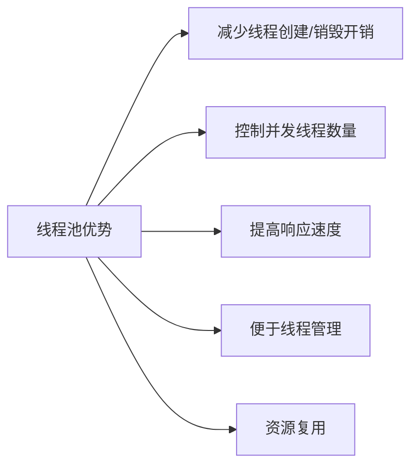
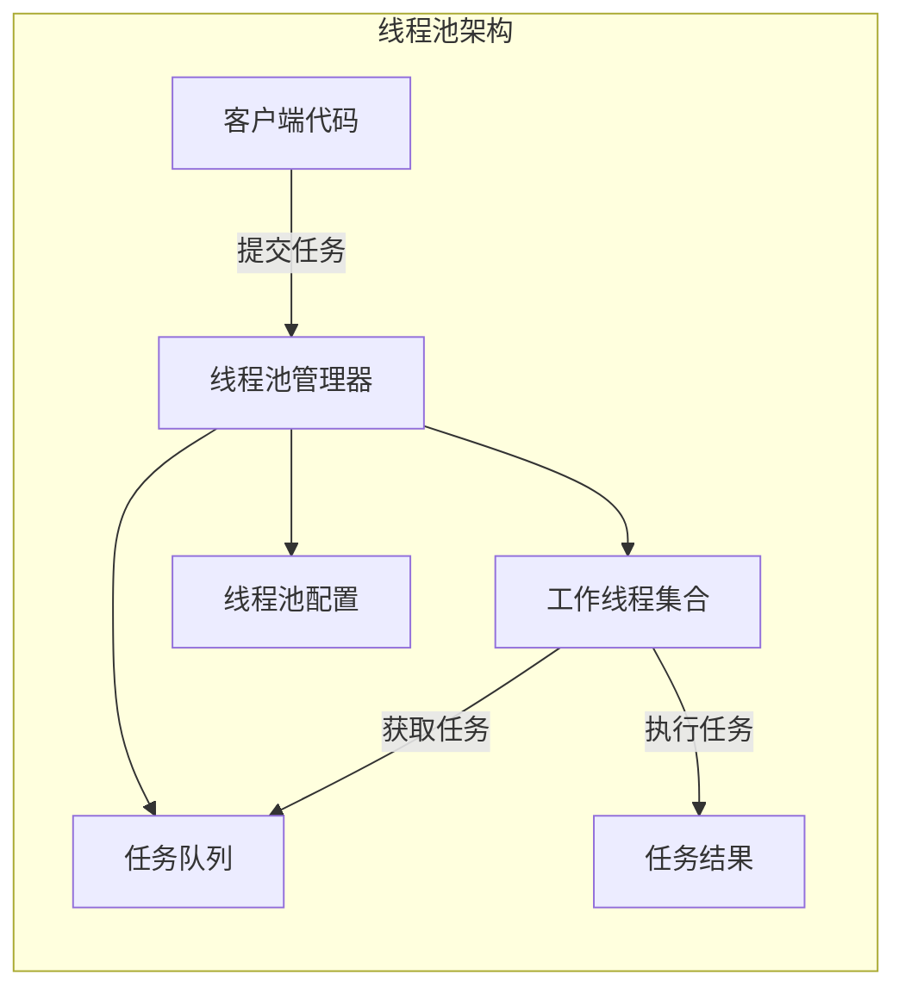
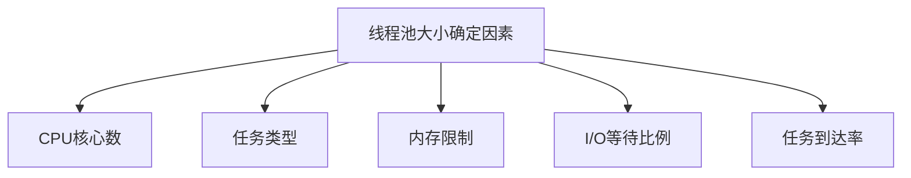
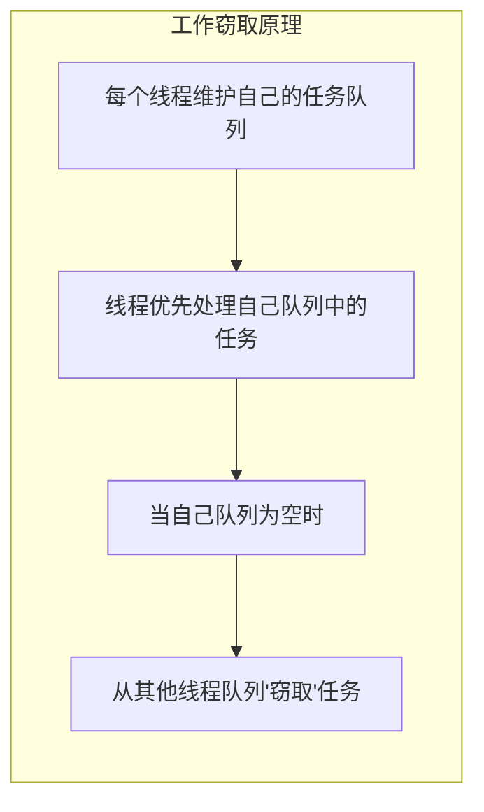
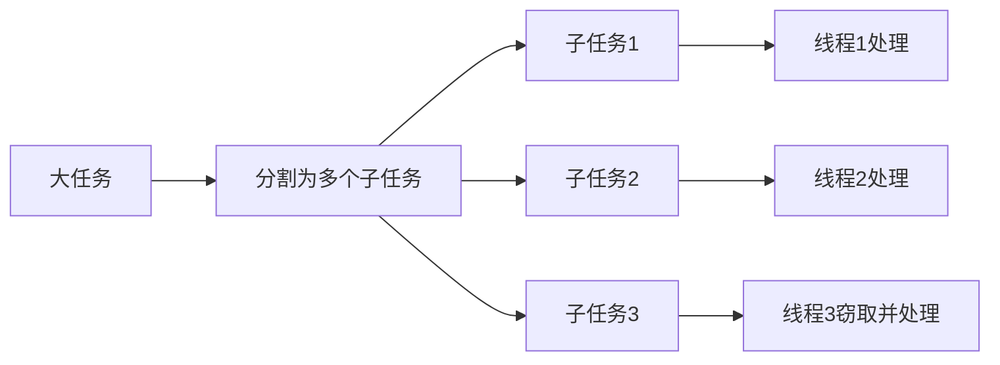
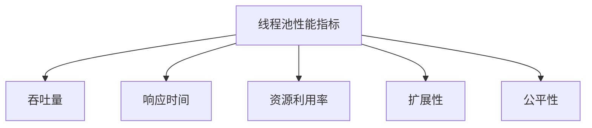
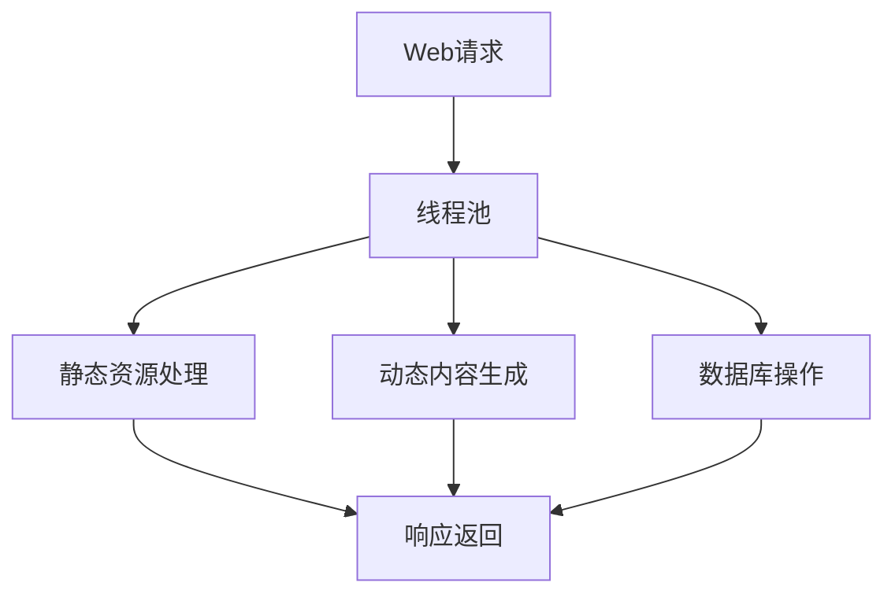
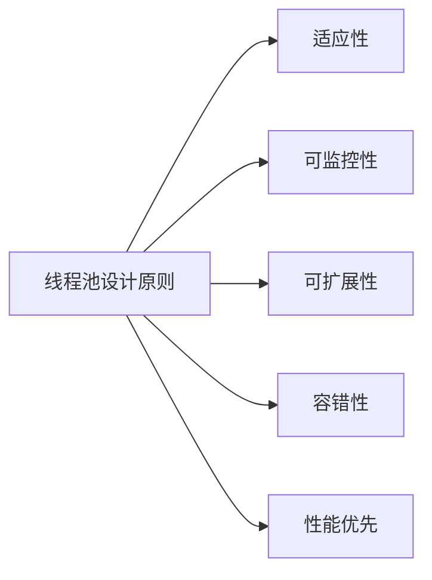

# 线程池设计与调优

## 线程池基本概念

线程池是一种线程使用模式，它在初始化时创建一定数量的工作线程，这些线程在生命周期内不断地从任务队列中获取任务并执行，从而避免了频繁创建和销毁线程的开销。

### 线程池的优势



1. **减少开销**：避免频繁创建和销毁线程的CPU和内存开销
2. **控制并发**：限制系统中并发线程的数量，避免资源过度消耗
3. **响应速度**：任务可以立即被执行，无需等待线程创建
4. **线程管理**：提供统一的线程生命周期管理
5. **资源复用**：线程可以被多个任务重复使用

## 线程池核心组件

### 架构概览



### 核心组件详解

1. **线程池管理器**
   - 负责线程池的创建、销毁和管理
   - 维护工作线程的状态
   - 提供任务提交接口
   - 实现线程池调整策略

2. **工作线程**
   - 从任务队列获取任务
   - 执行任务并返回结果
   - 在空闲时等待新任务
   - 支持线程状态管理（运行、等待、终止）

3. **任务队列**
   - 存储待执行的任务
   - 支持优先级排序
   - 提供线程安全的访问机制
   - 可能实现为阻塞队列或无锁队列

4. **任务**
   - 封装待执行的工作单元
   - 包含任务执行逻辑和参数
   - 可能包含优先级信息
   - 支持结果返回机制（如Promise/Future）

## 线程池设计策略

### 线程池大小确定

线程池大小是影响性能的关键因素，需要根据系统特性和工作负载进行调整：



#### 常见计算公式

1. **CPU密集型任务**：
   - 理想线程数 = CPU核心数 + 1
   - 额外的线程用于在某个线程因页缺失或其他原因暂停时保持CPU忙碌

2. **I/O密集型任务**：
   - 理想线程数 = CPU核心数 × (1 + I/O等待时间/CPU计算时间)
   - 或者：CPU核心数 / (1 - 阻塞系数)，其中阻塞系数在0和1之间

3. **混合型任务**：
   - 需要通过性能测试确定最佳线程数
   - 可以实现自适应调整机制

### 任务队列设计

任务队列的设计直接影响线程池的性能和可扩展性：

1. **队列类型选择**
   - 无界队列：可以接受任意数量的任务，但可能导致内存溢出
   - 有界队列：限制队列大小，需要配合拒绝策略使用
   - 优先级队列：根据任务优先级排序
   - 延迟队列：支持定时执行任务

2. **队列实现**
   - 阻塞队列：提供线程安全的操作，支持阻塞获取
   - 无锁队列：减少锁竞争，提高并发性能
   - 工作窃取队列：支持工作窃取调度算法

### 拒绝策略

当线程池无法接受新任务时（如队列已满、线程池已关闭），需要有合适的拒绝策略：

1. **直接拒绝**：抛出异常或返回错误
2. **调用者运行**：在提交任务的线程中执行任务
3. **丢弃任务**：直接丢弃无法处理的任务
4. **丢弃最旧任务**：丢弃队列中最早的任务，然后尝试提交新任务
5. **自定义处理**：根据业务需求实现特定的处理逻辑

## C++线程池实现

### 基本实现

```cpp
#include <iostream>
#include <thread>
#include <mutex>
#include <condition_variable>
#include <queue>
#include <functional>
#include <vector>
#include <future>
#include <memory>

class ThreadPool {
 public:
    // 构造函数，创建指定数量的工作线程
    ThreadPool(size_t numThreads) : stop(false) {
        for (size_t i = 0; i < numThreads; ++i) {
            workers.emplace_back([this] {
                while (true) {
                    std::function<void()> task;
                    {
                        std::unique_lock<std::mutex> lock(queueMutex);
                        // 等待直到有任务或线程池停止
                        condition.wait(lock, [this] { 
                            return stop || !tasks.empty(); 
                        });
                        
                        // 如果线程池停止且任务队列为空，退出线程
                        if (stop && tasks.empty()) {
                            return;
                        }
                        
                        // 获取任务队列中的第一个任务
                        task = std::move(tasks.front());
                        tasks.pop();
                    }
                    
                    // 执行任务
                    task();
                }
            });
        }
    }
    
    // 提交任务到线程池，返回future对象
    template<class F, class... Args>
    auto enqueue(F&& f, Args&&... args) -> std::future<typename std::result_of<F(Args...)>::type> {
        using return_type = typename std::result_of<F(Args...)>::type;
        
        // 创建一个packaged_task，包装函数和参数
        auto task = std::make_shared<std::packaged_task<return_type()>>(
            std::bind(std::forward<F>(f), std::forward<Args>(args)...)
        );
        
        // 获取future对象，用于获取任务结果
        std::future<return_type> result = task->get_future();
        
        {
            std::unique_lock<std::mutex> lock(queueMutex);
            
            // 如果线程池已停止，抛出异常
            if (stop) {
                throw std::runtime_error("enqueue on stopped ThreadPool");
            }
            
            // 将任务添加到队列
            tasks.emplace([task]() { (*task)(); });
        }
        
        // 通知一个等待中的线程有新任务
        condition.notify_one();
        
        return result;
    }
    
    // 析构函数，停止所有线程
    ~ThreadPool() {
        {
            std::unique_lock<std::mutex> lock(queueMutex);
            stop = true;
        }
        
        // 通知所有等待中的线程
        condition.notify_all();
        
        // 等待所有线程完成
        for (std::thread &worker : workers) {
            worker.join();
        }
    }
    
 private:
    // 工作线程向量
    std::vector<std::thread> workers;
    // 任务队列
    std::queue<std::function<void()>> tasks;
    
    // 同步原语
    std::mutex queueMutex;
    std::condition_variable condition;
    bool stop;
};
```

### 高级特性实现

#### 动态调整线程池大小

```cpp
class AdaptiveThreadPool {
 public:
    AdaptiveThreadPool(size_t minThreads, size_t maxThreads, 
                      size_t queueSize = 1000, 
                      std::chrono::seconds monitorInterval = std::chrono::seconds(30))
        : minThreads_(minThreads), maxThreads_(maxThreads),
          queueSize_(queueSize), stop_(false), activeThreads_(0) {
        
        // 创建初始线程
        for (size_t i = 0; i < minThreads_; ++i) {
            addWorker();
        }
        
        // 启动监控线程
        monitorThread_ = std::thread([this, monitorInterval] {
            while (!stop_) {
                std::this_thread::sleep_for(monitorInterval);
                adjustThreadPoolSize();
            }
        });
    }
    
    // 添加工作线程
    void addWorker() {
        std::unique_lock<std::mutex> lock(poolMutex_);
        if (workers_.size() >= maxThreads_) return;
        
        workers_.emplace_back([this] {
            while (true) {
                std::function<void()> task;
                {
                    std::unique_lock<std::mutex> lock(queueMutex_);
                    condition_.wait(lock, [this] { 
                        return stop_ || !tasks_.empty(); 
                    });
                    
                    if (stop_ && tasks_.empty()) return;
                    
                    task = std::move(tasks_.front());
                    tasks_.pop();
                }
                
                // 增加活动线程计数
                activeThreads_++;
                task();
                activeThreads_--;
            }
        });
    }
    
    // 移除工作线程
    void removeWorker() {
        // 实际实现中需要安全地移除线程
        // 这里简化处理，实际应用需要更复杂的机制
    }
    
    // 动态调整线程池大小
    void adjustThreadPoolSize() {
        std::unique_lock<std::mutex> lock(poolMutex_);
        
        size_t currentThreads = workers_.size();
        size_t queueSize = 0;
        
        {
            std::unique_lock<std::mutex> qLock(queueMutex_);
            queueSize = tasks_.size();
        }
        
        // 计算线程利用率
        double utilization = static_cast<double>(activeThreads_) / currentThreads;
        
        // 根据利用率和队列大小调整线程数
        if (utilization > 0.7 && queueSize > 0 && currentThreads < maxThreads_) {
            // 高利用率，增加线程
            size_t threadsToAdd = std::min(maxThreads_ - currentThreads, 
                                         queueSize / 10 + 1);
            for (size_t i = 0; i < threadsToAdd; ++i) {
                addWorker();
            }
        } else if (utilization < 0.3 && currentThreads > minThreads_) {
            // 低利用率，减少线程
            size_t threadsToRemove = std::min(currentThreads - minThreads_,
                                            currentThreads / 4);
            for (size_t i = 0; i < threadsToRemove; ++i) {
                removeWorker();
            }
        }
    }
    
    // 其他方法（提交任务、析构等）与基本线程池类似
    
 private:
    size_t minThreads_;
    size_t maxThreads_;
    size_t queueSize_;
    bool stop_;
    std::atomic<size_t> activeThreads_;
    
    std::vector<std::thread> workers_;
    std::queue<std::function<void()>> tasks_;
    
    std::mutex queueMutex_;
    std::mutex poolMutex_;
    std::condition_variable condition_;
    
    std::thread monitorThread_;
};
```

## Rust线程池实现

### 基本实现

```rust
use std::sync::{Arc, Mutex, Condvar};
use std::thread;
use std::collections::VecDeque;

// 任务类型，使用Box<dyn FnOnce() + Send>表示可发送的闭包
type Task = Box<dyn FnOnce() + Send + 'static>;

// 线程池结构
pub struct ThreadPool {
    // 工作线程
    workers: Vec<Worker>,
    // 任务发送端
    sender: Option<std::sync::mpsc::Sender<Task>>,
}

impl ThreadPool {
    // 创建指定大小的线程池
    pub fn new(size: usize) -> ThreadPool {
        assert!(size > 0);
        
        // 创建通道，用于发送任务
        let (sender, receiver) = std::sync::mpsc::channel();
        // 使用Arc和Mutex包装接收端，以便多个线程共享
        let receiver = Arc::new(Mutex::new(receiver));
        
        // 创建工作线程
        let mut workers = Vec::with_capacity(size);
        for id in 0..size {
            workers.push(Worker::new(id, Arc::clone(&receiver)));
        }
        
        ThreadPool {
            workers,
            sender: Some(sender),
        }
    }
    
    // 执行任务
    pub fn execute<F>(&self, f: F)
    where
        F: FnOnce() + Send + 'static,
    {
        let job = Box::new(f);
        self.sender.as_ref().unwrap().send(job).unwrap();
    }
}

impl Drop for ThreadPool {
    // 析构时清理资源
    fn drop(&mut self) {
        // 丢弃发送端，导致接收端迭代器结束
        drop(self.sender.take());
        
        // 等待所有工作线程完成
        for worker in &mut self.workers {
            if let Some(thread) = worker.thread.take() {
                thread.join().unwrap();
            }
        }
    }
}

// 工作线程结构
struct Worker {
    id: usize,
    thread: Option<thread::JoinHandle<()>>,
}

impl Worker {
    // 创建新的工作线程
    fn new(id: usize, receiver: Arc<Mutex<std::sync::mpsc::Receiver<Task>>>) -> Worker {
        // 创建线程，循环从接收端获取任务并执行
        let thread = thread::spawn(move || loop {
            // 获取锁并尝试接收任务
            let message = receiver.lock().unwrap().recv();
            
            match message {
                Ok(job) => {
                    println!("Worker {} got a job; executing.", id);
                    job();
                }
                Err(_) => {
                    println!("Worker {} disconnected; shutting down.", id);
                    break;
                }
            }
        });
        
        Worker {
            id,
            thread: Some(thread),
        }
    }
}
```

### 高级特性实现

#### 使用Crossbeam实现无锁工作窃取队列

```rust
use crossbeam::deque::{Injector, Steal, Worker as CbWorker};
use crossbeam::utils::CachePadded;
use std::sync::{Arc, atomic::{AtomicBool, Ordering}};
use std::thread;

// 任务类型
type Task = Box<dyn FnOnce() + Send + 'static>;

// 工作窃取线程池
pub struct WorkStealingPool {
    // 全局任务队列
    injector: Arc<Injector<Task>>,
    // 工作线程
    workers: Vec<WorkerThread>,
    // 停止标志
    stop: Arc<AtomicBool>,
}

impl WorkStealingPool {
    // 创建新的工作窃取线程池
    pub fn new(num_threads: usize) -> Self {
        assert!(num_threads > 0);
        
        let injector = Arc::new(Injector::new());
        let stop = Arc::new(AtomicBool::new(false));
        
        // 创建工作线程本地队列
        let mut workers = Vec::with_capacity(num_threads);
        let mut worker_locals = Vec::with_capacity(num_threads);
        
        for _ in 0..num_threads {
            worker_locals.push(CachePadded::new(CbWorker::new_fifo()));
        }
        
        let worker_locals = Arc::new(worker_locals);
        
        // 创建工作线程
        for id in 0..num_threads {
            let worker = WorkerThread::new(
                id,
                Arc::clone(&injector),
                Arc::clone(&worker_locals),
                Arc::clone(&stop),
            );
            workers.push(worker);
        }
        
        WorkStealingPool {
            injector,
            workers,
            stop,
        }
    }
    
    // 提交任务到全局队列
    pub fn submit<F>(&self, f: F)
    where
        F: FnOnce() + Send + 'static,
    {
        self.injector.push(Box::new(f));
    }
    
    // 关闭线程池
    pub fn shutdown(&self) {
        self.stop.store(true, Ordering::SeqCst);
        for worker in &self.workers {
            if let Some(thread) = &worker.handle {
                thread.thread().unpark();
            }
        }
    }
}

impl Drop for WorkStealingPool {
    fn drop(&mut self) {
        self.shutdown();
        for worker in &mut self.workers {
            if let Some(handle) = worker.handle.take() {
                handle.join().unwrap();
            }
        }
    }
}

// 工作线程
struct WorkerThread {
    id: usize,
    handle: Option<thread::JoinHandle<()>>,
}

impl WorkerThread {
    fn new(
        id: usize,
        injector: Arc<Injector<Task>>,
        worker_locals: Arc<Vec<CachePadded<CbWorker<Task>>>>,
        stop: Arc<AtomicBool>,
    ) -> Self {
        // 获取当前线程的本地队列
        let local = &worker_locals[id];
        let handle = thread::spawn(move || {
            let num_workers = worker_locals.len();
            
            while !stop.load(Ordering::SeqCst) {
                // 尝试从本地队列获取任务
                if let Some(task) = local.pop() {
                    task();
                    continue;
                }
                
                // 尝试从全局队列窃取任务
                match injector.steal() {
                    Steal::Success(task) => {
                        task();
                        continue;
                    }
                    Steal::Empty => {}
                    Steal::Retry => continue,
                }
                
                // 尝试从其他工作线程窃取任务
                let mut found_task = false;
                for i in 0..num_workers {
                    if i == id {
                        continue;
                    }
                    
                    match worker_locals[i].steal() {
                        Steal::Success(task) => {
                            task();
                            found_task = true;
                            break;
                        }
                        Steal::Empty => {}
                        Steal::Retry => {
                            found_task = true;
                            break;
                        }
                    }
                }
                
                if !found_task {
                    // 没有任务，短暂休眠
                    thread::park_timeout(std::time::Duration::from_millis(1));
                }
            }
        });
        
        WorkerThread {
            id,
            handle: Some(handle),
        }
    }
}
```

## 工作窃取调度算法

工作窃取（Work Stealing）是一种高效的任务调度算法，特别适用于并行计算和负载不均衡的场景。

### 基本原理



1. **双端队列**：每个工作线程维护一个双端队列
   - 线程从队列前端（LIFO方式）获取自己的任务
   - 其他线程从队列后端（FIFO方式）窃取任务

2. **局部性优化**：
   - LIFO方式有利于缓存局部性
   - 子任务通常与父任务共享数据，保持在同一线程处理可提高缓存命中率

3. **负载均衡**：
   - 忙碌的线程专注于自己的工作
   - 空闲的线程主动寻找工作，实现自动负载均衡

### 实现策略

#### 任务分割（Task Splitting）



1. **递归分割**：将大任务递归分割为更小的子任务
2. **阈值控制**：当任务小于某个阈值时停止分割，避免过度分割带来的开销
3. **动态分割**：根据系统负载动态调整分割粒度

#### 窃取策略

1. **随机窃取**：随机选择一个线程进行窃取
2. **最大负载窃取**：选择任务队列最长的线程进行窃取
3. **邻近窃取**：优先从邻近的线程（如同一NUMA节点）窃取任务
4. **窃取量控制**：一次窃取多个任务以减少窃取频率

## 线程池性能调优

### 性能指标



1. **吞吐量**：单位时间内完成的任务数量
2. **响应时间**：从提交任务到开始执行的时间
3. **资源利用率**：CPU、内存等资源的使用效率
4. **扩展性**：随着线程数增加，性能提升的程度
5. **公平性**：不同任务获得执行机会的均衡性

### 调优策略

#### 线程数调优

1. **动态调整**：
   - 监控线程池利用率和任务队列长度
   - 根据负载情况动态增减线程数
   - 设置合理的最小和最大线程数限制

2. **自适应策略**：
   - 根据历史性能数据预测最佳线程数
   - 考虑系统资源变化（如CPU负载）调整线程数
   - 实现反馈控制机制，根据性能指标自动调整

#### 任务调度优化

1. **任务分类**：
   - 将任务按特性分类（CPU密集型、IO密集型等）
   - 为不同类型任务使用不同的线程池或调度策略

2. **优先级调度**：
   - 实现多级任务队列，支持任务优先级
   - 高优先级任务优先执行
   - 防止低优先级任务饥饿（如老化机制）

3. **亲和性调度**：
   - 将相关任务调度到同一线程或邻近线程
   - 利用CPU缓存局部性提高性能
   - 考虑NUMA架构特性进行调度

#### 资源管理优化

1. **内存管理**：
   - 使用线程本地存储减少共享内存访问
   - 预分配任务对象，避免频繁内存分配
   - 实现对象池复用任务对象

2. **锁优化**：
   - 减少锁粒度，避免全局锁
   - 使用无锁数据结构（如原子操作、CAS）
   - 批量处理任务减少锁竞争

### 性能测试与监控

1. **基准测试**：
   - 测试不同线程数下的性能表现
   - 模拟不同负载场景（高并发、长任务、短任务混合等）
   - 测量关键性能指标（吞吐量、延迟、CPU使用率等）

2. **性能监控**：
   - 实时监控线程池状态（活跃线程数、队列长度等）
   - 记录任务执行时间分布
   - 监控资源使用情况（CPU、内存、锁竞争等）
   - 设置性能告警阈值

3. **性能分析工具**：
   - 使用profiler分析热点代码
   - 使用线程分析工具检测锁竞争和死锁
   - 使用内存分析工具检测内存泄漏和过度分配

## 实际应用场景优化

### Web服务器场景



1. **分层线程池**：
   - 请求处理线程池：处理HTTP请求解析和路由
   - 业务处理线程池：执行业务逻辑
   - IO处理线程池：处理数据库和文件IO

2. **优化策略**：
   - 短连接请求：使用较大线程池，快速响应
   - 长连接请求：使用事件驱动模型，减少线程数
   - 静态资源：使用专用线程池，配合零拷贝技术

### 大数据处理场景

1. **MapReduce模型**：
   - Map阶段：使用工作窃取线程池并行处理数据分片
   - Reduce阶段：使用固定大小线程池聚合结果

2. **优化策略**：
   - 数据本地性：任务调度考虑数据位置，减少数据传输
   - 内存管理：实现数据分块处理，避免OOM
   - 动态调整：根据数据规模动态调整并行度

### 实时系统场景

1. **优先级调度**：
   - 关键任务使用高优先级队列
   - 设置任务执行超时机制
   - 实现任务抢占策略

2. **资源隔离**：
   - 为不同优先级任务分配独立线程池
   - 限制低优先级任务的资源使用
   - 实现资源预留机制

## 总结与最佳实践

### 线程池设计核心原则



1. **适应性**：根据工作负载特性自动调整
2. **可监控性**：提供完善的监控和诊断能力
3. **可扩展性**：支持不同调度策略和任务类型
4. **容错性**：优雅处理任务异常和系统故障
5. **性能优先**：最小化开销，最大化吞吐量

### 常见陷阱与解决方案

1. **线程池过大**：
   - 问题：上下文切换开销增加，内存占用高
   - 解决：根据系统资源和任务特性设置合理上限

2. **线程池过小**：
   - 问题：资源利用率低，任务排队等待
   - 解决：动态调整线程数，监控任务队列长度

3. **任务执行时间过长**：
   - 问题：阻塞线程池，影响其他任务
   - 解决：拆分长任务，设置超时机制，使用专用线程池

4. **死锁和资源竞争**：
   - 问题：线程相互等待，性能下降
   - 解决：避免嵌套任务依赖，使用无锁数据结构

5. **任务提交速率过高**：
   - 问题：队列溢出，内存压力
   - 解决：实现流量控制，使用背压机制

### 未来发展趋势

1. **协程与纤程**：
   - 轻量级线程模型，降低上下文切换开销
   - C++20协程和Rust异步编程的应用

2. **硬件感知调度**：
   - 考虑CPU拓扑结构的任务调度
   - 利用NUMA架构特性优化内存访问

3. **机器学习辅助调优**：
   - 使用ML预测最佳线程池配置
   - 自适应学习最优调度策略

4. **专用硬件加速**：
   - 利用GPU/FPGA加速特定任务
   - 异构计算资源的统一调度