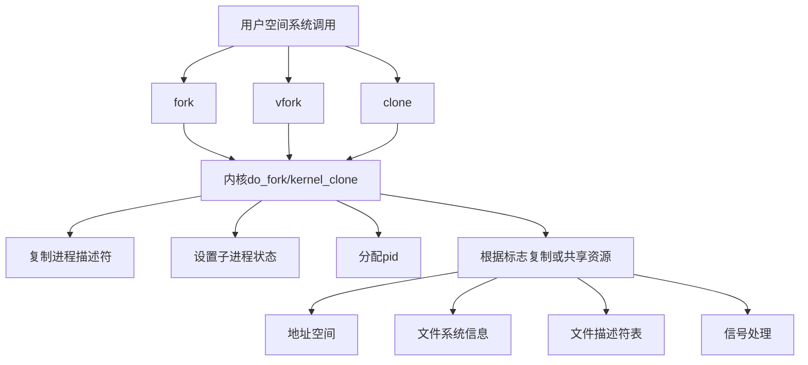
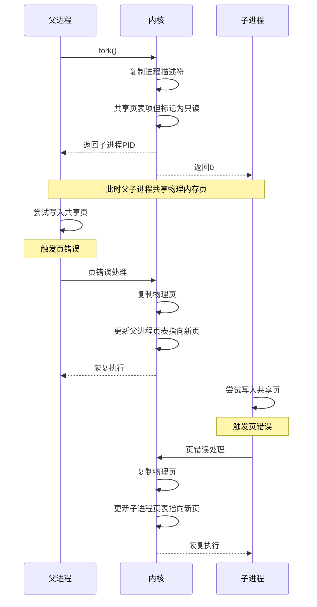
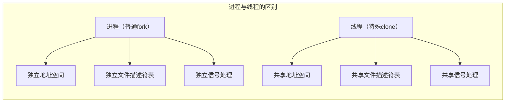

---
tags:
  - 系统编程
  - 进程
  - 内核实现
---

# Linux进程创建机制：fork与clone实现详解

## 进程创建概述

Linux系统中，进程创建主要通过fork、vfork和clone系统调用实现，它们都基于内核中的clone()函数，但提供了不同级别的资源共享和隔离选项。



## 系统调用接口

### fork系统调用

fork()创建一个与父进程几乎完全相同的子进程，子进程获得父进程数据段、堆和栈的副本。

```c
#include <unistd.h>
pid_t fork(void);
```

### clone系统调用

clone()允许精细控制父子进程间共享的资源。

```c
#include <sched.h>
int clone(int (*fn)(void *), void *stack, int flags, void *arg, ...);
```

主要标志位：

- **CLONE_VM**: 共享内存空间
- **CLONE_FS**: 共享文件系统信息
- **CLONE_FILES**: 共享文件描述符表
- **CLONE_SIGHAND**: 共享信号处理函数
- **CLONE_THREAD**: 同一线程组（同一进程的线程）

## 内核实现机制

### do_fork/kernel_clone函数

所有进程创建系统调用最终都通过内核中的do_fork()（较新版本中为kernel_clone()）函数实现：

```c
pid_t kernel_clone(struct kernel_clone_args *args)
```

主要步骤：

1. 调用copy_process()复制进程描述符
2. 根据标志位决定资源共享程度
3. 为新进程分配PID
4. 唤醒新进程

### 写时复制（Copy-on-Write）机制



写时复制是Linux进程创建的关键优化技术：

1. fork()时不立即复制物理内存页
2. 父子进程共享物理页面，但页表项标记为只读
3. 任一进程尝试写入时触发页错误
4. 内核为写入进程创建页面副本
5. 更新页表指向新页面并移除写保护

### 进程描述符复制

```c
static struct task_struct *copy_process(
    struct pid *pid,
    int trace,
    int node,
    struct kernel_clone_args *args)
```

copy_process()函数负责：

1. 调用dup_task_struct()创建子进程的task_struct和内核栈
2. 检查用户资源限制
3. 初始化子进程各种资源（文件、信号处理器等）
4. 根据clone标志决定共享哪些资源
5. 设置子进程状态为TASK_UNINTERRUPTIBLE，直到完全创建好

## 线程实现

Linux中线程是通过特殊的clone调用实现的，共享大部分资源：

```c
int clone(threadfn, stack, CLONE_VM | CLONE_FS | CLONE_FILES | CLONE_SIGHAND | CLONE_THREAD, args);
```



## vfork特殊性

vfork()创建的子进程与父进程共享地址空间，且父进程会被挂起直到子进程调用exec()或exit()：

```c
pid_t vfork(void);
```

实现上，vfork通过以下标志调用clone：

```c
CLONE_VM | CLONE_VFORK | SIGCHLD
```

## 内核数据结构

### task_struct（进程描述符）

```c
struct task_struct {
    /* ... */
    pid_t pid;                      /* 进程ID */
    pid_t tgid;                     /* 线程组ID */
    struct task_struct *parent;     /* 父进程 */
    struct list_head children;      /* 子进程链表 */
    struct mm_struct *mm;           /* 内存描述符 */
    struct files_struct *files;     /* 打开的文件 */
    struct signal_struct *signal;   /* 信号处理 */
    /* ... */
};
```

### mm_struct（内存描述符）

```c
struct mm_struct {
    /* ... */
    pgd_t * pgd;                    /* 页全局目录 */
    atomic_t mm_users;              /* 用户数量 */
    atomic_t mm_count;              /* 引用计数 */
    struct list_head mmlist;        /* 所有mm的链表 */
    unsigned long start_code;       /* 代码段起始地址 */
    unsigned long end_code;         /* 代码段结束地址 */
    unsigned long start_data;       /* 数据段起始地址 */
    unsigned long end_data;         /* 数据段结束地址 */
    unsigned long start_brk;        /* 堆起始地址 */
    unsigned long brk;              /* 堆当前结束地址 */
    unsigned long start_stack;      /* 栈起始地址 */
    /* ... */
};
```

## 性能考量

### fork性能优化

1. **写时复制**：避免不必要的内存复制
2. **vfork优化**：适用于立即exec的场景
3. **MADV_WIPEONFORK**：子进程不继承特定内存区域
4. **MADV_DONTFORK**：不复制特定内存区域到子进程

### 线程vs进程创建性能

```mermaid
bar chart
    title 创建开销比较
    x-axis [创建类型]
    y-axis 相对开销 (μs)
    "线程创建" 25
    "进程创建(fork)" 100
    "进程创建+exec" 150
```

线程创建比进程创建快的原因：

1. 无需复制页表
2. 无需复制文件描述符表
3. 共享大部分内核资源

## 实际应用场景

### Web服务器模型

1. **prefork模型**（Apache）：预先fork多个进程处理请求
2. **worker模型**：多进程+多线程
3. **event模型**：事件驱动+线程池

### 容器技术

Docker等容器技术使用特殊的clone标志创建隔离环境：

```c
clone(CLONE_NEWPID | CLONE_NEWNS | CLONE_NEWUTS | CLONE_NEWIPC | ...)
```

命名空间隔离类型：

- **CLONE_NEWPID**: 进程ID隔离
- **CLONE_NEWNS**: 挂载点隔离
- **CLONE_NEWUTS**: 主机名和域名隔离
- **CLONE_NEWNET**: 网络隔离

## 调试与观察

### 跟踪fork/clone系统调用

```bash
# 使用strace跟踪进程创建
strace -f -e trace=process ./your_program

# 使用perf跟踪内核fork函数
sudo perf record -e sched:sched_process_fork -a

# 使用eBPF/bpftrace跟踪
sudo bpftrace -e 'tracepoint:sched:sched_process_fork { printf("fork: %s (pid %d) -> %s (pid %d)\n", comm, pid, args->comm, args->pid); }'
```

## 总结

Linux进程创建机制通过fork、vfork和clone系统调用提供了灵活的进程和线程创建方式，内部实现上采用写时复制等优化技术提高性能。理解这些机制对于开发高性能服务器程序、容器技术以及进行系统级性能优化至关重要。