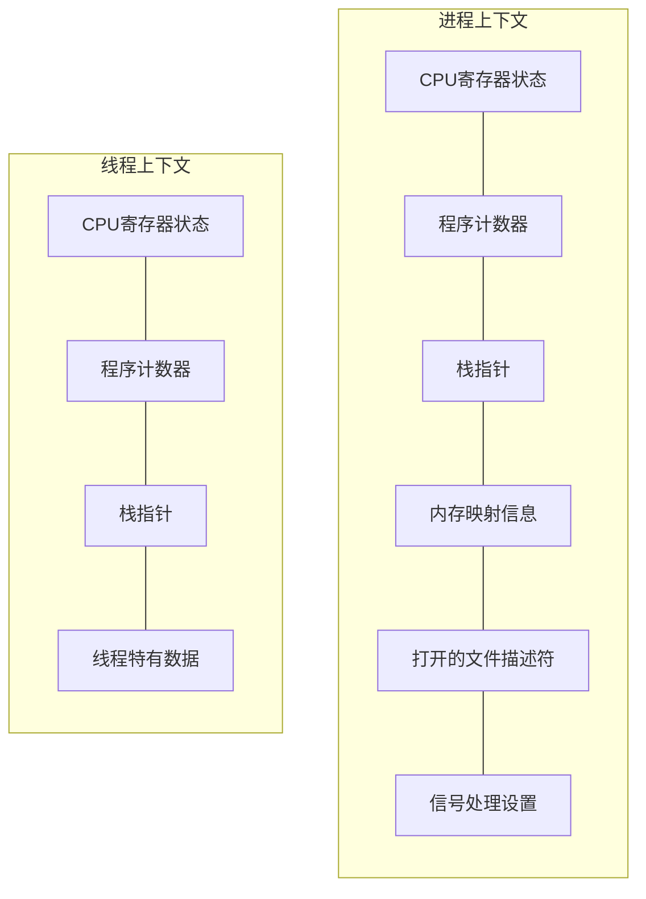
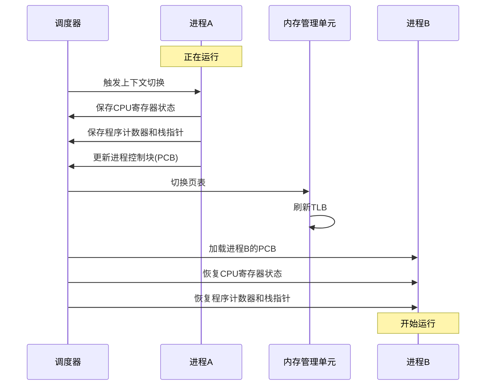
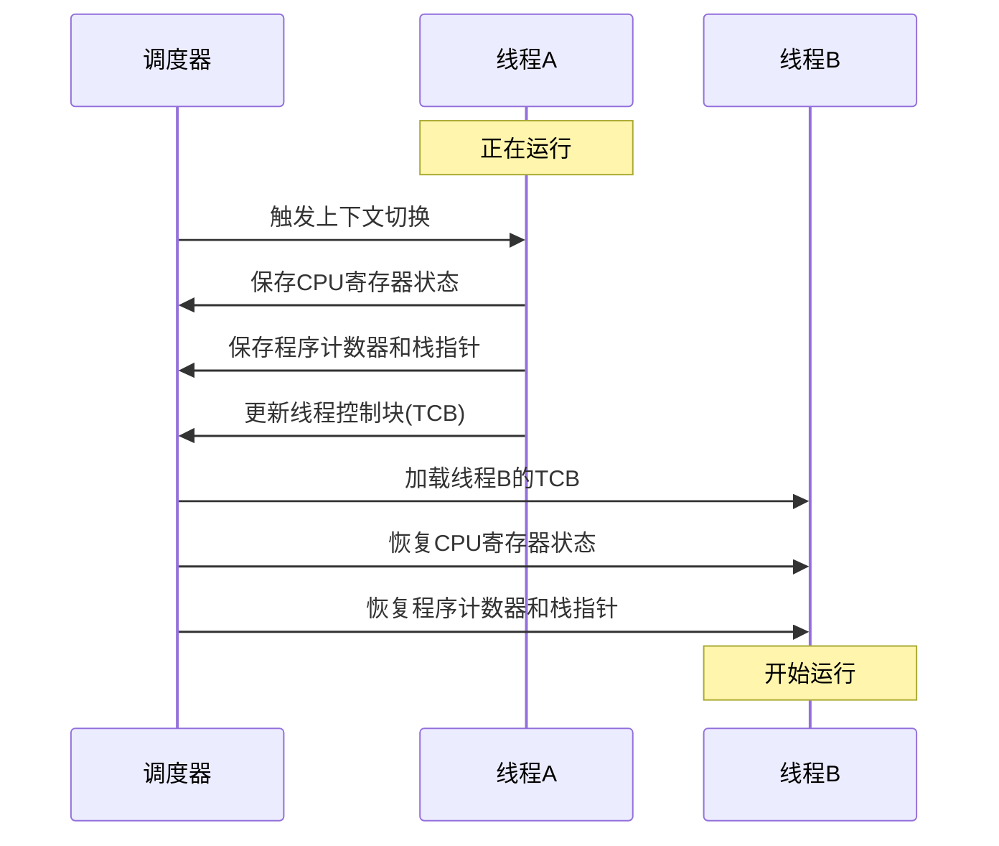
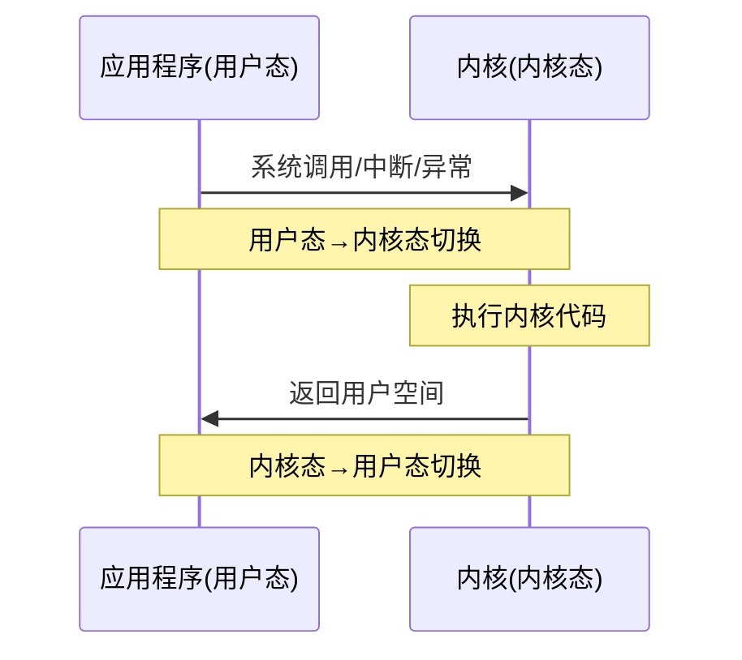
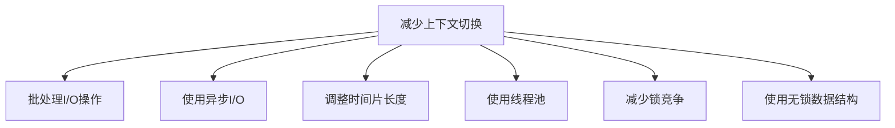
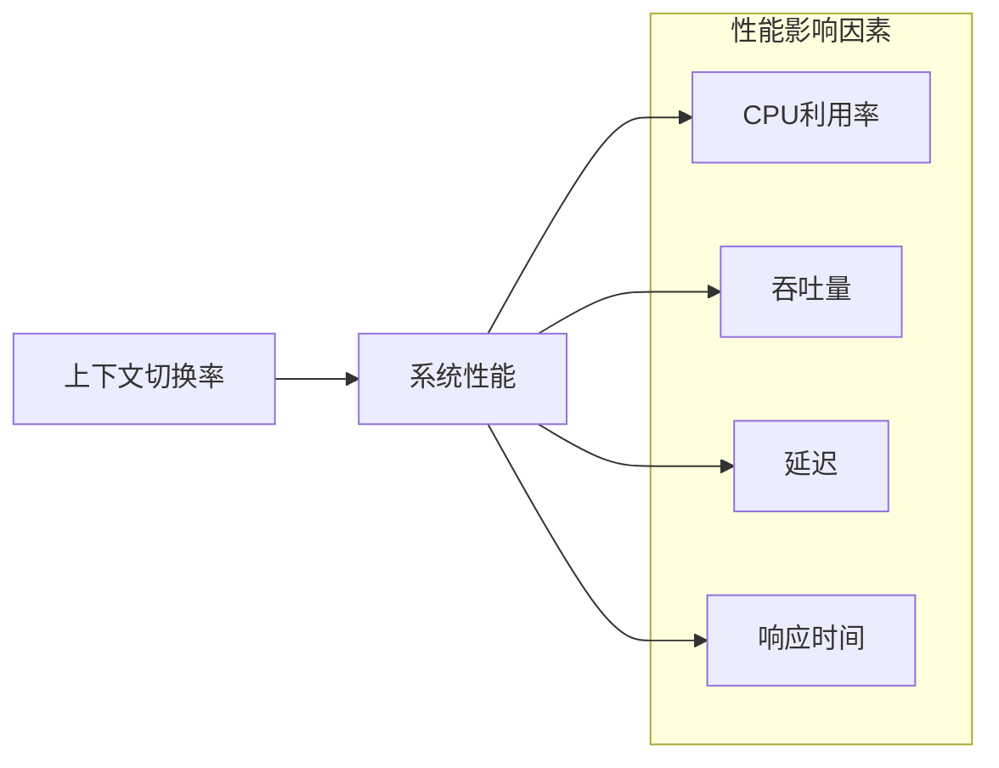
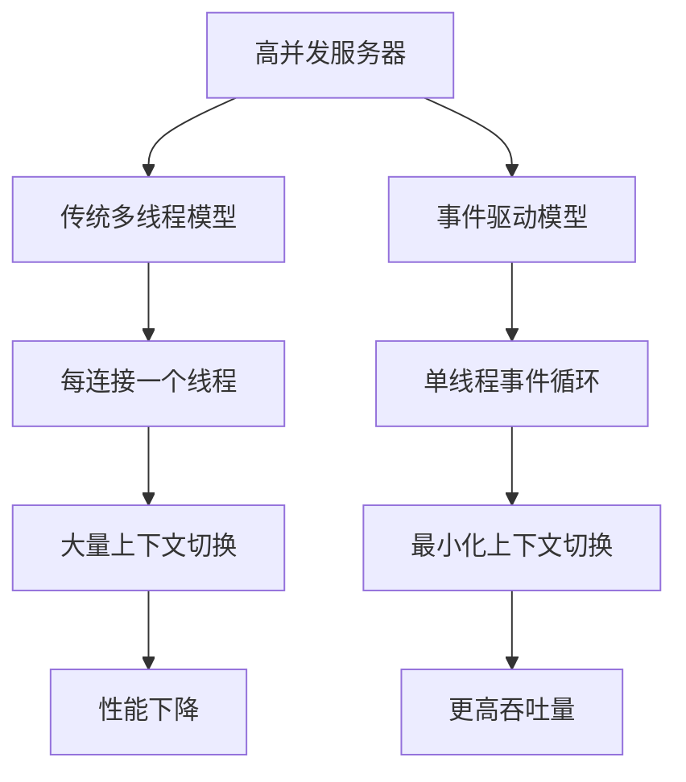
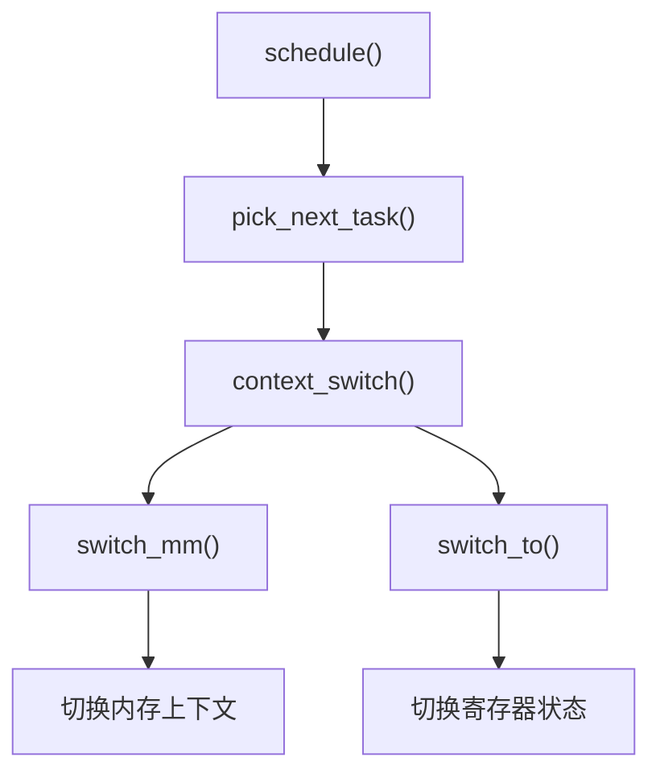

# 进程/线程切换过程

## 上下文切换概述

上下文切换(Context Switch)是操作系统中的一个核心概念，指的是CPU从一个进程或线程切换到另一个进程或线程的过程。在这个过程中，操作系统需要保存当前执行实体的状态（上下文），并加载下一个待执行实体的状态。

### 上下文的组成



### 上下文切换的触发条件

1. **时间片用尽**：进程/线程的分配时间片耗尽
2. **系统调用**：进程/线程执行系统调用进入内核态
3. **中断处理**：硬件中断需要处理
4. **同步事件**：等待资源（如I/O操作、锁等）
5. **优先级调度**：更高优先级的进程/线程需要执行

## 进程上下文切换

进程上下文切换是一个相对昂贵的操作，因为它需要切换虚拟内存空间，涉及到TLB刷新和缓存失效等开销。

### 进程上下文切换流程



### 进程上下文切换的开销

1. **直接开销**
   - 保存和恢复寄存器状态
   - 切换内存映射（页表）
   - 刷新TLB（地址转换缓存）
   - 切换内核栈

2. **间接开销**
   - CPU缓存失效
   - 流水线刷新
   - 分支预测器重置

## 线程上下文切换

线程上下文切换比进程上下文切换更轻量，因为同一进程内的线程共享地址空间和大部分资源，不需要切换页表和刷新TLB。

### 线程上下文切换流程



### 线程上下文切换的开销

1. **直接开销**
   - 保存和恢复寄存器状态
   - 切换线程栈

2. **间接开销**
   - 部分CPU缓存失效
   - 流水线刷新

## 用户态与内核态切换

除了进程/线程间的上下文切换，还有用户态与内核态之间的切换，这也会带来一定的开销。



### 用户态与内核态切换的开销

1. **特权级别切换**
2. **内核栈切换**
3. **验证参数**
4. **复制数据**（在某些系统调用中）

## 上下文切换优化策略

### 减少不必要的上下文切换



### 提高上下文切换效率

1. **CPU亲和性(Affinity)**：尽量让进程/线程在同一个CPU核心上运行，提高缓存命中率
2. **NUMA感知调度**：在NUMA架构中，优先在靠近内存的CPU上调度进程/线程
3. **优化内存布局**：减少TLB缺失和缓存失效

## 上下文切换的测量与分析

### 使用工具测量上下文切换

```bash
# 使用vmstat查看系统范围的上下文切换
vmstat 1

# 使用pidstat查看特定进程的上下文切换
pidstat -w -p <pid> 1

# 使用perf分析上下文切换详情
perf record -e context-switches -a sleep 5
perf report
```

### 上下文切换的性能影响



## 实际案例分析

### 高并发服务器中的上下文切换优化



### 实时系统中的上下文切换考量

在实时系统中，上下文切换的延迟和可预测性比频率更重要。实时系统通常采用以下策略：

1. **优先级抢占式调度**：高优先级任务可以抢占低优先级任务
2. **优先级继承**：避免优先级反转问题
3. **减少中断处理时间**：缩短不可抢占的代码路径

## 不同操作系统的上下文切换实现

### Linux上下文切换实现

Linux内核中的上下文切换主要由`switch_to`宏实现，该宏定义在架构相关的代码中。



### Windows上下文切换实现

Windows使用CONTEXT结构体保存线程上下文，通过SwitchToThread、SwitchToFiber等API触发上下文切换。

## 总结

上下文切换是操作系统多任务处理的基础，但也是系统开销的重要来源。理解上下文切换的原理和优化策略，对于开发高性能系统至关重要。在实际应用中，应根据具体场景选择合适的并发模型，平衡上下文切换开销与并发性能。