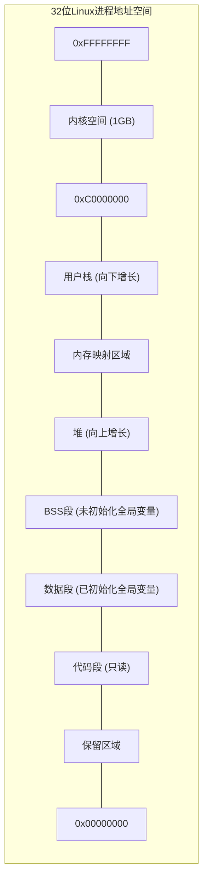
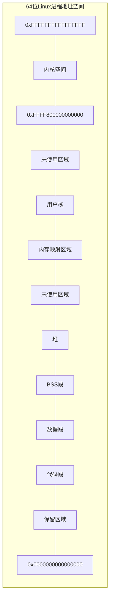
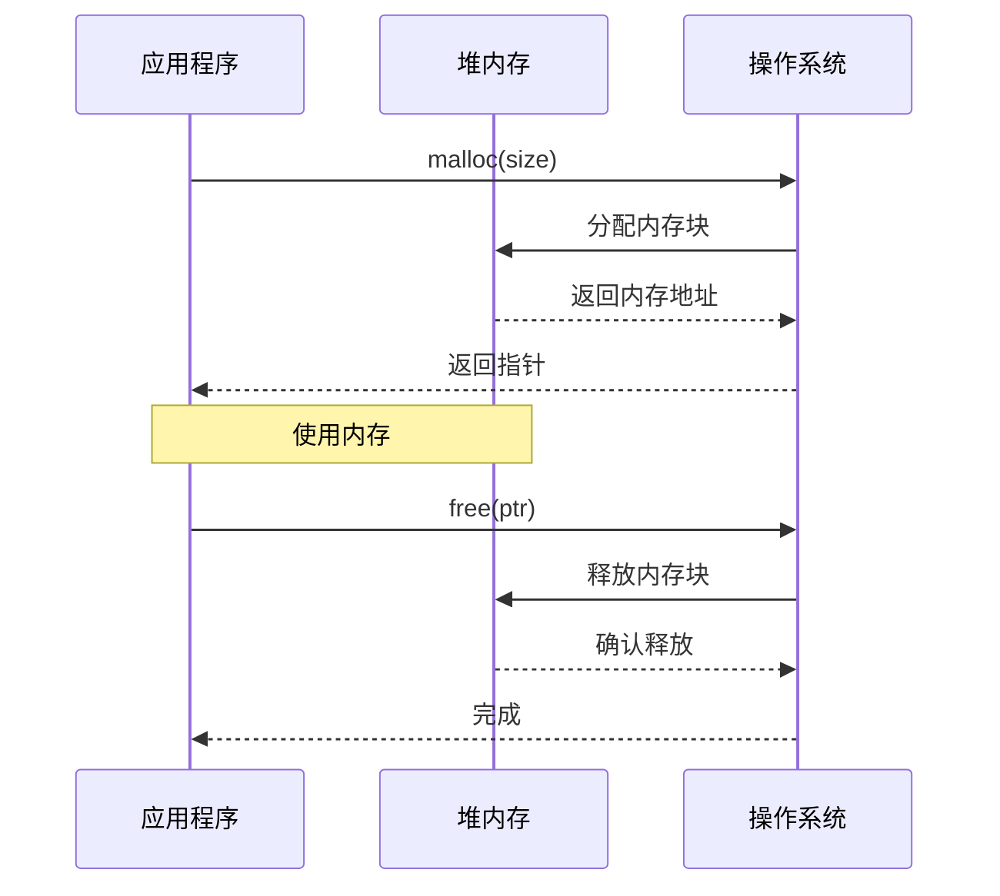
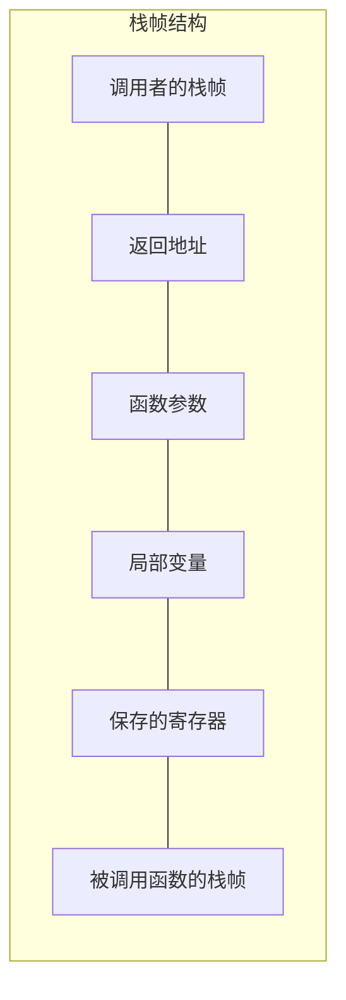
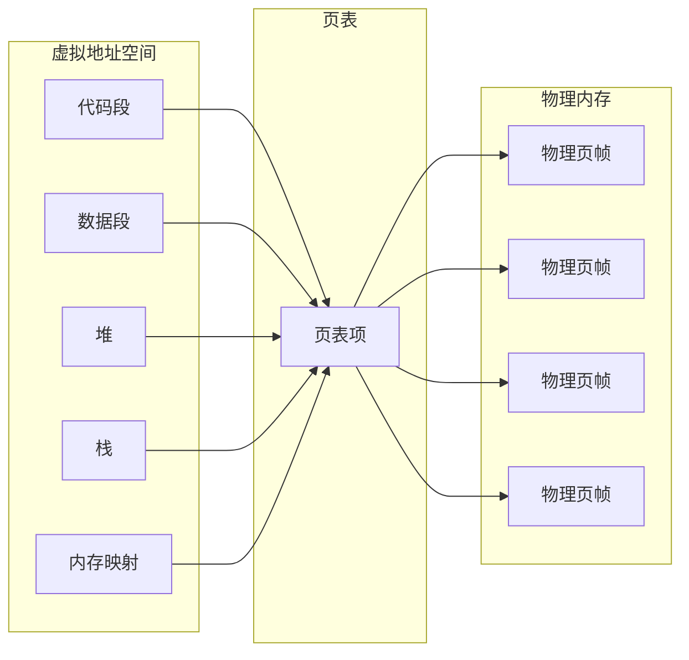
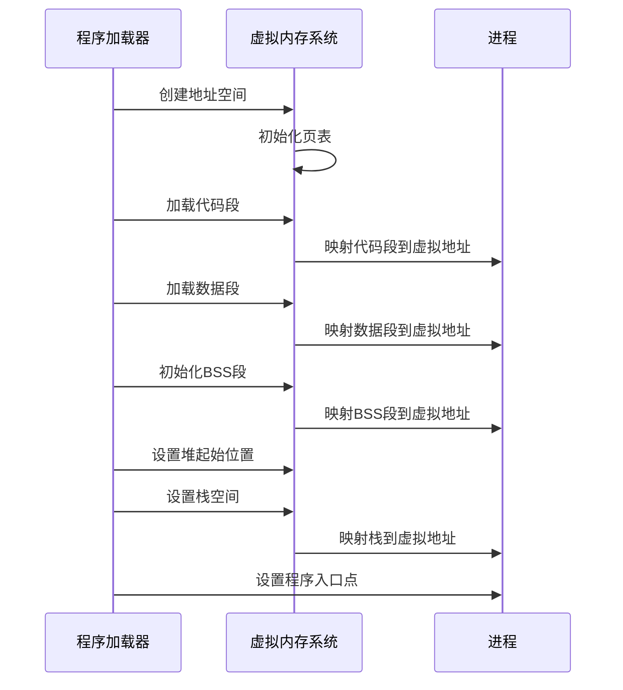
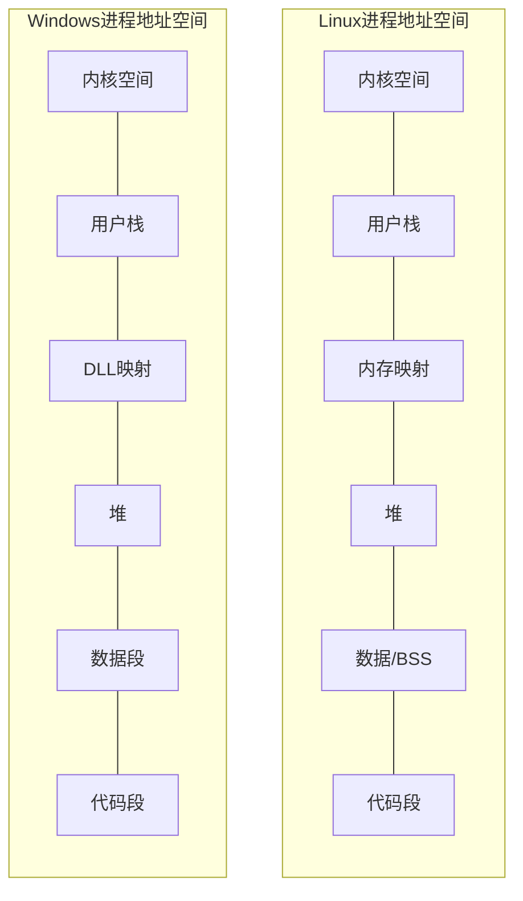
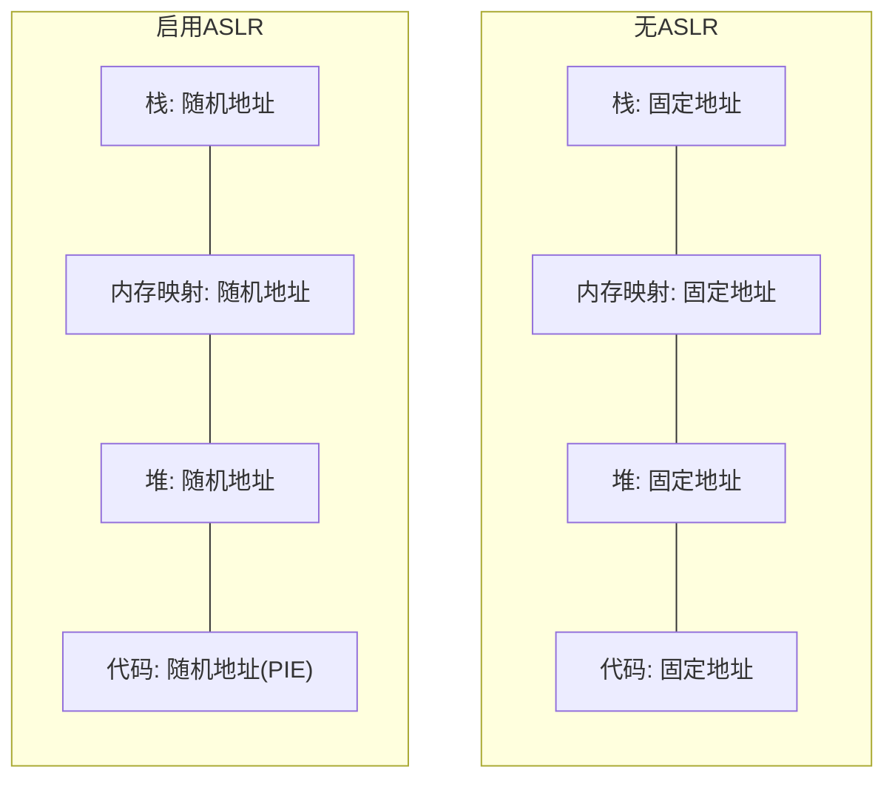

# 进程地址空间布局

## 进程地址空间概述

进程地址空间是操作系统为每个进程分配的虚拟内存空间，它提供了一个独立的内存视图，使得进程可以在不干扰其他进程的情况下运行。进程地址空间包含了代码、数据、堆、栈等不同区域，每个区域有特定的用途和访问权限。

### 地址空间的作用

1. **内存隔离**：每个进程拥有独立的地址空间，防止进程间相互干扰
2. **内存保护**：不同区域设置不同的访问权限，提高系统安全性
3. **虚拟内存管理**：支持虚拟内存技术，使程序可以使用比物理内存更大的地址空间
4. **动态内存分配**：通过堆区域支持动态内存分配

## 典型的进程地址空间布局

## 地址空间各区域详解

### 代码段（Text Segment）

代码段存储程序的可执行指令，通常是只读的，以防止程序意外修改自身的指令。

- **权限**：只读、可执行
- **内容**：编译后的机器指令、常量字符串等
- **特点**：多个进程可以共享同一个程序的代码段，节省内存

### 数据段（Data Segment）

数据段存储已初始化的全局变量和静态变量。

- **权限**：可读写
- **内容**：全局变量、静态变量（已初始化）
- **特点**：在程序启动时从可执行文件加载

### BSS段（Block Started by Symbol）

BSS段存储未初始化的全局变量和静态变量。

- **权限**：可读写
- **内容**：全局变量、静态变量（未初始化）
- **特点**：不占用可执行文件空间，在程序启动时被初始化为0

### 堆（Heap）

堆是用于动态内存分配的区域，由程序员通过malloc/new等函数显式管理。

- **权限**：可读写
- **特点**：
  - 向高地址方向增长
  - 由程序员负责分配和释放
  - 容易产生内存泄漏和碎片

### 栈（Stack）

栈用于存储函数调用信息、局部变量和函数参数。

- **权限**：可读写
- **特点**：
  - 向低地址方向增长
  - 自动分配和释放
  - LIFO（后进先出）结构
  - 大小通常有限制（如8MB）

### 内存映射区域（Memory Mapping Segment）

内存映射区域用于映射文件或共享内存到进程地址空间。

- **权限**：可读、可写、可执行（取决于映射类型）
- **用途**：
  - 加载动态链接库
  - 文件映射（mmap）
  - 共享内存
  - 匿名映射（大块内存分配）

### 内核空间（Kernel Space）

内核空间是操作系统内核代码和数据所在的地址空间部分。

- **权限**：仅内核态可访问
- **内容**：内核代码、数据结构、设备驱动等
- **特点**：所有进程共享同一个内核空间

## 地址空间管理

### 虚拟内存映射

### 进程地址空间创建过程

## 不同操作系统的地址空间差异

### Linux vs Windows

## 地址空间相关系统调用

1. **brk/sbrk**：调整堆的大小
2. **mmap/munmap**：创建/删除内存映射
3. **mprotect**：修改内存区域的保护属性
4. **mremap**：重新映射内存区域

## 安全考虑

### 地址空间布局随机化（ASLR）

ASLR通过随机化进程地址空间中各区域的位置，增加攻击者预测内存地址的难度，从而防止缓冲区溢出等攻击。

### 不可执行栈（NX位/DEP）

通过将栈区域标记为不可执行，防止攻击者在栈上注入并执行恶意代码。

## 性能优化考虑

1. **内存对齐**：合理的内存对齐可以提高内存访问效率
2. **局部性原理**：利用空间局部性和时间局部性优化内存访问模式
3. **缓存友好**：设计缓存友好的数据结构和算法
4. **内存碎片**：减少内存碎片，提高内存利用率